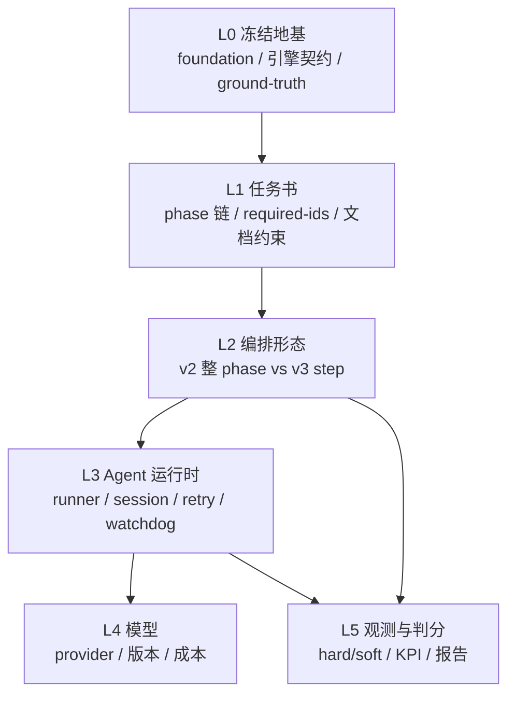

# Round2 run4 · 实验矩阵与变量认知

> **用途**：把 run4 从「盲目探索」收成可检验的对照实验。
> 对照基线 = **run3（harness v2）**；处理组 = **run4（harness v3）**。
> 配套规格：[harness-spec.md](./harness-spec.md)、[scoring.md](./scoring.md)、[implementation-gaps.md](./implementation-gaps.md)。

## 1. 实验要回答什么

| 问题 | 不是问什么 |
|---|---|
| v3 **step 化编排**是否把 run3 的「黑箱 STOP」变成可定位失败？ | 哪个模型「最强」排行榜 |
| **B/E 类失败**（缺 id、基础设施误杀）是否相对 run3 下降？ | 727 是否一次跑满 |
| **H3 dossier 重试**是否比 v2 盲续跑更有效？ | 单次 run 的绝对 P3 通关率 |
| **H5 利用率 KPI**能否揪出「通关但空壳」（run3 grokbuild 类）？ | 与 SWE-bench 分数对齐 |

引擎推进与 full corpus 复测见 [scoring.md §6](./scoring.md#6-full-corpus人工跑后)；本矩阵只管 **编排层学习**。

---

## 2. 五层变量坐标系

分析任何 STOP / 异常时，**先标层级**，禁止混谈「模型不行」。



| 层 | run4 策略 | 典型变量 |
|---|---|---|
| **L0** | **冻结** | `grid/solver/soundness`、`data/ground-truth/`、stub 预注册后的 registry |
| **L1** | **冻结**（与 run3 同任务书） | P0→P3 链、`required-ids/*.txt`、worker 文档路径 |
| **L2** | **处理组 = v3** | step 制、分层 prompt、dossier、verify T0–R2 分层 |
| **L3** | **去 confound** | 全 `opencode`、detach `launch.sh`、watchdog+heartbeat、费用熔断 |
| **L4** | **自变量** | `models-run4.txt`（10 模型，去掉 devstral2） |
| **L5** | **因变量** | 失败五类占比、step 定位率、phaseUtilization、727 delta |

**查因顺序**：L3（误杀？）→ L2（交付形态？）→ L4（能力？）→ L1（任务书是否过难？）。L0 本轮不动。

---

## 3. run3 失败分类 → 归因字典

跑 run4 时，每条 pipeline 终态必须标 **A–E 之一**（可多标，主因一个）。

| 代号 | run3 代表 | 主因层 | v3 杠杆 |
|---|---|---|---|
| **A** | devstral2 三次 P0 全挂 | L4 | run4 **不纳入**清单 |
| **B** | deepseekv4 P1 缺 19 id；sonnet46 p2 软过缺 7–14 id | L2 | **H1/H2** step + 窄 prompt |
| **C** | kimi-k27 E 阶段 franken-fish 非法消除 | L4+L1 | step 末 T3；phase 末 R2；harness 不能单独消灭 |
| **D** | grokbuild P3 通关 human 0 / last 65 | L5 | **H5** utilization + fixtureIsolation |
| **E** | gemini p2a watchdog；composer grok runner | L3 | **H4** events + monitor + 统一 runner |

run3 摘要：[../results-summary.md](../results-summary.md)、[../reports/run3-summary.md](../reports/run3-summary.md)。

---

## 4. v2→v3：假设包（为何一次改很多）

昂贵 run 赌的是 **4 个假设 + 1 套基础设施**，不是 15 个独立旋钮。

| ID | 假设 | v3 改动 | run3 痛点 | run4 成功信号 |
|---|---|---|---|---|
| **H1** | 交付粒度 | 整 phase → 单 `strategyId` step | B：批量遗漏 | `step.fail` 可点名 id；缺 id 率 ↓ |
| **H2** | 上下文负载 | 分层窄 prompt（见 [prompt-engineering.md](./prompt-engineering.md)） | B：巨 prompt 丢清单尾部 | 单 step prompt token ↓；step 完成率 ↑ |
| **H3** | 重试质量 | capture + dossier（见 [checkpoint-and-reset.md](./checkpoint-and-reset.md)） | v2 盲续跑 | retry 后 verify 错误类型变化 |
| **H4** | 误杀与不可观测 | append-only events + monitor（见 [state-and-events.md](./state-and-events.md)） | E | `watchdog.kill` 占比 ↓；runner 无 grok |
| **H5** | 空壳通关 | stub 预写死 + phaseUtilization（见 [scoring.md](./scoring.md)） | D | `fixtureFlags` 非空；util 与 727 delta 相关 |

### 4.1 必须绑定的实现组

| 绑定 | 原因 |
|---|---|
| H1 + H2 + verify-step（T0–T3） | 无 step 则无窄 prompt、无 step 级验收 |
| H3 + H1 | dossier 语义依附 step-retry + `parentCommit` |
| H4 事件 schema + `report.sh` 读 jsonl | 无留痕则无法事后拆 H1–H5 |

### 4.2 相对独立但 run4 一并冻结

| 改动 | 性质 |
|---|---|
| 去掉 devstral2 | L4 筛选 |
| grok → opencode | L3 去 confound；报告中注明相对 run3 多控制 runner |
| stub 预写死 | 降注册噪声，H1 测「实现」非「登记事务」 |
| `MAX_COST_PER_MODEL` 熔断 | L3 保护，不改变行为假设 |

---

## 5. run4 实验设计

### 5.1 对照

| 项 | 基线（run3） | 处理（run4） |
|---|---|---|
| Harness | v2 `run-model.sh` 整 phase | v3 `run-step.sh` + `run-phase.sh` |
| 模型清单 | 11（含 devstral2） | 10（`models-run4.txt`，见 [implementation-gaps.md §7](./implementation-gaps.md#7-modelstxt-run4-变更)） |
| 任务书 L1 | P0→P3、同一 required-ids 语义 | **同**（foundation 从同一 master 重切） |
| 归档 | `archive/round2/run3/` | `archive/round2/run4/`（`RUN_TAG`） |

### 5.2 阶段 0 — Pilot（不缩小野心，只防白烧）

见 [implementation-gaps.md §11](./implementation-gaps.md#11-pilot-流程实现后首次真跑)：

- **范围**：`models-pilot.txt` 仅 minimax-m3 × **P0**
- **目的**：验证 H4 基础设施（events、reset、dossier、pause、monitor），**不**验证模型排名
- **门禁**：pilot 表全部 ✅ 后才启动 10 模型全链

### 5.3 阶段 1 — Full run4

```bash
sudo pmset -a disablesleep 1
orchestration/round2/harness/launch.sh orchestration/round2/models-run4.txt
# 监控: tail -f orchestration/round2/reports/run-all.out
#        orchestration/round2/harness/monitor.sh watch
```

**冻结 env（与 run3 尽量一致，便于对比）**：

| 变量 | run3 参考 | run4 建议 |
|---|---|---|
| `MAX_PAR` | 8 | 8 |
| `VERIFY_MAX` | 3 | 3 |
| `RETRIES` / v3 等价 | 3 | `INVOCATION_RETRIES=3` `STEP_RETRIES=2` `PHASE_RETRIES=1` |
| `TIMEOUT` | 3600 | 3600 |
| `SERIAL_PROVIDERS` | alibaba-cn, siliconflow-cn, grok, bedrock | 无 grok runner 后可去掉 `grok` |

### 5.4 阶段 2 — 跑后解读顺序

1. **表 6 机制是否生效**（先读，再读排名）
2. **表 7 假设 H1–H5**
3. **表 8 模型横向**（仅当 1–2 通过）
4. 可选：人工 [EVAL-RUBRIC.md](../EVAL-RUBRIC.md) + full corpus（[scoring.md §6](./scoring.md#6-full-corpus人工跑后)）

---

## 6. 跑前冻结清单

实现与 launch 前勾选。

### L0–L1 冻结

- [ ] `master` 含 stub + `verify:r2` + v3 harness 代码
- [ ] 从 master 重切 `foundation`（删 `orchestration/`、中性化文档）
- [ ] `required-ids/` 与 run3 语义一致（累积规则不变）
- [ ] `docs/plans/diabolical-727-checklist.md` 未改评分口径

### L2–L3 处理组就绪

- [ ] `run-step.sh` / `run-phase.sh` / `lib/build-prompt.sh` / `capture-attempt.sh` 已实现
- [ ] `verify-step.sh` + `verify-phase.sh` 分层生效
- [ ] `events.jsonl` 禁止覆盖（CI 或 grep 检查）
- [ ] `models-run4.txt`：无 devstral2；composer25、grokbuild → `opencode`
- [ ] Pilot（§5.2）已通过

### L5 观测就绪

- [ ] `report.sh` 读 jsonl 产出 summary
- [ ] `stats.jsonl` 含 `scope=phase-kpi`（utilization、fixtureFlags）
- [ ] 跑后填写 [`../reports/run4-analysis.md`](../reports/run4-analysis.md)（§9 模板已预置）

---

## 7. 跑后机制验收（表 6）

| 检查项 | 数据来源 | 通过标准（建议） |
|---|---|---|
| 失败可定位 | `logs/<name>/events.jsonl` | ≥90% 硬 STOP 含 `step.fail` 或 `verify-step`/`verify-phase` 事件链 |
| 基础设施死亡 E | `watchdog.kill` 计数 / run3 对比 | 全 fleet E 类占比明显下降 |
| 重试有信息 H3 | `attempt-history.jsonl` | step-retry 后 verify 主错误类型有变化（非完全重复） |
| 空壳可见 H5 | `stats.jsonl` `fixtureFlags` | D 类候选被 flag；即使 phase 软过 |
| 留痕完备 H4 | 每种 kill 有 `watchdog.kill` 或 `pipeline.stop` | grep 无「裸死」pipeline |

未通过：**先修 harness**，不做「模型强弱」结论。

---

## 8. 假设判定（表 7）

| 假设 | 对比 | 成立 | 不成立 → 下一步 |
|---|---|---|---|
| **H1/H2** | run3 vs run4 缺 id 率、完成 step 数 | B 类 ↓；P3 完成率 ↑ | 查 L1 任务书或 L4 上限；考虑更细 step 夹具 |
| **H3** | 同 step 多 attempt 的 verify JSON | 错误类型迁移 | 加强 dossier（diff excerpt、研究卡摘录） |
| **H4** | E 类占比、`watchdog.kill` | ≈0 或远低于 run3 | 调 `WATCHDOG_STALL`、heartbeat、verify 槽位 |
| **H5** | phaseUtilization vs 727 delta 相关 | 高 util ↔ 高 delta | 收紧 step 硬门或夹具孤立规则 |

---

## 9. 模型横向（表 8）— 最后才读

**排序键**（与 [scoring.md §2.3](./scoring.md#23-排名建议) 一致）：

1. phase 完成度（到达 p3 且 phase 链 complete）
2. 累计 **phaseUtilization**
3. 727 human-default 解出增量
4. 727 last-resort 增量（p3 相关）
5. 费用 / wall time（tie-break）

**禁止**：在表 6 未通过时用 P3 通关率单独定论。

### 9.1 填表

跑后编辑 **[`../reports/run4-analysis.md`](../reports/run4-analysis.md)**（空表已预置，含表 6–8 与 run3 对照行）。

---

## 10. 与业界 benchmark 的对照阅读（非替代 run4）

| 资料 | 借什么 | 不做什么 |
|---|---|---|
| [SpecBench](https://arxiv.org/abs/2605.21384) | validation vs holdout **gap** → 本项目的 fixtureIsolation + holdout | 完整复现 30 系统任务 |
| SWE-bench | agent/scaffold 分离 → L3 统一 opencode | 用其 leaderboard 替代本编排实验 |
| AdvancedIF / HANDBOOK | 长文档纠缠约束 → EVAL-RUBRIC 脚本化项 | LLM-as-judge 作主判分 |

---

## 11. 相关文档

| 文档 | 关系 |
|---|---|
| [README.md](./README.md) | run4 设计总索引 |
| [harness-spec.md](./harness-spec.md) | v3 状态机与 verify 分层 |
| [state-and-events.md](./state-and-events.md) | H4 事件 schema |
| [prompt-engineering.md](./prompt-engineering.md) | H2/H3 prompt |
| [checkpoint-and-reset.md](./checkpoint-and-reset.md) | H3 reset |
| [scoring.md](./scoring.md) | H5 KPI |
| [implementation-gaps.md](./implementation-gaps.md) | pilot、env、models-run4 |
| [../README.md](../README.md) | Round2 跑测入口 |
| [../../harness/methodology/model-comparison-process.md](../../harness/methodology/model-comparison-process.md) | Round1 方法论 |