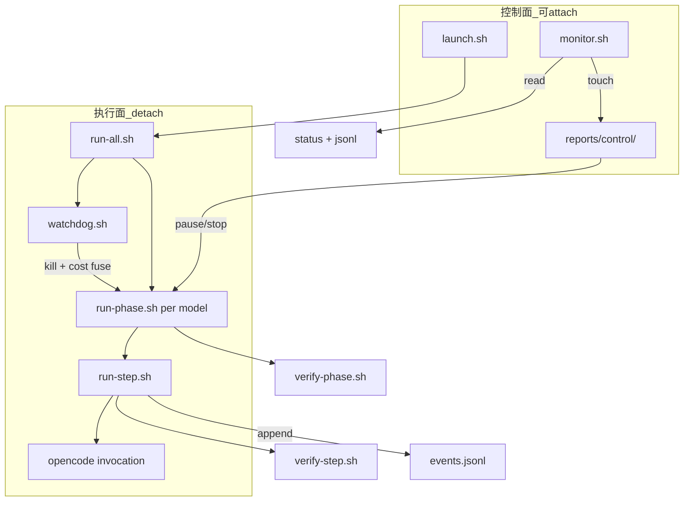

# Round2 run4 · Harness 规格（v3）

> **Round2 第 4 次跑测**的 harness 改造，不是新实验轮次。主文档见 [README.md](./README.md)。
> 状态留痕：[state-and-events.md](./state-and-events.md)；KPI：[scoring.md](./scoring.md)。
> 术语：**phase** = 阶段 P0/P1/… → **step** = 单 strategyId → **invocation** = 单次 opencode。

## 1. 目标

在 round2「整 phase 一次交付」失败模式上，改为：

1. **step 制**：harness 驱动每策略实现，模型在同 phase 单会话内多 invocation 迭代
2. **可恢复**：git checkpoint + append-only 事件；失败 step 可 reset 重跑
3. **可监管**：detach 存活 + Monitor 读文件 + control 暂停/停止 + watchdog 熔断
4. **评模型**：统一 opencode；id 预写死；difficulty 由模型定；KPI 偏利用率

## 2. 架构



| 组件 | 职责 |
|---|---|
| `launch.sh` | setsid + nohup 启动 run-all；写 `run-all.pid` |
| `run-all.sh` | 调度多模型；读 `status` resume；尊重 control |
| `run-phase.sh` | 单模型单 phase：遍历 steps → phase 末 verify |
| `run-step.sh` | 单 step：invocation 循环 → verify-step → git commit → checkpoint |
| `verify-step.sh` | 夹具 + typecheck 增量 + 单文件 oracle 扫描 |
| `verify-phase.sh` | npm test + verify:r2 全量（727 + 污染 + P3） |
| `watchdog.sh` | stale 检测 → kill + 留痕；费用累加 → fuse |
| `monitor.sh` | 只读仪表盘；`stop`/`pause` 转 control 文件 |

**费用**：检测/熔断在 **watchdog**（或 run-step 每 invocation 后累加）；展示在 **monitor**。

## 3. 实验前置

### 3.1 分支

- **master**：引擎 + `verify:r2` + 全部 strategy stub + harness
- **foundation**：从 master 重切（删 `orchestration/`、`research/hodoku-logic/`，中性化文档）
- 旧 `foundation` 已归档：`archive/round2/run3/foundation`

### 3.2 策略注册（id 预写死）

- `packages/engine/src/strategies/registry.ts`（或等价）：**全部** round2 required id 占位，`apply() => null`
- `required-ids/<phase>.txt`：本 phase 应**实现**的 id 子集（非注册子集）
- step 任务：**只实现** `strategies/<id>.ts`，**禁止**增删 registry 条目

### 3.3 difficulty（与 id 正交）

- 模型在 step 内可调整**本 id** 的 `difficulty` 与在 `CANONICAL_STRATEGY_ORDER` 中的位置
- harness lint（verify-step）：禁止单 step 内改动其他 id 的 difficulty；禁止单 step 改动 `LAST_RESORT_IDS`（非 p3 phase）

### 3.4 模型清单

- 去掉 devstral2（round2 三次 P0 失败）
- 统一 `runner=opencode`（含 grok 系模型用 xai 路由）

## 4. 状态机

### 4.1 Phase 链（每模型）

```
p0 → p1 → p2a → p2b → e → p3
```

| 迁移 | 条件 |
|---|---|
| 进入下一 phase | 当前 phase `phase.complete` |
| `phase.skip` | 当前 phase `phase.fail` 且策略配置为 STOP 链 |
| `phase.fail` 但继续 | 配置 `PHASE_FAIL_POLICY=continue` 时仅记分，不 SKIP（实验选项） |

默认与 round2 相同：**fail → 后续 SKIP**。

### 4.2 Step 链（phase 内）

```
for strategyId in required-ids/<phase>.txt (ordered):
  step.start
  loop invocations with INVOCATION_RETRIES
  verify-step
  on success: checkpoint, step.complete
  on fail: STEP_RETRIES with git reset to parentCommit
  on exhaust: step.fail → PHASE_FAIL or step.skip per policy
```

### 4.3 Invocation 循环（step 内）

```
invocation.start
opencode run (continue session within step)
invocation.end
if watchdog/idle/exit!=0 → invocation retry (same step, same or new session per config)
if pause file → pause.accepted, exit runner gracefully
else continue until model step-done signal or idle timeout
```

**Invocation 失败不直接 step.fail**；耗尽 `INVOCATION_RETRIES` 才进入 verify-step 或下一 invocation 策略。

## 5. 验证分层

| 层级 | 命令/脚本 | 时机 | 硬门 |
|---|---|---|---|
| T0 | 策略夹具单测 `vitest run <id>.test.ts` | step 末 | ✅ |
| T1 | `apply(fixtureGrid) !== null` smoke | step 末 | ✅ |
| T2 | typecheck | step 末 | ✅ |
| T3 | 单文件 brute-oracle grep | step 末 | ✅ |
| R1 | `npm test`（含 400 GT soundness） | phase 末 | ✅ |
| R2 | `verify:r2 --phase <phase>`（727 + 污染 + P3） | phase 末 | ✅ |
| KPI | 策略利用率（见 scoring.md） | phase 末 | ❌ 评分 |

**ground-truth（400）**：不在每个 step 全跑；在 **phase 末** 随 `npm test` 执行。step 级用**夹具**触发策略，避免「400 未触发策略却通过」。

## 6. Hard / Soft 边界

| 层级 | Hard fail | Soft / 评分 |
|---|---|---|
| invocation | （无；仅 retry） | — |
| step | 夹具失败；smoke null；typecheck；本文件 oracle；越权改 profiles | — |
| phase | npm test；727 soundness；污染；P3 泄漏；本 phase 全部 step 未完成 | 利用率、727 delta、缺实现 id 列表 |
| experiment | — | full corpus（人工） |

## 7. 重试预算（默认，可 env 覆盖）

| 变量 | 默认 | 说明 |
|---|---|---|
| `INVOCATION_RETRIES` | 3 | 单次 opencode 失败、watchdog kill、idle |
| `STEP_RETRIES` | 2 | 含 reset 到新 session + parentCommit |
| `PHASE_RETRIES` | 1 | 仅 phase 末 verify 失败；重新跑末段 steps 或全 phase |

## 8. 摆烂检测（id 预写死）

| 检测 | 说明 |
|---|---|
| 夹具未通过 | step 无法 complete |
| `apply` 在夹具盘面返回 null | step 无法 complete |
| phase 末扫描 | 本 phase required id 均存在 `step.complete` 事件 |
| 利用率 = 0 且夹具过 | 记入 soft flag「夹具孤立」供人工复核 |

## 9. Monitor 与控制

### 9.1 PID 文件

见 [state-and-events.md §2](./state-and-events.md#2-文件布局)：`run-all.pid`、`pids/<name>.json`、`watchdog.pid`。

### 9.2 control 信号

| 文件 | 效果 |
|---|---|
| `control/PAUSE` | 全局：invocation 末优雅退出 |
| `control/PAUSE.<name>` | 单模型暂停 |
| `control/STOP` | monitor 触发 SIGTERM 整组 |
| `control/STOP.<name>` | 单模型下一轮 invocation 前退出 |
| `control/STOP.cost.<name>` | watchdog 费用熔断 |

### 9.3 monitor.sh 子命令（实现目标）

```bash
monitor.sh status          # 打印各模型 phase/step/invocation、cost、state
monitor.sh watch           # 每 60s 刷新；写 liveness.json
monitor.sh pause [name]    # touch PAUSE
monitor.sh resume [name]   # rm PAUSE*
monitor.sh stop-all        # touch STOP + kill -TERM -pgid
```

## 10. Watchdog

继承 round2 多文件 mtime + verify heartbeat；**新增**：

1. 每 `COST_CHECK_SEC` 累加 `stats.jsonl` → 超 `MAX_COST_PER_MODEL` 写 `STOP.cost.<name>` + `cost.fuse` 事件
2. kill 前写 `watchdog.kill` 事件（含 pid 树、staleSec）

**不放 monitor 内**：watchdog 必须与 scheduler 同生命周期。

## 11. Prompt 结构（每 invocation）

harness 拼接（非模型自选）：

1. phase/step 上下文（当前 id、已完成 id 列表）
2. 本 id 研究卡路径 + 夹具要求
3. 红线（oracle、profiles）
4. 若 retry：结构化失败（`verify-step` / `invocation.end` 摘要）
5. **禁止**一次实现多个 id

## 12. Git checkpoint 与恢复

每 `step.complete`：

```bash
git commit -m "model/<name>: <phase>/<strategyId> ok (invocation=N)"
# append checkpoints.jsonl + events git.commit
```

step 失败恢复：

```bash
git reset --hard <parentCommit>
# 新 invocation 序列；prompt 含「上轮失败摘要」
```

report / 人工可据 `checkpoints.jsonl` 检出任意 step 起点复现。

## 13. 跑测生命周期

```
1. 从 master 重切 foundation
2. cleanup.sh（可选 --purge）
3. launch.sh models.txt          # 生成 runId
4. [运行中] monitor.sh watch
5. [可选] touch PAUSE → 合盖/断网 → 再 launch  resume
6. scheduler 结束 → report.sh    # 只读 jsonl
7. [人工] full corpus 各 archive 分支
8. archive-run.sh round2/run4
```

**full corpus 不进入步骤 3–6 脚本。**

## 14. 与 run1–run3（harness v2）文件映射

| run1–run3（v2） | run4（v3） |
|---|---|
| `run-model.sh`（整 phase） | `run-phase.sh` + `run-step.sh` |
| `p0-attempt-N.log` 覆写 | `invocation-<seq>-<ts>.log` 新建 |
| `status/<name>.tsv` | `status/<name>.json` + `hist.jsonl` |
| `p0.metrics.json` 覆盖 | `stats.jsonl` 追加 |
| `prevruns/` | 不需要 |
| `resume_feedback_section` | 读 events + verify JSON 生成 |

## 15. 实现检查清单

- [ ] `runId` 贯穿所有 jsonl
- [ ] 无覆盖写（CI grep 检查 `> logs/*attempt*` 禁止）
- [ ] 每种 kill 有 `watchdog.kill` 或 `pipeline.stop`
- [ ] pause 不产生 `phase.fail`
- [ ] resume 读 jsonl 不读孤立 metrics
- [ ] step 失败可 `git reset` 到 `parentCommit`
- [ ] report.sh 仅聚合 jsonl
- [ ] README 与 round2 交叉链接