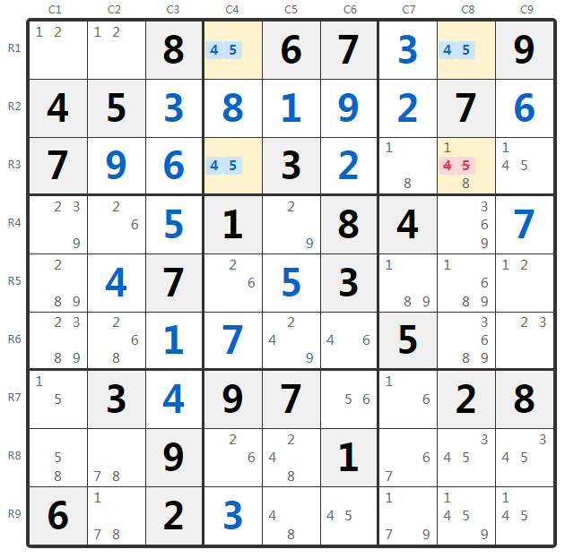
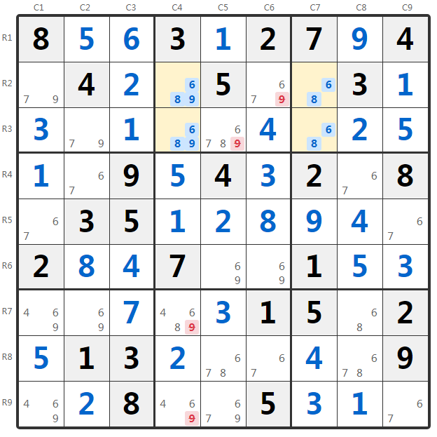
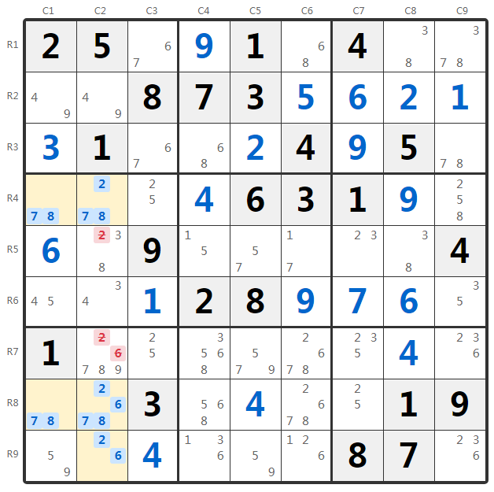
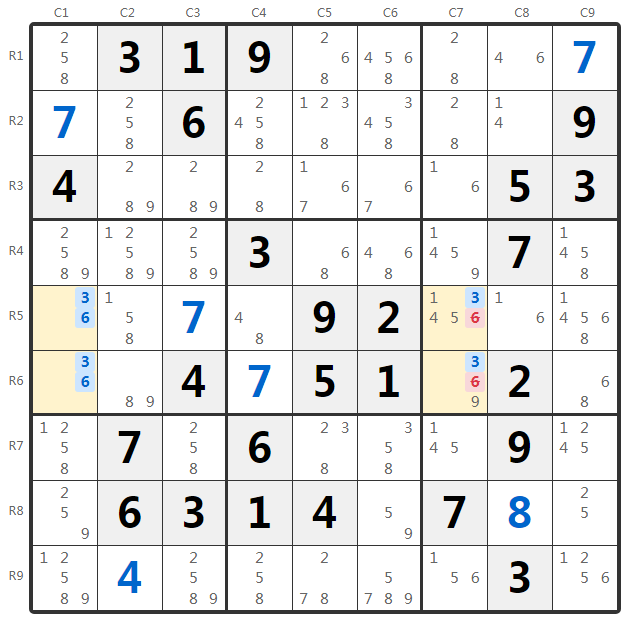

Title: 数独唯一矩形技巧详解：类型1/2/3/4完整攻略

URL Source: https://cn.sudokupuzzle.org/sudoku-guide/unique-rectangle/

Markdown Content:
**唯一矩形**（Unique Rectangle，简称UR）是数独高级技巧中非常重要的一类方法，它利用了**数独必须有且仅有一个解**的规则来推导。当盘面中出现可能形成"致死模式"（Deadly Pattern）的矩形结构时，我们可以据此排除某些候选数，从而保证唯一解的存在。

数独游戏

**核心原理：**

 如果四个格子（位于两行两列的交叉处，且恰好分布在两个宫中）都只剩下相同的两个候选数{a, b}，那么这四个格子的填法将有两种可能（形成致死模式），导致数独出现**多解**。由于正规数独必须唯一解，所以**这种模式不可能出现**，我们可以利用这一点来排除候选数。

唯一矩形技巧根据矩形中格子的候选数分布情况，分为多种类型。本文将详细讲解最常见的**四种类型**：Type 1（基础型）、Type 2（同余型）、Type 3（数组型）和Type 4（强链型）。

#### 术语说明

*   **地板格（Floor）**：矩形中只有两个候选数{a, b}的格子，这些格子如果全部保留原样会形成致死模式
*   **屋顶格（Roof）**：矩形中除了{a, b}还有其他候选数的格子，这些额外候选数是打破致死模式的关键
*   **UR对角数（UR Pair）**：形成唯一矩形的两个候选数{a, b}

在阅读本文前，建议先掌握[数独行列宫的命名规则](https://cn.sudokupuzzle.org/sudoku-guide/naming-convention/)和基本的候选数技巧。

## 类型1：基础型（Type 1）

**Type 1**是最简单、最直观的唯一矩形类型。它的特征是：矩形四格中，**三个是地板格**（只含{a, b}），**一个是屋顶格**（含{a, b}和其他候选数）。

#### Type 1 规则

**如果**唯一矩形的四个格子中，三个只含{a, b}，一个含{a, b, x...}，

**那么**该屋顶格必须填入x...中的某个数（不能填a或b），因此可以从屋顶格删除a和b。

### 实例分析

图：唯一矩形Type 1 - R1C4, R1C8, R3C4, R3C8 形成包含4, 5的唯一矩形

观察盘面，我们发现以下四个格子形成矩形结构：

*   R1C4：候选数 {4, 5}（地板格）
*   R1C8：候选数 {4, 5}（地板格）
*   R3C4：候选数 {4, 5}（地板格）
*   R3C8：候选数 {1, 4, 5, 8}（屋顶格，含额外候选数1, 8）

这四个格子位于第1行、第3行与第4列、第8列的交叉处，且分布在宫2和宫3中，满足唯一矩形的条件。

1**识别致死模式：**如果R3C8也变成只有{4, 5}，那么这四个格子都只含{4, 5}。此时R1C4=4, R1C8=5, R3C4=5, R3C8=4 与 R1C4=5, R1C8=4, R3C4=4, R3C8=5 都是合法填法，导致多解。

2**推理结论：**为避免多解，R3C8**不能**只剩下{4, 5}，它必须填入1或8。因此可以从R3C8删除候选数4和5。

**操作结果：**

 唯一矩形Type 1：R1C4、R1C8、R3C4、R3C8 包含 {4, 5}

 从 R3C8 删除候选数 4 和 5，保留 {1, 8}

## 类型2：同余型（Type 2）

**Type 2**的特征是：矩形四格中，**两个是地板格**（只含{a, b}），**两个是屋顶格**，且两个屋顶格包含**相同的额外候选数x**。

#### Type 2 规则

**如果**唯一矩形有两个地板格{a, b}和两个屋顶格{a, b, x}（额外候选数相同），

**那么**两个屋顶格中至少有一个必须填x（否则变成致死模式），因此能同时看到两个屋顶格的其他格子可以删除候选数x。

### 实例分析

图：唯一矩形Type 2 - R2C4, R2C7, R3C4, R3C7 形成包含6, 8的唯一矩形，额外候选数9

观察盘面中的唯一矩形结构：

*   R2C4：候选数 {6, 8, 9}（屋顶格）
*   R2C7：候选数 {6, 8}（地板格）
*   R3C4：候选数 {6, 8, 9}（屋顶格）
*   R3C7：候选数 {6, 8}（地板格）

两个屋顶格R2C4和R3C4都有额外候选数 9，且它们在同一列（第4列）。

候选数

1**推理逻辑：**为避免致死模式，R2C4和R3C4中**至少有一个**必须填9。也就是说，候选数9在第4列中被"锁定"在R2C4和R3C4。

2**执行排除：**第4列的其他格子，以及能同时看到R2C4和R3C4的格子，都不能填9。具体来说：

*   R2C6（第2行能看到R2C4）：删除候选数 9
*   R3C5（第3行能看到R3C4，宫2能看到R2C4）：删除候选数 9
*   R7C4（第4列）：删除候选数 9
*   R9C4（第4列）：删除候选数 9

**操作结果：**

 唯一矩形Type 2：R2C4、R2C7、R3C4、R3C7 包含 {6, 8}，额外候选数 9

 从 R2C6、R3C5、R7C4、R9C4 删除候选数 9

## 类型3：数组型（Type 3）

**Type 3**结合了唯一矩形和**隐性/显性数组**技巧。两个屋顶格有**不同的额外候选数**，这些额外候选数与同一单元内的其他格子形成数组关系。

#### Type 3 规则

**如果**两个屋顶格分别含{a, b, x}和{a, b, y}（或{a, b, x, y}等组合），

**并且**这些额外候选数{x, y...}与同行/列/宫中的其他格子形成显性数组，

**那么**该单元中其他格子可以按数组规则删除相应候选数。

### 实例分析

图：唯一矩形Type 3 - R4C1, R4C2, R8C1, R8C2 形成包含7, 8的唯一矩形

观察唯一矩形结构：

*   R4C1：候选数 {7, 8}（地板格）
*   R4C2：候选数 {2, 7, 8}（屋顶格，额外候选数2）
*   R8C1：候选数 {7, 8}（地板格）
*   R8C2：候选数 {2, 6, 7, 8}（屋顶格，额外候选数2, 6）

1**分析屋顶格：**两个屋顶格R4C2和R8C2都在第2列。为避免致死模式，它们至少有一个必须填入额外候选数（2或6）。换句话说，R4C2和R8C2"合起来"必须包含{2, 6}中的至少一个。

2**发现数组关系：**观察第2列的 R9C2，其候选数为{2, 6}。由于R4C2和R8C2必须占用{2, 6}中的数字，与R9C2一起，这三个格子在第2列形成了对{2, 6}的"锁定"。

3**执行排除：**第2列的其他格子不能包含2或6：

*   R5C2：删除候选数 2
*   R7C2：删除候选数 2 和 6

**操作结果：**

 唯一矩形Type 3：R4C1、R4C2、R8C1、R8C2 包含 {7, 8}

 屋顶格必须保留 {2, 6} 中至少一个，与 R9C2 形成数组，锁定第2列的 {2, 6}

 从 R5C2 删除 2，从 R7C2 删除 2 和 6

## 类型4：强链型（Type 4）

**Type 4**利用了**强链**的概念。当两个屋顶格在同一行/列/宫中，且UR对角数中的某一个在该单元只出现在这两个屋顶格时，可以进行特殊的排除。

#### Type 4 规则

**如果**两个屋顶格在同一单元（行/列/宫），且UR对角数a在该单元**只出现在这两个屋顶格**，

**那么**这两个屋顶格中必有一个填a（强链关系），不能两个都填b，因此可以从两个屋顶格删除另一个UR对角数b。

### 实例分析

图：唯一矩形Type 4 - R5C1, R5C7, R6C1, R6C7 形成包含3, 6的唯一矩形

观察唯一矩形结构：

*   R5C1：候选数 {3, 6}（地板格）
*   R5C7：候选数 {1, 4, 5, 6, 8}（含3, 6的屋顶格？实际需检查）
*   R6C1：候选数 {3, 6}（地板格）
*   R6C7：候选数 {1, 4, 5, 6, 8}（屋顶格）

实际上根据题目，四个格子 R5C1, R5C7, R6C7, R6C1 包含候选数 {3, 6}，两个屋顶格 R5C7 和 R6C7 在**第7列**中都含有3和6。

1**检查强链条件：**在第7列中，候选数 3 只出现在R5C7和R6C7两个格子。这意味着第7列的3必须填在这两格之一（形成强链）。

2**推理逻辑：**由于R5C7和R6C7中**必有一个填3**，它们**不可能都填6**。如果两个都填6，第7列就没有3的位置了。

3**执行排除：**既然两个屋顶格不能都填6，而为避免致死模式它们必须"破坏"只含{3, 6}的状态，可以从两个屋顶格删除候选数6：

*   R5C7：删除候选数 6
*   R6C7：删除候选数 6

**操作结果：**

 唯一矩形Type 4：R5C1、R5C7、R6C1、R6C7 包含 {3, 6}

 第7列中 R5C7、R6C7 必含3（强链），不能都填6

 从 R5C7、R6C7 删除候选数 6

## 四种类型对比

| 类型 | 地板格数量 | 屋顶格数量 | 特征 | 删除位置 |
| --- | --- | --- | --- | --- |
| **Type 1** | 3个 | 1个 | 唯一的屋顶格有额外候选数 | 从屋顶格删除UR对角数 |
| **Type 2** | 2个 | 2个 | 两个屋顶格有相同的额外候选数x | 从能看到两个屋顶格的格子删除x |
| **Type 3** | 2个 | 2个 | 屋顶格的额外候选数与其他格形成数组 | 按数组规则从同单元其他格删除 |
| **Type 4** | 2个 | 2个 | UR对角数之一在屋顶格所在单元形成强链 | 从两个屋顶格删除另一个UR对角数 |

## 如何发现唯一矩形？

1**寻找双值格：**首先找出盘面中只有两个候选数的格子（双值格）。

2**检查矩形结构：**看看是否有两个双值格含有相同的候选数{a, b}，且它们可以与另外两个格子形成矩形（两行两列，跨两个宫）。

3**验证另外两格：**检查矩形的另外两个格子是否都包含{a, b}作为候选数（可以有其他候选数）。

4**判断类型并执行：**根据地板格和屋顶格的数量和特征，判断属于哪种类型，然后执行相应的排除操作。

**重要条件：**

*   唯一矩形的四个格子必须**恰好分布在两个宫**中（不能在同一个宫，也不能在三个或四个宫）
*   UR对角数{a, b}必须是所有四个格子的**共同候选数**
*   唯一矩形技巧的前提是**数独有唯一解**，对于可能有多解的题目不适用

## 技巧总结

*   **核心思想：**利用"数独必须唯一解"的规则，避免出现致死模式
*   **识别条件：**四格形成矩形，跨两行两列两宫，都含相同的两个候选数
*   **类型选择：**根据地板格/屋顶格的数量和额外候选数的分布选择处理方式
*   **应用场景：**高级数独解题，特别是当其他技巧难以突破时

**实战建议：**

 唯一矩形是非常强大的高级技巧，但需要一定的练习才能熟练识别。建议：

*   从Type 1开始练习，它最容易识别和理解
*   习惯标记候选数，这样更容易发现潜在的矩形结构
*   记住关键判断：四格、两行两列、两宫、相同双值
*   Type 3和Type 4需要结合其他技巧知识（数组、强链），建议先掌握这些基础
