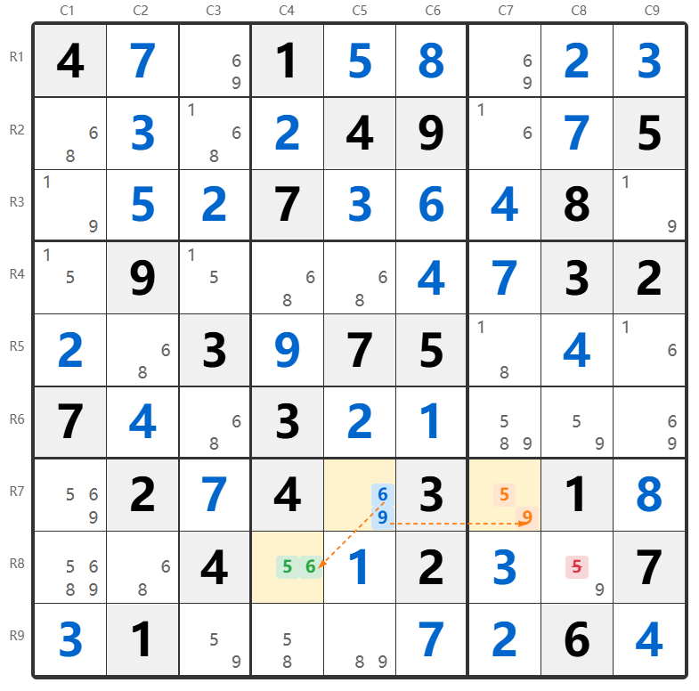
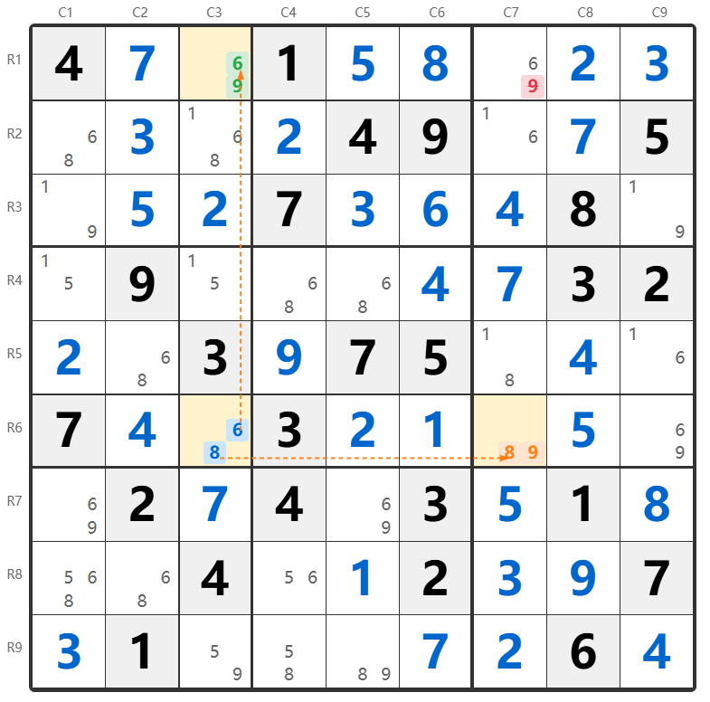

Title: XY翼技巧详解：三个双值格子的巧妙排除

URL Source: https://cn.sudokupuzzle.org/sudoku-guide/xy-wing/

Markdown Content:
**XY翼**（英文称 XY-Wing）是数独高级技巧中一种优雅的排除方法。它利用三个**双值格子**（只有两个候选数的格子）之间的特殊关系，通过逻辑推理进行候选数排除。

**核心原理：**

 XY翼由三个双值格子组成：一个**轴心（Pivot）**和两个**翼（Wing）**。轴心格子必须能同时"看到"两个翼格子（即在同一行、列或宫）。如果轴心是{X,Y}，一个翼是{X,Z}，另一个翼是{Y,Z}，那么**Z一定在某个翼格子中**。因此，能同时看到两个翼格子的位置可以删除候选数Z。

XY翼原理示意图：轴心{X,Y}与两个翼{X,Z}、{Y,Z}的关系，Z必在翼1或翼2中

在阅读本文前，建议先了解[数独行列宫的命名规则](https://cn.sudokupuzzle.org/sudoku-guide/naming-convention/)和[数对法](https://cn.sudokupuzzle.org/sudoku-guide/naked-pairs/)的基本概念。

XY翼包含三个关键元素：

*   **轴心（Pivot）**：中心格子，候选数为{X,Y}，必须能同时看到两个翼格子
*   **翼1（Wing 1）**：候选数为{X,Z}，与轴心在同一行、列或宫
*   **翼2（Wing 2）**：候选数为{Y,Z}，与轴心在同一行、列或宫

关键特征：三个格子的候选数共享三个数字X、Y、Z，每个数字恰好出现两次。

## 为什么XY翼有效？

1**轴心只能是X或Y：**轴心格子{X,Y}最终只能填入X或Y中的一个。

2**如果轴心是X：**翼1{X,Z}不能是X（同单元内不能重复），所以翼1必须是**Z**。

3**如果轴心是Y：**翼2{Y,Z}不能是Y（同单元内不能重复），所以翼2必须是**Z**。

4**结论：**无论轴心是X还是Y，**Z一定在翼1或翼2中**。因此，能同时看到两个翼格子的位置不能有Z。

## 实例一：R7C5为轴心的XY翼

我们来看第一个例子，展示一个典型的XY翼结构。

图1：轴心R7C5{6,9}，翼R8C4{5,6}和R7C7{5,9}，删除R8C8的候选数5

### 分析过程

1**识别轴心：**R7C5 是双值格子，候选数为 {6, 9}。

2**找到翼格子：**

*   R8C4（翼1）：候选数 {5, 6}，与轴心在同一宫（宫8）
*   R7C7（翼2）：候选数 {5, 9}，与轴心在同一行（第7行）

3**验证XY翼结构：**

*   轴心{6,9} + 翼1{5,6} + 翼2{5,9} = 三个数字5、6、9各出现两次 ✓
*   轴心能看到两个翼格子（宫8和第7行）✓
*   公共数字Z = 5

深入探索

今日数独

谜语和益智游戏

打印数独题目

4**推理过程：**

*   如果R7C5=6 → R8C4不能是6 → R8C4=**5**
*   如果R7C5=9 → R7C7不能是9 → R7C7=**5**
*   无论哪种情况，**R8C4或R7C7中必有一个是5**

5**找到删除目标：**R8C7 能同时看到两个翼格子（与R8C4同行，与R7C7同宫）。

**结论：**

 XY翼：轴心 R7C5，翼 R8C4 和 R7C7。

 可从 R8C7 删除候选数 5。

## 实例二：R6C3为轴心的XY翼

接下来我们看另一个例子，展示不同位置关系的XY翼。

图2：轴心R6C3{6,8}，翼R1C3{6,9}和R6C7{8,9}，删除R1C7的候选数9

### 分析过程

1**识别轴心：**R6C3 是双值格子，候选数为 {6, 8}。

2**找到翼格子：**

*   R1C3（翼1）：候选数 {6, 9}，与轴心在同一列（第3列）
*   R6C7（翼2）：候选数 {8, 9}，与轴心在同一行（第6行）

3**验证XY翼结构：**

*   轴心{6,8} + 翼1{6,9} + 翼2{8,9} = 三个数字6、8、9各出现两次 ✓
*   轴心能看到两个翼格子（第3列和第6行）✓
*   公共数字Z = 9

深入探索

数独解题器

数独难度选择

浏览器游戏

4**推理过程：**

*   如果R6C3=6 → R1C3不能是6 → R1C3=**9**
*   如果R6C3=8 → R6C7不能是8 → R6C7=**9**
*   无论哪种情况，**R1C3或R6C7中必有一个是9**

5**找到删除目标：**R1C7 能同时看到两个翼格子（与R1C3同行，与R6C7同列）。

**结论：**

 XY翼：轴心 R6C3，翼 R1C3 和 R6C7。

 可从 R1C7 删除候选数 9。

## 如何发现XY翼？

寻找XY翼需要系统化的方法：

1**找到所有双值格子：**首先标记出所有只有两个候选数的格子。

2**选择潜在轴心：**对于每个双值格子{X,Y}，检查它能看到的其他双值格子。

3**寻找配对的翼：**找两个双值格子，一个包含X和第三个数Z，另一个包含Y和Z。

4**验证结构：**确认轴心能同时看到两个翼格子。

5**找删除目标：**找能同时看到两个翼格子且包含候选数Z的格子。

**注意事项：**

*   轴心必须能**同时看到**两个翼格子（在同一行、列或宫）
*   两个翼格子**不需要**能互相看到
*   删除的是**公共数字Z**，即两个翼格子共有的那个数字
*   删除目标必须能**同时看到两个翼格子**

## 技巧总结

XY翼的应用要点：

*   **识别条件：**三个双值格子，候选数分别为{X,Y}、{X,Z}、{Y,Z}
*   **结构要求：**轴心{X,Y}能同时看到两个翼{X,Z}和{Y,Z}
*   **删除目标：**公共数字Z
*   **删除范围：**能同时看到两个翼格子的所有位置

**立即练习：**

[开始一局数独游戏](https://cn.sudokupuzzle.org/)，尝试使用XY翼进行排除！当你发现多个双值格子时，检查它们是否能形成XY翼结构。
