Title: 数独求解的高级技巧

URL Source: https://jwangl5.github.io/posts/advanced_techniques_for_sudoku_solving/

Published Time: 2023-02-10T00:00:00+08:00

Markdown Content:
> 本文档参照[Hodoku官方的教程](https://hodoku.sourceforge.net/en/index.php)和我的系统性梳理

*   Full house / Last digit （就是整行列宫的最后一个位置和数字）
*   Hidden single （行列宫中只有一个位置可以填写该数字）
*   Naked single （格子里只有一个数字可以填）

## 二、Intersections （Locked Candidates）

有两种情况（中文名字叫做行列消除法，是最最直观和简单的数独求解方案）

*   Pointing的情况是，虽然行列中有多个选择，但因为每一宫只能出现一个，因而如果在特定宫没有其他位置可以填写该数字，那么这一行列的数字就锁定在了这一宫

*   Claiming的情况和Pointing反过来，即使说在特定宫虽然有多个选择，但因为行或列中只有这个位置有，那么就锁定在了这一宫

根据是消除自己格子的候选数还是其他格子的候选数可以分类两种逻辑推断：

*   第一种情况消除自己格子里的其他候选数，叫做Hidden Subsets，也就是n个数字只能出现在n个格子中，那么这n个格子里不能再出现其他数字

    *   Hidden pair，当有两个数字只在行列宫特定的两个位置出现时，这个格子里的其他数字可以排除（n=2）
    *   Hidden triple，三个数字在三个格子的情况也是一样的（n=3）
    *   Hidden quadruple，四个数字的情况也可以做排除（n=4）

*   另一种情况是数对形成后，该数对所在的行列宫也不再能出现该数字，这种排除方法叫做Naked Subsets，根据数对中数字的不同，有如下几种：

    *   Naked pair，是说在形成pair之后，这一pair所在的行列宫不能再出现这两个数字；
    *   Locked pair，有一些Pair出现的位置可能同时作用(行或列)和宫，这样在两个作用域都可以消除；
    *   Naked Triple，和pair的情况是一样的；
    *   Locked Triple，和pair的情况是一样的；
    *   Naked Quadruple，四个的情况只有Naked block，不会出现同时两个house（house就是行或列或宫）；

* * *

以上三种方法均为数独求解的基础方法，很容易理解，这里不再给出案例 接下来是高级思路

* * *

鱼是一种Single Digit Pattern，其大概逻辑就是每行每列只能有1个位置，也就是说可以锁定在这些行列形成的网格点中，那么其他位置就可以删除，下面是基础鱼的类型：

*   Size 2: **X-Wing** (X-Wing is a fish and not a wing!)，比如说，在一行中只有两个位置可以出现该数字，而如果可以观察到两个这样的行，且列位置是对齐的，那么这两列中只有这两行可以出现该数字，其他位置的该数字可以删除（看下面的案例来理解）
*   Size 3: **Swordfish**，剑鱼，X-wing是2个位置有两行两列，swordfish是三行三列（不过不一样的是，可以是三个或三个以下，也就是说网格点不一定全都有）
*   Size 4: **Jellyfish**，水母，四行四列
*   Size 5: **Squirmbag** // Size 6: **Whale** // Size 7: **Leviathan**，都算是`lager basic fish`，在实际中用不太上

下面是X-wing的案例，其思路可以行列倒换情况，可以填写的结果也是类似于X的样子，最后排除时同样进行颠倒

[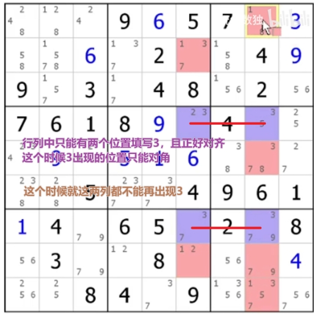](../../assets/chinese-jwangl5-advanced/02-sudoku-wps1.jpg)
但实际情况下，鱼并不会那么整整齐齐，很多时候会从格子中多一点或歪一点，从而形成了一些变种，最经典的变种鱼是**Finned fish（有鳍鱼）**/**Sashimi fish（生鱼片）**，这种思路的变化都可以针对X-wing、swordfish和jellyfish等

*   Finned Fish的含义是说，在形成鱼的方向上还多出来一个候选数字时被称作鱼鳍，这个时候鱼鳍和鱼共同影响的单元格可以被剔除（下图是X-wing和Swordfish的例子，Jellyfish同理）

[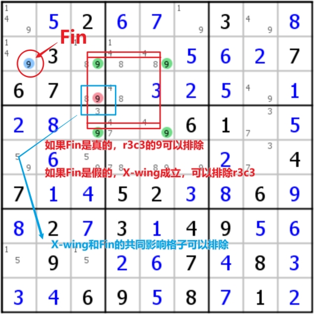](../../assets/chinese-jwangl5-advanced/03-sudoku-wps2.jpg)[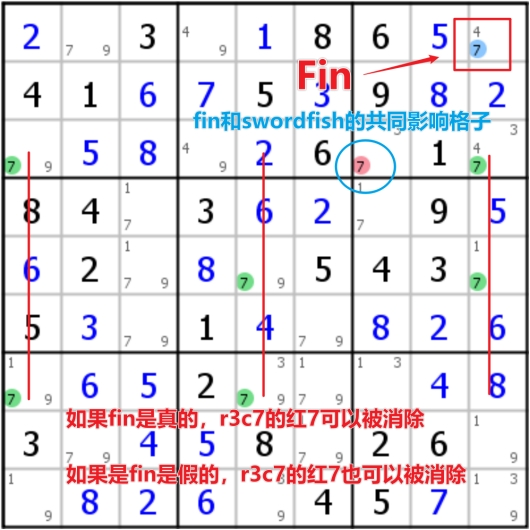](../../assets/chinese-jwangl5-advanced/04-sudoku-wps3.jpg)
*   Sashimi Fish是说，带有鳍的鱼有时候看起来不太完整时，就被称为生鱼片（其实本质上就是一条有鳍鱼，只是看起来不是很完整但确实符合鱼的逻辑），因为鱼鳍的存在，使得原有不完整的鱼出现了一些新信息（下图是X-wing和Swordfish的例子，Jellyfish同理）

[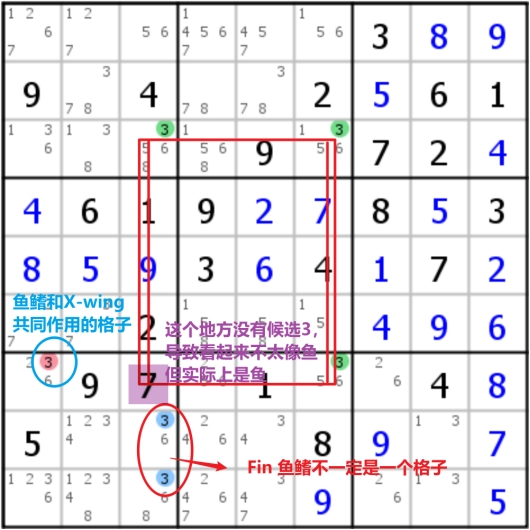](../../assets/chinese-jwangl5-advanced/05-sudoku-wps4.jpg)[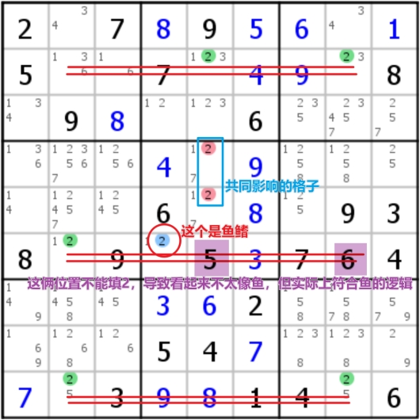](../../assets/chinese-jwangl5-advanced/06-sudoku-wps5.jpg)
此外还存在一些复杂的鱼定式：

*   Franken Fish，科学怪鱼
*   Mutant Fish，[交叉鱼](https://zhuanlan.zhihu.com/p/35245385)
*   Siamese Fish，[孪生鱼](https://www.bilibili.com/read/cv7190273)

Wing在本质上是链的定式，因而在这一部分不做过多的解释，在后面有案例和原理，其主要有3类：

*   XY-wing（XY-chain的一种特化，在了解chain之后写笔记）
*   XYZ-wing（XY-wing的高阶版本，本质上仍旧是chain）
*   W-wing（本质上是Discontinuous Nice Loop）

链是在同一行列宫中，具有相同候选数的两个格子之间的关系。需要注意的是，链是针对于特定的行列宫出现的，有可能针对行不能形成链，但针对宫就可以；另外，链是依赖于一个或多个候选数而存在的，这个数字也是链的基本属性之一。

链具有强弱之分，强链是不能同时为假（如果A为假，则B为真，用=x=表示），弱链是不能同时为真（如果A为真，则B为假，用-x-表示）；弱链的本质就是数独的基本规则，即任意两个格子之间的关系都是弱链，也就是说强链是特殊的弱链；此外，链是没有方向的，其逻辑判断可以是双向的，可以从A格子推断B，也可以从B格子推断A；

接下来是几个关于链的定式：

只使用相同的双值格，因为是双值格，所以必定为强链接

[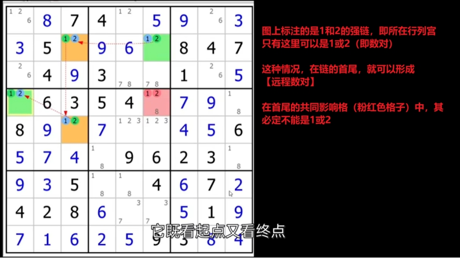](../../assets/chinese-jwangl5-advanced/07-sudoku-wps6.jpg)
X链又可以叫做Alternating Inference Chain（AIC，强弱交替链），不过要求是首尾都得是强链（即强弱强、强弱强弱强等）；在这样的结构下，可以形成漂亮的逻辑链条，即对于A=x=B-x-C=x=D而言，有A为假时，B一定为真，则C定为假，D为真（A不是x，B是x，C不是x，D是x）；反过来也成立，D为假时，C真，B假，A真；也就是说，A和D之间必然会有一个为真，那么A和D的共同作用格子一定就不是这个数字；看下面这个例子

[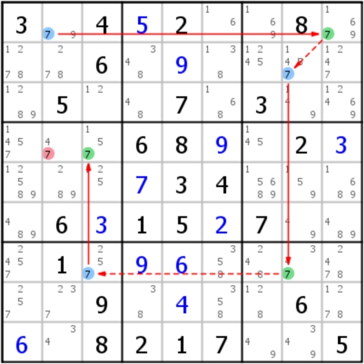](../../assets/chinese-jwangl5-advanced/08-sudoku-wps7.jpg)
值得关注的是，当AIC链条数字相同且长度为3（格子数为4）时的解法称为**Turbot Fish**（多宝鱼）或双强链，而根据不同的形态，多宝鱼又做了很多细致的划分和命名，但原理都是一样的（比如摩天楼、双线风筝、空矩形都是被命名的特殊多宝鱼）

因为弱链水平，且强链垂直而得名

[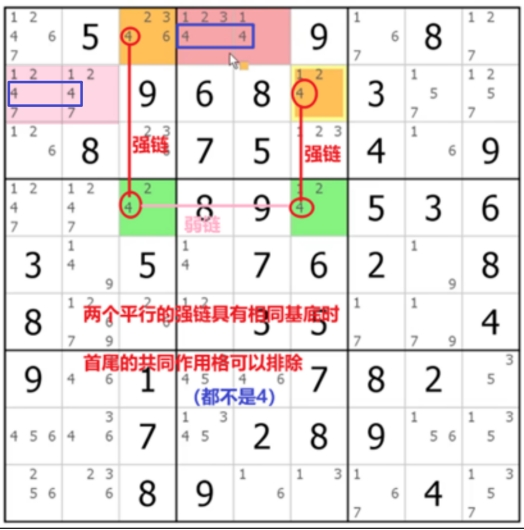](../../assets/chinese-jwangl5-advanced/09-sudoku-wps8.jpg)
首先是标准型态的双线风筝，是由AIC形成的类似风筝的结构（值得注意的是，强链是特殊的弱链，所以出现强强强也是正常的，不过在逻辑推断时需要写作强弱强，否则逻辑不通顺）；

[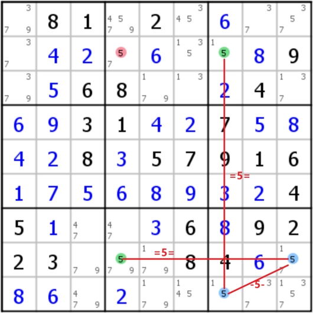](../../assets/chinese-jwangl5-advanced/10-sudoku-wps9.jpg)[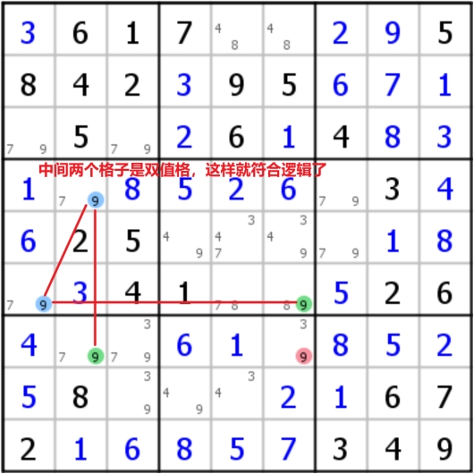](../../assets/chinese-jwangl5-advanced/11-sudoku-wps10.jpg)
另一种形态叫做**Dual 2-string kite（双重双线风筝）**

当在同一宫中，对于特定数字，只有两个位置可以填的时候，往往可以两个类似的双线风筝的结构，如图，这样得到的逻辑判断是可以同时三个黄色或三个粉色，他们的共同影响格正好是两个风筝所看到的，因而同样可以进行消除（强链是特殊的弱链，所以该结构中公用的强链是可以被看作弱链的）

[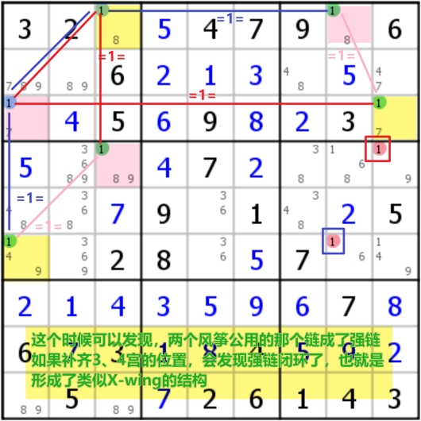](../../assets/chinese-jwangl5-advanced/12-sudoku-wps11.jpg)
首先是标准形态是说，在一个宫内，某个候选数字出现在了特定的行和特定的列中，这时剩下的4个不能填写该数字的格子构成了空矩形；同时需要找另外一行或列，其该数字只出现了两次，且其中一个数字与刚刚特定的行列相同（如下面的案例中蓝线的位置）

在一些案例中，空矩形并不一定要限制在固定的位置上，在只有两个候选格子的时候，其可以是不确定位置的（如右图），这种情况本质上就是X-chain（或者叫Turbot Fish多宝鱼）

[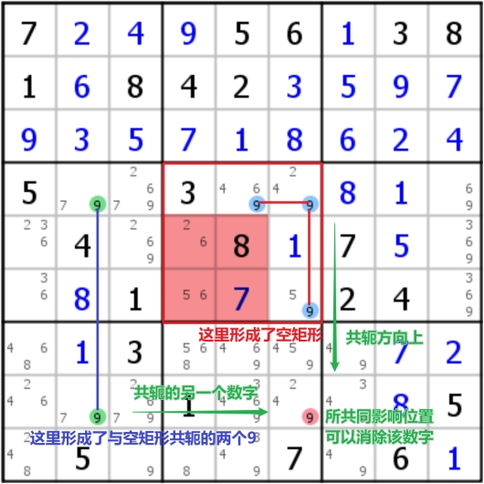](../../assets/chinese-jwangl5-advanced/13-sudoku-wps12.jpg)[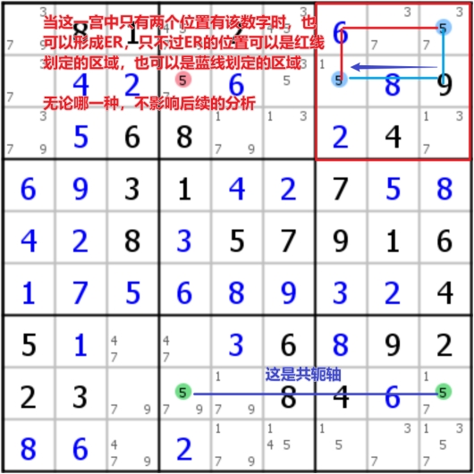](../../assets/chinese-jwangl5-advanced/14-sudoku-wps13.jpg)
在一些情况下，这个共轭的轴可能出现两条，这个情形叫做**Dual Empty Rectangle**，这个时候可以多次消除

[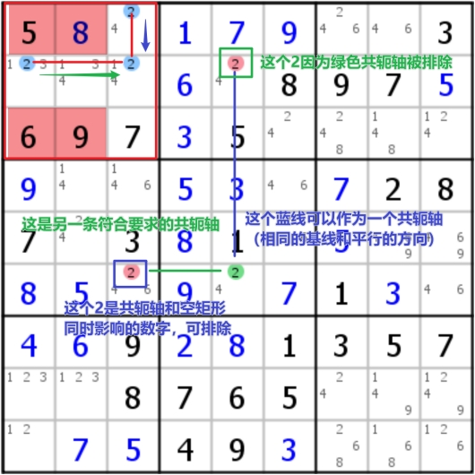](../../assets/chinese-jwangl5-advanced/15-sudoku-wps14.jpg)[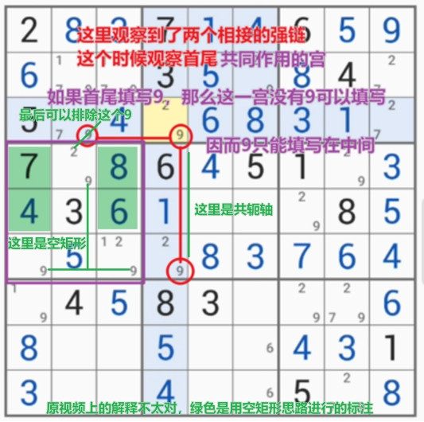](../../assets/chinese-jwangl5-advanced/16-sudoku-wps15.jpg)
PS：空矩形的本质是上面提到的Mutant Fish（Finned Mutant X-Wing）或后面学习的Grouped Nice Loop

只使用双值格形成的链，不过不一样的是**必须**用不同的数字进行对接，并且链的首尾具有相同的数字；结果和X-chain是一样的，也就是说首尾必须有一格是这个数字，因而可以删除这两个格子的共同影响格

在某种程度上，可以认为双值格本身就是一种强链逻辑，因为只有两种选择，当一个为假时，**另一数字**必然为真；而强链是特殊的弱链，所以双值格也可以被认为是弱链；那么当两个弱链连接在同一个格子时，这个格子必须是双值格，从而用另一个数字补全AIC逻辑；而当两个强链连接双值格时，双值格可以被认为是一种弱链，用与让下一个链换另一个数字，从而用另一个数字补全AIC逻辑（PS：如果是一强一弱连接在同一格子上，这个时候不能换数字，否则逻辑就连不起来了）

XY-chain可以理解为XY-wing逻辑的延伸，也就是说多个pivot的双值格连接起来的结构（可以先搞清楚XY-wing之后再看XY-chain）

[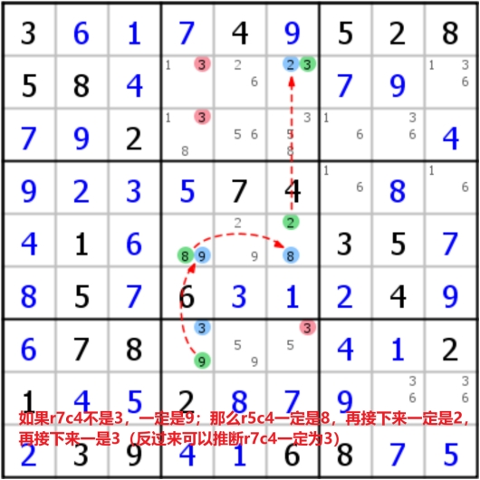](../../assets/chinese-jwangl5-advanced/17-sudoku-wps16.jpg)
本质上就是短的XY-chain（双值格形成的两条链三个格子），其中中间的格子被称为pivot，两边的格子被称为pincers，其结构是由pivot的两个候选数（比如x和y）用弱链连接了两个pincers，而连接的两个格子拥有的另一数字相同时（比如xz和yz），这两个格子必然之一会存在这个数字z，所以他们的共同影响区域不能再出现该数字z

[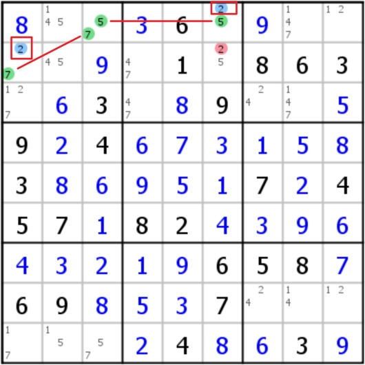](../../assets/chinese-jwangl5-advanced/18-sudoku-wps17.jpg)[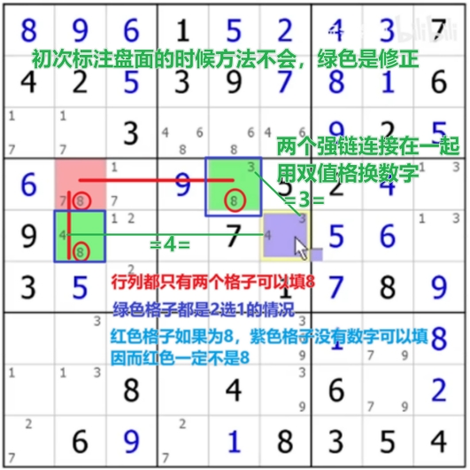](../../assets/chinese-jwangl5-advanced/19-sudoku-wps18.jpg)
其结构和XY-wing类似，不过pivot包含了x、y、z三个候选数，而两个pincers的数字为xz和yz，结果是一样的，删除pincers共同影响格中的z（推导逻辑的时候可以假设pivot分别为x、y、z，然后发现这些格子都不能是z）

[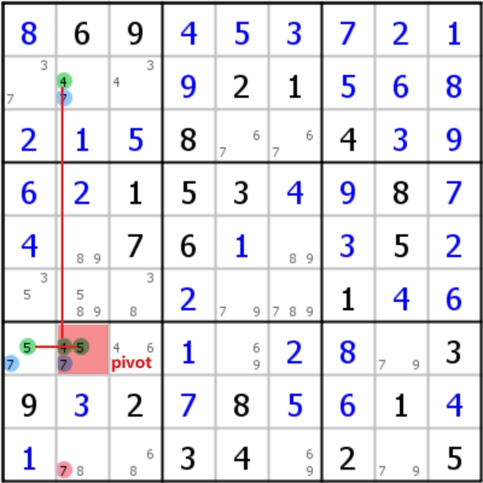](../../assets/chinese-jwangl5-advanced/20-sudoku-wps19.jpg)
Nice Loop是连成环的链，号称最接近普适理论的解法，虽不容易被观察到（观察该Loop的时候也很容易出错），但该方法往往是复杂数独的突破口；其需要构建出合理的逻辑链条（即在假设第一个格子的值后，链的每一步骤都可以推断出明确的数值），下面三个是观察（延伸）链时遵循的经验规律：

1.   当节点有两个强链接时，数字必须不同；（=x=[cell]=x= 不合理）

强链的逻辑是，如果A格子不为x，则B一定为x；在这样的逻辑范式下，前一个强链要求该格子一定为x，而后一个强链要求该格子一定不为x；这样逻辑链条就没办法成立；

2.   当节点有两个弱链接时，必须双值格，且数字不同；（-x-[bivalue cell]-y- 合理）

弱链（如果A格子是x，则B格子不是x）只有指向双值格，才能发生有效推断，即不是x，而一定是另一个值y；后一个弱链一定是依赖于y，从而推断再下一个格子；这一步骤往往是最容易出错的，务必多次检查该格子是否为双值格；

3.   当节点前后有两个不同类型的链接（一弱一强）时，数字必须相同；（=x=[cell]-y- 不合理）（数字相同的一弱一强连接在双值格上似乎是合理的）

这个逻辑就是AIC，没啥可以解释的，可以在假设前一个格子后明确推断出下一个格子；

值得注意的是，链本身没有方向性，其形成逻辑链条后，仍旧是没有方向性的，只不过为了书写、阅读方便，才通常标记箭头，但实际上，完全可以反过来进行推断，逻辑仍旧是通顺的

当逻辑链条能够回连到起始格子的时候，这样的结构称为Nice loop，其包含两种类型：

当最后一个链回到第一个格子后，发现最后一个链可以和第一个链无法连接起来形成合理的逻辑链条，这种情况称为不连续的Nice loop；（其实不连续的Nice Loop可以在其他地方连起来，但现在不用在意，就当作有一个缺口的逻辑环）；这个缺口的形成有3种情况（案例参考上面的网址）：

1.   该格子连接两个相同数字的弱链时，这个时候可以排除这个缺口格子里的该数字

因为当逻辑链起点为该数字（弱链发出格子）时，终点必定不是该数字（弱点指向格子），产生逻辑矛盾；

2.   该格子连接两个相同数字的强链时，该格子就填这个数字（假设不为该数字时，逻辑链条要求该格子必须为该数字）

3.   该格子连接两个不同数字的一强一弱链时，可以消除弱链的候选数（这种情况是出现最多的）

比如说缺口格为-7-[567R1C1]=5=时，这说明，如果该格子不是5（强链发出格子），那么逻辑链条要求该格子也不是7（弱链指向格子）；这个时候，假设该格子为7（不是5的数字，比如说7），那么推断的结果说该格子不是7，造成逻辑矛盾，从而可以排除7；

在Discontinuous Nice Loop中，存在一个简单好用的定式，叫做**W-wing**：首先需要找到两个相同的双值格，然后找到一对有相同数字的强链接，这对强链接的周围可以分别影响那两个双值格，那么双值格的共同影响格中，另一个数字可以被排除（其逻辑十分简单，直接假设强链就可以很容易排除另外一个数字）

[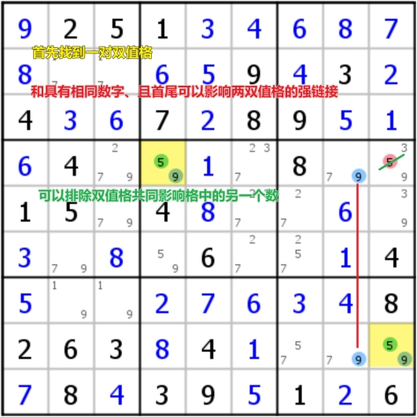](../../assets/chinese-jwangl5-advanced/21-sudoku-wps20.jpg)[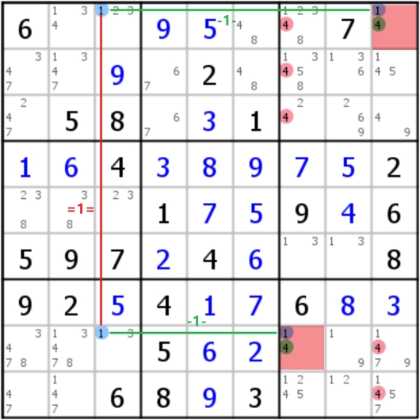](../../assets/chinese-jwangl5-advanced/22-sudoku-wps21.jpg)
右边的案例可以很容易地用Grouped Discontinuous Nice Loop推导，而在推导左边的案例时，不要忘记强链本身就是特殊的弱链，是可以当作弱链使用的（在写标记时应该写为弱链，这样才能正确的进行逻辑推理）

[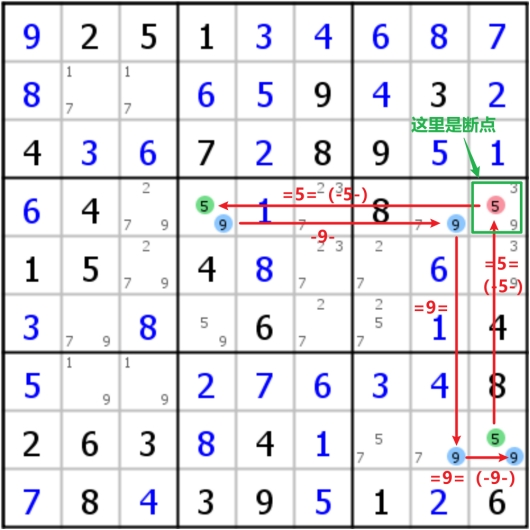](../../assets/chinese-jwangl5-advanced/23-sudoku-wps22.jpg)
当最后一个链回到第一个格子后，发现最后一个链可以和第一个链能够连接起来形成合理的逻辑链条，称作为连续的Nice Loop；连续的Loop十分让人感到舒适是因为不需要找缺口格子，从任意一个格子开始就可以得到整个逻辑链条（而如果是不连续的时候，你看到的第一个格子不一定就是缺口，你可能还需要像前去寻找缺口）；在得到Continuous Nice Loop后，可能有这些情况，从中可以得到如下这些推断：

1.   如果格子前后都被两个强链所连接，那么这个格子必定是这两个不同的候选数，其他数字可以排除（因为这个格子里必然有一个数字是强链上的数）

2.   弱链连接的两个格子的共同影响格，可以消除该候选数（因为弱链连接的两个格子必有其一是该候选数）

最后，值得注意的是，不是所有构建出来的Conutinous Nice Loop都是有信息的，有一些Nice Loop在得到之后是无法得到有效信息的（不能按照上面说的两个思路消除候选数）

在学习Nice Loop的时候，还有一种变种，是说链的节点不一定是单独一个格子，也可以是几个（一组）格子做为链的节点，叫做Grouped chain（比如上面W-wing右侧的那个案例）；

这里有两种情况可以讨论，有待整理

首先是概念，平时在找寻Naked subset的时候，总是会发现在N个格子当中会出现N+1个候选数的情况，这个时候我们把这样的几个格子称为ALS。ALS不能像Naked subset那样直接直接消除其他格子中的候选数，但它可以作为一个group参与链。看下面的几种定式：

*   Singly Linked ALS-XZ

*   Doubly Linked ALS-XZ

*   ALS-XY-Wing

*   ALS Chain

*   Death Blossom

这是一类特殊的技巧，其大前提是说数独只会出现唯一解，而有些数字在填写后会出现多解，这个填写就是错误的，因而在这里会有一些方法，比如之前B站看到过的全双值格致死法

* * *

* * *

下面是之前看B站视频中遇到的案例，在系统整理数独技巧时，已经陆陆续续都整合进上面系统的笔记中，下面是剩下的几个案例

范式：turbot fish/多宝鱼/双强链

[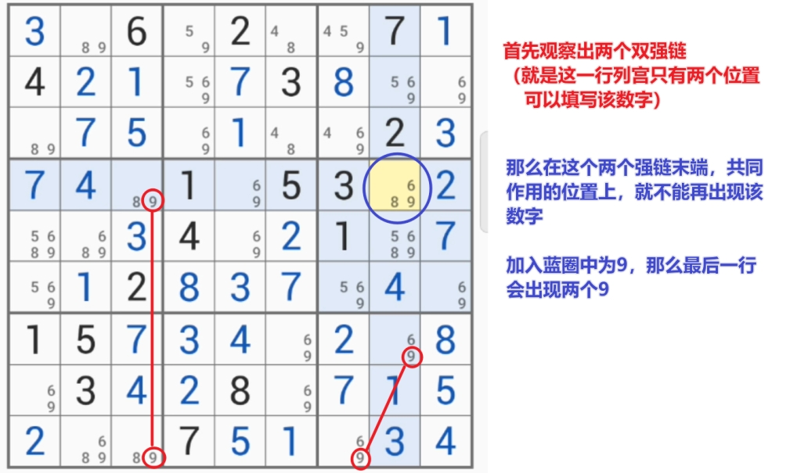](../../assets/chinese-jwangl5-advanced/24-sudoku-wps23.jpg)
（这个情况也可以被看作是特殊的空矩形，按照空矩形的思路求解）

范式：W-wing（这个案例是B站UP主讲的，但还没太看懂为什么符合W-wing定式）

[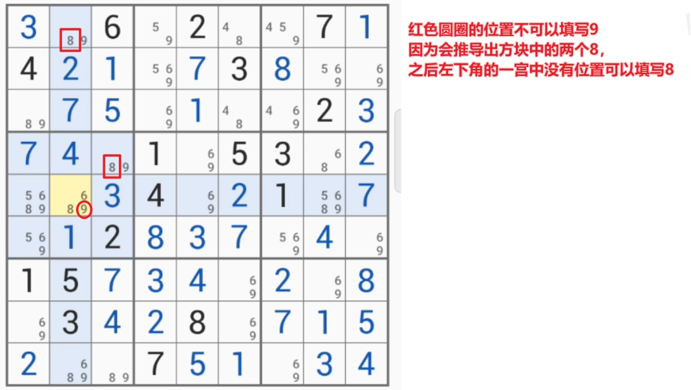](../../assets/chinese-jwangl5-advanced/25-sudoku-wps24.jpg)
特殊情况：全双值格致死

盘面所有格子只有两个候选数，只有一个格子里有三个候选数，这个时候候选数都是两两配对的；这个时候要看三值格时，有一个数字会在行列宫中出现3次，那个格子里就得是这个数字，否则会出现多解

[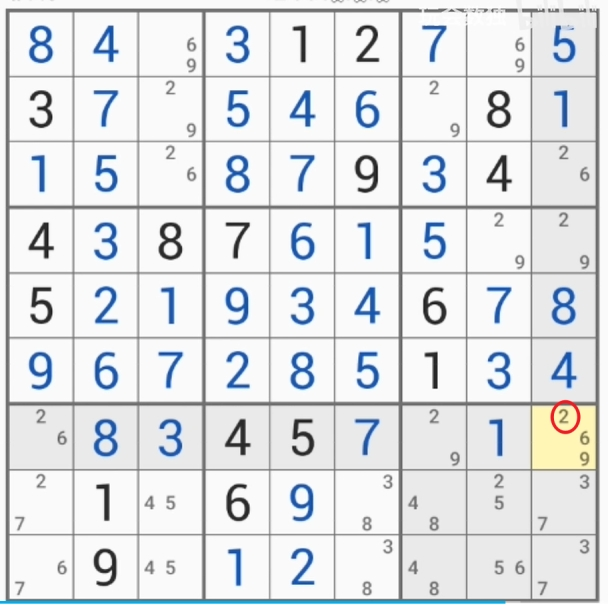](../../assets/chinese-jwangl5-advanced/26-sudoku-wps25.jpg)
