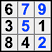

Title: Good Set-Equivalence-Theory Explanations : Advanced solving techniques

URL Source: http://forum.enjoysudoku.com/good-set-equivalence-theory-explanations-t45864.html

Markdown Content:

# The New Sudoku Players' Forum

Sponsored by Enjoy Sudoku

[Skip to content](http://forum.enjoysudoku.com/#start_here)

[Advanced search](http://forum.enjoysudoku.com/search.php?sid=465cd054495273a9c749d327f4ce1f9f "View the advanced search options")

*   [Board index](http://forum.enjoysudoku.com/)**‹**[Sudoku: the puzzle](http://forum.enjoysudoku.com/sudoku-the-puzzle-f5.html)**‹**[Advanced solving techniques](http://forum.enjoysudoku.com/advanced-solving-techniques-f6.html)
*   [Change font size](http://forum.enjoysudoku.com/# "Change font size")
*   [Print view](http://forum.enjoysudoku.com/viewtopic.php?f=6&t=45864&start=0&view=print&sid=465cd054495273a9c749d327f4ce1f9f "Print view")

*   [FAQ](http://forum.enjoysudoku.com/faq.php?sid=465cd054495273a9c749d327f4ce1f9f "Frequently Asked Questions")
*   [Register](http://forum.enjoysudoku.com/ucp.php?mode=register&sid=465cd054495273a9c749d327f4ce1f9f)
*   [Login](http://forum.enjoysudoku.com/ucp.php?mode=login&sid=465cd054495273a9c749d327f4ce1f9f "Login")

## [Good Set-Equivalence-Theory Explanations](http://forum.enjoysudoku.com/good-set-equivalence-theory-explanations-t45864.html)

Advanced methods and approaches for solving Sudoku puzzles

[Post a reply](http://forum.enjoysudoku.com/posting.php?mode=reply&f=6&t=45864&sid=465cd054495273a9c749d327f4ce1f9f "Post a reply")

 19 posts • [Page **1** of **2**](http://forum.enjoysudoku.com/# "Click to jump to page…") • **1**, [2](http://forum.enjoysudoku.com/good-set-equivalence-theory-explanations-t45864-15.html)

*   [Reply with quote](http://forum.enjoysudoku.com/posting.php?mode=quote&f=6&p=353356&sid=465cd054495273a9c749d327f4ce1f9f "Reply with quote")

### [Good Set-Equivalence-Theory Explanations](http://forum.enjoysudoku.com/good-set-equivalence-theory-explanations-t45864.html#p353356)

by **[RichardGoodrich](http://forum.enjoysudoku.com/member4064.html)** » Thu Jun 05, 2025 11:30 pm

SET baloney?

I have found a couple of academic papers - but very hard to understand. 

Are there any sudoku program that use it? - I can't find any!

Are there any clear explanations that WITH EXAMPLES that show how to generally apply the theory?

I find a few YouTube videos that claim to explain it but they seem to be just special cases without any good explanation for the general case?

And is there any software to be found - say in Python?

To me if it can't be programmed then it is NOT very useful!

RichardGoodrich

Big1952

[RichardGoodrich](http://forum.enjoysudoku.com/member4064.html)**Posts:** 137**Joined:** 12 December 2012**Location:** Josephine, TX (north of Dallas, TX)

[Top](http://forum.enjoysudoku.com/good-set-equivalence-theory-explanations-t45864.html#wrap "Top")

* * *

*   [Reply with quote](http://forum.enjoysudoku.com/posting.php?mode=quote&f=6&p=353396&sid=465cd054495273a9c749d327f4ce1f9f "Reply with quote")

### [Re: Good Set-Equivalence-Theory Explanations](http://forum.enjoysudoku.com/good-set-equivalence-theory-explanations-t45864.html#p353396)

by **[eleven](http://forum.enjoysudoku.com/member2814.html)** » Mon Jun 09, 2025 4:42 pm

Note that I am no expert for set equivalence theory, maybe others can tell you more.

As i see it, it is no special technique, which you can implement easily to get eliminations, but it uses a general property of sets of cells, which are combinations of some units (rows, columns or boxes). If two of such sets contain the same number of cells, then you know, that also the non intersecting cells in both sets must contain the same numbers. If one set has one more unit than the other, then it's non intersecting cells must contain the other's numbers plus each digit from 1 to 9.

If it's possible to find useful sets (normally with - almost - disjunctive givens in them), you possibly can deduct candidate elminations from this property.

The eliminations i saw in the samples could also be made with one digit patterns (x-wing to jellyfish) or MSLS (multi sector locked sets), maybe there are others with more complex sets.

What i really like is, that you can make eliminations from the givens without looking at all the candidates.

E.g. this is the sample, which has been presentedby Smart Hobbies on yt [here](https://www.youtube.com/watch?v=nPF3q2la6SU).

Code: [Select all](http://forum.enjoysudoku.com/#)`v  v     v  v              v    +-----------+-----------+-----------+ >  | #9  -  -  |  -  - #8  | #7 #6  -  |    |  . *. *.  | *1 *9  .  |  .  . *.  |    |  .  .  2  |  .  .  .  |  .  .  .  |    +-----------+-----------+-----------+    |  . *3 *.  | *b *b  .  |  .  . *.  |    |  . *9 *.  | *b *b  .  |  .  1 *6  | >  | #8  -  -  |  -  - #a  | #5 #9  -  |    +-----------+-----------+-----------+ >  | #7  -  -  |  -  - #6  | #8 #5  -  | >  | #5  -  -  |  -  8 #9  | #6 #7  -  |    |  . *. *.  | *. *5  .  |  .  . *4  |    +-----------+-----------+-----------+`

 The sets are built from rows 1678 and columns 23459, the non intersecting cells are marked # and *. There is only the one non given cell ar6r6 in the #-ed cells, and they contain numbers 5-9 only.

 The *-ed cells contain 1,2,3 and 4 one time each. If there is another one of the four in the *-ed cells, the cell a had to be the same, otherwise the other 4 occurances had to be in the common cells (-).

So br45c45 cannot be 1234, because it shares the box with a. This solves the puzzle (easier than with 4 jellyfish).

[Added:] Or look, how easy SK loop eliminations can be shown, e.g. in the easter monster puzzle with the Phistomefel sets:

Code: [Select all](http://forum.enjoysudoku.com/#)`#        #  #  #        #    +-----------+-----------+-----------+* | *1  - *.  |  -  -  -  | *.  - *2  |  |  . #9  .  | #4 #. #.  |  . #5  .  |* | *.  - *6  |  -  -  -  | *7  -  *  |  +-----------+-----------+-----------+  |  . #5  .  |  9  .  3  |  . #.  .  |  |  . #.  .  |  .  7  .  |  . #.  .  |  |  . #.  .  |  8  5  .  |  . #4  .  |  +-----------+-----------+-----------+* | *7  -  *  |  -  -  -  | *6  -  *  |  |  . #3  .  | #. #. #9  |  . #8  .  |* |  *  - *2  |  -  -  -  |  *  - *1  |  +-----------+-----------+-----------+`

 r1379, and c24568, * non common cells in rows, # in columns excluding box 5 to get 16 cells each.

 8 digits from 1267 in starred cells, 8 free cells in #, none of 1267 there => the free cells only can be 1267 (remove 34589 there).

 8 digits from 34589 in # => the 8 free * cells can only be 34589 (remove 1267).

PS: It's a pity, that there is no site, where the theory is explained and groups of real world examples are described. It's really cumbersome to look at youtube videos, where so much time is wasted, if you just want to understand the basics, potential and limits.

[eleven](http://forum.enjoysudoku.com/member2814.html)**Posts:** 3293**Joined:** 10 February 2008

[Top](http://forum.enjoysudoku.com/good-set-equivalence-theory-explanations-t45864.html#wrap "Top")

* * *

*   [Reply with quote](http://forum.enjoysudoku.com/posting.php?mode=quote&f=6&p=353405&sid=465cd054495273a9c749d327f4ce1f9f "Reply with quote")

### [Re: Good Set-Equivalence-Theory Explanations](http://forum.enjoysudoku.com/good-set-equivalence-theory-explanations-t45864.html#p353405)

by **[eleven](http://forum.enjoysudoku.com/member2814.html)** » Mon Jun 09, 2025 11:07 pm

This is a puzzle by Big201 from an old chinese site [here](https://tieba.baidu.com/p/5547459565#).

Code: [Select all](http://forum.enjoysudoku.com/#)`+-------+-------+-------+ | . . 9 | . . . | 1 . . | | . . . | 4 . 5 | . . . | | 8 . . | . 3 . | . . 2 | +-------+-------+-------+ | . 5 . | 1 . 7 | . 6 . | | . . 1 | . . . | 3 . . | | . 6 . | 5 . 3 | . 7 . | +-------+-------+-------+ | 1 . . | . 5 . | . . 9 | | . . . | 7 . 4 | . . . | | . . 2 | . . . | 8 . . | +-------+-------+-------+`

Can you solve it now ?

**Hidden Text:**[Show](http://forum.enjoysudoku.com/#)

[Edit2 (see next page):] After SET x-wing, 3 strong links, xy-wing and UR

Last edited by [eleven](http://forum.enjoysudoku.com/member2814.html) on Thu Jun 19, 2025 12:01 am, edited 2 times in total. 

[eleven](http://forum.enjoysudoku.com/member2814.html)**Posts:** 3293**Joined:** 10 February 2008

[Top](http://forum.enjoysudoku.com/good-set-equivalence-theory-explanations-t45864.html#wrap "Top")

* * *

*   [Reply with quote](http://forum.enjoysudoku.com/posting.php?mode=quote&f=6&p=353410&sid=465cd054495273a9c749d327f4ce1f9f "Reply with quote")

### [Re: Good Set-Equivalence-Theory Explanations](http://forum.enjoysudoku.com/good-set-equivalence-theory-explanations-t45864.html#p353410)

by **[Leren](http://forum.enjoysudoku.com/member3782.html)** » Tue Jun 10, 2025 3:15 am

The Smart Hobbies puzzle referred to by eleven. 9....876....19......2.......3........9.....168.....59.7....685.5...8967.....5...4

Watching videos can upset my PC so I passed on that and just copied the puzzle.

At the start there was a MSLS : 22 Truths r23459 c1567 + r9c8 & r234c8 : 22 Links; 234r2 134r3 124r4 234r5 123r9 & 8c8 ; 6c1 67c5 57c6 9c7 ; > 24 eliminations that was basically useless.

The easy way to solve in the traditional way I used 4 finned fishes.

Leren

[Leren](http://forum.enjoysudoku.com/member3782.html)**Posts:** 5216**Joined:** 03 June 2012

[Top](http://forum.enjoysudoku.com/good-set-equivalence-theory-explanations-t45864.html#wrap "Top")

* * *

*   [Reply with quote](http://forum.enjoysudoku.com/posting.php?mode=quote&f=6&p=353433&sid=465cd054495273a9c749d327f4ce1f9f "Reply with quote")

### [Re: Good Set-Equivalence-Theory Explanations](http://forum.enjoysudoku.com/good-set-equivalence-theory-explanations-t45864.html#p353433)

by **[RichardGoodrich](http://forum.enjoysudoku.com/member4064.html)** » Tue Jun 10, 2025 8:14 pm

Thanks for responding guys! Have not been able to get the forum to work well lately! I have not studied your response much yet, but wanted you to know, I am seeing them now. The one paper on the subject I have is a draft titled: "Generalizing Sudoku Strategies" by Kevin Gromley (2014) Problem for me is who is this mysterious Kevin Gromley and how would one get in contact. From what I can decipher it sounds a bit like the n digits to n cells thing but not restricted to a single house. Do any of you have any idea who Kevin Gromley is? I echo the idea the YouTube videos don't give me much joy. However, I did duplicate the mechanics on Arto Inkala' 2012 hardest sudoku and sure seemed to work. My issues as always is what means do you use to apply the method in general or how do you know which puzzles the method could be applied to? Now let me go back and dig into your responses before I go on...

Big1952

[RichardGoodrich](http://forum.enjoysudoku.com/member4064.html)**Posts:** 137**Joined:** 12 December 2012**Location:** Josephine, TX (north of Dallas, TX)

[Top](http://forum.enjoysudoku.com/good-set-equivalence-theory-explanations-t45864.html#wrap "Top")

* * *

*   [Reply with quote](http://forum.enjoysudoku.com/posting.php?mode=quote&f=6&p=353465&sid=465cd054495273a9c749d327f4ce1f9f "Reply with quote")

### [Re: Good Set-Equivalence-Theory Explanations](http://forum.enjoysudoku.com/good-set-equivalence-theory-explanations-t45864.html#p353465)

by **[StrmCkr](http://forum.enjoysudoku.com/member2491.html)** » Wed Jun 11, 2025 6:30 pm

[https://www.reddit.com/r/sudoku/comments/1hzyatu/set_equivalence_theory](https://www.reddit.com/r/sudoku/comments/1hzyatu/set_equivalence_theory)

i wrote about S.E.T here its a brute force application of trial and error fashion of matching N sets and N Sets with equal 9 digit placements 

 those that talk about "set" seem to miss this point completely as it was one of the main reasons it wasn't developed more then a test system on the setBB programmers from long before it got re-branded as S.E.T 

we use Mutli Sector locked Sets { which is set based, a searchable application as its based on the information of the grid : Naked/Hidden sets } as a balance equation system 

which can be written as NxN + K fish mathematics.

Some do, some teach, the rest look it up.

[stormdoku](http://forum.enjoysudoku.com/stormdoku-t32977.html)

[StrmCkr](http://forum.enjoysudoku.com/member2491.html)**Posts:** 1515**Joined:** 05 September 2006

[Top](http://forum.enjoysudoku.com/good-set-equivalence-theory-explanations-t45864.html#wrap "Top")

* * *

*   [Reply with quote](http://forum.enjoysudoku.com/posting.php?mode=quote&f=6&p=353494&sid=465cd054495273a9c749d327f4ce1f9f "Reply with quote")

### [Re: Good Set-Equivalence-Theory Explanations](http://forum.enjoysudoku.com/good-set-equivalence-theory-explanations-t45864.html#p353494)

by **[eleven](http://forum.enjoysudoku.com/member2814.html)** » Sun Jun 15, 2025 11:50 am

I tried David's classic MSLS Examples [here](http://forum.enjoysudoku.com/post228337.html#p228337) with SET. Note, that the real work is to find the appropriate sets to make use of it. To find eliminations then, you probably would prefer the method, which you have practiced more, the effect is the same.

The first one is "unbalanced", it has more columns than rows (therefore the columns must hold extra 1-9).

Code: [Select all](http://forum.enjoysudoku.com/#)`1......8......92....6.3...52....8.....5.7.....6.5....4..47...........91..3..6...7       v v   v v         v   +-------+-------+-------+>  | 1 - - | - - * | * 8 - |>  | * - - | - - 9 | 2 * - |   | . # 6 | # 3 . | . . 5 |   +-------+-------+-------+>  | 2 - - | - - 8 | * * - |   | . # 5 | # 7 . | . . # |   | . 6 # | 5 # . | . . 4 |   +-------+-------+-------+   | . # 4 | 7 # . | . . # |>  | * - - | - - * | 9 1 - |   | . 3 # | # 6 . | . . 7 |   +-------+-------+-------+`

Only 1289 given in 4 rows, 34567 in 5 cols.

Non intersecting sets:

rows 8 digits, 8 empty (*)

cols 13 digits, 12 empty (#)

Because the intersecting cells hold the same count for each number in both the seleccted rows and columns, for each number (1-9) in the non intersecting cells of the rows (i call it the rows set) there must be an extra number in the non intersecting cells of the columns (cols set).

We have 4 different digits 1289 in that rows set. Each of them has to be additional one time in the cols set, which occupies 4 cells. So the 8 givens in the rows plus 4 here exactly fit into the 12 empty cells in the cols set (#). All can only be 1289.

From the givens in the cols set containing the numbers 34567 there must be the same counts in the rows set minus one for each number. We have 13 givens minus 5 for each number, i.e. 8, here exactly the number of empty cells in the row set (*). So they all can only be 34567.

The second example is straight forward with 4 rows, 4 cols and matching numbers of given and empty cells.

The third one depends on the strong link for 5 in box 1, and David found a way to use it:

Code: [Select all](http://forum.enjoysudoku.com/#)`98.7.....6.7...8......85...4...3..2..9....6.......1..4.6.5..9......4...3.....2.1.              v v     v v  +-------+-------+-------+> | 9 8 # | 7 . . | # . . |> | 6 # 7 | # . . | 8 . . |  | . . . | . 8 5 | . * * |  +-------+-------+-------+  | 4 . . | . 3 * | . 2 * |> | # 9 # | # . . | 6 . . |  | . . . | . * 1 | . * 4 |  +-------+-------+-------+> | # 6 # | 5 . . | 9 . . |  | . . . | . 4 * | . * 3 |  | . . . | . * 2 | . 1 * |  +-------+-------+-------+`

8 digits from 1234 in the cols, 58 in both sets, 9 empty cells (*) in the rows. Since 5 is restricted to b1p35, a 5 must be there, and 1234 in the other 7 cells.

11 digits from 56789 in the rows, plus 5 in b1p35, minus 58 in both.

10 empty cells (and 58) in the cols, so they can only be 56789.

[eleven](http://forum.enjoysudoku.com/member2814.html)**Posts:** 3293**Joined:** 10 February 2008

[Top](http://forum.enjoysudoku.com/good-set-equivalence-theory-explanations-t45864.html#wrap "Top")

* * *

*   [Reply with quote](http://forum.enjoysudoku.com/posting.php?mode=quote&f=6&p=353505&sid=465cd054495273a9c749d327f4ce1f9f "Reply with quote")

### [Re: Good Set-Equivalence-Theory Explanations](http://forum.enjoysudoku.com/good-set-equivalence-theory-explanations-t45864.html#p353505)

by **[RichardGoodrich](http://forum.enjoysudoku.com/member4064.html)** » Mon Jun 16, 2025 2:48 pm

> StrmCkr wrote:[https://www.reddit.com/r/sudoku/comments/1hzyatu/set_equivalence_theory](https://www.reddit.com/r/sudoku/comments/1hzyatu/set_equivalence_theory)
> 
> 
> 
> i wrote about S.E.T here its a brute force application of trial and error fashion of matching N sets and N Sets with equal 9 digit placements 
> 
>  those that talk about "set" seem to miss this point completely as it was one of the main reasons it wasn't developed more then a test system on the setBB programmers from long before it got re-branded as S.E.T 
> 
> 
> 
> we use Mutli Sector locked Sets { which is set based, a searchable application as its based on the information of the grid : Naked/Hidden sets } as a balance equation system 
> 
> which can be written as NxN + K fish mathematics.

Saw your write up. Thx. I wondered about that. I really dont need another T@E method!

Big1952

[RichardGoodrich](http://forum.enjoysudoku.com/member4064.html)**Posts:** 137**Joined:** 12 December 2012**Location:** Josephine, TX (north of Dallas, TX)

[Top](http://forum.enjoysudoku.com/good-set-equivalence-theory-explanations-t45864.html#wrap "Top")

* * *

*   [Reply with quote](http://forum.enjoysudoku.com/posting.php?mode=quote&f=6&p=353506&sid=465cd054495273a9c749d327f4ce1f9f "Reply with quote")

### [Re: Good Set-Equivalence-Theory Explanations](http://forum.enjoysudoku.com/good-set-equivalence-theory-explanations-t45864.html#p353506)

by **[RichardGoodrich](http://forum.enjoysudoku.com/member4064.html)** » Mon Jun 16, 2025 2:54 pm

> eleven wrote:I tried David's classic MSLS Examples [here](http://forum.enjoysudoku.com/post228337.html#p228337) with SET. Note, that the real work is to find the appropriate sets to make use of it. To find eliminations then, you probably would prefer the method, which you have practiced more, the effect is the same.
> 
> 
> 
> The first one is "unbalanced", it has more columns than rows (therefore the columns must hold extra 1-9).
> 
> Code: [Select all](http://forum.enjoysudoku.com/#)`1......8......92....6.3...52....8.....5.7.....6.5....4..47...........91..3..6...7       v v   v v         v   +-------+-------+-------+>  | 1 - - | - - * | * 8 - |>  | * - - | - - 9 | 2 * - |   | . # 6 | # 3 . | . . 5 |   +-------+-------+-------+>  | 2 - - | - - 8 | * * - |   | . # 5 | # 7 . | . . # |   | . 6 # | 5 # . | . . 4 |   +-------+-------+-------+   | . # 4 | 7 # . | . . # |>  | * - - | - - * | 9 1 - |   | . 3 # | # 6 . | . . 7 |   +-------+-------+-------+`
> 
> 
> 
> Only 1289 given in 4 rows, 34567 in 5 cols.
> 
> Non intersecting sets:
> 
> rows 8 digits, 8 empty (*)
> 
> cols 13 digits, 12 empty (#)
> 
> Because the intersecting cells hold the same count for each number in both the seleccted rows and columns, for each number (1-9) in the non intersecting cells of the rows (i call it the rows set) there must be an extra number in the non intersecting cells of the columns (cols set).
> 
> We have 4 different digits 1289 in that rows set. Each of them has to be additional one time in the cols set, which occupies 4 cells. So the 8 givens in the rows plus 4 here exactly fit into the 12 empty cells in the cols set (#). All can only be 1289.
> 
> From the givens in the cols set containing the numbers 34567 there must be the same counts in the rows set minus one for each number. We have 13 givens minus 5 for each number, i.e. 8, here exactly the number of empty cells in the row set (*). So they all can only be 34567.
> 
> 
> 
> The second example is straight forward with 4 rows, 4 cols and matching numbers of given and empty cells.
> 
> The third one depends on the strong link for 5 in box 1, and David found a way to use it:
> 
> Code: [Select all](http://forum.enjoysudoku.com/#)`98.7.....6.7...8......85...4...3..2..9....6.......1..4.6.5..9......4...3.....2.1.              v v     v v  +-------+-------+-------+> | 9 8 # | 7 . . | # . . |> | 6 # 7 | # . . | 8 . . |  | . . . | . 8 5 | . * * |  +-------+-------+-------+  | 4 . . | . 3 * | . 2 * |> | # 9 # | # . . | 6 . . |  | . . . | . * 1 | . * 4 |  +-------+-------+-------+> | # 6 # | 5 . . | 9 . . |  | . . . | . 4 * | . * 3 |  | . . . | . * 2 | . 1 * |  +-------+-------+-------+`
> 
> 8 digits from 1234 in the cols, 58 in both sets, 9 empty cells (*) in the rows. Since 5 is restricted to b1p35, a 5 must be there, and 1234 in the other 7 cells.
> 
> 11 digits from 56789 in the rows, plus 5 in b1p35, minus 58 in both.
> 
> 10 empty cells (and 58) in the cols, so they can only be 56789.

Thanks for thoughtful response. I know it works. My issue is how to programmatically find the cases where it can be applied. I knew about the MSLS connection, but was at a loss how to exploit that. Maybe this will help thanks. Thx again.

Big1952

[RichardGoodrich](http://forum.enjoysudoku.com/member4064.html)**Posts:** 137**Joined:** 12 December 2012**Location:** Josephine, TX (north of Dallas, TX)

[Top](http://forum.enjoysudoku.com/good-set-equivalence-theory-explanations-t45864.html#wrap "Top")

* * *

*   [Reply with quote](http://forum.enjoysudoku.com/posting.php?mode=quote&f=6&p=353511&sid=465cd054495273a9c749d327f4ce1f9f "Reply with quote")

### [Re: Good Set-Equivalence-Theory Explanations](http://forum.enjoysudoku.com/good-set-equivalence-theory-explanations-t45864.html#p353511)

by **[eleven](http://forum.enjoysudoku.com/member2814.html)** » Mon Jun 16, 2025 5:35 pm

I don't know, if MSLS programmers first look for links or appropriate units. Once you have the latter, instead of counting truths and links you count filled and empty cells in the non intersecting cells. In case of SK-loop-like MSLS's you can drop a box to get the same number of 4 units per set.

This should find the majority of MSLS eliminations, but not the special ones like [those](http://forum.enjoysudoku.com/post228884.html#p228884), which also turned out to be a problem for David and others.

[eleven](http://forum.enjoysudoku.com/member2814.html)**Posts:** 3293**Joined:** 10 February 2008

[Top](http://forum.enjoysudoku.com/good-set-equivalence-theory-explanations-t45864.html#wrap "Top")

* * *

*   [Reply with quote](http://forum.enjoysudoku.com/posting.php?mode=quote&f=6&p=353514&sid=465cd054495273a9c749d327f4ce1f9f "Reply with quote")

### [Re: Good Set-Equivalence-Theory Explanations](http://forum.enjoysudoku.com/good-set-equivalence-theory-explanations-t45864.html#p353514)

by **[Leren](http://forum.enjoysudoku.com/member3782.html)** » Mon Jun 16, 2025 8:36 pm

My current MSLS code finds one for each of the puzzles in eleven's link. I think the difference is that after that post I added boxes as possible links, which increases the chance of a hit.

Leren

[Leren](http://forum.enjoysudoku.com/member3782.html)**Posts:** 5216**Joined:** 03 June 2012

[Top](http://forum.enjoysudoku.com/good-set-equivalence-theory-explanations-t45864.html#wrap "Top")

* * *

*   [Reply with quote](http://forum.enjoysudoku.com/posting.php?mode=quote&f=6&p=353515&sid=465cd054495273a9c749d327f4ce1f9f "Reply with quote")

### [Re: Good Set-Equivalence-Theory Explanations](http://forum.enjoysudoku.com/good-set-equivalence-theory-explanations-t45864.html#p353515)

by **[eleven](http://forum.enjoysudoku.com/member2814.html)** » Tue Jun 17, 2025 12:07 am

I think, i found a way to do it with SET too, let's take the 3rd puzzle:

In a first step we can make half of the job with the 4 rows and 4 columns:

Code: [Select all](http://forum.enjoysudoku.com/#)`v v     v v  +-------+-------+-------+> | 9 8 * | 7 . . |/6 . . |  | . . . | ./6 # | . # # |  | . . . | . # 5 | . 4 # |  +-------+-------+-------+> | 8 * * | 3 . . | 2 . . |  | . 2 . | . # 1 | . # 6 |> | * * 3 | * . . | * . . |  +-------+-------+-------+  | 7 . . | . 1 # | . # 5 |  | . 3 . | . 4 # | . 6 # |> | * * 8 | 2 . . | 9 . . |  +-------+-------+-------+`

rows 1469 (23789), cols 5689 (1456), a 6 in each sets deleted.

Let set 1 be the non intersecting cells in the rows, set 2 in the cols.

Remove 6 from both sets, then we have

11 givens in set 1, 11 empty cells in set 2 => empty cells in set 2 (#) can only be 23789.

In a second step we add box 4 to the cols, making the minirows 13 in box 4 to common cells and mini row 2 added to set 2.

Code: [Select all](http://forum.enjoysudoku.com/#)`v v     v v  +-------+-------+-------+> | 9 8 * | 7 . . |/6 . . |  | . . . | ./6 # | . # # |  | . . . | . # 5 | . 4 # |  +-------+-------+-------+> | 8 - - | 3 . . |/2 . . |B4| #/2 # | . # 1 | . # 6 |> | - - 3 | * . . | * . . |  +-------+-------+-------+  | 7 . . | . 1 # | . # 5 |  | . 3 . | . 4 # | . 6 # |> | * * 8 | 2 . . | 9 . . |  +-------+-------+-------+`

If we remove 2 from both sets, we have

8 givens in set 2 from 1456, and 5 empty cells in set 1.

This does not fit, because with the additional unit we would need 5+4=9 givens (additional one for each of the 4 digits in set 2).

Looking at the candidates in r5c123, they are

Code: [Select all](http://forum.enjoysudoku.com/#)`45  2  4579`This means, r5c1 must be from set 2 anyway and we have the missing "given", so we can reduce the * cells to 1256. And r5c3 must be from the other set and we can eliminate 45 there, because we can't have more "givens" in one set than can fit into the empty cells of the other set.

[eleven](http://forum.enjoysudoku.com/member2814.html)**Posts:** 3293**Joined:** 10 February 2008

[Top](http://forum.enjoysudoku.com/good-set-equivalence-theory-explanations-t45864.html#wrap "Top")

* * *

*   [Reply with quote](http://forum.enjoysudoku.com/posting.php?mode=quote&f=6&p=353535&sid=465cd054495273a9c749d327f4ce1f9f "Reply with quote")

### [Re: Good Set-Equivalence-Theory Explanations](http://forum.enjoysudoku.com/good-set-equivalence-theory-explanations-t45864.html#p353535)

by **[RichardGoodrich](http://forum.enjoysudoku.com/member4064.html)** » Wed Jun 18, 2025 2:16 pm

> eleven wrote:I think, i found a way to do it with SET too, let's take the 3rd puzzle:
> 
> In a first step we can make half of the job with the 4 rows and 4 columns: ...

eleven, I am NOT ignoring this. I have temporarirly gone on to some other stuff for now. Like how to program again | at least run the gcc compiler for some of that good code 1to9only has on his github! I will be back ...

Big1952

[RichardGoodrich](http://forum.enjoysudoku.com/member4064.html)**Posts:** 137**Joined:** 12 December 2012**Location:** Josephine, TX (north of Dallas, TX)

[Top](http://forum.enjoysudoku.com/good-set-equivalence-theory-explanations-t45864.html#wrap "Top")

* * *

*   [Reply with quote](http://forum.enjoysudoku.com/posting.php?mode=quote&f=6&p=353536&sid=465cd054495273a9c749d327f4ce1f9f "Reply with quote")

### [Re: Good Set-Equivalence-Theory Explanations](http://forum.enjoysudoku.com/good-set-equivalence-theory-explanations-t45864.html#p353536)

by **[RichardGoodrich](http://forum.enjoysudoku.com/member4064.html)** » Wed Jun 18, 2025 2:18 pm

> Leren wrote:My current MSLS code finds one for each of the puzzles in eleven's link. I think the difference is that after that post I added boxes as possible links, which increases the chance of a hit.
> 
> 
> 
> Leren

Leren,

Do I have access to you MSLS code?

Big1952

[RichardGoodrich](http://forum.enjoysudoku.com/member4064.html)**Posts:** 137**Joined:** 12 December 2012**Location:** Josephine, TX (north of Dallas, TX)

[Top](http://forum.enjoysudoku.com/good-set-equivalence-theory-explanations-t45864.html#wrap "Top")

* * *

*   [Reply with quote](http://forum.enjoysudoku.com/posting.php?mode=quote&f=6&p=353537&sid=465cd054495273a9c749d327f4ce1f9f "Reply with quote")

### [!](http://forum.enjoysudoku.com/good-set-equivalence-theory-explanations-t45864.html#p353537)

by **[RichardGoodrich](http://forum.enjoysudoku.com/member4064.html)** » Wed Jun 18, 2025 2:28 pm

> eleven wrote:This is a puzzle by Big201 from an old chinese site [here](https://tieba.baidu.com/p/5547459565#).
> 
> Code: [Select all](http://forum.enjoysudoku.com/#)`+-------+-------+-------+ | . . 9 | . . . | 1 . . | | . . . | 4 . 5 | . . . | | 8 . . | . 3 . | . . 2 | +-------+-------+-------+ | . 5 . | 1 . 7 | . 6 . | | . . 1 | . . . | 3 . . | | . 6 . | 5 . 3 | . 7 . | +-------+-------+-------+ | 1 . . | . 5 . | . . 9 | | . . . | 7 . 4 | . . . | | . . 2 | . . . | 8 . . | +-------+-------+-------+`
> 
> Can you solve it now ?
> 
> 
> 
> **Hidden Text:**[Show](http://forum.enjoysudoku.com/#)
> 
> 
> 
> [Edit (first missed to make an elimination):] After SET x-wing, xy-wing and UR

I did look at this some. Of course there are mutltiple ways. I tend to "cheat" and use Forces along with some of the basics. For now I lean on HoDoKu heavily. Or I could just run DLX or skip to the end in the HoDoKu Solution Path to get the answer. I had a python implemented 4 grid solver (like Denis Berthier) but just the basics plus Forcing after that in an iterative loop back to the basics. Talking about rcn,rnc,ncr,bns grids. Those other grids are great for finding in naked fashion hidden subsets (up to only quads of course! which sometimes lead to fishy patterns in the rcn grid. Thinking of reversing the idea of simplest first and looking for 4 candidate subsets first and working on down, just to see what "shakes out"

Big1952

[RichardGoodrich](http://forum.enjoysudoku.com/member4064.html)**Posts:** 137**Joined:** 12 December 2012**Location:** Josephine, TX (north of Dallas, TX)

[Top](http://forum.enjoysudoku.com/good-set-equivalence-theory-explanations-t45864.html#wrap "Top")

* * *

[Next](http://forum.enjoysudoku.com/good-set-equivalence-theory-explanations-t45864-15.html)Display posts from previous:  Sort by  

* * *

[Post a reply](http://forum.enjoysudoku.com/posting.php?mode=reply&f=6&t=45864&sid=465cd054495273a9c749d327f4ce1f9f "Post a reply")

 19 posts • [Page **1** of **2**](http://forum.enjoysudoku.com/# "Click to jump to page…") • **1**, [2](http://forum.enjoysudoku.com/good-set-equivalence-theory-explanations-t45864-15.html)

[Return to Advanced solving techniques](http://forum.enjoysudoku.com/advanced-solving-techniques-f6.html)

Jump to: 

*   [Board index](http://forum.enjoysudoku.com/)
*   [The team](http://forum.enjoysudoku.com/the-team.html) • [Delete all board cookies](http://forum.enjoysudoku.com/ucp.php?mode=delete_cookies&sid=465cd054495273a9c749d327f4ce1f9f) • All times are UTC 

Powered by [phpBB](https://www.phpbb.com/)® Forum Software © phpBB Group 

