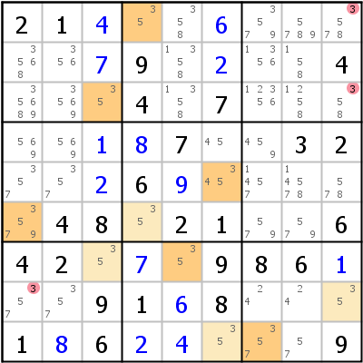
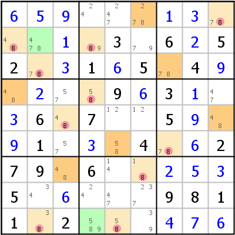
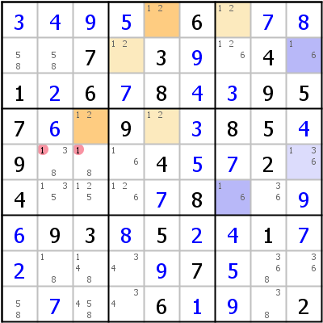
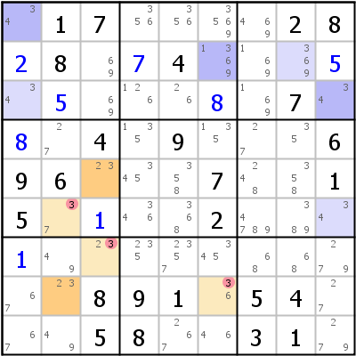

Title: HoDoKu: Solving Techniques - Coloring (Simple Colors, Multi Colors, Color Wrap, Color Trap)

URL Source: https://hodoku.sourceforge.net/en/tech_col.php

Markdown Content:
## Table of Contents

*   [Simple Colors (Color Wrap/Color Trap)](https://hodoku.sourceforge.net/en/tech_col.php#sc)
*   [Multi Colors](https://hodoku.sourceforge.net/en/tech_col.php#mc)

Coloring is a single digit technique that has spawned a number of variants in various degrees of complexity. Two easy variants are explained here. The principle is always the same: The player looks for houses, in which the color digit has only two possible cells left (the house contains a [strong link](https://hodoku.sourceforge.net/en/tech_chains.php#strong_link) for that digit). In coloring terms such a strong link is called a conjugate pair. The two candidates of the conjugate pair are assigned opposite colors (see [Coloring](https://hodoku.sourceforge.net/en/docs_play.php#keyboard_2) in the [Users Manual](https://hodoku.sourceforge.net/en/docs.php)). After the coloring is complete, the grid is searched for contradictions that can lead to eliminations.

When two opposite colors are applied to a grid (say color 1 and color2), either all cells with color 1 are true and all cells with color 2 are false or vice versa. It is impossible that two cells with opposite colors can be true at the same time. If more than two colors are used, the above is true for every color pair.

All coloring techniques are simply methods for finding [chains](https://hodoku.sourceforge.net/en/tech_chains.php). Using coloring is normally much easier than searching the grid for possible chains.

* * *

## Simple Colors

Simple Colors uses only two different colors. Starting with one cell of a conjugate pair, the colors are applied, until no colored cell has a conjugate partner cell left. After that the grid is scanned for one of two possible contradictions:

1.   An uncolored cell that sees cells of opposite colors (Color Trap): Since the cells with the same color are either all true or all false, one of the two colored cells has to be true, and the uncolored cell can never have the color candidate placed.
2.   Two cells with the same color seeing each other (Color Wrap): The cells with that color are either all true or all false. All true is impossible (we would get the same digit twice in the same house), so they must all be false.

The example on the left shows a Color Trap: Cell r1c9 sees cells r1c4 and r8c9 and those cells have opposite colors. Candidate 3 can be eliminated from r1c9. The same argument holds for r3c9 and r8c1.

The example on the right shows a Color Wrap: Filters have been applied to paint all cells containing a candidate 8 with green background (two of those cells are still green; they don't belong to a conjugate pair). Then coloring started at r1c6 and continued, until no further strong link could be found. Now look at column 4: r2c4 and r4c4 have both the same color and are in the same house. 8 can be eliminated from all cells with that color, which solves the sudoku (meaning: leaves only singles).

* * *

## Multi Colors

Multi Colors uses more than one pair of colors to color regions formed by conjugate pairs that are not connected. When the coloring is done, we again have two situations that can lead to eliminations:

1.   Two colored cells of different color pairs are in the same house (they form a [weak link](https://hodoku.sourceforge.net/en/tech_chains.php#weak_link)). Since they share a house, they can't be both true (and the same holds for all cells with these colors). But it also means that either the opposite color of pair one or the opposite color of pair two has to be true. The color candidate can be eliminated from any cell that sees at least two cells with these opposite colors.
2.   Two cells with the same color (say color 1) see cells with opposite colors of another color pair. One of the cells of the other color pair must be true (see [Simple Colors](https://hodoku.sourceforge.net/en/tech_col.php#sc)), which means that one of the cells which color 1 has to be false. Since all cells with the same color have to have the same state regarding the color digit, all cells with color 1 cannot contain the color candidate.

Multi Colors have the same power as [X-Chains](https://hodoku.sourceforge.net/en/tech_chains.php#x). HoDoKu currently supports only two color pairs in its Multi Colors implementation, so not all X-Chains produce the equivalent Multi Colors step in HoDoKu.

The example on the left shows type 1 for candidate 1: We use two colors. r1c5 has color 1a, r1c7 has color 1b; r2c9 has 2a and r5c9 has 2b. r1c7 and r2c9 belong two different color pairs, but share the same house (block 3). Since only one of them can possibly be true (they can both be false!), either all cells with color 1a or all cells with color 2b have to be true. Cells r5c23 see both colors and cannot therefore contain the color candidate.

The example on the right shows type 2 for candidate 3 (we use the same color designators as above): Cell r6c2 (color 1b) sees cell r6c9 (color 2b) and cell r8c6 (color 1b as well) sees cell r2c6 (color 2a). Since all cells with color 2a or all cells with color 2b must be true, one of r6c2 or r8c6 has to be false. But since those two cells have the same color, all cells with that color cannot contain a 3.

* * *

Copyright © 2008-12 by Bernhard Hobiger

 All material on this page is licensed under the [GNU FDLv1.3](http://www.gnu.org/licenses/fdl-1.3.html).
