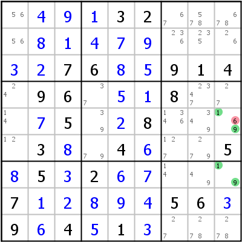
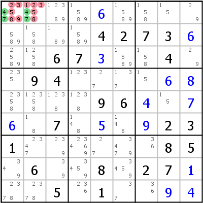
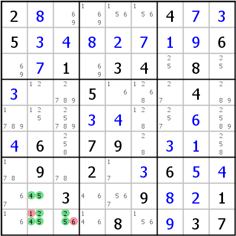
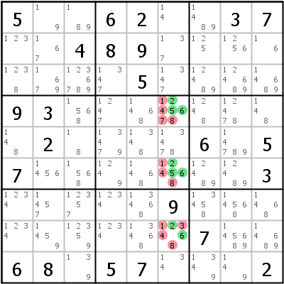
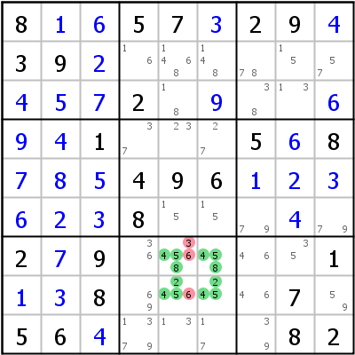
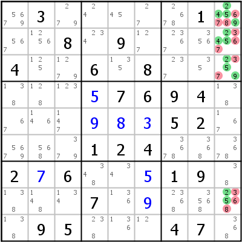
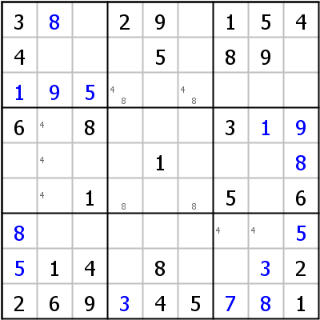

Title: HoDoKu: Solving Techniques - Hidden Subsets (Hidden Pair, Hidden Triple, Hidden Quadruple)

URL Source: https://hodoku.sourceforge.net/en/tech_hidden.php

Markdown Content:
## Table of Contents

*   [Hidden Pair](https://hodoku.sourceforge.net/en/tech_hidden.php#h2)
*   [Hidden Triple](https://hodoku.sourceforge.net/en/tech_hidden.php#h3)
*   [Hidden Quadruple](https://hodoku.sourceforge.net/en/tech_hidden.php#h4)
*   [How to find them](https://hodoku.sourceforge.net/en/tech_hidden.php#h234)

* * *

## Hidden Pair

All Hidden Subsets work the same way, the only thing that changes is the number of cells and candidates affected by the move. Take Hidden Pair: If you can find two cells within a house such as that two candidates appear nowhere outside those cells in that house, those two candidates must be placed in the two cells. All other candidates can therefore be eliminated.

Take a look at column 9 in the left example: The candidates 1 and 9 appear only in cells r5c9 and r7c9 (often abbreviated as r57c9) in that column (they appear elsewhere in row 5, row 7, block 6 and block 9, but that is not important here). One of those two cells has to be 1 and the other 9. We don't know yet which is which, but what we know is, that r5c9 can't possibly be 6.

Hidden Pairs can be buried under lots of other candidates as shown in the right example: r1c12 is a Hidden Pair for candidates 4 and 7 (in this case they are hidden in row 1 and in block 1), but those cells house another 10 candidates, which can all be eliminated.

* * *

## Hidden Triple

Hidden Triples work in the same way as Hidden Pairs only with three cells and three candidates.

The left example shows a Hidden Triple in block 7: Candidates 2, 4, and 5 appear only in cells r8c2, r9c2, and r9c3 in that block. 1 can be eliminated from r9c2 and 6 from r9c3, which cracks the sudoku.

The example on the right is special, in that the Hidden Triple is the very first step of the solution (no singles available in the initial state of the sudoku). The triple is in column 6 (r468c6) with candidates 2, 5, and 6. After the triple only singles are needed to solve the sudoku.

* * *

## Hidden Quadruple

Hidden Quadruples (4 candidates in 4 cells) are relatively seldom. It is very hard to spot them without using pencil marks.

The left example is again in a block (cells r7c56 and r8c56, all in block 8) using the candiates 2, 4, 5, and 8. The right example is in column 9 (r1238c9) using candidates 2, 4, 5, and 9.

* * *

## How to find them

Hidden Pairs can be found easily using pencil marks. Take a look at the sudoku: After a few singles pencil marks were applied for candidates 4 and 8. The Hidden Pair in r3c46 becomes immediately visible. No other candidate can go into one of those cells.

Finding larger Hidden Subsets requires a good short term memory. Many players prefer using larger Naked Subsets over larger Hidden Subsets, once pencil marks have been applied, but this is of course entirely a matter of taste.

* * *

Copyright © 2008-12 by Bernhard Hobiger

 All material on this page is licensed under the [GNU FDLv1.3](http://www.gnu.org/licenses/fdl-1.3.html).
