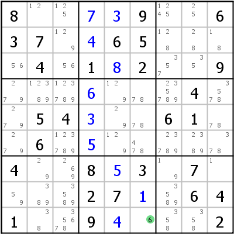
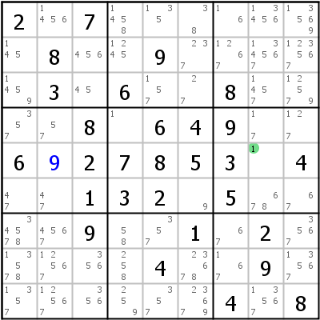
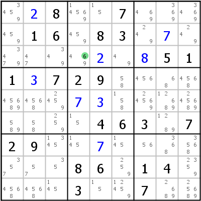
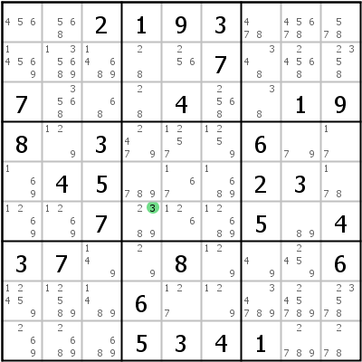
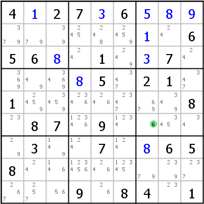
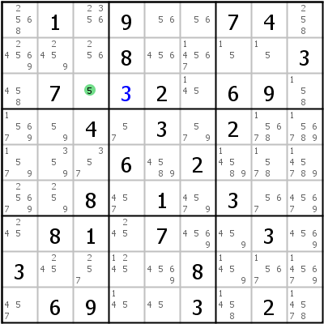
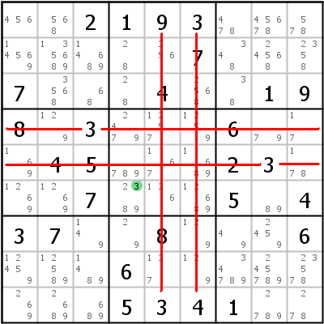
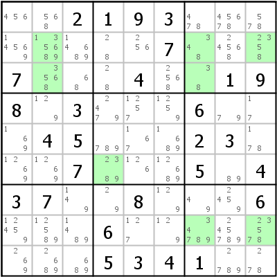

Title: HoDoKu: Solving Techniques - Singles (Hidden Single, Naked Single, Full House)

URL Source: https://hodoku.sourceforge.net/en/tech_singles.php

Markdown Content:
## Table of Contents

*   [Full House/Last Digit](https://hodoku.sourceforge.net/en/tech_singles.php#fh)
*   [Hidden Single](https://hodoku.sourceforge.net/en/tech_singles.php#h1)
*   [Naked Single](https://hodoku.sourceforge.net/en/tech_singles.php#n1)
*   [How to find them](https://hodoku.sourceforge.net/en/tech_singles.php#fnh1)

* * *

## Full House/Last Digit

Singles are the most basic techniques in solving sudokus and within the singles the **Full House** is the easiest as well.

A Full House is simply the last digit that can be placed in a house. If it is the last digit for the whole grid, it is sometimes called "Last Digit". In the example above on the left block 8 has only one unfilled cell left. The only missing digit is 6, r9c6 must therefore be a 6.

In the example on the right the Full House is in row 5: Only digit 1 is missing.

* * *

## Hidden Single

Hidden Single means that for a given digit and house only one cell is left to place that digit. The cell itself has more than one candidate left, the correct digit is thus _hidden_ amongst the rest.

Look at cell r3c4 in the example on the left: The digits 4, 6, and 9 are possible according to the rule. If we look closely at row 3, however, we notice that in this row digit 6 can only be placed in r3c4. r3c1, r3c2 and r3c3 are blocked by digit 6 in r2c3, r3c6 is blocked by digit 6 in r6c6. That means that 6 can be placed in r3c4.

In the right example one of several Hidden Singles can be found in r6c4: Digit 3 is the only 3 in row 6, column 4 and block 5.

* * *

## Naked Single

Naked Single means that in a specific cell only one digit remains possible (the last remaining candidate has no other candidates to hide behind and is thus _naked_). The digit must then go into that cell.

Example on the left: Look at cell r6c7: It is not a hidden single. Row 6 has another possible 6 in r6c4, c7 and b6 both have another possible 6 in r5c7. But when we examine all cells that can see r6c7, we notice that they contain all digits except 6. 6 is therefore the last possible candidate for r6c7.

In the sudoku on the right setting 3 into r3c4 (a Hidden Single) unlocks the Naked Single in r3c3: It's the last possible digit there and can be placed.

* * *

## How to find them

Finding Full Houses is self explanatory. Hidden and Naked Singles are not so easy to spot. They are a good example for why it is so difficult to specify a difficulty level for techniques: When playing with pencil and paper, Hidden Singles are easy to find, but seeing Naked Singles can take a while. When playing with a computer program such as HoDoKu that automatically keeps track of remaining possible candidates, finding Naked Singles is trivial but finding Hidden Singles can be quite a chore because of the amount of candidates left in the grid (especially early on in the game).

When playing by hand, Hidden Singles can be found by "cross hatching": Concentrate on one digit and one block. Draw lines through all rows and columns that already have an instance of that digit set (in your mind only please). If only one cell is left, that cell is a Hidden Single for that digit.

The image on the left shows that technique for digit 3 in block 5: All cells in that block are "blocked" by a placed digit 3, r6c4 is the last possible cell for digit 3 in block 5.

The image on the right shows another possibility: [Using filters](https://hodoku.sourceforge.net/en/docs_play.php#filters). If filters are enabled, Singles and [Locked Candidates](https://hodoku.sourceforge.net/en/tech_intersections.php) moves can be found easily.

Finding Naked Singles by hand involves either filling in all possible candidates or trying promising cells (count all digits in the cells seeing your intended target cell; if only one possibility remains, it is a Naked Single).

* * *

Copyright © 2008-12 by Bernhard Hobiger

 All material on this page is licensed under the [GNU FDLv1.3](http://www.gnu.org/licenses/fdl-1.3.html).
