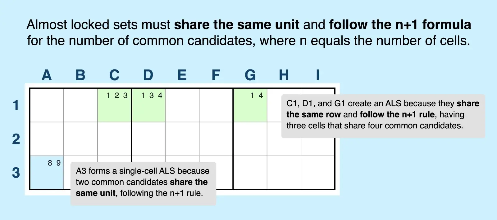
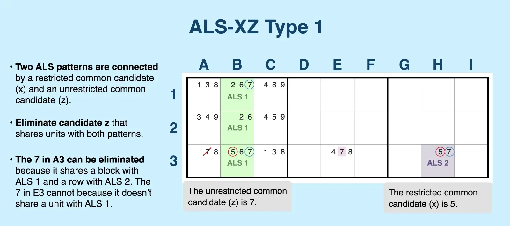
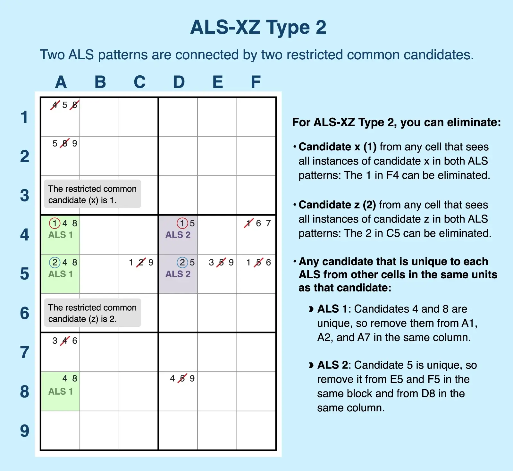
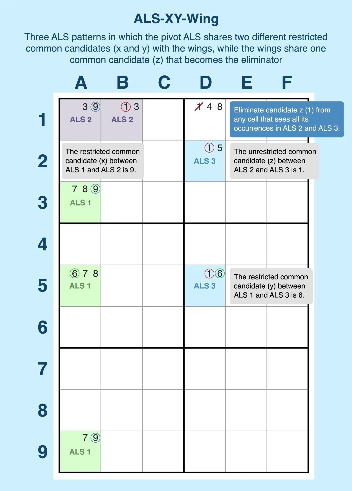

Title: Almost Locked Set Sudoku Technique & Examples

URL Source: https://sudokubliss.com/guides/almost-locked-set

Markdown Content:
## Almost Locked Set Sudoku Technique: How to Find and Examples

An almost locked set (ALS) refers to a group of unsolved cells that have one more common candidate (_n_) than there are cells, expressed with the formula _n+1_. For example, an ALS can be as simple as one cell with two candidates or five cells with six shared candidates. When two ALS interact, they can reveal eliminations that help you solve your Sudoku puzzle faster.

Almost locked sets get their name from the fact they are very close to locked sets. Locked sets, such as [naked pairs](https://sudokubliss.com/guides/naked-pairs-triples-quads) (conjugate pairs) and naked triples, have a certain number of cells with the exact same number of shared candidates. Those common digits become locked candidates because they must appear in those specific cells, but for an almost locked set, that group has an extra candidate. So those digits aren't locked in with certainty to those specific cells.

## How to Find an Almost Locked Set in Sudoku

An almost locked set must meet the following criteria:

*   **Be in the same unit:** All cells must be in the same row, column, or block. For example, C1, D1, and G1 are in the same row.
*   **Share one more common candidate than the number of cells in the group:** Following the n+1 formula, the number of common candidates must be one more than the number of cells in the set. For example, the set of candidates for the three cells (C1, D1, and G1) include four candidates (1, 2, 3, and 4), which is one more than the number of cells in that group.

So C1, D1, and G1 create an almost locked set. The most basic ALS, however, is one you're very probably familiar with already: a single bi-value cell. Because a bi-value cell refers to a cell with just two candidates, it fits the n+1 formula of having one more candidate (2) than the number of cells (1). For example, A3 is a bi-value cell because it has just two candidates (8, 9), so it's also an almost locked set.

Operating alone, almost locked sets don't provide much in the way of eliminations. However, if you establish a relationship between two ALS groups that have specific, shared candidates, you can use this [advanced technique](https://sudokubliss.com/guides/sudoku-advanced-strategies) for powerful eliminations. In fact, some interacting ALS cells can create an advanced extension of a [Sue de Coq](https://sudokubliss.com/guides/sue-de-coq).

## Almost Locked Set Examples

To eliminate candidates in puzzles, you must establish a relationship between at least two almost locked sets. You can establish that relationship with different types of shared candidates:

*   **Restricted common candidate (RCC):** A restricted common candidate must appear in both sets, and every occurrence of that candidate in one ALS must see (share a unit with) all occurrences of that candidate in the other ALS.
*   **Unrestricted common candidate:** An unrestricted common candidate must appear in both sets, but at least one occurrence in one ALS cannot see all occurrences in the other ALS.

While you can find these sets commonly throughout puzzles, finding those special relationships for Sudoku solving can be a bit trickier, so we break them down in the following sections.

**Remember:** The ALS strategy can overlap with other solving techniques. For example, XYZ-wings and WXYZ-wings are composed of two almost locked sets and are a subset of ALS-XZ Type 1. Or you may discover that you can express eliminations through alternating inference chains (AIC). But the ALS technique goes beyond these subtypes, and recognizing the relationships between sets gives you even more opportunities to eliminate candidates.

### ALS-XZ Type 1

Type 1 has a **single restricted common candidate (RCC)**. To find this type, you need to find two almost locked sets that are connected by a restricted common candidate (_x_) and an unrestricted common candidate (_z_) .

Just follow these steps to find a Type 1:

1.   **Find ALS 1.** For example, three cells in the same block (B1, B2, and B3) have four shared candidates (2, 5, 6, and 7), creating ALS 1.
2.   **Find ALS 2 that shares at least two candidates with ALS 1.** Like the first set, you must find a bi-value cell or group of unsolved cells in the same unit with one more shared candidate than the number of cells. For example, the bi-value cell in H3 (5, 7) is an almost locked set. This single cell has two candidates, so it meets the n+1 criteria. This ALS is in the same row as B3, which is part of ALS 1, and both cells share two candidates (5, 7). So H3 is ALS 2.
3.   **Confirm that the sets share a restricted common candidate (_x_).** In this case, 5 appears in both sets—in B3 in ALS 1 and H3 in ALS 2. Each occurrence of 5 in both sets sees the other. So 5 is candidate _x_.
4.   **Identify the unrestricted common candidate (_z_).** The second common candidate must be an unrestricted common candidate. For example, 7 occurs in B3 and H3, so it's a common shared candidate. While it also is found in B1, which is still part of ALS 1, H3 can't see that cell, so 7 is not restricted, making it the _z_ candidate.
5.   **Eliminate candidate _z_ from any cell that shares units with both almost locked sets.** For example, A3 shares a block with ALS 1 and a row with ALS 2, so the 7 in that cell can be eliminated. Because E3 only shares a row with ALS 2 but doesn't share a unit with ALS 1, that 7 cannot be eliminated.

### ALS-XZ Type 2

This type offers a more powerful set of eliminations and requires x and z to be **two restricted common candidates**. While you still need two almost locked sets with this type, you don't need an unrestricted common candidate, and you'll discover that you can eliminate quite a few candidates in the process.

Follow these steps to find this type:

1.   **Find ALS 1.** For example, three cells in the same column (A4, A5, and A8) have four shared candidates (1, 2, 4, and 8), creating ALS 1.
2.   **Find ALS 2 that shares two restricted common candidates with ALS 1.** For example, cells D4 and D5 share a column and contain three common candidates (1, 2, and 5), so they meet the n+1 criteria, creating ALS 2. 
    1.   **Confirm that the sets share a restricted common candidate (x).** The restricted common candidate must appear in both sets, and every occurrence of that candidate in one ALS must see (share a unit with) all occurrences of that candidate in the other ALS. In this case, 1 appears in both sets—in A4 in ALS 1 and D4 in ALS 2. Each occurrence of 1 in both sets sees the other. So 1 is candidate _x_.
    2.   **Confirm that the sets share a restricted common candidate (_z_).** The second restricted common candidate must appear in both sets, and every occurrence of that candidate in one ALS must see (share a unit with) all occurrences of that candidate in the other ALS. In this case, 2 appears in both sets—in A5 in ALS 1 and D5 in ALS 2. Each occurrence of 2 in both sets sees the other. So 2 is candidate _z_.

3.   **Eliminate candidate x from any cell that sees all instances of candidate x in both ALS patterns.** For example, 1 (candidate _x_) is found in A4 (ALS 1) and D4 (ALS 2), and these two cells share a row, so any 4s in that row outside of the two ALS patterns can be eliminated. Because F4 has a 1 and sees both cells from ALS 1 and ALS 2, so that 4 can be eliminated.
4.   **Eliminate candidate _z_ from any cell that sees both all instances of candidate z in both ALS patterns.** For example, 2 (candidate _z_) is found in A5 (ALS 1) and D5 (ALS 2), and these two cells share a row, so any 5s in that row outside of the two ALS patterns can be eliminated. Because C5 has a 2 and sees both cells from ALS 1 and ALS 2, so that 2 can be eliminated.
5.   **Eliminate any candidate that is unique to each ALS from other cells in the same unit as that candidate.** This step is where Type 2 reveals its power for eliminations. Because this type has two restricted candidates, any candidate unique to one ALS can be eliminated within the unit of the ALS outside of the cells making up the ALS. 
    1.   **Check for unique candidates in ALS 1 that can be removed from the unit.** For example, ALS 1 (A4, A5, and A8) contain candidates 4 and 8, which are not shared candidates with ALS 2, so those act as hidden subsets and can be eliminated from A1, A2, and A7 because they share a column with ALS 1.
    2.   **Check for unique candidates in ALS 2 that can be removed from the unit.** ALS 2 (D4 and D5) has one unique candidate (5) compared to ALS 1. So 5s can be eliminated from E5 and F5 because they share a block with ALS 2, but the 5 in D8 can also be eliminated because it shares a column with ALS 2.

### ALS-XY-Wing

For this type, you need to find three almost locked sets, and it requires _x_ and _y_ to be **two restricted common candidates. It follows similar to the logic behind the [XY-wing technique](https://sudokubliss.com/guides/finding-y-wing-styles).**

Follow these steps to find this type:

1.   **Find ALS 1.** Three cells in the same column (A3, A5, and A9) have four shared common candidates (6, 7, 8, and 9), creating ALS 1.
2.   **Find ALS 2 with a restricted common candidate (_x_) shared with ALS 1.** Two cells in the same row (A1 and B1) share three common candidates (1, 3, and 9), forming ALS 2. Each occurrence of 9 in ALS 1 and ALS 2 sees the other, making 9 the restricted common candidate (_x_).
3.   **Find ALS 3 with a restricted common candidate (_y_) shared with ALS 1.** Two cells in the same row (D2 and D5) share three common candidates (1, 5, and 6), forming ALS 3. All 6s in ALS 1 and ALS 3 see each other, making 6 the restricted common candidate (_y_).
4.   **Confirm that ALS 2 and ALS 3 share a common candidate (_z_).** Both ALS 2 and ALS 3 share the common candidate 1 (_z_). This shared candidate may be restricted or unrestricted, and the occurrences of _z_ in each ALS do not need to see each other.
5.   **Eliminate candidate _z_ from cells that see all instances of _z_ in ALS 2 and ALS 3.** For example, candidate 1 (_z_) appears in D1, which shares a row with ALS 2 and a column with ALS 3, and it sees all 1s in ALS 2 (B1) and ALS 3 (D2 and D5). Therefore, the 1 in D1 can be eliminated.

Whether you're a seasoned solver or just starting to add Sudoku strategies to your solving game, you'll find the ALS technique to be a helpful solving strategy for difficult puzzles. Use it the next time you're [playing Sudoku online](https://sudokubliss.com/).
