Title: Basic Principles

URL Source: https://sudoku.allanbarker.com/sweb/general.htm

Markdown Content:
Also see [details seen in images](https://sudoku.allanbarker.com/sweb/details.htm).

Sudoku is defined by groups of overlapping rows, columns, boxes, and cells, each of which must contain one unique value. Universal logi c refers reasoning based directly on this native intrinsic structure and its interactions, rather than separate solving methods each designed to find specific logic or patterns.

Universal logic can therefore express any and all logical deductions in Sudoku unlike traditional methods. Sudoku's rows, columns, boxes, and cells are naturally viewed as sets of 9 possible candidates (possible solution digits). We often consider these sets when thinking about solving Sudoku.

Most logical deductions fully contain some sets and parts of others. Fully contained sets must contain exactly one true candidate and are called strong links or 'truths' to indicate one candidate is logically true. Sets whose candidates are not fully contained in the logic are called weak links or just links. Links.

So far we have not added anything new to the logic defined by Sudoku. Thus universal logic is not new. It stems from Sudoku's definition and underlies almost all Sudoku logic and methods.

For clarity it will be useful to consider truths and links as base and cover sets. In this way base sets contain all the candidates and cover sets (links) overlap or 'cover' base sets. Then we can consider:

*   Rules with N truths covered by N links, seen in many methods including fish.
*   Treating rows, columns, boxes, and cells equally, and allowing multiple digits.
*   Allowing unequal numbers of N truths covered by M links. 
*   Allow multiple overlapping truths and links.
*   Define a property rank to express relative numbers of truths and links.
*   Define illegal logic to describe uniqueness in broken wings and inference sets.

**Truths and Links**

Sudoku has 81 row, column, box, and cell sets for a total of 4*81 = 324, each of which must have a truth. For example, in row 2 below, one 5 must be true so we can represent its truth with a solid red bar connecting all 5s. The same is done for truths in columns, boxes, and cells, which we color green, brown, and blue respectively.

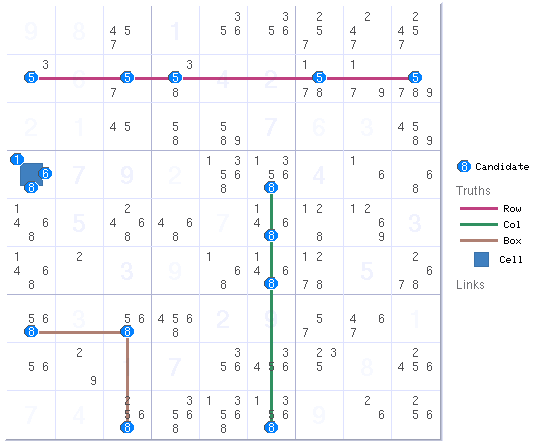

**PART 1,****Cover Sets and Rank**

**Base and Cover Sets and Eliminations**

To find eliminations, we assume that each base set has one true candidate. Then the number of true candidates equals the number of independent base sets (black rectangles). If all candidates in all base sets are also covered by links (red rectangles), then all true candidates in base sets must also be in the links.

If the number of bases is equal the number of links, then every link has a true candidate from the bases thus any other candidates in the links can be eliminated (X). This rule holds for any equal number of bases and links. The only restriction is that the bases cannot overlap. This is discussed below.

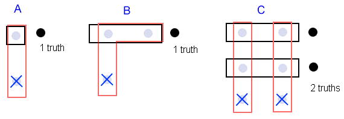

Diagram C above is an X-Wing, an example of which is shown in the grid below. The two truths are located in rows 2 and 5, the links are located in columns 2 and 6.

**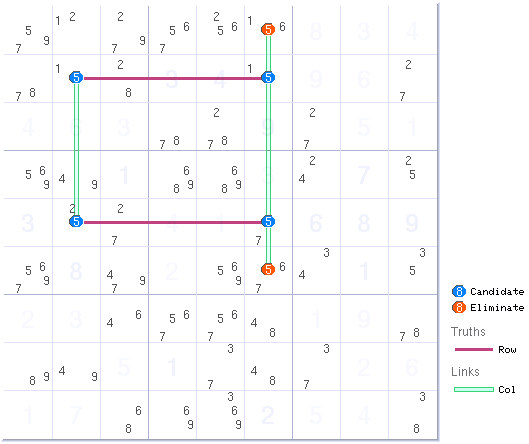**

**Rank and Rank 0.**

It's useful to define a term called rank where:

**_Rank = number of cover links - number of bases_**

The above examples had equal numbers of bases and links and were therefore rank 0.From the aabove we can summarize a rule for rank 0.

**_Rank 0:_**_Any non-base candidate contained in any link can be eliminated._

This is a general rule that is not restriced to single digits and makes no distinction between cells, rows, boxes, or columns. The 81 cells are treated equally to the 81 row-digit sets, etc. This following example logic has 3 truths, 1 row + 1 box + 1 cell. The truths are covered by 3 links, 1 row + 1 column + 1 cell. The rank is 3 – 3 = 0. Accroding to the rank 0 rule, all candidates in all links can be removed. The links zones in row 6, column 8, and cell r4c1 are highlighted. Any candidates in these zones will be eliminated.

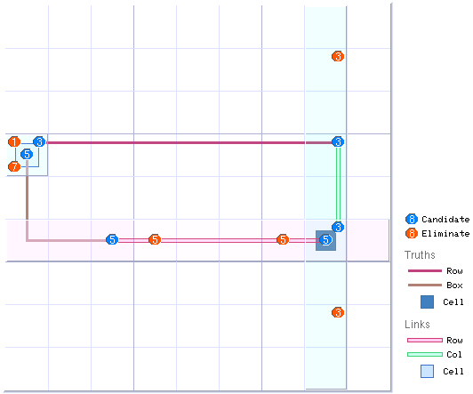

**Rank 1**

Rank 1 logic has one extra link thus N sets must have N true candidates distributed among N+1 links. In this case, any _two_ links are guaranteed to contain one true candidate from the bases sets, thus anywhere any two links overlap, outside of the bases, can eliminate candidates. A rank 1 rule would read

**_Rank 1:_**_Any non-base candidate contained in any **two** links can be eliminated._

Rank 1 logic is common and include chains, finned fish, XY-wings, discontinuous nice loops, and Kraken fish. A simple rank 1 example below is a crossed two-string kite.

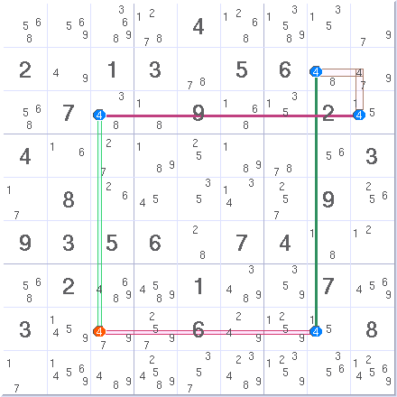

[**Rank**](https://sudoku.allanbarker.com/sweb/general.htm)**R**

The same general argument holds true for any rank R higher than 1. Rank R logic has R extra links thus N base sets must have N true candidates distributed among N+R links. In this case, any R +1 links are guaranteed to contain one true candidate from the bases sets, thus anywhere any R + 1 links overlap, outside of the bases, can eliminate candidates. The rank R rule is.

**_Rank R:_**_Any non-base candidate contained in any **R + 1** links can be eliminated._

Again, this is a general rule that applies to any number, type, or combination of sets, links, candidates, and digits as long as the base sets do not overlap. No other rules or restrictions apply, this is the law!Rank rules apply beyond Sudoku to problems of any geometry and any number of spatial dimensions. Sudoku is limited to 3 dimensions and 4 overlapping sets.

Ranks 0 and 1 cover many Sudoku methods. Ranks higher than 3 possible in complex eliminations when combined with triplets, described later. The rank 3 example below has 7 bases covered with 10 cover links. According to the rank rule, 4 covers must overlap to eliminate a candidate. The logic has 4 independent bi-value paths emerging from the cell set in r5c5. The 4 branches converge at 5r2c2 where they eliminate the red candidate.

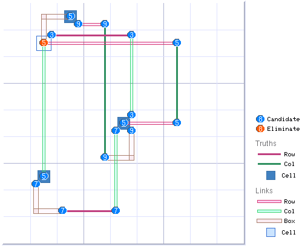

Three-dimensional view with colored sets and white links. The four links converge on 5r2c2 to eliminate the orange candidate.

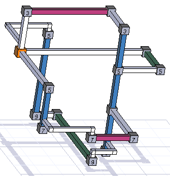

Some rank R examples:[rank 2 three leg bug](https://sudoku.allanbarker.com/sweb/gen2/rank.htm).

**Illegal Logic and Rank -1**

Illegal logic is any group of sets (or candidates) that has no solution, i.e., there is no way to arrange the candidates that is allowed by the rules of Sudoku. The illegal 'fish' below has 3 bases connected by two links where it's easy to see that 3 candidates cannot be placed in the links without placing 2 in a single link. The illegal logic, denoted by black sets, has a rank of 2 links - 3 base sets equals minus 1. Negative rank is real and can be a useful quantity.

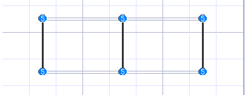

**Covering Sets, Eliminations, and Multiple Solutions**

Covering sets are the links that exactly cover the base candidates. A group of covering sets is any group of links containing all candidates in the base sets where no link can be removed and the candidates remain covered. _Covering sets are not necessarily exact cover sets because they are allowed to overlap_. One group of base sets can be covered by multiple groups of covering sets.

A candidate is eliminated only when it sees other candidates through the _same group of covering sets_. In other words, rank rules are based on cover groups.

_Eliminations occur when one or more links in the same group of covering sets overlap to contain a candidate. Overlap linksets from different cover groups do not cause eliminations._

**Cannibal Eliminations**

In Sudoku, cannibal eliminations occur when a candidates in a base set or other kind of truth are eliminated. Cannibal eliminations are virtually always caused by a _subgroup_ of the base and cover sets being considered, i.e., simpler eliminations exist.

**Counting Rank**

When counting rank or searching for a solution of covering sets, two points are considered.

1.   The links must form a group of covering sets, i.e., cover all candidates with no redundancies.
2.   Strong links are counted as ordinary links because they are not part of the base sets.

**PART 2,****Triplets and Rank Regions**

**Triplets, Overlap, and Pointing**

Two base sets or two links that overlap form a _triplet_. The left circle below marks a candidate in 2 overlapping bases + 1 link. The right circle marks a candidate in 2 overlapping links + 1 base set. Because the three branches connected to the triplet are not equal, it's convenient to describe the direction of a triplet as pointing towards its odd branch. A triplet with two bases points in the direction of its link and a triplet with two links points in the direction of its base set. The logic in the pointing direction is called the upper branch.

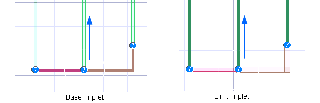

When sets or links form _triplets,_ they have a global effect on logic. When two _bases_ overlap, the logic no longer contains a fixed number of _true_ candidates to occupy the cover links. When two _links_ overlap, the number of _true_ candidates is fixed but the number of occupied links is not. Both cases can lead to regions with different rank and novel eliminations or assignments.

**Base Triplets and Rank**

When base truths overlap, the rank must be corrected because the number of _true_ candidates is no longer constant. The example below has 3 base sets (2 red rows and 1 brown box) and 3 column links (light green), and a base triplet. The triplet has only two states, occupied or not. **Un-occupied:** When a base triplet is un-occupied (left) there are 3 true candidates to occupy the 3 links, thus its rank = 0. **Occupied:** When a base triplet is occupied (right), the number of _true_ candidates in the logic drops by 1 because the triplet's _true_ candidate occupies 2 bases. Two true candidates in 3 links means rank 1. However, the triplet's link must be occupied because the triplet is occupied thus the triplet's link must have a rank of 0. The worst-case rank for the logic is 1 except for the triplet's link, which is 0.

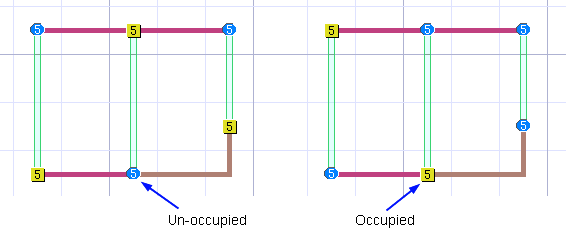

Eliminations are based on the worst case rank, which is 0 for the triplet's link in column 4. Thus all other digit 5s can be eliminated from the column. The triplet has created different rank regions in the logic. The rank 0 region in column 4 is highlighted black.

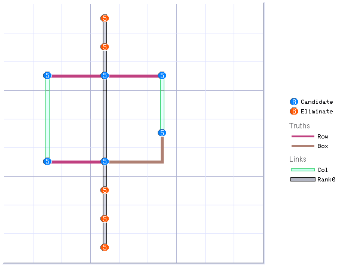

**Link Triplets**

Link triplets are slightly different because the number of _true_ candidates is fixed but the number of occupied links can vary. This again can lead to mixed rank logic. The two possible states are shown below where the blue arrows mark the link triplet. There are several ways to arrange the true candidates (yellow squares), two ways are shown below.

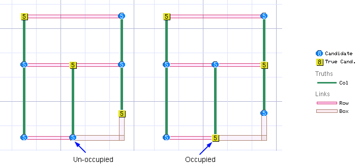

The logical argument goes like this. The overall rank is 1 because the logic has one extra link. **Occupied:**When the triplet is occupied (right), the overall logic must be rank 0 because all links have a candidate. **Un-occupied:**When the triplet is not occupied, (left) the overall rank must be 1. However, the base set connected to the triplet now has fewer candidates to cover, which effectively lowers the rank in that branch.

Once again, the worst case rank is 1 everywhere except for the middle row link in r5, which has a worst case rank of 0, thus the digit 5 can be eliminated from that row. The rank 0 link in row 5 is highlighed black.

However, that's not the end of the story. The worst case rank for the other 3 links is 1. According to the rank rules, anywhere 2 of these links overlap can eliminate candidates. Note that the row and box links in row 8 do overlap in cell r8c5, where they eliminate the red candidate for digit 5. Thus, this example has both rank 0 and rank 1 eliminations.

**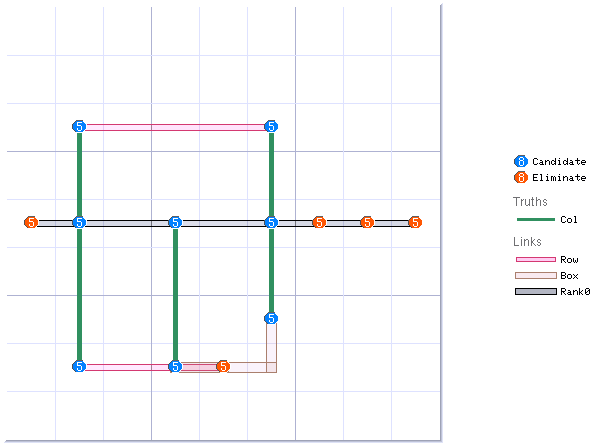**

**Link Triplets, Example 2**

A link triplet lowers the rank of the of all linksets along its minor branch, or the set side. The example below has 2 linksets in the minor branch, both of which are rank 0 (black highlight) and both eliminate candidates on the left.

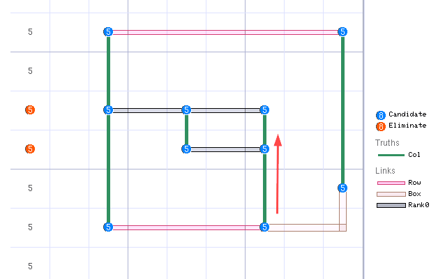

**Rank Regions**

Both kinds of triplets define boundaries between two regions. For a link triplet, one region contains the base set branch and the other contains the two link branches. If the logic on the base side never rejoins the rest of the logic then the rank will be lower everywhere along the branch. If the set branch does reconnect, then another boundary is needed to define the region. **_As a rule of thumb_**, the lowered rank branch usually continues until the first bifurcation that has two separate return paths back to the triplet. The example below is similar to the one above except now for the bifurcation at r5c5 that has two separate return paths to the triplet's links thus r5 is no longer rank 1.

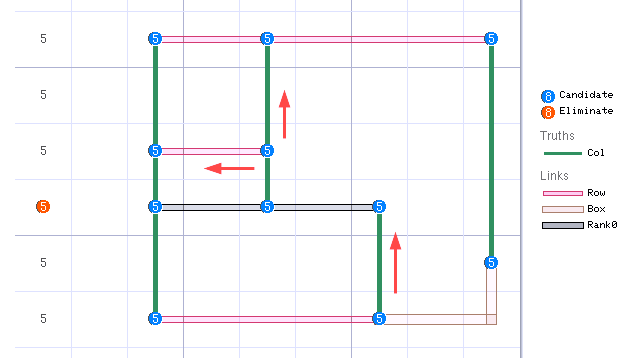

This bifurcation can be hard to spot as in the next example below with 8 sets, 9 linksets and a rank of 1. A simple way to find the low rank region is to cut the triplet node from the minor branch, then follow the branch to find those sets that can be covered by an equal number of linksets, e.g., make a new, small rank 0 logic block. If the logic was rank 2, then find N sets covered by N+1 linksets along the branch. The minor branch below (dark highlight) has 3 sets and 3 linksets that make a rank 0 upper branch. Row r5 and its candidates are not included. This upper branch is a swordfish or fishy cycle.

This procedure works because cutting the branch is the same as assuming the triplet is not occupied and the upper branch is occupied, which is how the triplet rule is derived. For a set triplet, cut the triplet from its 2 two linksets sets leaving the triplet in the minor branch as a single. This is the same as assuming the triple is occupied.

**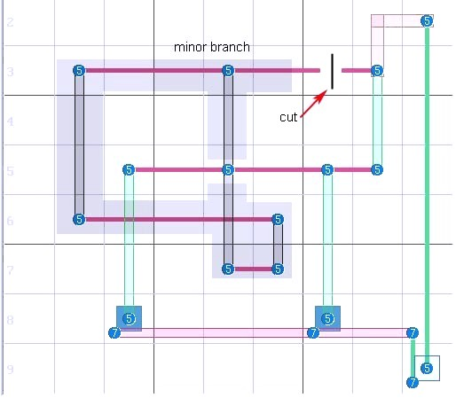**

**Rank 2 Mixed Rank Logic**

Mixed rank logic can have any rank. The link triplet example below, left has 3 sets, 4 links, and is rank 1. The triplet's minor branch includes the middle column linkset, which is rank 0 (dark highlight) and has yellow elimination zones along the column eliminating 1 candidate (red). The example on the right includes an extra candidate and linkset in row 2, which makes the logic rank 2. According to the rank rules, the minor branch of triplet r4c6 is now rank 1 and cannot directly cause eliminations. However, it can eliminate the candidate at r2c5 by overlapping linkset r25. The linkset to the right of the branch, c65, also overlaps r25 but cannot cause an elimination because it is in the rank 2 region.

**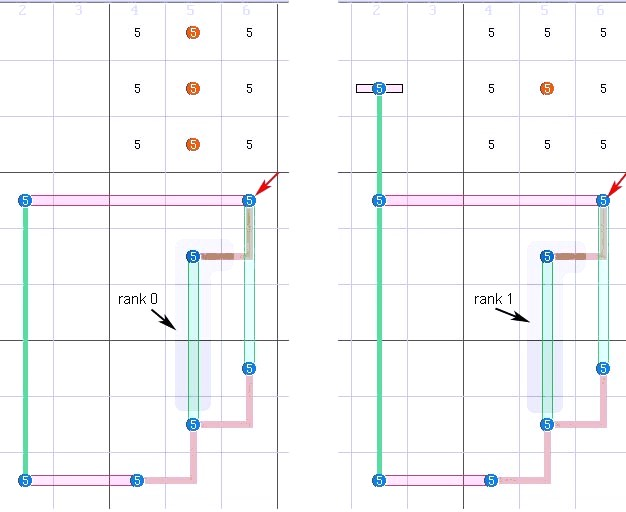**

**The Idea of Uniform Rank**

Uniform rank over a region seems counterintuitive, especially when thinking about first order logic however, there is a rational for such an effect based on permutations of candidates.

Given a rank 1 structure with 10 sets 11 linksets, the cover set principle says any two linksets must have at least one candidate. This is logically correct but what makes sure there is always an arrangement of candidates that fulfills this requirement? Candidates are possibilities. Without constraints, all permutations or arrangements of candidates are possible, about one billion for this example. The number is smaller because constraints remove most of them but without a constraint, or reason not to be there, every combination is possible. In this sense, the mathematics of combinorics fills all possible configurations that are not invalid, everywhere in the structure.

This reverses the argument, rather than why should candidate configurations be there, the correct question is why would they not? In this example, if any two sets did not contain a candidate, that configuration must be invalid because it would force two candidates into one of the sets.

**Additive Properties of Triplets**

The effects of triplets can be additive, i.e., two link triplets both aligned in the direction of a candidate can lower the rank in the region of the candidate by 2. However, such logic must follow the rules about cover sets for triplet branches.

Additively can be proved using the same arguments used for one triplet, by dividing the problem into occupied and unoccupied triplet states, the only difference is more states. Naive arguments for eliminations such as

4 _overlap linksets = 2 overlap linksets + 2 pointing linksets triplets_

can be helpful but the details of the logic must be considered before accepting the elimination. The rank 3 logic example below has 5 sets, 8 linksets, and 2 link triplets, 5r2c2 and 5r2c5, pointing in the direction of the candidate. This adds up to the equivalent of 4 overlap linksets required to eliminate the candidate 5r7c8. Note that other digit 5 candidates also sit at the overlap of various linksets, but they are not eliminated.

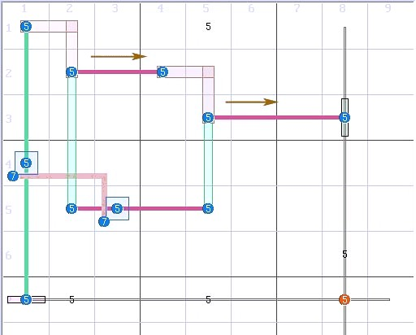

**Very Complex Logic**

Very complex eliminations only occur in the most difficult eliminations from the most difficult monster puzzles. The following elimination from Easter Monster has an incredible rank of 6.

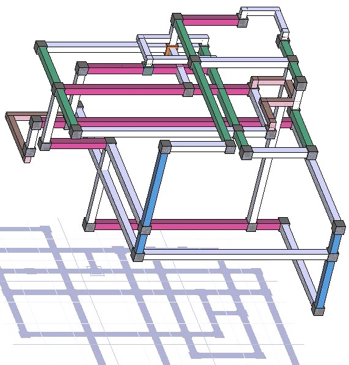

**PART 3,****Odd Loops, Broken Wings, and Dark Logic**

Odd length loops play a role in many methods such as chains, discontinuous nice loops, and broken wings however, the principle behind broken wings is unique and is thus a third part to Sudoku Set Logic.

**Illegal Logic and Odd Length Loops**

Illegal logic is any group of sets (or candidates) that has no solution, i.e., there is no way to arrange the candidates that is allowed by the rules. One type of illegal logic was[shown above](https://sudoku.allanbarker.com/sweb/general.htm#illegal_logic0). Odd length loops of bi-value strong links are also illegal. The length 5 loop below can contain at most two nodes without double occupancy, thus one set must be unoccupied. Set loops of any odd length have a rank of minus 1.

**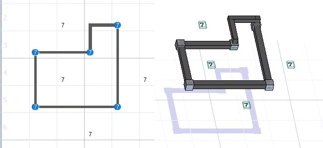**

**Broken Wings**

The [broken wing](http://www.sudoku.com/boards/viewtopic.php?t=2666&highlight=) principle, introduced by Ron Hagglund and later [studied here](http://www.sudoku.com/boards/viewtopic.php?t=5225&start=0), assumes that a valid puzzle cannot contain loops with an odd number of bi-value strong links (conjugate pairs). To be legal, at least one link must contain at least one extra candidate, called a guardian. If there is one guardian, it can be assigned. If there are multiple guardians, eliminations can be logically deduced. Guardians can be connected to a variety of logic. The lone guardian (G) in r3c8 below prevents the logic from being illegal thus it can be assigned, which then eliminates the orange candidates in column 8. Eliminated candidates in the structure are red and assigned candidates are green.

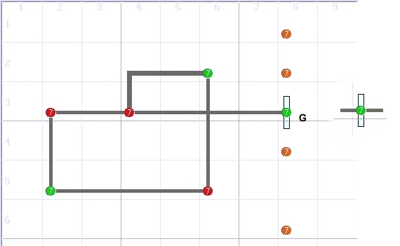

**Sets, Broken Wings, and Dark Logic**

Broken wings and other illegal logic made of strong sets occur naturally in set logic. The following is a generalized view of broken wing principles integrated with Sudoku set theory. The same principles apply to a variety of logic including deadly patterns and unique rectangles.

To keep track of what's what, the term _dark_ refers to anything illegal. A _dark_ loop contains the set s and candidates belonging to illegal logic but not guardians or other logic that may be in the same sets. In other works, a group of sets may contain a dark loop _and_ guardians. Defined this way, dark loops have the following properties:

_A dark loop of any size has a rank of minus 1._

_The guardians act as a single virtual set that can span rows, columns, boxes, and digits. The virtual sets can be combined with any other logic and solved accordingly._

_A dark loop can be ignored when solving logic that contains the guardians, i.e., they are not included in any cover set groups._

Thus, dark logic works like unseen logic that exerts a force on a group of otherwise unconnected candidates causing them to be logically linked. (Well, its better than anti-logic).

Below is a two-guardian broken wing. Although neither guardian can be assigned, one must be true so the linkset in column 8 is always occupied, or rank 0, which eliminates the red candidates.

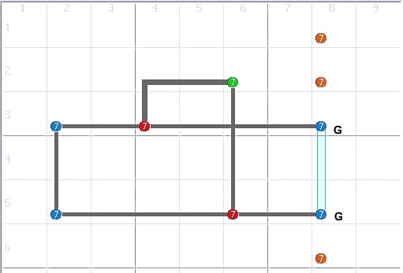

The dark loop's guarantee of one true guardian effectively divides the problem in two. On the right, the guardians work as a virtual set that forms something like locked candidates spaning 2 boxes. On the left, rows r3 and r5 are linksets relative to the dark loop, which can be solved as a discontinuous nice loop assigning 7r2c6 and eliminating the two red candidates.

**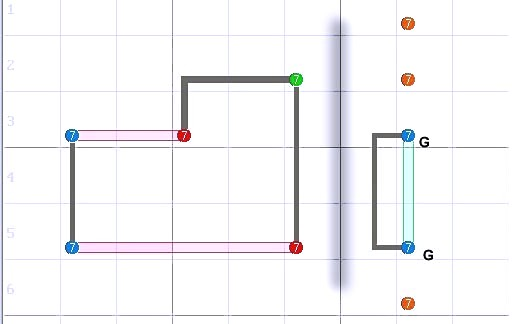**

**Illegal (Dark) Logic and Sets**

Broken wings are only one form of illegal logic. Any logic can be used as dark logic if has no legal arrangement of candidates (permutations). Deadly patterns and unique rectangles are used in the same way by assuming that valid puzzles have only one solution. Broken wings and other dark logic require no assumptions.

The most general definition of dark logic is _logic with a negative rank_. A more useful definition is:

_Any group of candidates that could be covered by more sets than linksets if selected candidates were removed. The 'removed' candidates become guardians. This assumes non-overlap sets._

_Additional candidates in linksets do not need to be removed and are not guardians._

The definition does not require all strong links or any conjugate pairs. A simple example below uses 3 sets and 2 linksets. If the two candidates labeled G are 'removed' then the 6 remaining candidates in rows 3, 5 and columns 2,5,8 become _dark_. The two G candidates can then be used as a single virtual set (brown bar) to make a short chain that eliminates candidate 5 in r8c8. Of course, this example looks a lot like a sashimi.

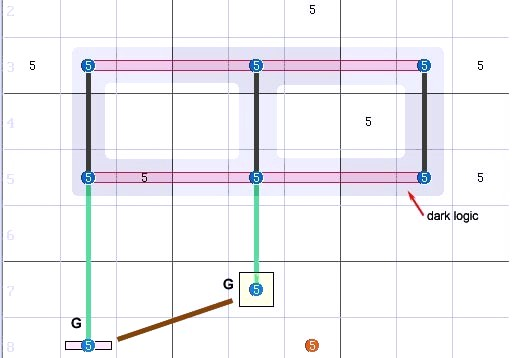

Sudoku grids contain a lot of unseen dark logic however, most small examples turn out to be other methods or patterns. Dark logic is better suited for difficult puzzles where it might help reduce the size elimination logic because it uses two steps, finding the dark logic and then finding eliminations.

**Embedded Broken Wings**

The dark principle applies to any logic as long as the dark logic nodes do not link to the the rest of the logic.A more detailed description of and examples of dark logic can be found in the [Odd Loops, Broken Wings, and dark logic](https://sudoku.allanbarker.com/sweb/gen2/blacklog.htm).

**SUMMARY**

1. Every elimination is based on two groups of sets. The **base set** group exactly contains a group of candidates and the **link set** group contains these candidates as well as other candidates that are potential eliminations.

2. The number of links minus the number of base sets is called rank. Rank is a distributed property of the logic and is uniform everywhere within a logical structure except for conditions noted below.

3.Rank 0 eliminates any additional candidates inside of linksets. Common examples include singles, locked candidates, ALCs, X-wing, swordfish, etc.

4. Rank 1 eliminates any additional candidates where two linksets overlap. Many Sudoku methods fall into this category such as finned fish, chains, discontinuous nice loops, etc.

5. Ranks 2 (or 3) logic requires 3 (or 4) simultaneously overlapping linksets to cause eliminations.

6. Ranks higher than 3 can only cause eliminations when combined with triplets, described next.

7. A triplet is a single candidate that connects three sets. A set-triplet has two sets and one linkset, and a linkset-triplet has two linksets and one set. Triplets "point" in the direction of the minor link, i.e., the linkset direction of a two set triplet. The two types of triplets are similar but have different properties.

8. Triplets can divide logic into high rank and low rank regions and therefore change the number of linksets that are needed to eliminate a candidate, but this must follow specific rules. When link triplets point in the direction of a candidate, it may reduce the number of linksets required to eliminate the candidate..

9. Set triplets can increase the number of overlap linksets required to make an elimination if they reduce the number of true nodes (assigned candidates) guaranteed to be in the set group. Link-triplets cannot.

10. The area of lower rank caused by a set triplet usually extends from the triplet's linkset to the first bifurcation that has independent paths back to the triplet's two sets. For link triplets, swap the terms set and linkset.

11. The candidate in a set-triplet with an unconnected linkset can be assigned in rank 0 logic.

12. When triplets are located and aligned correctly, their effects can be additive however, complex arrangements often require consideration or additional logical analysis.

13. When two blocks of logic are (hypothetically) combined, each retains its original rank internally and the rank of the combined logic is the sum of the individual ranks. Eliminations can occur when linksets of different blocks overlap based on the overall rank and triplets used to link blocks.

14. Logic made of, or containing odd length loops of (strong) sets can contain dark logic, which works similar to broken wings. Dark logic contains only the sets and nodes that would make illegal logic.

15. A dark loop has a rank of minus 1. A dark loop can be completely removed from the rest of the logic and all remaining candidates that were in the removed sets can be placed in a single virtual set. The virtual set can be used like a normal set with other logic. A virtual set can have any number of candidates and span rows, columns, and boxes.

16. After removal, dark loop sets that lost candidates become linksets and the dark loop can be solved separately, assuming a solution can be found.
