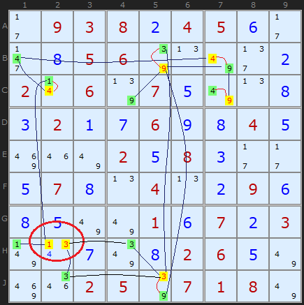
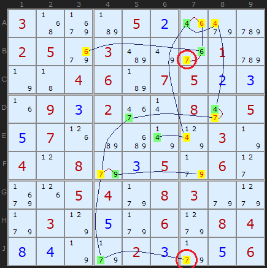
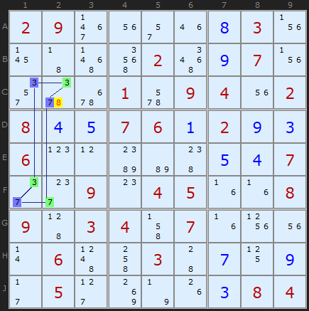
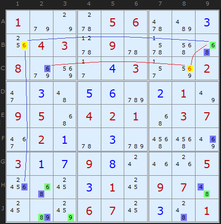
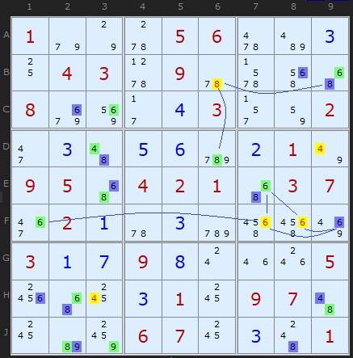
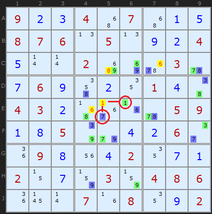
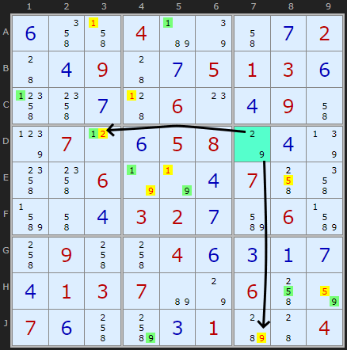
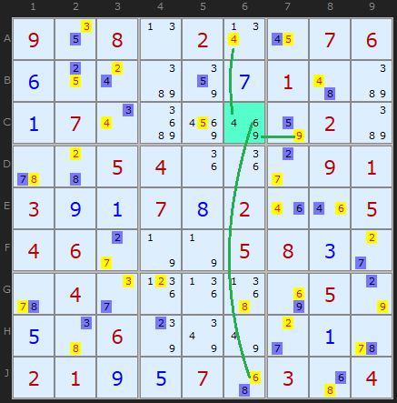
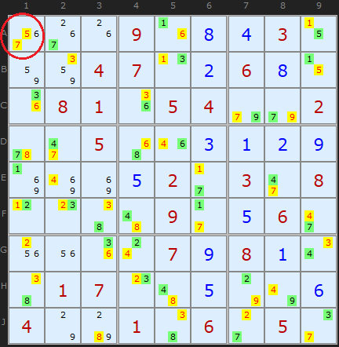

Title: 3D Medusa - SudokuWiki.org

URL Source: https://www.sudokuwiki.org/3D_Medusa

Markdown Content:
# 3D Medusa - SudokuWiki.org

SudokuWiki.org

Strategies for Popular Number Puzzles

*   [Sign up for more](https://www.sudokuwiki.org/SPHome.aspx)

*   [Main Page](https://www.sudokuwiki.org/Main_Page)
*   [What's New](https://www.sudokuwiki.org/Whats_New)
*   [Strategy Overview](https://www.sudokuwiki.org/Strategy_Families)

9x9 Solvers

*   [Sudoku Solver](https://www.sudokuwiki.org/Sudoku.htm)
*   [Jigsaw Solver](https://www.sudokuwiki.org/Jigsaw.aspx)
*   [Sudoku X Solver](https://www.sudokuwiki.org/SudokuX.aspx)
*   [Windoku Solver](https://www.sudokuwiki.org/Windoku.aspx)
*   [Colour Sudoku](https://www.sudokuwiki.org/ColourSudoku.aspx)
*   [Killer Solver](https://www.sudokuwiki.org/KillerSudoku.aspx)
*   [Killer Jigsaw Solver](https://www.sudokuwiki.org/KillerJigsaw.aspx)

6x6 Solvers

*   [6x6 Sudoku Solver](https://www.sudokuwiki.org/Sudoku6x6.aspx)
*   [6x6 Killer Solver](https://www.sudokuwiki.org/Killer6x6.aspx)
*   [6x6 KenKen Solver](https://www.sudokuwiki.org/KenKen6x6.aspx)
*   [6x6 KenDoku Solver](https://www.sudokuwiki.org/kendoku6x6.aspx)

Weekly 'Unsolvable'

*   [Unsolvable Sudoku](https://www.sudokuwiki.org/Weekly-Sudoku.aspx)
*   [Unsolvable Jigsaw](https://www.sudokuwiki.org/Weekly-Jigsaw.aspx)
*   [Unsolvable Str8ts](https://www.str8ts.com/weekly_str8ts.aspx)

Puzzles to Play

*   [The Daily Sudoku](https://www.sudokuwiki.org/Daily_Sudoku)
*   [Daily 6x6 Sudoku](https://www.sudokuwiki.org/Daily_Mini_Sudoku)New!
*   [The Jigsaw Sudoku](https://www.sudokuwiki.org/Daily_Jigsaw_Sudoku)
*   [The Daily Sudoku X](https://www.sudokuwiki.org/Daily_Sudoku_X)
*   [The Daily Killer](https://www.sudokuwiki.org/Daily_Killer_Sudoku.aspx)
*   [Daily Mini Killer](https://www.sudokuwiki.org/Daily_Mini_Killer_Sudoku.aspx)
*   [Daily Killer Jigsaw](https://www.sudokuwiki.org/Daily_Killer_Jigsaw.aspx)
*   [The Daily Kakuro](https://www.sudokuwiki.org/Daily_Kakuro)
*   [The Daily KenKen](https://www.sudokuwiki.org/Daily_KenKen.aspx)
*   [Daily Codewords](https://www.sudokuwiki.org/Daily_Codewords)
*   [1 to 25](https://www.str8ts.com/daily_1to25.aspx)
*   [The Daily Binairo](https://www.sudokuwiki.org/DailyBinairo)
*   [Letterlicious](https://www.letterlicious.com/Letterlicious_Home.aspx)
*   [Puzzle Packs](https://www.sudokuwiki.org/ACSPuzzles.aspx)

Basic Strategies

*   [Introduction](https://www.sudokuwiki.org/Introduction)
*   [Getting Started](https://www.sudokuwiki.org/Getting_Started)
*   [Naked Candidates](https://www.sudokuwiki.org/Naked_Candidates)
*   [Hidden Candidates](https://www.sudokuwiki.org/Hidden_Candidates)
*   [Intersection Removal](https://www.sudokuwiki.org/Intersection_Removal)

Tough Strategies

*   [X-Wing](https://www.sudokuwiki.org/X_Wing_Strategy)
*   [Chute Remote Pairs](https://www.sudokuwiki.org/Chute_Remote_Pairs)
*   [Simple Colouring](https://www.sudokuwiki.org/Simple_Colouring)
*   [W-Wing](https://www.sudokuwiki.org/W_Wing_Strategy)
*   [Y-Wing](https://www.sudokuwiki.org/Y_Wing_Strategy)
*   [Rectangle Elimination](https://www.sudokuwiki.org/Rectangle_Elimination)
*   [Swordfish](https://www.sudokuwiki.org/Sword_Fish_Strategy)
*   [XYZ-Wing](https://www.sudokuwiki.org/XYZ_Wing)
*   [BUG](https://www.sudokuwiki.org/BUG)
*   [Avoidable Rectangles](https://www.sudokuwiki.org/Avoidable_Rectangles)

Diabolical Strategies

*   [X-Cycles (Part 1)](https://www.sudokuwiki.org/X_Cycles)
*   [X-Cycles (Part 2)](https://www.sudokuwiki.org/X_Cycles_Part_2)
*   [3D Medusa](https://www.sudokuwiki.org/3D_Medusa)
*   [Jellyfish](https://www.sudokuwiki.org/Jelly_Fish_Strategy)
*   [Unique Rectangles](https://www.sudokuwiki.org/Unique_Rectangles)
*   [Tridagons](https://www.sudokuwiki.org/Tridagons)
*   [Fireworks](https://www.sudokuwiki.org/Fireworks)
*   [Twinned XY-Chains](https://www.sudokuwiki.org/Twinned_XY_Chains)
*   [SK Loops](https://www.sudokuwiki.org/SK_Loops)
*   [Extended Rectangles](https://www.sudokuwiki.org/Extended_Unique_Rectangles)
*   [Hidden URs](https://www.sudokuwiki.org/Hidden_Unique_Rectangles)
*   [WXYZ-Wing](https://www.sudokuwiki.org/WXYZ_Wing)
*   [XY-Chains](https://www.sudokuwiki.org/XY_Chains)
*   [Aligned Pair Exclusion](https://www.sudokuwiki.org/Aligned_Pair_Exclusion)

Extreme Strategies

*   [Grouped X-Cycles](https://www.sudokuwiki.org/Grouped_X_Cycles)
*   [Forcing Nets](https://www.sudokuwiki.org/Forcing_Nets)
*   [Exocet](https://www.sudokuwiki.org/Exocet)
*   [Finned X-Wing](https://www.sudokuwiki.org/Finned_X_Wing)
*   [Finned Swordfish](https://www.sudokuwiki.org/Finned_Swordfish)
*   [Inference Chains](https://www.sudokuwiki.org/Alternating_Inference_Chains)
*   [AIC with Groups](https://www.sudokuwiki.org/AIC_with_Groups)
*   [AIC with ALSs](https://www.sudokuwiki.org/AIC_with_ALSs)
*   [AIC with URs](https://www.sudokuwiki.org/Using_Unique_Rectangles_as_Links_in_Chains)
*   [Almost Locked Sets](https://www.sudokuwiki.org/Almost_Locked_Sets)
*   [Death Blossom](https://www.sudokuwiki.org/Death_Blossom)
*   [Sue-de-Coq](https://www.sudokuwiki.org/Sue_de_Coq)
*   [Digit Forcing Chains](https://www.sudokuwiki.org/Digit_Forcing_Chains)
*   [Nishio Forcing Chains](https://www.sudokuwiki.org/Nishio_Forcing_Chains)
*   [Cell Forcing Chains](https://www.sudokuwiki.org/Cell_Forcing_Chains)
*   [Unit Forcing Chains](https://www.sudokuwiki.org/Unit_Forcing_Chains)
*   [Double Exocet](https://www.sudokuwiki.org/Double_Exocet)
*   [Pattern Overlay](https://www.sudokuwiki.org/Pattern_Overlay)

Deprecated Strategies

*   [Remote Pairs](https://www.sudokuwiki.org/Remote_Pairs)
*   [Y-Wing Chain](https://www.sudokuwiki.org/Y_Wing_Chains)
*   [Multivalue X-Wing](https://www.sudokuwiki.org/Multivalue_X_Wing_Strategy)
*   [Multi-Colouring](https://www.sudokuwiki.org/Multi_Colouring_Strategy)
*   [Empty Rectangles](https://www.sudokuwiki.org/Empty_Rectangles)
*   [Guardians](https://www.sudokuwiki.org/Guardians)

Str8ts

*   [Home & Rules](https://www.str8ts.com/str8ts)
*   [The Daily Str8ts](https://www.str8ts.com/Daily_str8ts)
*   [Weekly Extreme Str8ts](https://www.str8ts.com/weekly_str8ts.aspx)
*   [Str8ts Solver](https://www.str8ts.com/str8ts.htm)
*   [Str8ts Sample Pack](https://www.str8ts.com/Str8ts_Sample_Pack.pdf)

Other

*   [What's New](https://www.sudokuwiki.org/Whats_New)
*   [Latest Articles](https://www.sudokuwiki.org/LatestArticles.aspx)
*   [Feedback](https://www.sudokuwiki.org/sudokufeedback.aspx)
*   [Donate](https://www.sudokuwiki.org/Donations)
*   [Syndicated Puzzles](https://www.syndicatedpuzzles.com/)

[Print Version](https://www.sudokuwiki.org/Print_3D_Medusa)

[Page Index](https://www.sudokuwiki.org/Site_Map)

200 Shares 

# 3D Medusa

3D Medusa extends [Simple Colouring](https://www.sudokuwiki.org/Simple_Colouring) (or 'Single's chains') into a third dimension. Simple Colouring looked for pairs of X in rows, columns and boxes. Wherever the chains led they stuck to the same candidate number. This is good for tracking an elimination when you have made notes on a paper Sudoku for a particular number but it limits the scope of the strategy. The way we extend the search is up through the bi-value cells which contain two different numbers. You can think of the different candidate numbers as existing in a third dimension lifting up from the page with 1 at the bottom and 9 at the top. 

The devastating effect of colouring is that we are showing that ALL of one colour will be the solution. We don't know which set yet - but if any one of those cells becomes the solution we can know for certain ALL the cells of the same colour

## Rule 1 - Twice in a Cell

3D Medusa Rule 1 : [Load Example](https://www.sudokuwiki.org/sudoku.htm?bd=S9B2b0903080b04050f2b2j0h05067q0n7u2f0b020r067r070e7u0n0h0c020a0g060i0h040e8i1m7u020e080c2b2b0e070h0n040n0b090f0h0e7u7u010f070b030r0v0g7y0h02060e7u8i1q02057q0701087u) or : [From the Start](https://www.sudokuwiki.org/sudoku.htm?bd=093804500005600000206070000020060040000208000070040090000010703000002600002507180)

 There are six different ways we eliminate - six contradictions. The first is in the example to the right. It doesn't matter where you start on the grid. In this example I've started with the 4s in row B. By colouring one green and the other yellow we mentally draw a line between them, done graphically on the diagram. Going into the third dimension in B7 when we colour the 4 yellow we can colour the 9 green - since there are only two values left in the cell. 

Continue to look for bi-value and bi-location candidates and you soon build up a web of connections. This is where the image of [Medusa](https://en.wikipedia.org/wiki/Medusa) was perhaps attached to this strategy - her head being a tangle of snakes.

When you have built up a web of connections, alternating between two colours you might find a cell with the same colour set twice. This has been ringed in H2. Since we know that if yellow candidates have the potential to be ALL true we can't have a situation where two yellow numbers are competing for the same cell. This is a contradiction and therefore we can state that no yellow numbers can be the solution! 

Rule 1 is: **If two candidates in a cell have the same colour - all of that colour can be removed - and the opposite colour are all solutions**

My old definition of Rule 1 (pre 2015) only made a negative assertion about the yellow candidates - they can be removed. But **Steve Jacobs**, also programming a solver, alerted me to the fact that all green candidates MUST be the solutions to their cells - a positive assertion. This is self-evident for bi-value cells (where only green and yellow exist and green becomes a Naked Single) but also for cells like H1 in the example. The 1 in H1 becomes a Hidden Single. This is true because of the binary either/or connections in the Medusa web. My solver will continue to only remove the yellow candidates - hidden singles will be eliminated in the next step - but for pen and paper solvers - go fill in the 'green' solved cells. Jacobs' corollary also applies to Rule 2 and Rule 6.

Note: this rule does not exist in Simple Colouring since the same number does not appear twice in the same cell.

As an exercise, try colouring any of the highlighted cells starting from a different position. You may end up swapping the colours around and you may find some new connections. But eventually - in this example - you will get two of the same colour on H2. This is a very powerful yet simple strategy.

## Rule 2 - Twice in a Unit

3D Medusa Rule 2 : [Load Example](https://www.sudokuwiki.org/sudoku.htm?bd=300052000250300010004607523093200805570000030408035060005408300030506084840023056) or : [From the Start](https://www.sudokuwiki.org/sudoku.htm?bd=300050000250300010004607500090200805070000030408005060005408300030006084000020006)

 This rule **is** shared with Simple Colouring. Its the same principle as the first rule but we are looking for two coloured occurrences of X in the same unit (row, column or box) as opposed the two of the colour in the same cell. 

The example shows most of the links between bi-value and bi-location candidates, coloured between green and yellow. Ringed in red are two 7s in column 7. Since both cannot be true neither can be true and all yellow coloured candidates can be removed - and all green coloured candidates are solutions to their cells.

(Example requires three Medusa Rules 6 before Rules 2 comes into play)

## Rule 3 - Two colours in a cell

3D Medusa Rule 3 : [Load Example](https://www.sudokuwiki.org/sudoku.htm?bd=S9B02093f1u2q1m0h030z1743575i025a0i071v2u5y6q016a09041u02080d0e07060a020i0c060p0lbcb6480e0d072e2g090o04051f1f08094503044j071f101u0r064d4k03440g110i2b052d8k7n1g0c0804) or : [From the Start](https://www.sudokuwiki.org/sudoku.htm?bd=290000030000020070000109402800760200600000007009045008903407000060030000050000084)

 If you had unticked 3D Medusa in the solver this example would have been found by a number of later strategies, particularly [Alternating Inference Chains](https://www.sudokuwiki.org/Alternating_Inference_Chains) as the pattern is a classic Nice Loop. 3 and 7 alternate. It doesn't matter where you start in a Nice Loop but you can trace the on / off or green/blue round the loop. 3s and 7s neatly occur twice in units and cells. 

But 3D Medusa is not about loops, its about the network of links. This example just happens to be the same formation. We know that either ALL the blue candidates will be true, or ALL the green ones. If there are any another candidates in any cell with two colours, they cannot be solutions. Hence the 8 can be removed from C2. In Nice Loop terms, this is an _off-chain_ elimination.

(Example required Rectangel Elim and XYZ-Wing to be off)

Simple Colouring cannot produce this elimination since it is restricted to a single candidate number.

## Rule 4 - Two colours 'elsewhere'

3D Medusa Rule 4 : [Load Example](https://www.sudokuwiki.org/sudoku.htm?bd=100056003043090000800043002030560210950421037021030000317980005000310970000670301) or : [From the Start](https://www.sudokuwiki.org/sudoku.htm?bd=100056000043090000800003002000000010950421037020000000300900005000010970000670001)

 If we can eliminate "off chain" in a cell we can certainly do so off-chain in a unit. In this example there are two sets of eliminations (blue and red lines) that point to 6s. We are certain than ALL blues are the solution or ALL greens. Therefore where there are candidates that can see both colours they can be removed. By 'see' we mean any candidates that are the same number as members of the blue/green links. 

The 6 in B1 is removed because of the coloured 6s along the row in B9 and down the column in H1. In a similar way the blue 6 in C2 and the green 6 in B9 point to 6 in C8

This rule is shared with [Simple Colouring](https://www.sudokuwiki.org/Simple_Colouring).

3D Medusa Rule 4 : [Load Example](https://www.sudokuwiki.org/sudoku.htm?bd=100056003043090000800043002030560210950421037021030000317980005000310970000670301) or : [From the Start](https://www.sudokuwiki.org/sudoku.htm?bd=100056000043090000800003002000000010950421037020000000300900005000010970000670001)

A few steps later in the same puzzle we get a cluster of 4s, 6s and an 8 using the same observation.

Since February 2015 I have combined Rule 4 with the old Rule 5. I want to thank a reader going by the name **FallsOffRocks** for pointing out that the old Rule exactly covered all the eliminations that Rules 4 did and was redundant. I've folded Rule 5 ('elsewhere') into 4 ('along a unit') and decremented Rules 6 and 7. A simplification! So from now on there are only 6 Medusa Rules. This also affects [Simple Colouring](https://www.sudokuwiki.org/Simple_Colouring).

## Rule 5 - Two colours Unit + Cell

3D Medusa Rule 5 : [Load Example](https://www.sudokuwiki.org/sudoku.htm?bd=923407015876050924500200030769020140432000059185004260098042071207030486000708092) or : [From the Start](https://www.sudokuwiki.org/sudoku.htm?bd=900407000876050004000200030060000100430000059005000060090002000200030486000708002)

 This type of elimination looks to be the most complex - but inconveniently it is the most common. It's well worth looking out for. The rule says

**If an uncoloured candidate can see a coloured candidate elsewhere (it shares a unit) and an opposite coloured candidate in its own cell, it can be removed.**.

So its a combination of unit and cell - the colours green and blue are found looking along a unit and within the same cell. The example to the right demonstrates this with four eliminations.

The logic is very appealing. Consider 1 in E5. If 1 were the solution to the cell it would remove a green 1 from E6 AND a blue 7 from its own cell in E5. Since we know ALL blue or ALL green must be solutions we have a contradiction.

## Rule 6 - Cell Emptied by Color

Rule 6 : [Load Example](https://www.sudokuwiki.org/sudoku.htm?bd=S9B0f4m4j04b77q4i0g02440d09440g0501030f4p4o0g45060o0d094i7t070l0f05087o0d7r4o4o067n7n0d074k4mbn4i0d03020gbm06bn4k094k4k040f0c0a0g0d010307b67o064k82070f4kbo0c01b84404) or : [From the Start](https://www.sudokuwiki.org/sudoku.htm?bd=000400002009005130000060090070058000006000700000320060090040000013700600700001004)

 Anton Delprado in the comments below has discovered another way we can use 3D Medusa and I'm pleased to include it in the solver. It's almost a reflection of Rule 5. Take any cell that doesn't have any colors from the coloring and see if all the candidates can see the same color. If that color were the solution (and remember, all of one or all of the other will be) then all the candidates in that cell would be removed - leaving an empty cell!

Rule 6 highlights in cyan the cell that catches this. You can see the 2 and 9 in cell D7 can see the yellow 2 in D3 and 9 in J7. (Yellow is used to show eliminated cells). All green coloured candidates are solutions to their cells.

Rule 6 using 3 candidates in a cell : [Load Example](https://www.sudokuwiki.org/sudoku.htm?bd=S9B0912080n020v16070606100sba8607014aba01070uc6968q8202ba5u4405041i1i2c09010309010708021m1m0504062c7n7n0508032c5u042e1l1j538i057o0546067s7y7y2c015u02010905074y034y04) or : [From the Start](https://www.sudokuwiki.org/sudoku.htm?bd=908020076000000100070000020005400091300702005460005800040000050006000000210070304)

This puzzle has an amazing series of Medusa calls, using many different rules. It ends with Rule 6. I wanted to show a second puzzle to emphasize that the cell we are comparing the Medusa net to can have any number of candidates. These are 4,6 and 9 in C6. Green candidates have been turned yellow because they are eliminated, but you can see that the 4, 6 and 9 can all see the same color somewhere along the column or row.

You can be certain that it will be one color or the other, never equally both. Because this strategy is easier to spot and somewhat follows on from Rule 4, the solver looks for it before Rule 5. But too late to re-number them now. Well spotted Anton!

* * *

37 Eliminations by Rule 1 : [Load Example](https://www.sudokuwiki.org/sudoku.htm?bd=000908430004702680081054002005003129000520308000090560000079810017005006400106050) or : [From the Start](https://www.sudokuwiki.org/sudoku.htm?bd=000900030004700600081054002005000000000020308000090060000070800017000000400106050)

 To end this article I want to show you some special puzzles discovered by Klaus Brenner starting with this 37 elimination Rule 1 Medusa that completely solves the puzzle from that point. We go from 35 known numbers to 70 and the rest is trivial!

There are two candidates in A1 with the same color, 5 and 7. So All of those of that color can be removed.

However, the initial puzzle is not trivial and a very large number of steps are required before this mega medusa. Certainly an extreme grade.

## 3D Medusa Exemplars

 These puzzles require the 3D Medusa strategy at some point and may have some other basic strategies but they are the easiest puzzles with examples. Restocked August 2025

 They make good practice puzzles. 
*   [Exemplar 1 (Rule 1, score 155)](https://www.sudokuwiki.org/sudoku.htm?bd=007000103190000086000040000060302000510000090000905010000020000950000021802000500)
*   [Exemplar 2 (Rule 1, score 177)](https://www.sudokuwiki.org/sudoku.htm?bd=800100305002000800300608700001500000070000060000003100004307008006000200203009001)
*   [Exemplar 3 (Rule 2, score 184)](https://www.sudokuwiki.org/sudoku.htm?bd=000000009010503000003290700400001300900050008006300005008037400000108060700000000)
*   [Exemplar 4 (Rule 2, score 233)](https://www.sudokuwiki.org/sudoku.htm?bd=900008007000000060000710403005030006009802000100090800403059000050000000700600000)
*   [Exemplar 5 (Rule 3, score 155)](https://www.sudokuwiki.org/sudoku.htm?bd=001042000000309000790000080408000900009618200005000806050000031000403000000170600)
*   [Exemplar 6 (Rule 3, score 155)](https://www.sudokuwiki.org/sudoku.htm?bd=000502000000070021501006800104000000050708090000000604006400205410030000000601000)
*   [Exemplar 7 (Rule 4, score 154)](https://www.sudokuwiki.org/sudoku.htm?bd=190030005064000020500000000006007100907080604001400700000000009040000570700020068)
*   [Exemplar 8 (Rule 4, score 158)](https://www.sudokuwiki.org/sudoku.htm?bd=009010500040500090200003017000060008000209000700030000960100002030008070005020600)
*   [Exemplar 9 (Rule 5, score 151)](https://www.sudokuwiki.org/sudoku.htm?bd=006000510000007000200500068090020007160050082800090040670002005000400000024000600)
*   [Exemplar 10 (Rule 5 x2, score 162)](https://www.sudokuwiki.org/sudoku.htm?bd=050300200090007004000006000007008501800070002205900700000400000300800050009003060)
*   [Exemplar 11 (Rule 6, score 202)](https://www.sudokuwiki.org/sudoku.htm?bd=005000761000100009000003000400012300120000094009870006000500000600001000973000400)
*   [Exemplar 12 (Rule 6, score 212)](https://www.sudokuwiki.org/sudoku.htm?bd=920080010060004000008030700530000002000308000800000045009060400000100030040020071)

Go back to [XY-Chains](https://www.sudokuwiki.org/XY_Chains)Continue to [Remote Pairs](https://www.sudokuwiki.org/Remote_Pairs)

* * *

# Comments

Your Name/Handle

Email Address - required for confirmation (it will not be displayed here)

Your Comment

Please enter the

letters you see:

- [x]  Remember me

Please ensure your comment is relevant to this article.

**Email addresses are never displayed, but they are required to confirm your comments.** When you enter your name and email address, you'll be sent a link to confirm your comment. Line breaks and paragraphs are automatically converted - no need to use 
 or   tags.

Comments[Talk](https://www.sudokuwiki.org/3D_Medusa?talk#comments)

## ... by: kevintimba

Wednesday 15-Apr-2026

This is the best explanation I've found. I love the crystal clear logic and the plain, witty, conversational wording. There's one thing that's confusing me in the diagram for Rule 5. (Oops - as I tried to describe it I saw my error). So anyway, thank you so much for this. I was pulling my Medusa-like hair out in bunches before finding it.

REPLY TO THIS POST

## ... by: TomB

Monday 21-Apr-2025

Implementing all 6 rules of the 3D Medusa strategy in a Sudoku solver is

time well spent and highly recommended. In a test bed of 1914 puzzles of

all difficulty levels (easy through diabolical), in my solver, this strategy

accounts for 9.5% of all "cells solved" and 12.7% of all "candidates eliminated".

REPLY TO THIS POST

## ... by: Christian

Thursday 5-Sep-2024

Hi,

Rule 5 

Can you explain the formulation :

 " Since we know ALL blue or ALL green must be solutions we have a contradiction." 

When candidate 1 in E5 is removed , ALL blue or ALL green candidates are not solutions of their cells, especially cells with 3 candidates or more.

Thank's

Regards.

Andrew Stuart writes:

Lets go back to the definition of 3D-Medusa "we are showing that ALL of one colour will be the solution. We don't know which set yet - but if any one of those cells becomes the solution we can know for certain ALL the cells of the same colour". Doesn't matter if a cell still has three candidates - in at least one other direction (row, col, etc) it is connected to the blue/green network.

Add to this Thread

## ... by: VSS

Tuesday 19-Mar-2024

Are the rules numbered by the strategy simplicity or by their statistics?

Andrew Stuart writes:

Somewhat in order of complexity and later ones tacked on the end. Not chosen by frequency of use.

Add to this Thread

## ... by: Todd Lindberg

Saturday 30-Sep-2023

While studying and fiddling with 3D Medusa, I found a puzzle starting point that results in 40 eliminations from a Rule 2 match. Pretty impressive to see it unfold on the screen!

Starting point:

8403g1280h88411124c0110ka0k0g20a280k4g09214211050i81g12281110h05g2i041090kg1418888210k0311092k0m42k011i00k81224k0m11284881g14g116081g1030h0c0c60g14g0905a0c0112g03

Turn off Y-Wing and XY-Chain, and give it a go!

Andrew Stuart writes:

Neat!

Add to this Thread

## ... by: Ymiros

Wednesday 28-Jun-2023

Just a collection of thoughts on this article and the comments on it and it's repeating quite a bit of what they said, but I hope my introduction clarifies some of the ideas as I understand them at least (or it may completely confuse you):

Firstly I found the idea of three dimensions quite intriguing. As said in the introduction to the article the idea of this is to have 9 layers of the sudoku, each for one number. (In the same process you can also get rid of the number and replace them by neutral markers since they height already defines the number).

Let's call a single spot in this cube a candidate (a combination of row, column and number) for the rest of the article to differentiate it from a cell. If a marker can't be placed in a candidate that is the same as eliminating that candidate. In other words you're setting candidates to either true or false with only one per unit being true.

Let x be the former rows, y the former columns and z the different numbers for a lack of better ideas to avoid confusion when talking about columns.

Obviously each row, be it in the x,y or z direction, now contains exactly one marker. Boxes are a bit special as they still only apply in their respective x-y-Layer and have no equivalent in the x-z or y-z plane.

But what this shows us is that a single cell with multiple possible numbers in it is just a row in the z-direction with multiple possible positions for the marker, making it conceptually the same as any other unit with multiple possible positions for a marker (eg a row with a 3 in 2 possible positions would be a row in the x-direction in the 3rd layer of the 3D sudoku with 2 possible candidates. If H2 could contain 4 and 6 that would be a row in the z-direction with one possible candidate in the 4th layer and 1 in the 6th.)

This is why rule 1 and 2 are exactly the same, both simply refer to a marker of the same colour appearing twice in different candidates of the same unit.

It also makes rule 3, 4 and 5 exactly the same as they all rely on a candidate seeing a blue marker along a unit and a green marker along a unit, whether these two units are the same or not. (It took me a bit to see that Rule 4 "2 colours elsewhere" includes the 2 colours and the candidate to be eliminated being in a single unit.)

It also shows that rule 6 is lacking "Unit emptied by colour" as many others here have already pointed out and the author has even reacted to almost 10 years ago to add it to the solver, which doesn't seem to have happened though as rafirafi's example is still solved via digit forcing chain.

All in all I'm quite unsure why on this article strong and weak links always only link via location and don't include bi/multi-value cells since they do on Alternating Interference chains for example.

Instead of seeing x along a unit (or in its cell) you could also say linked to x (seeing includes both strong and weak links), so my rules 1, 2 and 3 would be:

1: If 2 of the same colour are linked, that colour is false

2: If a candidate is linked to 2 different colours, it can be removed

3: If all candidates in a link are linked to a single colour, that colour is false

As you can see link is just the same as unit in this case, I just use it in hopes it is clearer that different numbers in a cell are included.

I don't think it is necessary to compress your rules like that as they explain better what the possible different scenarios are and what to look out for when actually solving.

I would perhaps group the rules into those 3 categories though and maybe call them 1a,1b, 2a, b, c and 3a, b.

Regarding Ralp's comment about introducing 2 new colours, I like it. I'm not sure it is any easier to do / keep track of when you're doing the puzzle, but from a theoretical standpoint / for an automatic solver it is pretty neat imho. The explanation on how it works in that comment is pretty good, but in my opinion it's a bit lacking in explaining, why it works, so let's think about that.

Green and Blue are just the same as in this article, so what are Green' and Blue'? Green' basically means "this candidate sees Green" aka if Green is true, this is false. Vice versa for Blue'. To avoid confusion I will call Green' and Blue' subcolours instead of colours since many rules only apply to one kind

Interestingly they omit strong links from this even though Green is also obviously Blue' since if Blue is true Green can't also be, which imo leads to a mistake / gap in their explanation, but we'll get to that later.

Now why does their rule 1 cover Rule 1,2 and 6 (My rules 1a,b and 3a,b)?

Rules 1 and 2 (1a and b) are about 2 Green (or Blue) candidates of the same colour seeing each other.

This cannot happen via a strong link or the puzzle would be broken, so they have to see each other via a weak link. This means they both subcolour each other and all the other cells in Green' (or Blue' respectively). Thus Green (or Blue) is eliminated by Ralp's rule 1 since all the candidates are Green' (or Blue').

Rule 6 (Rule 3a and b) is about all candidates in a unit seeing the same colour and this colour thus being wrong.

Now if all the candidates see the same colour - let's say they see Green - via a weak link they will all be Green' and thus Green will be eliminated as possibility. This functionality is the same as Rule 6 if it were expanded as suggested (My rule 3a and b)

However if one of them sees Green via a strong link it will be Blue instead and subcolour all other candidates in the unit Blue' so they are Green' and Blue' and thus eliminated by Ralp's rule 2. This in turn leaves the respective Blue candidate as a single in the respective unit and the net will resolve itself from there, but without the help of 3D-Medusa and all the colouring we already did, which feels like kind of a waste.

This issue also contradicts what Ralp says in their comment in the end where they say that in the 2nd extra example their method would colour all candidates in cell G9 Blue' and thus remove Blue as possibility.

This issue exists in the original rule 6, my rule 3a and b as well as Ralp's ruleset.

For a human solver this is basically a nonissue since a Green candidate being the last option left in a unit naturally means that all Green candidates must be true, so this is a mere formality issue.

It can easily be fixed however by keeping in mind that a Green candidate still sees a Blue candidate and should be evaluated as such for the purpose of this rule. Then you can see that in cell G9 of the second extra example there are 3 cells that all see Blue and thus Green has to be correct.

Ralp's ruleset is even easier to "fix" by automatically giving all Blue cells the subcolour Green' as well and vice versa.

Now then rule 3, 4 and 5 (My rule 2) are all about eliminating a candidate if it can see both Blue and Green.

If a candidate can see both Blue and Green it will obviously gain the subcolours Green' and Blue' and subsequently be removed by Ralp's rule 2.

Again there is no need to worry about strong link since if a candidate sees both Green and Blue if even one of the links is strong it falls into a case of rule 1 or 2 (my rule 1) where 2 same colour candidates see each other, which we already looked at.

This comment is already quite long so I'll spare you a showcase of a formalisation I did on colours cuz they kept confusing me that surprisingly got rid of all rules except 6 and 7.

TL;DR:

Cells are also just units. Thus rules 1 and 2 are the same, I suggest calling them Rule 1a and 1b. Rules 3, 4 and 5 are also the same, I'd call them Rule 2a, b and c. Rules 6 and the missing rule 7 are the same as well, I'd call them Rule 3a and b. The letters aren't really necessary, they're just there if you want to keep the distinction between units and cells since when just looking at the riddle they look a bit different.

REPLY TO THIS POST

## ... by: David

Monday 28-Nov-2022

Nice catch extending rule 6 to units, rafirafi!

I completed my solver for this strategy earlier this evening and then read your post. I can confirm it works and solves your example puzzles. Since it leaves a unit unsolvable without necessarily any empty cells, I think it's appropriate to make this rule 7.

REPLY TO THIS POST

## ... by: METAXAS NIKOS

Friday 23-Jul-2021

example rule 3

Solver does not find the solution we talk about.

First finds a progress a WXYZ

We must untick WXYV for the solver to find the solution

REPLY TO THIS POST

## ... by: Ralp

Tuesday 11-Aug-2020

Kappeh and I found a method to squeeze even more eliminations out of rule 6 (and at the same time simplify this entire rule set down to one/two rules).

Each candidate can be any combination of four colours (For our purposes, lets call them Blue, Green, Blue' and Green'). For example, a cell could potentially be Blue or Green+Blue' or Blue+Blue'+Green'. The reason for value Colour and Colour' will become apparent. Note that a candidate cannot be both Blue and Green as this would indicate the puzzle is broken (There is an off length strong chain loop).

Side-note: !x refers to the opposite colour of x. (If x = Blue, !x = Green and vice versa)

Step 1: Generate the graph of strongly linked candidates and colour them Blue/Green in the same way as above. (Ignore rule 1 and 2 contradictions for now)

Step 2: For each candidate with colour x, colour each candidate that is weakly linked to the candidate x'.

(Our) Rule 1: If all candidates in a cell/unit are of colour x', then all candidates of colour x can be eliminated. (Alternatively/Additionally, you can set all candidates of colour !x)

(Our) Rule 2: If a candidate is both Blue' and Green' then it can be eliminated.

(Our) Rule 1 covers rules 1, 2, 6 and the first extra example.

- Rule 1 example: All candidates in H2 would be Blue', hence eliminate Blue.

- Rule 2 example: All 7s in column 7 would be Blue', hence eliminate Blue.

- Rule 6 example 1: All candidates in C1 are Blue', hence Blue can be eliminated.

- Rule 6 example 2: All candidates in C6 are Green', hence Greens can be eliminated.

- Extra example 1: In A1, all candidates are Blue', hence blue can be eliminated.

(Our) Rule 2 covers rules 3, 4, 5 and the second extra example.

- Rule 3 example: The C2 8 is both Green' and Blue', hence can be eliminated.

- Rule 4 examples: All yellow candidates are both Green' and Blue', hence can be eliminated.

- Rule 5 example: All yellow candidates are both Green' and Blue', hence can be eliminated.

- Extra example 2: All yellow candidates are both Green' and Blue', hence can be eliminated.

Another thing to note about the second extra example, is that in addition to the eliminations found by (Our) Rule 2 and (Your) Rule 5, the G9 cell can create further eliminates with (Our) Rule 1 and (Your) Rule 6. All of the candidates in G9 are Blue' thus Blue candidates can be eliminated. This totals 50 candidate eliminations in one step.

REPLY TO THIS POST

## ... by: Robert

Sunday 14-Jun-2020

Let me add yet another comment . . .

Following up on the thought in some of the comments, I decided to extend Rule 6 to include units. That is, if all occurrences of a candidate in a particular row, column, or box are themselves uncoloured, but linked to the same colour, then that colour can be turned *off*, and the other colour turned *on*.

In my database of puzzles, which currently contains 99 puzzles that cannot be solved using the basic techniques, using the basic techniques plus Medusa without rule 6 solves 45 of them. Adding rule 6 brings the total to 47 solved. But adding the extended version of Rule 6, a total of 63 of the puzzles are solved.

So it seems like extending Rule 6 to cover not just cells, but also units (or adding a Rule 7) would get a fair amount of mileage, at least in my database of puzzles.

I have already commented on applying this to simple colouring. Rule 6 as currently written has no applicability to simple colouring. However, when extended to rows, columns, and boxes, it makes perfect sense there. Without any extension, the basic techniques plus simple colouring solve 33 of the 99 puzzles in my database. But extending simple colouring to include something like Rule 6 (but extended to cover units), the total solved is 48.

So I think both simple colouring and Medusa can benefit from the extension, as suggested by rafirafi.

I would further note that simple colouring is a special case of "nice loops", and Medusa without Rule 6 is a special case of alternating inference chains. Adding Rule 6 (or its proposed extension), I don't think this is the case any longer. And similarly, if the rule is added to simple colouring, I think simple colouring would stop being a special case of nice loops.

REPLY TO THIS POST

## ... by: Robert

Friday 12-Jun-2020

And, it looks like what I mention in the last paragraph of my earlier comment, has already been implemented in the "Inference Chains" section.

The perils of not reading ahead . . .

REPLY TO THIS POST

## ... by: Robert

Friday 12-Jun-2020

Some random comments, including an alternate interpretation.

The first five rules are really perfectly analogous to the two rules of simple colouring, if we think about it in a particular way.

With simple colouring, we consider only one candidate value at a time. Once extended to Medusa, though, the two colours can have different candidate values, so we need to think not of "cells" being linked, but "cell/candidates" being linked. That is, a link is not between two cells, but between two particular values in two cells (or in some cases with Medusa, two values within the same cell). Then in the simple colouring case, we can a link between two cell/candidates exists when

a) The candidate value is the same, and the two cells are different, but in the same row.

b) The candidate value is the same, and the two cells are different, but in the same column.

c) The candidate value is the same, and the two cells are different, but in the same box.

Note that it is a possible for the same link to exist by two different rules - specifically, a) and c) or b) and c).

The link is "strong" when the candidate value only occurs twice in the row/column/box.

a-S) The candidate value is the same, and the two cells are different, but in the same row, and this candidate does not exist anywhere else in the row.

b-S) The candidate value is the same, and the two cells are different, but in the same column, and this candidate does not exist anywhere else in the column.

c-S) The candidate value is the same, and the two cells are different, but in the same box, and this candidate does not exist anywhere else in the box.

If the same link is defined by two different rules, it is "strong" if either definition in a-S) through c-S) applies. For example, suppose there are two "4" values in box 1, and both these values are in row 3. There is another "4" in row 3, but this third "4" is not in box 1. Then the first two values enjoy a strong link even though there are three "4" values in row, because there are only two in box 1. (Note - the third value "4" in row 3 but not in box 1, can be eliminated using simple colouring, but also using much more basic strategies.)

Simple colouring applies the colouring to cells that are connected by strong links. There can be cycles, but they must have an even number of links; if there is a cycle with an odd number of strong links, then no solution to the puzzle exists. Once the cells are coloured, we apply the two rules, which are as follows.

Rule 2, "Twice in a Unit" - could be restated as, "if there is a weak link between two cell/candidates with the same colour, then that colour is *off*, and the other associated colour is *on*". (There cannot be a strong link between two cell/candidates with the same colour, or the puzzle has no solution.) Because we are only dealing with one candidate value at a time in simple colouring, the terminology "cell" instead of "cell/candidate" is frequently used - the candidate is always the same.

Rule 4, "Two colours 'elsewhere'" - could be restated as, "if a cell/candidate has weak links to two cell/candidates with different colours, then the first cell/candidate can be removed". This would apply even if the first cell/candidate is coloured itself, although in that case, Rule 2 would also apply. In fact, Rule 2 is, in a way, a special case of Rule 4, if we drop the "weak" in my restatement. If a cell/candidate is coloured, then it must have a strong link to a cell of an opposite colour, unless it is an "island" - no strong links to other cell/candidates at all. In this case, there is no other cell/candidate with the *same* colour, and it cannot be linked to one of the same colour. So if Rule 2 applies, then the two linked cell/candidates each have a weak link to another cell/candidate of the same colour (each other), and a strong link to another cell/candidate of the opposite colour. Since they are each linked to both colours, they each can be eliminated. The elimination of other cell/candidates of the same colour, and the turning "on" of the opposite colour, then propagates through the rest of the colour chain by very basic rules.

Moving on to medusa, we can expand the definitions of "link" and "strong link", by adding a fourth possibility. A link between two cell/candidates exists if a), b), or c) holds, or if d) below holds.

d) The candidate values are different, but the cells are the same.

A link is strong if a-S), b-S), or c-S) holds, or if the fourth condition d-S) holds.

d-S) The candidate values are different, but the cells are the same, and no other candidate value exists in the same cell.

Then a colour chain is exactly as before - it colours cell/candidates connected by strong links, alternating colour each time. The only difference is the expanded definition of a strong link. There can still exist cycles, but there still must be an even number of links in each cycle, or no solution can exist. So the colouring process is the same, just with one extra step each time a cell/candidate is coloured - check whether the cell is bi-value, and if so, colour the other cell/value the opposite colour (and follow any strong links that cell/candidate might have).

Once the colouring is done, we apply the rules, of which there are six, but the first five are really the same as the two rules in simple colouring.

Rule two in simple colouring is, if two cell/candidates of the same colour are weakly linked, that colour can be eliminated, and the other colour turned *on*. The two cell/candidates can be in different cells (Medusa Rule 2), or in the same cell (Medusa Rule 1).

Rule four in simple colouring is, if a cell/candidate is weakly linked to two cell/candidates of different colour, then the first cell/candidate can be eliminated. The linked cell/candidates can both be in the same cell as the original cell/candidate (Medusa Rule 3), both in different cells (Medusa Rule 4), or on sin the same cell and one in a different cell (Medusa Rule 5).

So if we just expand the definition of "link" to include other candidate values in the same cell, and "strong link" to include the other candidate value in a bi-value cell, then the first five Medusa rules are really just the two simple colouring rules. Medusa rules 1 and 2 correspond to simple colouring rule 2, and Medusa rules 3, 4, and 5 correspond to simple colouring rule 4. As per my discussion above, you could even consider the two simple colouring rules (and therefore the first five Medusa rules) to be part of a single rule.

Medusa rule 6 does not seem to have any correspondence to anything in simple colouring, but I think it could. As written, the rule applies only to a single cell. Since simple colouring only uses one candidate value, at most one candidate value in a cell can be linked to other coloured cell/candidate values. So the cell could only be "emptied" by that colour being *on* if this candidate were the only value in the cell, in which case the cell is already solved.

However, some of the comments (e.g., rafirafi) point out that rule 6 could be applied to rows/columns/boxes. E.g., if every candidate value in a row is linked to the same colour, then that colour can be eliminated, and the other colour turned on. This rule makes sense in the case of simple colouring as well; I have to think about whether it is already covered by other techniques.

There is a comment by Ranier about colouring a cell/candidate when every other cell/candidate in the same cell would be eliminated by a particular colour, but it seems to me that changes the meaning of the colours. Under the current definition, either the first colour is on and the second colour is off, or the first is off and the second is on. If we colour the sole candidate in a cell that is not linked to another cell/candidate of that colour, then we have a different type of link here. If the other cell/candidates are "on", then so is this one, but if the other cell/candidates of the same colour are "off", this one might still be "on". So we only have one direction of inference - if the colour is "on", so is this cell/candidate, but if this cell/candidate is "on", the rest of the colour might still be off. I think you could probably get some useful results from this technique, but I would prefer to think of it as different than using colouring, because it weakens the meaning of the two colours.

Finally, I am going to think about a generalised version of "nice loops" which uses the expanded definition of link and strong link used above. (Maybe this has already been done by some of the advanced techniques I haven't studied yet?) It seems to me such a generalised "nice loops" would include, as special cases, x-wing, y-wing, xy-chain, simple colouring, existing nice loops, and medusa. But I will have to work on that another day, no more time for Sudoku today :)

REPLY TO THIS POST

## ... by: Jeff Wiseman

Sunday 9-Dec-2018

Hello. Thank you so much for all of this great information! A point of confusion however. In the description of Simple Coloring, the statement is made that "The technical term for these are 'bi-location' links. Where there are three or more 5s - for example in box 1 and box 6, no links are possible within those boxes. But there are plenty about." And indeed all of the examples for Simple Coloring and the first 3 rules of Medusa seem to follow that rule. However, in the first example for Medusa Rule 4, several connections are made where that bi-location status does not exist. For example, there are three 6's in row 2, row 3 and box 3, yet binary connections are made in all three of the units. Does the rule not always apply? How is one to know when it can be ignored? And finally, how is one to know which combination of the 3 or more instances are OK to connect? Thanks!

Andrew Stuart writes:

Check out the article [Weak and String Links](https://www.sudokuwiki.org/Weak_and_Strong_Links)

Basically the bi-location rule allows a chain to continue which every way you are coming into it, ie ON or OFF

However, you can still chain if you are coming into the candidate with ON since that always turns OFF all other candidates. You can follow the chain to all the OFF candidates

Add to this Thread

## ... by: lcn

Tuesday 31-Jul-2018

I found a pretty mega medusa step which solves the remaining 27 unknowns in one go.

Clues

010000200204008710050040000000050070002700400090061000000010080049800602006000040

Just before the really impressive medusa (if importing from here deselect strategies 9-14 inclusive and it should reach the big medusa)

918000204204098710050142800081250370502780401090061528325010987149800602876920140

REPLY TO THIS POST

## ... by: adrian313

Monday 12-Mar-2018

In the example for Rule 1, is there an XY-Chain?

B5=>B6=>F6=>F4

If 3 is ON in B5, the chain implies that 3 in F4 is OFF

Therefore, 3 can be eliminated in C4.

Is this faulty logic? The solver goes to 3D Medusa when I load from example.

REPLY TO THIS POST

## ... by: Buzz

Monday 1-Feb-2016

No biggy

But in your 3D Medusa article on strategy-- in the last puzzle of the article--22 clues, 10 eliminations etc

the line from F3 to F4 is inappropriate-- should be drawn from F3 to B3 ( 2 to 2)

REPLY TO THIS POST

## ... by: rafirafi

Tuesday 22-Dec-2015

As a cell is just a kind of unit you can also apply rule 6 to other units.

P.ex. all candidates for a value in a row are not colored but can see the same color, because a given value must appear one time in a row, we know that every candidate with this color can be removed.

an example :

163...987794..3256258769..4..6...72.87.6...4.4....76..341..687.68..7...2.273.8461

the solver gives a cell forcing chain after a few basic steps

but we can use medusa rule 6 instead :

 the candidates of values 9 in the central box are all removed by a net of 9 (check Show strong (bi-location) links in boxes, rows, colums, there is only one net with the value 9).

another example :

...4.........15....5.3.7..8135.8..9...2..9.53..9.53.......76.34..4..1...7..5..92.

after 2 locked candidates

There is a net with the chain +A6(2)-A6(8)+J6(8)-J6(4)+J5(4)-J5(3)+H5(3)

If you check all the candidates 2 in column 5: A5(2), C5(2), H5(2)

A5(2) and C5(2) can see +A6(2) - same box

H5(2) can see +H5(3) - same cell

REPLY TO THIS POST

## ... by: Nini Software

Monday 31-Aug-2015

You may also extend two virtual networks, each one extended with the assumption that one color of the 3D Medusa strong chain is true.

Then you get the same rules for candidates eliminations or color wrap, plus the extra rule : if both virtual networks are coloring a same candidate, then this candidate is true.

This very powerful method, named the virtual coloring, is published in french by Bernard Borrelly. 

I recently implemented it with Microsoft Excel2003:

http://nini-software.fr/site/uploads/Sudoku/Sudoku%20V46.15%20by%20Nini%20Software.zip

The virtual coloring has successfully and very shortly resolved all your extreme puzzles of august 2015

REPLY TO THIS POST

## ... by: Rainer Ernst

Friday 7-Nov-2014

4. Here is an example:

This is a Set with normal 3D-Medusa coloring. The bivalue coloring of this chain is exhausted but no contradiction has been found.

Now you can shift to the second level of coloring and chose any colored candidate that if it was true would color other candidates.

Look at the yellow 5 candidate in R2C6. If yellow WAS true, then the 5 in R2C6 would clean R3C5 and R5C6 and thus both cells would be 2. You thus can color these in your 2nd level color that is related to the the 1st level color with the strength of "would be true if yellow was true" i here chose orange as related to yellow.

Though you must not color them yellow as the omission of an unambiguous bivalue link would corrupt the strong link bivalue information "it sure is either / or" and thus lead you into traps like corrupt a possible contradiction at a later stage or simply be false. Without further information these candidates are not proven to be part of the yellow set. They will be the solution if yellow IS true, but if the other color (green) turns out to be true, the implications that came solely from the untrue color are not valid. This is because something that is not true cannot have any implications - unless it is within the full and strict bivalue rule, that leaves only one possibility, if the other is untrue.)

Now if R3C5 and R5C6 were 2 this would leave a Naked Pair of 5s and 9s in C8 (R3C8 and R5C8) thus cleaning 5 and 9 from R6C8 leaving 4 and 2 here while 4 is already green.

Since this would be the situation if yellow was true and since there is only one other possibility for a 2 in C8 that is already taken by a yellow 4, you now might think of coloring the candidate 2 in R6C8 orange. This would not be false but here comes a special feature of second level coloring: We here have a situation where the logical flipside information of the strict bivalue first level coloring that has been cut in the shift to the second level (omission of strict bevalue link and thus only presumed second level colors) is retrieved from another location: 

(1) Since candidate 4 is already first level green and the allegedly orange (yellow if yellow was true) is naturally different from the 4, both flipsides of the original first level Medusa information reunite within the cell/unit and thus this 2 in R6C8 is convicted to be first level yellow - with all power for further expansion of 1st level coloring (or 2nd level half information). 

(2) This reunion of both flipsides of bivalue information would be valid even if an oppositely colored other candidate would be of the second level opposite color (here related to 1st level green), validly convicting both oppositely colored candidates into original 1st level colors (featuring that, It does not say anything about the truth of one color though).

Other possibilities might be: 

(3). The already colored other candidate is of the same 1st or 2nd level color -> this is valid contradiction of all the first level color referents (only the first level color is contradicted!)

(4) The already colored candidate is of opposite 2ND level color but the same candidate (oh no!) -> in this cell this candidate is the solution but without further implications for all colors (if not by secondary means).

(5) The already colored candidate is of opposite 1ST level color and the same candidate -> the candidate and with him his 1st level color are the solution. 

Back to our example set:

By omission of a strict bivalue link and obliged shift to second level coloring but retrieval of the flipside information from the green 4 in R6C8 could be validated to be (green 4 and yellow 2). Thus classicaly, 5 and 9 can be eliminated. 

The now yellow 2 in R6C8 would clean all but one candidate in R6C7 thus with another shift to 2nd level coloring giving us an orange 9 in R6C7 -> followed up by an orange 5 in R6C3. Since Unit C3 has already an oppositely colored other 5 (green 5 in R4C3) bivalue flipside informations again are reunited -> candidate 5 in R6C3 convicted first level yellow -> 5 in R5C3 classically eliminated (R6 now could be classically colored and eliminated in first level green/yellow).

Now look at Row 5: 

The now first level yellow 9 together with the second level orange 2 clean for a second level orange 5 in R5C8 and all of these together with the yellow 7 in R1C9 clean for an orange 3 in R5C9.

R1C9 and R5C9 clean for a second level orange 5 in R2C9. But Row 2 already contains a same-flipside colored candidate 5 in R2C6 -> Therefor all yellow candidates are contradicted and green is the solution. 

REPLY TO THIS POST

## ... by: Rainer

Thursday 23-Oct-2014

3.

If color x candidates and/or color x2 (assumed x-candidates) would clean all but one candidate of a cell, this candidate can also be colored x2. And ever so on, if new x2 colored candidates would help to leave another cell with only one possible candidate. Within that second layer of coloring, do not use y2 to clean for other y2-candidates because the validity of this information it not transported. Color y2 must be used only in bivalue-dependence with color x2 but every resulting x2 then can validly be used to clean cells for other x2 in cooperation with every other x and x2.

The resulting x2 and y2 candidates will leave a complex web of what would be a third, fourth etc. layer of coloring, thus if you use only two second-layer colors they cannot be intertwined within themselves, BUT they still carry the information to validly contradict the original x-candidates: as soon as (two color x2) or (one color x and one color x2) occur within one unit.

thx

REPLY TO THIS POST

## ... by: Rainer

Thursday 23-Oct-2014

Dear Readers, 

sometimes i use a second level of Medusa coloring which shirks from the bivalue necessity. It harvests a second layer of coloring which is not definite to the original (true/certain) chain however its contradictions are true:

Within unites you often find candidates which - in a second next step - would be the only possible candidate for a color. Yet they cannot decisively be colored because their presumed link to the original strict bivalue and thus certain chain is open. This might be for example due to several candidates in a linking unit one of which would have to be of the opposite color, or maybe because of a color cleaning all but this candidate from a cell. 

The candidate so (in the second next step, i.e: under omission of an unambiguous link) might be the only possibility for color x of the ground chain but still be ambiguous for color y (in fact it has to be for otherwise the chain would simply continue full-value at this point). 

Now if you start to color the alleged candidate under question with a (different but) associated color x2 to the color x ( the reference in the original chain color x2 is derive from) the information this carries is "IF color x of the original chain WAS true - then the alleged candidate would also be true". Because of that feature, with associated bivalue coloring beginning from that "IF x then x2" candidate results a second level of coloring that is capable of contradicting color x (but not color y!) from the original chain. 

Attention: 

As soon as color x and color x2 contradict each other, then all color x, but NOT color x2 candidates are contradicted. This is because of the original chain not being fully closed, the transportation of truth is unidirectional.

If you start the second level from only one derived candidate x2 then the following also is true:

If color x2 OR color y2 contradict themselves the contradicting color in layer 2 of course can be eliminated, If the contradicting color is x2 (that is derived from the ground chain color x shirking the assumed ambiguous color y link) then x2 AND x are contradicted! If y2 contradicts itself, then only y2 but neither x nor y are contradicted - if not by newly found inferences after the eliminations.

The second level of colors can validly be intertwined only to contradict color x (original chain) beginning from every candidate that *would* unambiguously be color x2, IF color x WAS true. However if starting the second layer from several presumed links x2, then only the strictly bivalue connected parts of the second layer are capable of contradicting within themselves. This is because each ambiguous link might individually be true (one might use more associated colors here but that would make it more demanding for the working memory).

A second layer cannot be validly intertwined starting with mixed x2 and y2.

Andrew Stuart writes:

This reasoning reminds me of [Multi-Colouring Strategy](https://www.sudokuwiki.org/Multi_Colouring_Strategy). Correct me if I'm wrong and comparing apples with oranges, but it seems similar.

Add to this Thread

## ... by: Brett Yarberry

Friday 9-May-2014

Rules 1-6 can easily be combined. If a possibility is weakly connected to both colors, then it can be removed. This is because of the fact that if either one of these colors is true, than that possibility must be false.

REPLY TO THIS POST

## ... by: Mr Turner

Thursday 19-Sep-2013

Rule 7 can be extended. If all candidates of a single value in a row, column, or box can see a single color, then that color is invalid. 

Also, if all candidates in a cell (or a value in a row, column, or box) but one can see a single color, then that remaining candidate must be that color. If this candidate is part of another chain, then the two chains are now intertwined.

There may be some directionality induced here. It's not clear to me that if that candidate is colored that it implies the original chain coloring must be true.

Andrew Stuart writes:

A very good observation. Of course, if this applies to a cell, why not a unit. I will try and add this to the detection very soon. On your second point, I'll try and find an example. Interesting. It sounds like one of the other rules bent slightly. There are quite a few now! 

Add to this Thread

## ... by: Daniel

Saturday 7-Sep-2013

For Rule 6 - Two colours Unit + Cell, it says: If an uncoloured candidate can see a coloured candidate elsewhere (it shares a unit) and an opposite coloured candidate in its own cell, it can be removed... please advise if the 'coloured candidate' found elsewhere MUST be the same number ( in this case both the uncoloured and the coloured number are 1). 

Will it work if they are not the same number?

REPLY TO THIS POST

## ... by: jack

Monday 2-Sep-2013

In rule 1 example (first one at top of page) should there be a link between J5 & J2 and/or H4 and H2? Otherwise the link between H2 & J2 seems arbitrary?

Andrew Stuart writes:

Yes you can put those links in. The links I chose to draw in the example were done as if I was tracing the network myself and showing enough to get the first contradiction. I started in the top left. I haven't shown every possible pairing since this would overwhelm the picture. You can find a contradiction in a partial network - additional links will merely be confirmatory (and isolated links that can't be connected to you main network are irrelevant and can't help you).

Add to this Thread

## ... by: voidsky

Thursday 17-Jan-2013

The sample Sudoku Solver provides for 3D Medusa Rule2 seems to me as if it is about Rule6.

I am enjoying this site almost everyday. Thank you for your great work.

Andrew Stuart writes:

It does indeed find a Rule 5 and several Rule 6 before the Rule 2. I shall try and find an example that starts with Rule 2.

Add to this Thread

## ... by: Anton Delprado

Tuesday 31-Jan-2012

I have been using this strategy for a while now and I will propose a different type which I have used a few times in solving grids.

Namely if a cell has only two values and it sees those values in other cells with the same colour. For example if the cell has a 2 and 5 and the cell sees a blue 2 and a blue 5 in different rows, columns or boxes. If blue is the "correct" colour then that cell cannot be 2 or 5 leaving no values left. Therefore blue cannot be the "correct" colour and all cells take their green values.

Works for cells with more values of course but that will turn up less frequently.

Andrew Stuart writes:

You are very correct. I've checked this and it is sufficiently distinct to warrant it's own rule number. Very pleased you posted about this. Well done.

Add to this Thread

## ... by: Ehsan

Monday 30-Jan-2012

Abbas

 The Type 4 example works fine. What maybe confusing you is the line Andrew draws between those two colored 5's in column 7, since as you said it implies a conjugate pair (or strong link) between those two 5's. Indeed it's a weak link between those two fives, but that does not ruin the example for 3D Medusa. Focus instead on the other numbers for the cells in question (D7 and F7). Both these cells are bivalue cells, so if one of them numbers is the answer, the other cannot be. In D7, there is clearly a strong link between the 3 in C7 and the 3 in D7. So if 3 in C7 is purple, then 3 in D7 must be the opposite color (green). Now since D7 is a bivalue cell, if one of the candidates becomes colored, then the other candidate can take on the opposite color. You can think of this as a strong link between the 3 and the 5 in D7. Same exact concept holds for the 5 in F7, as there is a clear strong link between the 2 in F3 and the 2 in F7. Therefore, since the 2 in F7 is green, the 5 in F7 has to be the opposite color (purple) because it's a bivalue cell. 

So now you have two opposite colored candidates that share the same unit (Column 7 and Box 6). Therefore, any other 5's that share a unit (column, row, or box) with these oppositely colored 5's can now be eliminated. 

REPLY TO THIS POST

## ... by: Abbas

Wednesday 4-Jan-2012

Dear Sir

I am really confused with Type 4 , for your example there is weak link between two 5s and you colored only that weak links ! whats going on there ???

beacuse of that weak link you eleiminate other 5s 

I would be grateful if you ould explain

REPLY TO THIS POST

## ... by: Jmf

Friday 31-Dec-2010

In response to Oliver: I agree that unique "rectangles" as such can turn corners. In this example it is with 1 and 7, but can even have a 3rd number in the mix. You can remove 1 from B1 and from B8. That will avoid the unique corner rectangle. and yes leaves 1 in B6

REPLY TO THIS POST

## ... by: Jen G

Monday 8-Nov-2010

You stated above under rule 1 that:

 "you can't just set every cell with a green number to be the solution. When you eliminate a yellow number it *might* leave only a green number - in which case green is the solution. But look at H1. 1 is marked as green but there are other un-coloured candidates there. 1 *could* be the solution but it might not be. Always remove the yellow numbers and see what's left - don't just set green as the solution automatically."

This is incorrect reasoning. When one color is proven false, the other color *must* be true for ALL the cells it's in. Even ones with uncolored candidates alongside the 'true' color. This is the nature of conjugate (bilocation) pairs... and because Medusa coloring strictly sticks to coloring based on conjugate pairs..when you find out one color is false, then the other must be true everywhere it's located. 

In example 1 above, the candidates labeled green represent the conjugate pairs of the candidates labeled yellow in a given box/row/column. We learn that the yellow candidates cannot be valid. Therefore, ALL of the green labeled candidates are true and valid. Cell H1 MUST be 1 (the green candidate) because we know the yellow 1 in H2 is invalid. Because we colored only conjugate pairs and any of their bivalue cell mates... we can assume that when one color is false the other is true. 

Another way to look at it is if you enter in anything other than the color you learn to be true in those cells that have uncolored cohorts you will be in error... in essence you will be missing that candiate for the area it's conjugate pair occured in.

If we don't put the green labeled 1 in cell H1, then there will be no 1 in that box and row,,,,an invalid result. Cell H1's 1 was colored green because it formed a conjugate pair with the 1 colored yellow in H2... we know yellow everywhere is false and so H1 must be green candidate 1.

Likewise, in B2, if you don't enter the green labeled 4, then you will not have a 4 in that box since we know the 4 in cell C2 is invalid. In H4, you must enter the green labeled 3 or else there isn't one in that box and row. You can find more occurances in the examples on this page and whenever you implement medussa. Try putting anything in the cell other than the color we learn to be true and you will end up not having a valid puzzle because entire candidates will be missing from the box/row/column the colored conjugate pair occrured in.

Just remember: When the "color X" half of all the conjugate pairs we label in Medussa is proven false, then the "color Y" half of the pairs are ALL proven true. Even though Medusa can sometimes look messy and links jump all around the board, because these links are based strictly on occurances of pairs of candidates only, they allow us this basic assumption.

Jen G

Seattle

REPLY TO THIS POST

## ... by: wbngai

Monday 11-Oct-2010

Suggestion: For "color consistency", we better use blue and green in Rules 1 and 2; yellow for digits to be removed

REPLY TO THIS POST

## ... by: Ian Binnie

Saturday 25-Sep-2010

I have been trying to wrap my mind around this strategy, but cannot reconcile the bi-value and bi-location candidates.

If I have a row with 15 56 156

I colour the 1 in 15 green which sets the 1 in 156 yellow (bi-location)

and 5 in 15 yellow (bi-value) which sets the 6 in 56 yellow

This sets the 6 in 156 green(bi-location)

156 now contains 1 yellow 6 green

Rule 3 - Two colours in a cell implies that this can not be 5, but this is obviously nonsense

REPLY TO THIS POST

## ... by: suneet

Monday 7-Jun-2010

Hello Andrew,

In the latest version you have removed multi-coloring and Multi-Value X-wing. What is the reason.

 I know at least some problem which can be solved by multi-coloring but not by the 3D Medusa and simple coloring type 4 and 5.

Please explain.

 Strange, but these strategy Multi coloring etc are present in kendoku 6 by 6 solver.

Regards suneet.

REPLY TO THIS POST

## ... by: Cliff

Saturday 3-Apr-2010

I have been using this strategy for quite some time. It’s easy and mindless. Sort of therapeutic. Just start with the largest set of single digits tied together with hard links and branch out to another digit at a bi-value cell. If that gets you know where find the next largest set and use two different colors. Now comes the headache. When these two sets tie together with a soft link at different places there should be some rules as to which colors in the two sets belong together. I have to draw lines. If I get nowhere with colored sets they sometimes help find an alternation inference chain. If the headache becomes too severe I admit failure and guess which color is correct. Usually a quick solution but no satisfaction. 

REPLY TO THIS POST

## ... by: Raj

Thursday 25-Mar-2010

The addendum to Rule 1 should be unnecessary. Since only exclusively conjugate pairs are used in coloring, if one color is false, the other must be true within the given group (row, column or box). 

REPLY TO THIS POST

## ... by: Oliver Paulsen

Wednesday 24-Mar-2010

Hello Andrew,

my request do not concern Medusa but the top sudoku on this page. I want to know if there is some kind of unique rectangles (I call them forbidden bubbles) but in a larger form. There are 2 floors with 1 and 7 in line 1 and 5 and there is a strong link of them in row 9. The roof is in line 2 - cell B1 (147) and cell B8 (137). To avoid 17 for 6 times in this circle I would argue that the 7 in the roof-cells of line 2 have a strong link. There is no other place to stay in line 2. But the 1 can find a place in cell B6. So I would eleminate both 1 in the roof-cells and in B1 has to be the last 1 of this row. Is this argumentation which refers to unique rectangles type 4B correct in this case? Please let me hear

Kind regards Oliver

Andrew Stuart writes:

If you untick 3D Medusa it does find a Hidden Unique Rectangle, but not the one you identified. A deadly pattern is must be four cells sharing exactly 2 rows, 2 columns and 2 boxes, but you refer to many more than that so I don't immediatey get your example. You might have a loop there. In the next version of the solver I hope so present all alternatives at any one stage so if there is a pattern there is should pop out.

Add to this Thread

 Article created on 6-March-2010. Views: 364897

 This page was last modified on 14-August-2025.

 All text is copyright and for personal use only but may be reproduced with the permission of the author.

 Copyright [Andrew Stuart](https://www.sudokuwiki.org/) @ [Syndicated Puzzles](https://www.syndicatedpuzzles.com/), [Privacy](https://www.sudokuwiki.org/privacy), 2007-2026 

