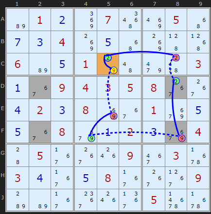
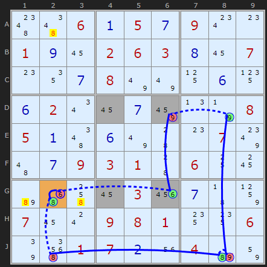
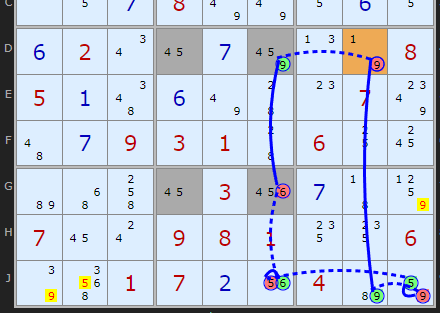

Title: Using Unique Rectangles as Links in Chains

URL Source: https://www.sudokuwiki.org/Using_Unique_Rectangles_as_Links_in_Chains

Markdown Content:
We have already seen how chains can be built using [Grouped Cells](https://www.sudokuwiki.org/AIC_with_Groups) and [Almost Locked Sets](https://www.sudokuwiki.org/AIC_with_ALSs) as more complex links, expanding the number of patterns available. In this article I detail how we can use the [Unique Rectangle](https://www.sudokuwiki.org/Unique_Rectangles) as another type of link. And it's relatively simple! At least for the basic Type 1 Unique Rectangle most often found.

This has been on my to-do list for a long time, but I have to credit **David Hollenberg** for giving me the inspiration and push to implement it in the solver, having given me some examples with Y-Wing chains.

Anywhere where chains can be used this type of link is valid.

* * *

In the first example we have a Discontinuous Alternating Nice Loop that starts and ends on C5. By tracing round it can be shown that if 2 on C5 is removed the chain reaction puts the 2 right back, implying it must be the solution. 9 Can be removed from that cell.

UR inside an AIC : [Load Example](https://www.sudokuwiki.org/sudoku.htm?bd=S9Bb6010b8m075a8q054y0g0c048k0e4y8k455106b60e017o4a9m64030a36090403050838380d020c088i3601aa0e0e3608aa0a020caa04440537381o093e036r030d370e0837383909b8b6373c1o3b056z6r) or : [From the Start](https://www.sudokuwiki.org/sudoku.htm?bd=010070050004000000600100003009435800020800100008002004050009030300080009000000500)

But what is going on on F8 and D8? The chain jumps straight from -9 on F8 to +2 on D8. The reason is simple. The four shaded cells DF28 all contain 6/7 plus these other TWO candidates 2 and 9. We know from understanding [unique rectangles](https://www.sudokuwiki.org/Unique_Rectangles) (type 1) that we cannot allow all four of these cells to be reduced to 6 and 7 alone - that would give two solutions to the puzzles. So one of the extra candidates must exist (or maybe both!).

The chain coming into F8 takes off the 9 there. That forces D8 to be 2 (for the duration of the chain - we don't know yet). +2 on D8 allows us to continue the chain, in this case to D9.

AIC on 2 ((w.UR) Discontinuous Alternating Nice Loop, length 8):

-2[C5]+9[C5]-9[E5]+9[F4]-9(UR[DF28])+2[D8]-2[C8]+2[C5]

- Contradiction: When 2 is removed from C5 the chain implies it must be 2 - other candidates 9 can be removed

UR inside an AIC : [Load Example](https://www.sudokuwiki.org/sudoku.htm?bd=S9B4g4e060a050g090w0o010i160206030h16070o120g087u7u110f150f020u160g8a0n7n08050a4e0f7u440o07804a0g09030144061018b64y4k1603220g438507160s0908011414067q5i01070b1u04b682) or : [From the Start](https://www.sudokuwiki.org/sudoku.htm?bd=006050900100263007000800000020000008500000070009310600000030000700981006001700400)

In this next example the solver has found two options - use 'explore' and choose the 3rd and 4th. Strictly speaking we don't need to use these chains with URs as there are a couple of simpler AICs. But to illustrated the strategy I reproduce here.

Both options have off-chain eliminations.

Removing the 9 from D6 endangers the solution by exposing the unique rectangle, so we can confidently turn ON the 6 in G6. That allows us to continue and close the loop.

_(This is a much harder puzzle and might require some clicking to get to the interesting step)_

Second option : [Load Example](https://www.sudokuwiki.org/sudoku.htm?bd=S9B4g4e060a050g090w0o010i160206030h16070o120g087u7u110f150f020u160g8a0n7n08050a4e0f7u440o07804a0g09030144061018b64y4k1603220g438507160s0908011414067q5i01070b1u04b682)

The 4th 'explore' option shows us another AIC with the same path and different off-chain eliminations.

The same Deadly Rectangle threat where losing the 6 in G6 forces ON the 9 in D6 allows us to continue a loop but with different cells elsewhere. The elimination on the weak links are shown.

* * *
