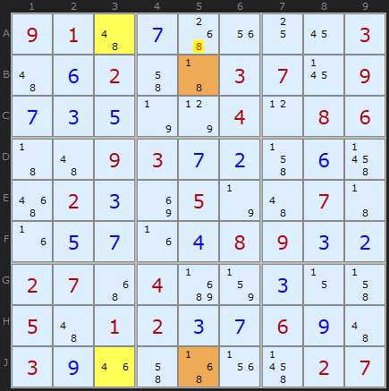
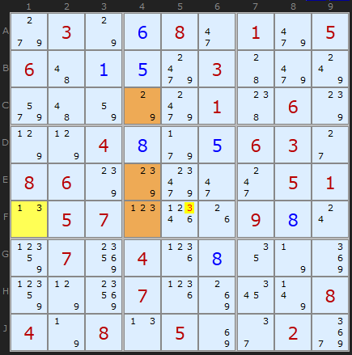
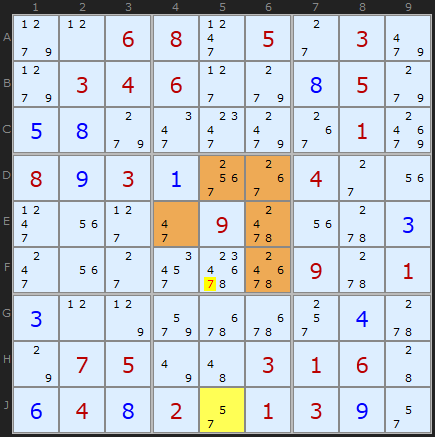
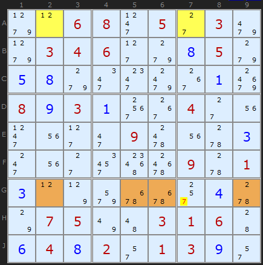
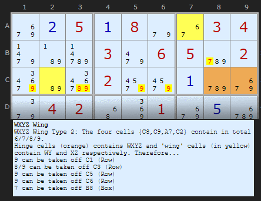
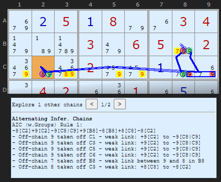
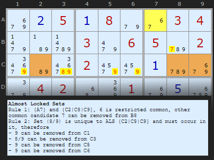
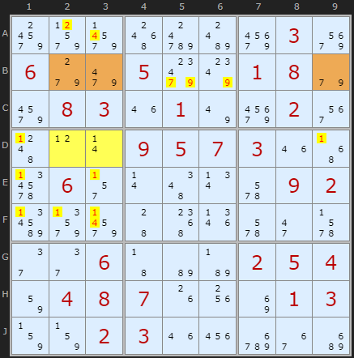
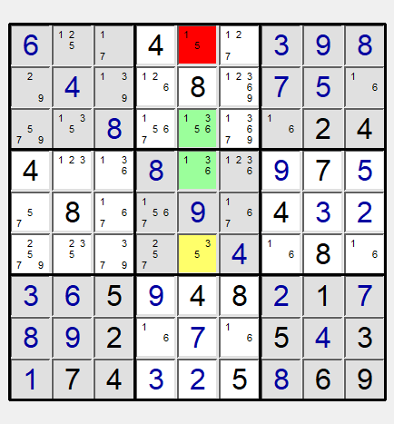

Title: Almost Locked Sets - SudokuWiki.org

URL Source: https://www.sudokuwiki.org/Almost_Locked_Sets

Markdown Content:
# Almost Locked Sets - SudokuWiki.org

SudokuWiki.org

Strategies for Popular Number Puzzles

*   [Sign up for more](https://www.sudokuwiki.org/SPHome.aspx)

*   [Main Page](https://www.sudokuwiki.org/Main_Page)
*   [What's New](https://www.sudokuwiki.org/Whats_New)
*   [Strategy Overview](https://www.sudokuwiki.org/Strategy_Families)

9x9 Solvers

*   [Sudoku Solver](https://www.sudokuwiki.org/Sudoku.htm)
*   [Jigsaw Solver](https://www.sudokuwiki.org/Jigsaw.aspx)
*   [Sudoku X Solver](https://www.sudokuwiki.org/SudokuX.aspx)
*   [Windoku Solver](https://www.sudokuwiki.org/Windoku.aspx)
*   [Colour Sudoku](https://www.sudokuwiki.org/ColourSudoku.aspx)
*   [Killer Solver](https://www.sudokuwiki.org/KillerSudoku.aspx)
*   [Killer Jigsaw Solver](https://www.sudokuwiki.org/KillerJigsaw.aspx)

6x6 Solvers

*   [6x6 Sudoku Solver](https://www.sudokuwiki.org/Sudoku6x6.aspx)
*   [6x6 Killer Solver](https://www.sudokuwiki.org/Killer6x6.aspx)
*   [6x6 KenKen Solver](https://www.sudokuwiki.org/KenKen6x6.aspx)
*   [6x6 KenDoku Solver](https://www.sudokuwiki.org/kendoku6x6.aspx)

Weekly 'Unsolvable'

*   [Unsolvable Sudoku](https://www.sudokuwiki.org/Weekly-Sudoku.aspx)
*   [Unsolvable Jigsaw](https://www.sudokuwiki.org/Weekly-Jigsaw.aspx)
*   [Unsolvable Str8ts](https://www.str8ts.com/weekly_str8ts.aspx)

Puzzles to Play

*   [The Daily Sudoku](https://www.sudokuwiki.org/Daily_Sudoku)
*   [Daily 6x6 Sudoku](https://www.sudokuwiki.org/Daily_Mini_Sudoku)New!
*   [The Jigsaw Sudoku](https://www.sudokuwiki.org/Daily_Jigsaw_Sudoku)
*   [The Daily Sudoku X](https://www.sudokuwiki.org/Daily_Sudoku_X)
*   [The Daily Killer](https://www.sudokuwiki.org/Daily_Killer_Sudoku.aspx)
*   [Daily Mini Killer](https://www.sudokuwiki.org/Daily_Mini_Killer_Sudoku.aspx)
*   [Daily Killer Jigsaw](https://www.sudokuwiki.org/Daily_Killer_Jigsaw.aspx)
*   [The Daily Kakuro](https://www.sudokuwiki.org/Daily_Kakuro)
*   [The Daily KenKen](https://www.sudokuwiki.org/Daily_KenKen.aspx)
*   [Daily Codewords](https://www.sudokuwiki.org/Daily_Codewords)
*   [1 to 25](https://www.str8ts.com/daily_1to25.aspx)
*   [The Daily Binairo](https://www.sudokuwiki.org/DailyBinairo)
*   [Letterlicious](https://www.letterlicious.com/Letterlicious_Home.aspx)
*   [Puzzle Packs](https://www.sudokuwiki.org/ACSPuzzles.aspx)

Basic Strategies

*   [Introduction](https://www.sudokuwiki.org/Introduction)
*   [Getting Started](https://www.sudokuwiki.org/Getting_Started)
*   [Naked Candidates](https://www.sudokuwiki.org/Naked_Candidates)
*   [Hidden Candidates](https://www.sudokuwiki.org/Hidden_Candidates)
*   [Intersection Removal](https://www.sudokuwiki.org/Intersection_Removal)

Tough Strategies

*   [X-Wing](https://www.sudokuwiki.org/X_Wing_Strategy)
*   [Chute Remote Pairs](https://www.sudokuwiki.org/Chute_Remote_Pairs)
*   [Simple Colouring](https://www.sudokuwiki.org/Simple_Colouring)
*   [W-Wing](https://www.sudokuwiki.org/W_Wing_Strategy)
*   [Y-Wing](https://www.sudokuwiki.org/Y_Wing_Strategy)
*   [Rectangle Elimination](https://www.sudokuwiki.org/Rectangle_Elimination)
*   [Swordfish](https://www.sudokuwiki.org/Sword_Fish_Strategy)
*   [XYZ-Wing](https://www.sudokuwiki.org/XYZ_Wing)
*   [BUG](https://www.sudokuwiki.org/BUG)
*   [Avoidable Rectangles](https://www.sudokuwiki.org/Avoidable_Rectangles)

Diabolical Strategies

*   [X-Cycles (Part 1)](https://www.sudokuwiki.org/X_Cycles)
*   [X-Cycles (Part 2)](https://www.sudokuwiki.org/X_Cycles_Part_2)
*   [3D Medusa](https://www.sudokuwiki.org/3D_Medusa)
*   [Jellyfish](https://www.sudokuwiki.org/Jelly_Fish_Strategy)
*   [Unique Rectangles](https://www.sudokuwiki.org/Unique_Rectangles)
*   [Tridagons](https://www.sudokuwiki.org/Tridagons)
*   [Fireworks](https://www.sudokuwiki.org/Fireworks)
*   [Twinned XY-Chains](https://www.sudokuwiki.org/Twinned_XY_Chains)
*   [SK Loops](https://www.sudokuwiki.org/SK_Loops)
*   [Extended Rectangles](https://www.sudokuwiki.org/Extended_Unique_Rectangles)
*   [Hidden URs](https://www.sudokuwiki.org/Hidden_Unique_Rectangles)
*   [WXYZ-Wing](https://www.sudokuwiki.org/WXYZ_Wing)
*   [XY-Chains](https://www.sudokuwiki.org/XY_Chains)
*   [Aligned Pair Exclusion](https://www.sudokuwiki.org/Aligned_Pair_Exclusion)

Extreme Strategies

*   [Grouped X-Cycles](https://www.sudokuwiki.org/Grouped_X_Cycles)
*   [Forcing Nets](https://www.sudokuwiki.org/Forcing_Nets)
*   [Exocet](https://www.sudokuwiki.org/Exocet)
*   [Finned X-Wing](https://www.sudokuwiki.org/Finned_X_Wing)
*   [Finned Swordfish](https://www.sudokuwiki.org/Finned_Swordfish)
*   [Inference Chains](https://www.sudokuwiki.org/Alternating_Inference_Chains)
*   [AIC with Groups](https://www.sudokuwiki.org/AIC_with_Groups)
*   [AIC with ALSs](https://www.sudokuwiki.org/AIC_with_ALSs)
*   [AIC with URs](https://www.sudokuwiki.org/Using_Unique_Rectangles_as_Links_in_Chains)
*   [Almost Locked Sets](https://www.sudokuwiki.org/Almost_Locked_Sets)
*   [Death Blossom](https://www.sudokuwiki.org/Death_Blossom)
*   [Sue-de-Coq](https://www.sudokuwiki.org/Sue_de_Coq)
*   [Digit Forcing Chains](https://www.sudokuwiki.org/Digit_Forcing_Chains)
*   [Nishio Forcing Chains](https://www.sudokuwiki.org/Nishio_Forcing_Chains)
*   [Cell Forcing Chains](https://www.sudokuwiki.org/Cell_Forcing_Chains)
*   [Unit Forcing Chains](https://www.sudokuwiki.org/Unit_Forcing_Chains)
*   [Double Exocet](https://www.sudokuwiki.org/Double_Exocet)
*   [Pattern Overlay](https://www.sudokuwiki.org/Pattern_Overlay)

Deprecated Strategies

*   [Remote Pairs](https://www.sudokuwiki.org/Remote_Pairs)
*   [Y-Wing Chain](https://www.sudokuwiki.org/Y_Wing_Chains)
*   [Multivalue X-Wing](https://www.sudokuwiki.org/Multivalue_X_Wing_Strategy)
*   [Multi-Colouring](https://www.sudokuwiki.org/Multi_Colouring_Strategy)
*   [Empty Rectangles](https://www.sudokuwiki.org/Empty_Rectangles)
*   [Guardians](https://www.sudokuwiki.org/Guardians)

Str8ts

*   [Home & Rules](https://www.str8ts.com/str8ts)
*   [The Daily Str8ts](https://www.str8ts.com/Daily_str8ts)
*   [Weekly Extreme Str8ts](https://www.str8ts.com/weekly_str8ts.aspx)
*   [Str8ts Solver](https://www.str8ts.com/str8ts.htm)
*   [Str8ts Sample Pack](https://www.str8ts.com/Str8ts_Sample_Pack.pdf)

Other

*   [What's New](https://www.sudokuwiki.org/Whats_New)
*   [Latest Articles](https://www.sudokuwiki.org/LatestArticles.aspx)
*   [Feedback](https://www.sudokuwiki.org/sudokufeedback.aspx)
*   [Donate](https://www.sudokuwiki.org/Donations)
*   [Syndicated Puzzles](https://www.syndicatedpuzzles.com/)

[Print Version](https://www.sudokuwiki.org/Print_Almost_Locked_Sets)

[Page Index](https://www.sudokuwiki.org/Site_Map)

47 Shares 

# Almost Locked Sets

On the occasional Diabolical and most certainly on many Extreme Sudoku puzzles there will be many opportunities to whittle down the candidates by identifying and using Almost Locked Sets. Lets think about the terms first. A set of candidates is locked if the number of candidates in a group of cells matches the number of cells they are in. For example, a Naked Pair of 3/7 on two cells is a locked set: two candidates in two cells. They are considered "locked" because we know all the candidates for the cells; we just don't know the solution order. 

**Any set of cells with exactly one extra candidate is "Almost Locked"**. The solver now uses curley {brackets} to denote them bringing them in line with AIC chain links.

Note: these examples require AICs and Forcing Chains to be unticked in the solver.

ALS is strongly related to [XYZ-Wings](https://www.sudokuwiki.org/XYZ_Wing) and [WXYZ-Wings](https://www.sudokuwiki.org/WXYZ_Wing) which are subsets of ALS.

Almost Locked Set example 1 : [Load Example](https://www.sudokuwiki.org/sudoku.htm?bd=910700003062003709735004086009372060023050070057048932270400300501237690390000027) or : [From the Start](https://www.sudokuwiki.org/sudoku.htm?bd=910000003002003709000004086009300000020050070000008900270400000501200600300000027)

 It's one away from being locked down. All Naked Pairs, Triples, Quads etc are Locked Sets. Formally, we are interested in groups of cells of size N with N+1 candidates.

Take this example where two Almost Locked Sets have been coloured in yellow {A3,J3} and brown {B5,J5}. You can immediately see that the first set has {4,6,8} as members and the brown set has {1,6,8}. So far so good. But since Almost Locked Sets are so common - and you will see them everywhere!, perhaps the greatest difficulty with this strategy is finding ones we can work with. The building blocks are easy enough, but spotting the formations that conform to the rules outlined below can be tricky.

## Rule 1: The Almost Locked Set XZ Rule

To make use of Almost Locked Sets, we're going to need two or more of them. Their sizes don't matter, but they ought to be able to 'see' each other that is, have some cells that share a unit (row J in this example). We also need a mixture of candidates in both sets. If there is a common candidate found in both sets and this common candidate is among those cells that can 'see' each other, this candidate can exist only in one set or the other. We call this candidate a restricted common candidate (RCC). In the two sets in the example above, 6 is a restricted common because 6 in one set will remove it in the other. Let's call any restricted common candidate X.

The Z part of the rule involves any other candidate found in both ALSs but not a restricted common; that, a candidate that still appears in both ALSs and is not exclusive to one or the other. In the above example, Z is number 8. Now, it so happens that **any other 8 on the grid that can 'see' all the 8s in both ALSs can be removed**. 

Making an interesting observation is one thing, but what's the proof? Think of the 8 in A5 in the example above. If 8 were the solution, we'd quickly get a contradiction in at least one of the two sets. A3 would become 4, forcing J3 to be 6 and that removed 6 from J5. B5 would become 1 and since 6 and 8 are removed form J5 as well we are left with a 1 also in J5 - two 1s in the column. So following the consequences through shows the 8 in A5 must go.

## A 1 Cell + 3 cell Example

The N+1 definition also applies to single cells - they simply must have two candidates in them - the natural bi-value cell. This next example uses a 3-cell ALS in combination with the 1-cell ALS.

Almost Locked Set example 2 : [Load Example](https://www.sudokuwiki.org/sudoku.htm?bd=030680105601503000000001060004805630860000051057000980070408000000700008408050020) or : [From the Start](https://www.sudokuwiki.org/sudoku.htm?bd=030080105600003000000001060004000630860000051057000900070400000000700008408050020)

 The yellow cell F1 is our first ALS. The 1 and 3 in F1 can see F4 which is part of the brown 3-cell ALS. 1 and 3 are common to both ALS but only 1 is restricted common because all the cells in both ALSs can see each other. 3 can't be restricted because the 3 in E4 cannot see the 3 in F1. 

The XZ rules says we can use that 3 to look for other 3s that share units with both ALSs. The sole 3 on F5 can see F1 (row) and the 3s in E4 and F4 (because of the box). That 3 can be removed.

## More Complex Examples

Almost Locked Set example 3 : [Load Example](https://www.sudokuwiki.org/sudoku.htm?bd=006805030034600850580000010893100400000090003000000901300000040075003160648201390) or : [From the Start](https://www.sudokuwiki.org/sudoku.htm?bd=006805030034600050000000010803000400000090000000000901000000000075003160040201300)

 Both these next examples come from the same puzzle and almost follow on from each other. The definition of example 3 is 

Rule 1: [J5] and {D5|D6|E4|E6|F6}, 5 is restricted common, other common candidate 7 can be removed from F5 

We have an enormous 5-cell ALS in brown with 5 as the restricted common. You can see that 5 occurs only in D5 and aligns with the yellow ALS J5. Its pretty hard to pick out a 5-cell ALS but if you add the numbers available in the brown cells you can see there are 6 possibilities. 7 is shared by both ALSs and is not restricted so it can be removed.

Almost Locked Set example 4 : [Load Example](https://www.sudokuwiki.org/sudoku.htm?bd=006805030034600850580000010893100400000090003000000901300000040075003160648201390) or : [From the Start](https://www.sudokuwiki.org/sudoku.htm?bd=006805030034600050000000000803000400000090000000000901000000000075003160040201300)

 Still on number 7 the next step is another ALS combination, this time a 2-cell and a 4-cell. The {1,2,7} in the top yellow ALS is matched with a set of {1,2,6,7,8} in row G. 1 is linked by A2 and G2 so it is restricted common. The only interesting cell that is not part of any ALS and contains common candidates is G7. Apart from 5 it contains 2 and 7. The 7 can see the 7 in A7 and all the 7s in the brown ALS. It can be removed. 2 looks like it could be eliminated but there is a 2 in A2 which it cannot directly see. To be eliminated the X must see all the candidates X in both ALSs, which is not the case with 2.

Rule 1: {A2|A7} and {G2|G5|G6|G9}, 1 is restricted common, other common candidate 7 can be removed from G7

## Overlap with other strategies

 There is overlap with other strategies as often noted in the comments on this and other pages. Here I have taken the [first example](https://www.sudokuwiki.org/sudoku.htm?bd=S9Baa0b050a089e3603049nb7d7039m0605cy02amb6e602a2a20acyaa9i04024y8m01aa0edu9v069f4q0bbu030rcy08837r079a8e0b0r8i1n071n091r0u080b0e0203c25m3u6i9m9e018bbnbf4a2j029m0603) from [HoDoKu](https://hodoku.sourceforge.net/en/tech_als.php) docs page "Singly Linked ALS-XZ". 

The solver here first finds this as a WXYZ-Wing

The eliminations can be expressed as an Alternating Inference Chain

And then it gets to the Almost Locked Set.

## ALS-XZ rule 2 — Double Linked Rule

Thanks to David Bird (in 2016) for the extension to the ALS-XZ rule that allows other candidates to be eliminated. And to STRMCKR for the example and [forum post](http://forum.enjoysudoku.com/almost-locked-rules-for-now-t2510-15.html#p284617). There is earlier discussion (2009) on the [same forum here](http://forum.enjoysudoku.com/restricted-common-adjacency-rules-t6642.html). Sorry this has taken seven years to document!

Double Linked Rule example : [Load Example](https://www.sudokuwiki.org/sudoku.htm?bd=S9Ba49xa358d8bgay03aq069g9m059s8001089ea208031m017uay023m4d0l0r090507031m4z6n062r0r4e0v6a0902bz9za344541r6a2i6b2e2e0643b6b7020504820408071g1w8i0103838302031m22du36c2)

When there are two restricted common candidates it will be the case that each one of them will be false in one of the ALSs locking all their other member digits. In practise this means that any candidate in the ALS that is unique to that ALS (and not the other) is a solution somewhere in that ALS set - so other cells that can see all members of the ALS can have that candidate removed.

In STRMCKR's example 2 and 4 are the restricted common candidates. For ALS {D2|D3} candidate 1 is unique to {D2|D3} and 1 does not appear in {B2|B3|B9}. All thoses 1's in box 4 can be removed.

Likewise 7 and 9 are only found in row and are 'locked in' to B239 so can be removed from the rest of the row. _(Turn off AIC and Forcing Chains)_

**Almost Locked Sets**

Rule 1 (Doubly Linked): {D2|D3} and {B2|B3|B9}, 2/4 are restricted common and are locked in to these ALSs. Therefore

- 4 can be removed from A3

- 4 can be removed from F3

Rule 1 (Doubly Linked): {D2|D3} and {B2|B3|B9}, 2/4 are restricted common and are locked in to these ALSs. Therefore

- 2 can be removed from A2

Rule 2: Set (1) is unique to ALS {D2|D3} and must occur in it, therefore

- 1 can be removed from D1

- 1 can be removed from D9

- 1 can be removed from E1

- 1 can be removed from E3

- 1 can be removed from F1

- 1 can be removed from F2

- 1 can be removed from F3

Rule 2: Set (7/9) is unique to ALS {B2|B3|B9} and must occur in it, therefore

- 7/9 can be removed from B5

- 9 can be removed from B6

Go back to [Unit Forcing Chains](https://www.sudokuwiki.org/Unit_Forcing_Chains)Continue to [Finned X-Wing](https://www.sudokuwiki.org/Finned_X_Wing)

* * *

# Comments

Your Name/Handle

Email Address - required for confirmation (it will not be displayed here)

Your Comment

Please enter the

letters you see:

- [x]  Remember me

Please ensure your comment is relevant to this article.

**Email addresses are never displayed, but they are required to confirm your comments.** When you enter your name and email address, you'll be sent a link to confirm your comment. Line breaks and paragraphs are automatically converted - no need to use 
 or   tags.

Comments[Talk](https://www.sudokuwiki.org/Almost_Locked_Sets?talk#comments)

## ... by: LJC

Monday 29-Dec-2025

Here’s a fairly straightforward extension: If all two candidates (which can be either grouped candidates or single candidates) in an ALS are connected by a strong link in an AIC, then all other candidates in that ALS must be locked within it, allowing eliminations to be made.

I imagine this situation isn’t too rare, but it’s probably extremely hard to spot.

REPLY TO THIS POST

## ... by: Ymiros

Saturday 8-Jul-2023

I think a more generalised proof of rule 1 would go something like this:

If 2 ALS have a common restricted digit that means you only have 1 more digits than cells to work with. If you were now to place a digit that completely removes a digit that is not commonly restricted from both ALS you effectively remove 2 digits, leaving 1 fewer digits than cells to work with (which is obviously wrong).

Also concerning Robert's comments I think his last comment is a correction for his rule 1 and not his rule 2 as the eliminations he describes do not work on sets with any "excess"

All in all I think this can be generalised into having any number of sets that each contain some number N of digits in some lower number C of cells and then some of them are restricted.

Now as soon as you look at 3 sets there will be different types of restrictions occuring as a digit could be able to appear only once across all 3 sets or it could be able to only appear once in 2 of the sets but could still appear in the third set in addition.

In other words in the first case placing it in one of the sets eliminates it from 2 other sets and in the second case from 1 other set.

Thus I call them 2-restricted or 1-restricted respectively.

If no digit is restricted you just add all N and all C of the sets you are looking at and end up with N digits (digits may repeat here) to put into C cells, in other words you have N - C degrees of freedom.

Now if digits are restricted commons that effectively reduces your N and it does so by exactly the strength as I have defined it, so a 1-restricted digit reduces N by 1, a 2-restricted by 2 etc.

(This is due to it appearing in N as often as you include sets it appears in, but for the sets it is restricted in it should've appeared only once)

C stays the same, so your degrees of freedom also go down by that amount.

If now a candidate would completely remove more digits than the degree of freedom it can be eliminated.

(I hope this is obvious as it would result in having to place a number of digits in a larger amount of cells inevitably leaving at least one empty.)

You have to be very careful though, let's say you are looking at the sets 1,2,8 and 3,4,8 where 8 is not a restricted digit removing 8 from both sets counts as 2 eliminations while removing it from one set only counts as 1 elimination. If you only remove it from cells within a set but it still can go somewhere in the set that is no elimination at all.

However if 8 were a restricted common in both sets eliminating it from just one of the sets would not amount to eliminating one digit, instead it has to be eliminated from all sets it is restricted in at once to count as a single elimination.

Let us look at the example for the double linked rule in this article to showcase this:

We have two sets: 2,4,7,9 and 1,2,4.

Thus our N is 7.

The sets have 3 and 2 cells respectively adding to C = 5.

We have 2 digits that are 1-restricted, so our N decreases by 2.

We can see that N - C = 0, so we have no degree of freedom.

Thus any cell that removes even just one of the digits from one of the sets can be eliminated.

We can also see that only the 2 and 4s get removed that remove the restricted common digits from both sets.

Of course all this also works with the complementary aka hidden sets, though thinking about that makes my head hurt.

I also do not know how many eliminations this generalisation even opens up.

Furthermore for a human solver I do not think this strategy is very feasible (Not that I myself am any good at spotting regular ALS eliminations), but I think the best strategy to search for these might just be picking one ALS you can see and then expanding from that by adding other cells / sets of cells that are linked to the original set in a way that the degree of freedom decreases or stays the same to increase the number of eliminations (Though with this approach there will be a LOT of links to pay attention to in the end).

What StrmCkr proposes here goes in the same direction as what he's mentioning are 3 ALS, which are triply linked.

3 ALS means 3 sets which one more digit than cells, so a degree of freedom of 3

Triply linked in this case means 3 1-restricted commons, so a reduction of the degree of freedom by 3 to 0.

Therefore you can apply the eliminations as discussed above.

The same will obviously work with 4 ALS and 4 links

I don't think the example they make in their comment is a good one cuz that can also just be done with a double linked ALS as they say, but the last example of their forum post has a better example as it contains 3 sets that are distinctly separate and at least your solver fails to solve the puzzle without guessing, but can do it if you put in the eliminations provided in that example (though the puzzle remains absolutely brutal even after that).

strmckr replies:Monday 3-Jun-2024
yes: 

 the N als with N RCC rule makes them all a.i.c Rings technically: 

 warning note that the elimination rules can get interesting with als as the internal nodes can also be weak-inferenced to each other more then once through out the chain. {of course depending on how complex & more exacting} 

i do agree the example below isn't great but it show cases the logic is sound: i did email over better examples to Andrew a while back which should be the forum posts. + others.

Add to this Thread

## ... by: ALSFAIR INLOVEANDWAR

Friday 7-Jan-2022

Hello Andrew

I have several examples of two overlapping ALS where one cell can be described as existing is both sets. If one accepts that this is allowed then eliminations are possible according to the ALS xz rules. The link to the diagram is below (sorry didn't know how to paste one in)



Set A {1,3,5,6} is the two green cells plus the yellow cell. n = 4 so n-1 = 3 cells

Set B {3,5} ids the yellow cell

The overlapping cell is the yellow one.

Restricted common x = 3 which will only end up in A or B

Common Candidate z = 5 which is eliminated and shown as the red cell. 

Is this legal ? I have several other of these which worked perfectly for solutions to difficult puzzles. However....

Cerberus replies:Thursday 19-Oct-2023
I see no-one answer your post, ALSFAIR INLOVEANDWAR.

I understand it is not legal as the restricted common (3) shares the overlap.

Andrew Stuart writes:

Thanks for answering!

Add to this Thread

## ... by: Anonymous

Friday 31-Dec-2021

Hi Robert 

I did encounter ALS-XZ Rule 2 when using the solver and it seems that your assumption is actually correct. The solver's implementation seems similar to this here: http://hodoku.sourceforge.net/en/tech_als.php#axz2

However the solver uses the words 'unique to one ALS' which I think is wrong, as they need not be.

REPLY TO THIS POST

## ... by: Robert

Tuesday 31-Aug-2021

Bugger, I did not describe my idea for an extension to this technique properly.

My proposed "Rule 2" is correct as far as it goes, but it is incomplete. If there are two restricted digits in the ALS case, or a number of restricted digits equal to the "excess" (definition in my earlier comment) if we allow AALS or even more "A"s, then all restricted digits must occur in the one set or the other. Therefore, in any cell outside the two sets, if one of the restricted digits occurs and can "see" all occurrences within the two sets, it can be eliminated. So there are two types of eliminations - restricted digits need to be able to see all occurrences in both sets, but unrestricted digits only have to see all occurrences in one of the two sets. Unrestricted digits in this case do not have to occur in both sets; however, if they do, some of them may be eliminated, if they can "see" all occurrences of the same digit in the other set.

REPLY TO THIS POST

## ... by: Robert

Thursday 26-Aug-2021

Follow-up to my earlier comment regarding my extension of this strategy.

In my database of 341 "advanced" puzzles, I run the ALS strategy (with my version of Rule 2, which may or may not be the same as David Bird's) together with basic techniques, and get 66 puzzles fully solved.

My extended version of the strategy only finds eliminations based on ALSs, AALSs, and AAALSs. Furthermore, although my solver does find some eliminations involving AAALSs, it finds the same eliminations when restricted to just ALSs and AALSs.

So I don't know whether there is some general wisdom here that there is no need to check for anything more than an AAALS, or if that is just a specific property of my sample of 341 puzzles.

REPLY TO THIS POST

## ... by: Robert

Thursday 26-Aug-2021

So the documentation on Rule 2 is still on the to-do list, but I have speculated in a comment last week about what it might be. I repeat my speculation here, and also offer an extension to this method.

First, my speculation about Rule 2 - if there are two restricted digits in the pair of ALSs, then any candidate in any cell that can see all of the same digit in just *one* of the ALSs can be eliminated. This might possibly include occurrences of that digit in the other ALS (so the same value occurring in both ALSs, but it is not restricted, and therefore possible for the same digit to appear in the solved puzzle in both ALSs). My own solver finds some instances of this occurring in my sample of "advanced" puzzles (now up to 341 puzzles), and can solve 66 of those puzzles using the basic techniques, the ALS Rule 1 above, and my proposed version of the ALS Rule 2. Using only Rule 1, I get 65 puzzles solved instead of 66, and possibly some additional eliminations in puzzles that are partially solved (I would have to check).

Rule 1 is a special case of AICs with ALSs, but with the size limitation in the implementation of ALSs that appear in AICs, it is possible that the solver might find some eliminations using this strategy, that is doesn't find using AIC with ALSs. My version of Rule 2 is also a special case of AICs with ALSs.

Now, for my extension. We can use not just ALSs, but AALSs, AAALSs, etc. So here is how it works. Find two groups of cells that are not locked sets. (If they include locked sets as subsets, these should be thrown away - the strategy is still valid, but other strategies can be applied.) So they might be ALSs, AALSs, AAALSs, or maybe even more Almosts. Call the "excess" the combined number of "almosts" in the two sets. For example, if one set is an ALS, and another is an AALS, the "excess" is three. If there are two AALSs, the "excess" is four. If there are two ALSs, the "excess" is two. (I think this strategy probably works with locked sets as well, but in that case, easier strategies can be used instead.)

The number of restricted digits (same definition used for ALSs) cannot be more than the "excess". If it is, the puzzle has no solution (or we have made a logical error while trying to solve it).

Rule 1: if the number of restricted digits is equal to the "excess", then any candidate in any cell that can "see" all occurrences of an unrestricted digit in *either* (not both) of the sets can be eliminated. This might possibly include candidates in one of the two sets, if it can see all occurrences of an unrestricted digit in the other set.

Rule 2: If the number of restricted digits is equal to the "excess" minus one, then any candidate in any cell that can "see" all occurrences of an unrestricted digit in *both* of the sets (and the unrestricted digit must occur in both sets) can be eliminated.

I have implemented this in my own solver. Once I had the ALS code running smoothly, it probably took me five minutes to make the extension (definitely less than ten). It adds a lot of processing time, because *every* set of cells within a unit that is not a locked set, is an ALS, an AALS, an AAALS, an AAAALS, an AAAAALS, an AAAAAALS, an AAAAAAALS, or an AAAAAAAALS. In my database of advanced puzzles, it does not solve any additional puzzles (when combined with basic techniques) than the 66 solved using ALS Rule 1 and my version of Rule 2 (which may or may not match David Bird's Rule 2). However, it does find some additional eliminations, bring some of the partially solved puzzles a little closer to solution.

When I combine it with all the other strategies I have implemented, although a number of my "super-ALS" pairs are found, and some eliminations made, all the same eliminations would have been made by other strategies anyway. So it is possible this extended strategy is a special case of some other strategies (just as Rule 1 of the ALS strategy, and my version of Rule 2, are special cases of AIC with ALSs).

REPLY TO THIS POST

## ... by: Robert

Thursday 19-Aug-2021

So no docs on the extension mentioned, but if I may speculate -

Is it that, if there are two restricted digits, then any candidate that can see all instances of a non-restricted digit in *either* (not necessarily both) ALS can be eliminated?

REPLY TO THIS POST

## ... by: Gary

Monday 5-Jul-2021

Almost Locked Set Example 3: cannot 7 also be removed from D5?

REPLY TO THIS POST

## ... by: Robert

Wednesday 27-Jan-2021

I've been implementing my own solver, really just for laughs, and I've gotten as far as AIC with Groups. Still need to do AIC with ALSs, which is next on my to-do list. But AIC seems to be an extremely powerful technique. Mesusa (except for Rule 6), Digit Forcing, Nishio Forcing, and some other strategies are all special cases.

Which brings me to this one. All of the examples above look like they could be considered examples of AICs with ALSs, if we define a weak link between certain candidates in the ALSs. In these examples, the resulting AIC has five links, and the candidate to be eliminated as between two weak links. If this candidate is "on", then the same candidate must be "off" in both the ALSs. But because they are ALSs, if one of the candidates is "off", all the other candidates must be "on" (strong link), although if a candidate appears several times within the ALS, we won't know which one is "on". But for the restricted common, there is a weak link between the two ALSs - "on" in one means "off" in the other. So we have an AIC. In the last example shown,

Candidate 7 in G7

_is weakly linked to_

Candidate 7 in ALS {G2,G5,G6}

_is strongly linked to_

Candidate 1 in ALS {G2,G5,G6}

_is weakly linked to_

Candidate 1 in ALS {A2,A7}

_is strongly linked to_

Candidate 7 in ALS {A2,A7}

_is weakly linked to_

Candidate 7 in G7

So it is an AIC, Candidate 7 in G7 can be eliminated by Rule 3 (and Rule 1 and Rule 2 are really just special cases of Rule 3 anyway).

So I think by defining the notion of a "weak link" between ALSs (which is done using the restricted common), we could build more complex inference chains than the five-step ones shown above.

Whether this is computationally feasible, let alone human-feasible, I do not know at this point.

Add to this Thread

## ... by: Twifty

Thursday 20-Aug-2020

For rule 1, you state that:

"any other candidate found in both ALSs but not a restricted common; that, a candidate that still appears in both ALSs and is not exclusive to one or the other."

but, what if there are two restricted commons?

Here is an example of a 1 and 4 cell ALS:

https://www.sudokuwiki.org/sudoku.htm?bd=360020009920000050870009203490750000010000090030918002259400831080090020040080965

The solver claims that candidates 1,4 can be removed from A8; which contradicts the above statement.

Andrew Stuart writes:

Alas this is nor coming up anymore so I can't reply properly. (Bit late on this one!)

Add to this Thread

## ... by: PAUL

Saturday 25-Jul-2020

Presently missing an explanation of the doubly linked ALS with two RCCs which becomes cannibalistic and is included in the solver as ALS XZ-Rule 2. See this link for more info: http://hodoku.sourceforge.net/en/tech_als.php I think you refer to David Bird about it. 

REPLY TO THIS POST

## ... by: Cerberus

Saturday 2-Nov-2019

Where are the docs you often refer to?

I was looking at the Almost Locked Sets web page, at the bottom you have a title, ALS-XZ Rule 2, with a thanks to Davis Bird and that Docs were to come. Where can they be found, or do they not exist yet?

Thanks in advance.

Andrew Stuart writes:

Yeaahhhh, looks like that fell by the wayside. I will add it to the job queue!

Add to this Thread

## ... by: strmckr

Thursday 8-Dec-2016

i'm guessing the missing 2ndary rule is the double linked rule for ALS 

http://hodoku.sourceforge.net/en/tech_als.php

{listed half way down the page for easy reference}

that rule has been on enjoy sudoko forms since 2006 roughly.

REPLY TO THIS POST

## ... by: Anton Delprado

Friday 2-May-2014

I have found it quite useful to extend this method with XY-Chains. XY-Chains find weak links between bi-value cells but you can use ALSs in place of XY cells (XY cells are just a simple type of ALS).

ALS XZs are just a two step chain and a "ALS Chain" is just continuing this logic.

These may seem hard to find at first, but if you are already looking for XY-Chains I have found it quite easy to include 2 and 3 cell ALSs in the chaining logic.

Of course all of these are examples of AICs but I find those to be quite hard to find in general.

REPLY TO THIS POST

## ... by: Jan

Thursday 24-Apr-2014

I found a very interesting example for this strategy. It involves in total 9 cells and they are all in only one unit. I found it in your "18 elimination Jelly-Fish" example (..........7..3.92..19.2563...4...21...........57.9.46..9514.37.7......4..4236759.)

It all happens in column 9. The first ALS is a 6-cell set {A9, B9, C9, D9, E9, J9} and the second is the single cell set {F9}. The restricted common is 3. This results in the elimination of candidate 8 in cells F9 and H9. The fact that both sets can be in one unit is not so evident, that's why it find it so interesting.

I also find it interesting for the fact that it illustrates that there can be more than one restricted common in each set. The first ALS has a 3 in both D9 and E9. More explicitly: if all candidates for X in set 1 see all candidates for X in set 2 then X is a restricted common for both sets.

REPLY TO THIS POST

## ... by: ralph maier

Wednesday 10-Jul-2013

LOL 

Still interested to know whether a restricted candidate is really necessary for an ALS to work

Andrew Stuart writes:

In this definition yes. But happy to entertain counter examples. Good to expand patterns.

Add to this Thread

## ... by: sunshine48

Sunday 14-Apr-2013

A simple explanation, I finally got it. Wonderful site.

REPLY TO THIS POST

## ... by: Douglas Boffey

Tuesday 9-Apr-2013

There is a second way a set can be almost locked, namely, when N candidates appear in N + 1 cells within a unit. I call this a Hidden ALS (or HALS), as knocking out one of the cells reduces to a hidden pair/triple/quad/&c. Likewise, the ALS described on this page would be better called a NALS (Naked ALS).

REPLY TO THIS POST

## ... by: Tokgot

Monday 18-Feb-2013

I wish to show my appreciation to the witrer just for bailing me out of this particular issue. Just after browsing throughout the world-wide-web and coming across opinions which were not productive, I was thinking my life was gone. Being alive without the solutions to the problems you've resolved all through your entire report is a critical case, as well as ones that might have in a wrong way damaged my entire career if I had not discovered your web site. Your main expertise and kindness in handling all the pieces was very useful. I am not sure what I would have done if I hadn't come upon such a thing like this. I can now look forward to my future. Thanks so much for your high quality and amazing guide. I won't think twice to recommend your blog to any person who wants and needs assistance on this issue.

REPLY TO THIS POST

## ... by: Jason

Wednesday 25-Jul-2012

Ian,

If I understand correctly, adding G5 to the brown ALS does no good. You can only use this technique to make eliminations on numbers common to both the ALS. 

In Example 1, adding G5 to the brown ALS picks up another candidate, the 9, but it will not lead to any more eliminations because the yellow ALS does not have a 9. If the yellow ALS happened to have a 9, then it could help.

Essentially, the relationships between the common elements of the two ALS means that the unrestricted common candidate (in Example 1, it's the 8) has to be the correct solution for a cell in at least one of the two ALS. So at least one of the yellow or brown cells that contain 8 as a candidate must actually be a 8 in the final answer.

It logically follows that 8 can be removed as a candidate in any cell that can see ALL of the 8s in the yellow and brown squares.

REPLY TO THIS POST

## ... by: Ian Saliba-Curtis

Saturday 30-Jun-2012

Hi Andrew!

Example 1: Could you not also have added G5 to the brown ALS and made it an almost locked triplet over 4 candidates?

If yes - is there a reason why you didn't?

If no - please could you explain why not?

Many thanks! Your site is fascinating.

Kind regards,

Ian

REPLY TO THIS POST

## ... by: Marc

Tuesday 3-Apr-2012

I have two questions:

If one of the ALS is a bi-value cell, then the other ALS cannot have a cell in the same box of the bi-value cell, is that true?

If none of the ALS is a bi-value cell, and they both are in a row (or both in a column), can both these rows (or columns) appear in the same band (or stack)? 

Marc replies:Thursday 5-Apr-2012
Ok, I've found out the answers myself...

Answer 1 = No, it's not true. A bi-value cell ALS can share the same box with one or more cells of the other ALS

Answer 2= Yes, they can.

Add to this Thread

## ... by: rlhaben

Thursday 15-Mar-2012

Andrew must be busy on the mobile solver since I have seen no answer. But I think Grandad is right. If you load the example, you will not even get to ALS as an example for those cells unless you manually remove the 2. However, even in that case, the proof doesn't seem to work. If you make F5 a 3, it does not present a contradiction in the two ALSs. It may present a contradiction elsewhere. But this type of example trips me up. I bought the book and I love it. But I often find that I can't prove a path I follow using its rules. I usually import the puzzle that I can't prove and watch what the solver does. Sometimes that helps, sometimes not.

rlhaben replies:Thursday 15-Mar-2012
Actually, sorry. I was wrong on this one. It does present a contradiction. I stared at this for 15 minutes trying to see it. Wrote the comment, then looked again and saw it immediately. Looking forward to getting this on the iPad. :)

Add to this Thread

## ... by: Grandad

Tuesday 23-Aug-2011

I am almost certainly not the first to ask but - in the 2nd example, surely F1 should have possibles 1, 2 and 3 so isn't an ALS ?

REPLY TO THIS POST

## ... by: Terry

Thursday 14-Oct-2010

Hi Andrew,

Excellent site ;-)

I'm just getting to grips with some of the more difficult strategies. I had a puzzle loaded in the solver and it came up with an ALS that I fail to understand :( The starting point for the puzzle is

..7...32.1..2.7..6.26.5.71..8...2....19.6.5...6.7......91.2..475..17.....78......

If you just keep clicking 'Take Step' until it comes to the first ALS, I can't see how 8 is restricted as 6 can also be seen by both ALSs.

What am I missing in my understanding of the ALS technique?

Many thanks and best wishes,

Terry

Andrew Stuart writes:

You are correct to suspect that 6 is restricted common as well as 8. The problem was my reporting since the 8 is not eliminated due to the 6. I have improved the reporting and this example is a Doubly Linked ALS. The solver will now say

Rule 1 (Doubly Linked): {G7} and {H2|H3|H7|H8|H9}, 6/8 are restricted 

common and are locked in to these ALSs. Therefore

- 6 can be removed from J7

- 6 can be removed from J8

Add to this Thread

## ... by: Ana

Sunday 28-Feb-2010

In the last example the {1,2,6,7,8} in row G is not an ALS because it has 5 candidates in 3 cells

Andrew Stuart writes:

The four cells highlighted in brown are the ALS, so thats 5 candidates in 4 cells.

Add to this Thread

## ... by: Luciano

Tuesday 20-Oct-2009

Having problems with this technique (ALS). It seems that since i started using it I am screwing up a large amount of sudokus. It always happens after using this technique. I can't be sure that it is this technique but it sure seems that way. Anyone else having similar pissues?

REPLY TO THIS POST

 Article created on 12-April-2008. Views: 204933

 This page was last modified on 1-September-2025.

 All text is copyright and for personal use only but may be reproduced with the permission of the author.

 Copyright [Andrew Stuart](https://www.sudokuwiki.org/) @ [Syndicated Puzzles](https://www.syndicatedpuzzles.com/), [Privacy](https://www.sudokuwiki.org/privacy), 2007-2026 

