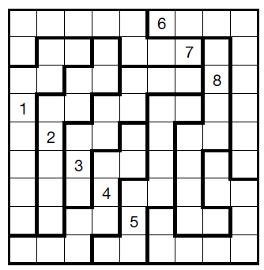

Title: Brute Force vs Logical Strategies

URL Source: https://www.sudokuwiki.org/Brute_Force_vs_Logical_Strategies

Markdown Content:
A number of times in feedbacks I've discussed the difference, or utility, of a **brute force** approach to solving Sudoku versus **logical strategies**. By **brute force** I mean any back-tracking method that can fill a puzzle board and derive all possible solutions. The _Solution Count_ on the solver is an example. The rest of this site is devoted to logical strategies.

I made a decision early on when exploring Sudoku that I was interested in logical strategies since they told me

how
to solve a puzzle using steps that showed why each cell could be solved in sequence just from the logical consequences of having clues. This felt much more satisfying than guessing, trial and error and simply placing numbers by intuition. However, I agree that intuition is one way a human can beat a computer: it is not to be dismissed.

Brute force is the domain of computers and people quickly developed optimal - or near optimal - ways of demolishing a puzzle by back-tracking. This is a proof by exhaustion since all valid numbers are inserted. The 'brutal' brute force does this in sequence, 1 to 9, top-left to bottom right until all ways of satisfying the rules are shown. A more clever brute force takes advantage of the theory of search branches. Either way, with brute force you can **count** the number of solutions, so partial or faulty Sudoku puzzles do not phase a brute-force algorithm. Which is why I employ one to check puzzles in the solver.

I don't pretend to know all Sudoku strategies and those I get stuck on are always solved by clever people in the [Weekly Unsolvables](https://www.sudokuwiki.org/Weekly-Sudoku.aspx) providing me with new clues. This is why Sudoku is so fascinating. However, there is another aspect to the two solving methods that pertains to programmers, especially optimisers.

The diagram on the right is a crude impression of how brute-force stacks up against logic when the number of clues is taken into account. Simply put, brute force is much quicker when there are many clues - not surprising - whereas it is known that clue density does not - in general - affect the grade or difficulty of a puzzle. You can have very easy low clue puzzles and very hard high clue ones - although the bias to 'hard' is usually with fewer clues.

Brute Force fails on this puzzle 

In a low-clue puzzle there is more to crunch through for a logical solver, but it can collapse quickly. Some strategies require an awful lot of searching to identify patterns, or are not yet optimised, so it depends on if they are needed. But generally the time to solve is flat against clue density.

However, brute force quickly escalates in time cost when clues are low. There are two factors. Density, just discussed, but also the orientation of the puzzle. For very extreme puzzles like this Jigsaw, I have never run the Solution Count to completion. It could take hours, or years? I don't know.

The naive brute force (top-left to bottom-right) is very sensitive to the orientation of a puzzle - the search space greatly increases if there are few clues in the top of the button. Spin it around and it could solve quickly. However an optimised brute force says it is worth exploring the cells with the least number of candidates first. This can greatly reduce the total search space and does away with the orientation problem. Not entirely. There will often be many cells with, say, two candidates left, and it will pick the first one.

Some people are very enthusiastic about using a mixture of both approaches. Using just the basic strategies to start a puzzle and then back-tracking if/when this fails does work well. But I keep pattern based separate from brute-force since the rare 'unsolvable' can inspire new logical strategies and generate new knowledge about Sudoku.

## A Brute Force Algorithm

The key is to express the rows, columns and boxes as bit arrays, which can be done in C or C++. At this point I'd like to credit **G.M. Boynton** who posted an algorithm way back in June 2005 (although I can't remember the language and if I ported it to bit arrays). We don't need to scan along a row or column to test if a number is present, we just need to know IF a number is present anywhere in the row, column or box.

unsigned short r[9]; // bit array to signal presence of 1 to 9 on a row
unsigned short c[9]; // bit array to signal presence of 1 to 9 on a columns
unsigned short b[9]; // bit array to signal presence of 1 to 9 in a box

unsigned short vals[9][9];// clues and solutions of each cell
As well as being called in the main function to insert the next number, this function can be used to set up the initial values from the clues. We shift 1 by 'n' bits for whatever row, column and box it is a member of.

void put_number_back( sudoku *s, int y, int x, int n )
{
    s->r[y] += (1 << n);
    s->c[x] += (1 << n);
    s->b[s->boxnum[y][x]-1] += (1 << n);
    s->vals[y][x] = n+1;
}

Imagine you are starting in A1 which is empty and you want to insert 3. If there is a 3 clue already down in J1 then the flag s->c[0] (first column) will contain a 1 at the third bit (1 shifted 2 bits). You can skip placing a 3 there and go onto 4. It pays to find the cell with the least amount of candidates before recursing with all n on that cell.

bool bRecSlv( Sudoku s, int depth, unsigned int *solutions )
{
    register unsigned short x,y;
    unsigned short n, best_n, xN, yN;
    calls++;
    
    best_n = 0; // Find the cell with the least amount of candidates
    for(y=0;y<9;y++)
        for(x=0;x<9;x++)
    	if( s.vals[y][x] == 0 ) // that is still empty
	{
	    // Or together candidates in all visible units
	    n = bit_count(s.r[y] | s.c[x] | s.b[s.boxnum[y][x]-1]);
	    // Candidates for this cell are 511-n, so higher n is better
	    if( n > best_n ) {
		best_n = n;
		xN = x;
		yN = y;
	    }
	}

    if( !best_n )
    {    
        // No empty cells, must be a solution. Return true if no more required	    
        (*solutions)++;
        return true;
    }
    else 
    {
        x = xN;
        y = yN;
        for(n=0;n<9;n++)    // For each possible number:
        {
            // if any bit mask is set, skip n
            if( s.r[y] & (1 << n) ) continue;
            if( s.c[x] & (1 << n) ) continue;
            if( s.b[s.boxnum[y][x]-1] & (1 << n) ) continue;
            // Valid to place n in this cell
            put_number_back( &s, y, x, n );

            // and call this function recursively!
            if( bRecSlv(s,depth+1,solutions) )    
            {
                return true; // If solution found AND no more solutions required, // then exit recursive function
            }
            // take_off_number( &s, y, x, n ); // no need to zero n
        }
    }
    return false;  
}

Note: We pass the whole "sudoku" object into the function, not a pointer to it. When we recurse a copy is made. When the branching is finished and we back out, the previous states are already in memory and in order.

* * *
