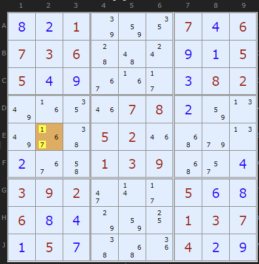
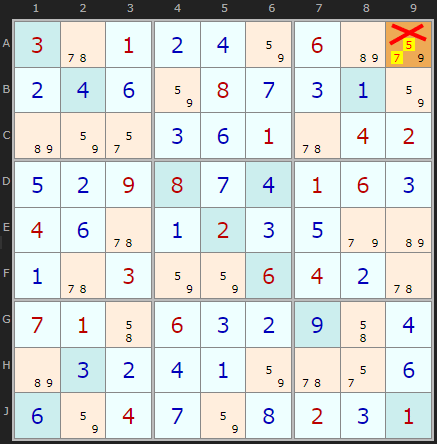

Title: BUG - SudokuWiki.org

URL Source: https://www.sudokuwiki.org/BUG

Markdown Content:
# BUG - SudokuWiki.org

SudokuWiki.org

Strategies for Popular Number Puzzles

*   [Sign up for more](https://www.sudokuwiki.org/SPHome.aspx)

*   [Main Page](https://www.sudokuwiki.org/Main_Page)
*   [What's New](https://www.sudokuwiki.org/Whats_New)
*   [Strategy Overview](https://www.sudokuwiki.org/Strategy_Families)

9x9 Solvers

*   [Sudoku Solver](https://www.sudokuwiki.org/Sudoku.htm)
*   [Jigsaw Solver](https://www.sudokuwiki.org/Jigsaw.aspx)
*   [Sudoku X Solver](https://www.sudokuwiki.org/SudokuX.aspx)
*   [Windoku Solver](https://www.sudokuwiki.org/Windoku.aspx)
*   [Colour Sudoku](https://www.sudokuwiki.org/ColourSudoku.aspx)
*   [Killer Solver](https://www.sudokuwiki.org/KillerSudoku.aspx)
*   [Killer Jigsaw Solver](https://www.sudokuwiki.org/KillerJigsaw.aspx)

6x6 Solvers

*   [6x6 Sudoku Solver](https://www.sudokuwiki.org/Sudoku6x6.aspx)
*   [6x6 Killer Solver](https://www.sudokuwiki.org/Killer6x6.aspx)
*   [6x6 KenKen Solver](https://www.sudokuwiki.org/KenKen6x6.aspx)
*   [6x6 KenDoku Solver](https://www.sudokuwiki.org/kendoku6x6.aspx)

Weekly 'Unsolvable'

*   [Unsolvable Sudoku](https://www.sudokuwiki.org/Weekly-Sudoku.aspx)
*   [Unsolvable Jigsaw](https://www.sudokuwiki.org/Weekly-Jigsaw.aspx)
*   [Unsolvable Str8ts](https://www.str8ts.com/weekly_str8ts.aspx)

Puzzles to Play

*   [The Daily Sudoku](https://www.sudokuwiki.org/Daily_Sudoku)
*   [Daily 6x6 Sudoku](https://www.sudokuwiki.org/Daily_Mini_Sudoku)New!
*   [The Jigsaw Sudoku](https://www.sudokuwiki.org/Daily_Jigsaw_Sudoku)
*   [The Daily Sudoku X](https://www.sudokuwiki.org/Daily_Sudoku_X)
*   [The Daily Killer](https://www.sudokuwiki.org/Daily_Killer_Sudoku.aspx)
*   [Daily Mini Killer](https://www.sudokuwiki.org/Daily_Mini_Killer_Sudoku.aspx)
*   [Daily Killer Jigsaw](https://www.sudokuwiki.org/Daily_Killer_Jigsaw.aspx)
*   [The Daily Kakuro](https://www.sudokuwiki.org/Daily_Kakuro)
*   [The Daily KenKen](https://www.sudokuwiki.org/Daily_KenKen.aspx)
*   [Daily Codewords](https://www.sudokuwiki.org/Daily_Codewords)
*   [1 to 25](https://www.str8ts.com/daily_1to25.aspx)
*   [The Daily Binairo](https://www.sudokuwiki.org/DailyBinairo)
*   [Letterlicious](https://www.letterlicious.com/Letterlicious_Home.aspx)
*   [Puzzle Packs](https://www.sudokuwiki.org/ACSPuzzles.aspx)

Basic Strategies

*   [Introduction](https://www.sudokuwiki.org/Introduction)
*   [Getting Started](https://www.sudokuwiki.org/Getting_Started)
*   [Naked Candidates](https://www.sudokuwiki.org/Naked_Candidates)
*   [Hidden Candidates](https://www.sudokuwiki.org/Hidden_Candidates)
*   [Intersection Removal](https://www.sudokuwiki.org/Intersection_Removal)

Tough Strategies

*   [X-Wing](https://www.sudokuwiki.org/X_Wing_Strategy)
*   [Chute Remote Pairs](https://www.sudokuwiki.org/Chute_Remote_Pairs)
*   [Simple Colouring](https://www.sudokuwiki.org/Simple_Colouring)
*   [W-Wing](https://www.sudokuwiki.org/W_Wing_Strategy)
*   [Y-Wing](https://www.sudokuwiki.org/Y_Wing_Strategy)
*   [Rectangle Elimination](https://www.sudokuwiki.org/Rectangle_Elimination)
*   [Swordfish](https://www.sudokuwiki.org/Sword_Fish_Strategy)
*   [XYZ-Wing](https://www.sudokuwiki.org/XYZ_Wing)
*   [BUG](https://www.sudokuwiki.org/BUG)
*   [Avoidable Rectangles](https://www.sudokuwiki.org/Avoidable_Rectangles)

Diabolical Strategies

*   [X-Cycles (Part 1)](https://www.sudokuwiki.org/X_Cycles)
*   [X-Cycles (Part 2)](https://www.sudokuwiki.org/X_Cycles_Part_2)
*   [3D Medusa](https://www.sudokuwiki.org/3D_Medusa)
*   [Jellyfish](https://www.sudokuwiki.org/Jelly_Fish_Strategy)
*   [Unique Rectangles](https://www.sudokuwiki.org/Unique_Rectangles)
*   [Tridagons](https://www.sudokuwiki.org/Tridagons)
*   [Fireworks](https://www.sudokuwiki.org/Fireworks)
*   [Twinned XY-Chains](https://www.sudokuwiki.org/Twinned_XY_Chains)
*   [SK Loops](https://www.sudokuwiki.org/SK_Loops)
*   [Extended Rectangles](https://www.sudokuwiki.org/Extended_Unique_Rectangles)
*   [Hidden URs](https://www.sudokuwiki.org/Hidden_Unique_Rectangles)
*   [WXYZ-Wing](https://www.sudokuwiki.org/WXYZ_Wing)
*   [XY-Chains](https://www.sudokuwiki.org/XY_Chains)
*   [Aligned Pair Exclusion](https://www.sudokuwiki.org/Aligned_Pair_Exclusion)

Extreme Strategies

*   [Grouped X-Cycles](https://www.sudokuwiki.org/Grouped_X_Cycles)
*   [Forcing Nets](https://www.sudokuwiki.org/Forcing_Nets)
*   [Exocet](https://www.sudokuwiki.org/Exocet)
*   [Finned X-Wing](https://www.sudokuwiki.org/Finned_X_Wing)
*   [Finned Swordfish](https://www.sudokuwiki.org/Finned_Swordfish)
*   [Inference Chains](https://www.sudokuwiki.org/Alternating_Inference_Chains)
*   [AIC with Groups](https://www.sudokuwiki.org/AIC_with_Groups)
*   [AIC with ALSs](https://www.sudokuwiki.org/AIC_with_ALSs)
*   [AIC with URs](https://www.sudokuwiki.org/Using_Unique_Rectangles_as_Links_in_Chains)
*   [Almost Locked Sets](https://www.sudokuwiki.org/Almost_Locked_Sets)
*   [Death Blossom](https://www.sudokuwiki.org/Death_Blossom)
*   [Sue-de-Coq](https://www.sudokuwiki.org/Sue_de_Coq)
*   [Digit Forcing Chains](https://www.sudokuwiki.org/Digit_Forcing_Chains)
*   [Nishio Forcing Chains](https://www.sudokuwiki.org/Nishio_Forcing_Chains)
*   [Cell Forcing Chains](https://www.sudokuwiki.org/Cell_Forcing_Chains)
*   [Unit Forcing Chains](https://www.sudokuwiki.org/Unit_Forcing_Chains)
*   [Double Exocet](https://www.sudokuwiki.org/Double_Exocet)
*   [Pattern Overlay](https://www.sudokuwiki.org/Pattern_Overlay)

Deprecated Strategies

*   [Remote Pairs](https://www.sudokuwiki.org/Remote_Pairs)
*   [Y-Wing Chain](https://www.sudokuwiki.org/Y_Wing_Chains)
*   [Multivalue X-Wing](https://www.sudokuwiki.org/Multivalue_X_Wing_Strategy)
*   [Multi-Colouring](https://www.sudokuwiki.org/Multi_Colouring_Strategy)
*   [Empty Rectangles](https://www.sudokuwiki.org/Empty_Rectangles)
*   [Guardians](https://www.sudokuwiki.org/Guardians)

Str8ts

*   [Home & Rules](https://www.str8ts.com/str8ts)
*   [The Daily Str8ts](https://www.str8ts.com/Daily_str8ts)
*   [Weekly Extreme Str8ts](https://www.str8ts.com/weekly_str8ts.aspx)
*   [Str8ts Solver](https://www.str8ts.com/str8ts.htm)
*   [Str8ts Sample Pack](https://www.str8ts.com/Str8ts_Sample_Pack.pdf)

Other

*   [What's New](https://www.sudokuwiki.org/Whats_New)
*   [Latest Articles](https://www.sudokuwiki.org/LatestArticles.aspx)
*   [Feedback](https://www.sudokuwiki.org/sudokufeedback.aspx)
*   [Donate](https://www.sudokuwiki.org/Donations)
*   [Syndicated Puzzles](https://www.syndicatedpuzzles.com/)

[Print Version](https://www.sudokuwiki.org/Print_BUG)

[Page Index](https://www.sudokuwiki.org/Site_Map)

232 Shares 

# BUG+1

BUG stands for **Bi-Value Universal Grave**

The principle behind BUG is the observation that any Sudoku where all remaining cells contain just two candidates is fatally flawed. There would have been a last remaining cell with three candidates. The odd number that couldn't be paired with another cell would have to be the solution for that cell in order to prevent the bi-value 'Graveyard'.

Thanks to Peter Hopkins for re-engaging me with BUG (July 2015). He has found the original discussion which goes back to November 2005. [Here is the link](http://forum.enjoysudoku.com/is-there-a-simpler-way-to-solve-this-t2277.html). From my testing of large data sets I believe that every instance of BUG can be solved by an [XY-Chain](https://www.sudokuwiki.org/XY_Chains). Hence it is positioned just before that strategy in the solver - it is an easy solution if you can recognise the pattern. Other simpler strategies may also do the same job but not as completely as XY-Chains.

BUG Example : [Load Example](https://www.sudokuwiki.org/sudoku.htm?bd=030000000109000008008007560900020057000080000520070006073800400800000901000000080)

 Here is an example written up by Peter

The BUG cell is F8. 

1.   If the solution was 4 we'd have two 4s in column 8 and row F

2.   If the solution was 6 we'd also have two 6s in column 8 and row F.

3.   Putting 3 in F8 sets up three 3s in column 8 and three in row F.

Thus, in order to kill the BUG, F8 must be 3. All alternatives allow two solutions since there are two of everything across all remaining rows and columns.

27 Clue minimal BUG : [From the Start](https://www.sudokuwiki.org/sudoku.htm?bd=001000706736000005500000082000078000000520000000139000392000500600000137050000400)

It is possible for the BUG to exist in a sea of bi-value cells, such as this one discovered by Klaus Brenner. It is also notable for having two whole boxes with only bi-value cells.

## Sudoku X BUGs - careful!

False Positive BUG : [Load Example](https://www.sudokuwiki.org/SudokuX.aspx?bd=X9B035u010b0d8206b69u0b0d0f82080g0c0a82b6822q0c0f015u04020e0b09080g0d01060c040f5u0a020c0e9eb60a5u03828206040b5u07014i060c0b0i4i0db60c0b0d0a825u2q0f0f82040g820h020c01) or : [From the Start](https://www.sudokuwiki.org/SudokuX.aspx?bd=301000600000080000000001042009800160400020000003006400710600000000000000004000201)

While testing I found this interesting false positive. 

This is a Sudoku X puzzle so there are extra constraints on the diagonals. But the remaining candidates form a BUG pattern. Or do they? A9 contains 5,7,9. How to decide which candidate is the solution?

At this point I was not checking the diagonals so I missed that 9 would leave a single 9 in the diagonal on F4. So none of the candidates 5,7 and 9 qualify for the criteria even though 5 is the solution to A9.

The puzzle can be resolved with Simple Colouring on 5.

## BUG Exemplars

 These puzzles require the Bi-Value Universal Grave strategy at some point.

 Only the first is somewhat trivial. They make good practice puzzles. 
*   [Exemplar 1 (score 3.2)](https://www.sudokuwiki.org/sudoku.htm?bd=200400501001038090030000708070002003060090005040000009004000060620300800810047000) (by David Filmer)
*   [Exemplar 2 (score 3.3)](https://www.sudokuwiki.org/sudoku.htm?bd=000009004000000015832000070100703060900080003060102009010000647490000000700800000)
*   [Exemplar 3 (score 3.6)](https://www.sudokuwiki.org/sudoku.htm?bd=560904000002003000100070080000302500090000020000106000040030009000600700000709056)
*   [Exemplar 4 (score 3.6)](https://www.sudokuwiki.org/sudoku.htm?bd=200039005107500042000000000004008200050000000006400900000000000620004108700950004)
*   [Exemplar 5 (score 3.7)](https://www.sudokuwiki.org/sudoku.htm?bd=000001007040007093700200005005020604000080000308010700400002009510600020200900000)
*   [Exemplar 6 (score 5.3)](https://www.sudokuwiki.org/sudoku.htm?bd=002090003000000010000600002007029000001000800000530600600001000030000000400080500)

Go back to [Avoidable Rectangles](https://www.sudokuwiki.org/Avoidable_Rectangles)Continue to [Gurths Theorem](https://www.sudokuwiki.org/Gurths_Theorem)

* * *

# Comments

Your Name/Handle

Email Address - required for confirmation (it will not be displayed here)

Your Comment

Please enter the

letters you see:

- [x]  Remember me

Please ensure your comment is relevant to this article.

**Email addresses are never displayed, but they are required to confirm your comments.** When you enter your name and email address, you'll be sent a link to confirm your comment. Line breaks and paragraphs are automatically converted - no need to use 
 or   tags.

Comments[Talk](https://www.sudokuwiki.org/BUG?talk#comments)

## ... by: Hexameron

Sunday 31-May-2026

I'm looking at the first example on this page (BUG+1) to understand the theory. Am I right that the explanation is misworded?

- if cell F8 were a 4, it would trigger a 3 in D8, leaving two naked SIXES (not 4's) in column 8. And, via the chain two naked 6's in row F.

Likewise, if F8 were a 6, you'd end up with two FOURS in column 8 and row F.

Thus, the solution to cell F8 must be 3 to avoid either of these dead ends.

REPLY TO THIS POST

## ... by: Charles R Cochems

Friday 22-Dec-2023

The simple way to find and remove a BUG is.

1) is the unsolved number of cells odd? if not you do not have a situation you can apply this to.

2) is there exactly ONE cell left with three? If not, you need to make more eliminations.

3) are all the other numbers penciled in in no more than 2 cells in each row, column or box? If no, you need to eliminate more until you are within the limits.

4) this all being true, one of the numbers in that cell will be in one row, column, and box three times instead of two. This is the number that has to be placed there to kill the BUG, and it will create at least four naked singles. two in the row, and two in the column. I believe it is always four, because the only way I see for there to be three in a box, row, and column is if the box and row or column share a set of 3 of the number.

Add to this Thread

## ... by: domP

Monday 31-Jul-2023

It seems that when we get BUG, the sudoku can only have one or three solutions. Never two solutions and never more than 3.

Can you confirm ? If not, maybe you have a counter-example ?

So we need to check the number of solutions before using 'BUG'. 

As I don't know uniqueness of solution, I never use 'BUG'. It's the same as all the unique rectangle methods. 

Is it a correct method to check a new puzzle ?

It seems also that, if we put this BUG test, after XYchains, it will never be usefull. Right ?

Thanks a lot for all explainations.

DomP 

REPLY TO THIS POST

## ... by: NeutrinoAnt

Wednesday 22-Mar-2023

Intreresting 'decisive technique' for hard sudoku. Be careful to check if there's another candidates to be removed by naked pair/triple, otherwise it may not be a BUG.

REPLY TO THIS POST

## ... by: Kasper D

Sunday 12-Jun-2022

I don't think this is a good explanation for a bug. When I tried to use it in a puzzle I got the wrong result. I obviously didn't understand the bug method but I still don't, so I think a better explanation is required. Further, when the puzzle is loaded in the solver it doesn't actually find a bug. Yes, 2 is the right answer for D8, but why? Maybe not caused by a bug? 

REPLY TO THIS POST

## ... by: Jonathan Handojo

Wednesday 4-Aug-2021

Alright, this strategy is now proven flawed. I've come across a puzzle where all cells are bi-value cells and can still consist of a unique solution. It's a puzzle that I purchased from the Extreme Pack, so I'm not permitted to sharing it here. Andrew Stuart, I've sent you an email with the puzzle and the step at which I took to make all cells bi-value. I actually played this far myself and wanted to check whether I'm doing the right eliminations. When I thought I saw an XY-Chain that made everything bi-value cells after that, I thought I made a mistake somewhere. So, I used the solver and it happened to also deduced to the same elimination.

Anonymous replies:Sunday 6-Feb-2022
Jonathan, the BUG pattern requires not only bivalue cells, but also every row, column and box having at most two instances of each candidate.

Add to this Thread

## ... by: Jan

Monday 17-Feb-2020

This technique isn't right because in yellow cell (1.2.3) on first pattern it is missing number 4 candidate.

Andrew Stuart writes:

That is removed by a previous strategy. Two steps are required to clear off enough candidates to use BUG

Add to this Thread

## ... by: David Filmer

Monday 21-Jan-2019

I have found a very simple example of a BUG which has only 13 unsolved cells of which 12 have 2 candidates and one has 3 as follows:-

2..4..5.1..1.38.9..3....7.8.7...2..3.6..9...5.4......9..4....6.62.3..8..81..47...

I entered it into the Brent Knoll News February 2019 edition and called it Valentine, as the clues are in the shape of a heart with a Cupid's Arrow piercing it!

All the other illustrations of a BUG (above) had many more. Can anyone else find a BUG with less than 13 unsolved cells?

REPLY TO THIS POST

## ... by: Pieter, Newtown, Australia

Monday 4-Jan-2016

Happy New Year Andrew!

AS a person reading about BUG for the first time may I make these suggestions to make this brief explanation clearer:

1. As noted by strmckr on 26/10/15, BUG "requires knowledge of unique rectangles and deadly patterns to apply its technique correctly". Since BUG is applied before URs in the solver, I think a reference should be made (in the first paragraph) to UR's strategy explanation for the novice to get an explanation of "deadly patterns". 

2. "Removing candidate 1 from the cell ... " OR candidate 3

3. Adding a numbered point 5. something like "Hence the whole of the unsolved part of the puzzle becomes a deadly bi-value pattern". Not obvious to a BUG novice. ;-)

All the best for the new year!

Ciao

Pieter

REPLY TO THIS POST

## ... by: strmckr

Monday 26-Oct-2015

your placing bug strategies way to high in the hierarchy: most bugs are solvable from a 

finned/sashimi x-wing { fish pattern's } 

out side of that it requires knowledge of unique rectangles and deadly patterns to apply its technique correctly. 

Bug

http://forum.enjoysudoku.com/the-bug-bivalue-universal-grave-principle-t2352.html#p14899

bug lite 

http://forum.enjoysudoku.com/between-uniqueness-and-bug-bug-lite-t3056.html

for reference to the other type of uniqueness based solving techniques also not covered on this site

 http://forum.enjoysudoku.com/collection-of-solving-techniques-t3315.html

look up: 

reverse bug,

reverse bug lite

mug

here is another one that is surprising powerful but often missed, 

the unique rectangle 1.1

http://forum.enjoysudoku.com/how-do-ars-arise-t31045.html#p226670

{there is early posts this one sums it up the best} 

U.R 1.1 

 Definition: an a/b/b/a pattern in a solution grid is anything isomorphic to that shown below:

 Code: Select all

 . . . | .

 a . . | b

 b . . | a

 ---------+---

 . . . | .

 Fact: if a solution grid (not necessarily unique) contains an a/b/b/a pattern on four unclued cells, C, then C=b/a/a/b is also a solution.

 Theorem: if a puzzle-in-progress (that does not necessarily have a unique solution) has pencilmarks as shown below on four unclued cells then the bottom right value resolves to '3':

 Code: Select all

 . . . | .

 1 . . | 2

 2 . . | 13

 ---------+---

 . . . | .

 Proof: suppose to the contrary the bottom right value resolves to '1'. Then (vacuously) the solution grid contains the 1/2/2/1 pattern on four unclued cells, C. So, by the Fact above, C=2/1/1/2 is also a solution. But wait! - the pencilmarks do not allow that other solution - contradiction.

 denis_berthier wrote:

 Thanks, RedEd, for this very smart proof.

 Before it, UR1.1 was only a conjecture, a matter of belief or disbelief. It is now a valid theorem (we'll see later under what implicit conditions). It shows that a short and clean proof can do what pages of repeated but unsustained claims can't.

REPLY TO THIS POST

## ... by: mike

Wednesday 14-Oct-2015

can the bug method also be used to solve str8ts puzzles thank you

Andrew Stuart writes:

Interesting question, I'd have to test it to be sure. There exists in Str8ts the idea of deadly rectangles - double solutions based on rectangles, but if this spans two compartments then the deadly pattern might not occur. A positive example would be nice, lots of negative ones don’t really prove it

Add to this Thread

## ... by: Strmckr

Sunday 2-Aug-2015

Technically most bugs contain a finned or sashimi X- wing (skyscraper) on a single digit. 

Which are easier to spot then xy wings and even this. 

Not to mention bugs and bug lite patterns only function based on uniqueness assumed. 

REPLY TO THIS POST

## ... by: Brett Yarberry

Wednesday 11-Mar-2015

I have found a good example of a solution easily solved by the BUG. 

  4-6-7 | 18-9-3 | 18-2-5 

  9- 2-8 | 17-5-4 | 3-6-17

  1- 3-5 | 2-6-78 | 4-78-9

 -------------------------------

  3- 1-4 | 78-78-5 | 2-9-6

  2- 5-6 | 3-4-9 | 17-17-8

 78-78-9 | 6-1-2 | 5-4-3

 -------------------------------

 78- 9-3 | 4-78-1 | 6-5-2

  6- 4-2 | 5-3-78 | 9-178-17

  5-78-1 | 9-2-6 | 78-3-4

The initial position of the board (loaded in solver) is: [LOAD HERE](https://www.sudokuwiki.org/sudoku.htm?bd=000093000008004060105200400314000000200000008000000543003001602040500900000920000)

Andrew Stuart writes:

Requires that Simple Colouring, Y-Chains and X-Cycles are turned off to find this example - just because of the ordering of the strategies in the solver.

Add to this Thread

## ... by: Arthur Lurvey

Thursday 15-Mar-2012

When you write up this technique, consider using [the following example](https://www.sudokuwiki.org/sudoku.htm?bd=196327854547800213283514769914003605052400900608950400469138572801045396005600148)

I got it from http://homepages.cwi.nl/~aeb/games/sudoku/solving18.html. It can be solved using other methods, but they are of the diabolical class. So this makes for a good application of this technique.

Art

REPLY TO THIS POST

## ... by: Peru Boro

Tuesday 17-May-2011

Does Bug+1 system always work? Usually it does work but twice it failed me so I want to be sure.Thank you.

Andrew Stuart writes:

Don't know BUG+1, do share a link to someone's explanation if you can.

Add to this Thread

## ... by: Sean Forbes

Wednesday 24-Mar-2010

Andrew, While I agree that a more astute player will more than likely identify and utilize some other solving technique before resorting to this one, I find this method very handy in real-time online competitions, especially if I've overlooked one of the more effective solving techniques up to the point when I can recognize the BUG pattern.

Thanks. Sean

REPLY TO THIS POST

## ... by: Harmen Dijkstra

Friday 19-Mar-2010

i have a sudoku with this strategy:

+--------------+--------------+--------------+

|    4   2   1 |    5   8   6 |    9   3   7 |

|    5   9  38 |    1  34   7 |    2  48   6 |

|    6   7  38 |    2  34   9 |   14 148   5 |

+--------------+--------------+--------------+

|    7   1   9 |    8   2   3 |    5   6   4 |

|    2   5   6 |    4   7   1 |    8   9   3 |

|    8   3   4 |    9   6   5 |   17  17   2 |

+--------------+--------------+--------------+

|    1   6   5 |    3   9   2 |   47  47   8 |

|    3   4   2 |    7   1   8 |    6   5   9 |

|    9   8   7 |    6   5   4 |    3   2   1 |

+--------------+--------------+--------------+

with this strategy, we will get this solution:

+--------------+--------------+--------------+

|    4   2   1 |    5   8   6 |    9   3   7 |

|    5   9   3 |    1   4   7 |    2   8   6 |

|    6   7   8 |    2   3   9 |    1   4   5 |

+--------------+--------------+--------------+

|    7   1   9 |    8   2   3 |    5   6   4 |

|    2   5   6 |    4   7   1 |    8   9   3 |

|    8   3   4 |    9   6   5 |    7   1   2 |

+--------------+--------------+--------------+

|    1   6   5 |    3   9   2 |    4   7   8 |

|    3   4   2 |    7   1   8 |    6   5   9 |

|    9   8   7 |    6   5   4 |    3   2   1 |

+--------------+--------------+--------------+

However, there are other solutions, for example:

+--------------+--------------+--------------+

|    4   2   1 |    5   8   6 |    9   3   7 |

|    5   9   8 |    1   3   7 |    2   4   6 |

|    6   7   3 |    2   4   9 |    1   8   5 |

+--------------+--------------+--------------+

|    7   1   9 |    8   2   3 |    5   6   4 |

|    2   5   6 |    4   7   1 |    8   9   3 |

|    8   3   4 |    9   6   5 |    7   1   2 |

+--------------+--------------+--------------+

|    1   6   5 |    3   9   2 |    4   7   8 |

|    3   4   2 |    7   1   8 |    6   5   9 |

|    9   8   7 |    6   5   4 |    3   2   1 |

+--------------+--------------+--------------+

Andrew Stuart writes:

Yes, [this puzzle](https://www.sudokuwiki.org/sudoku.htm?bd=421586937590107206670209005719823564256471893834965002165392008342718659987654321) has three solutions so it is most likely faulty or has been entered incorrectly

Add to this Thread

 Article created on 11-April-2008. Views: 287446

 This page was last modified on 9-March-2026.

 All text is copyright and for personal use only but may be reproduced with the permission of the author.

 Copyright [Andrew Stuart](https://www.sudokuwiki.org/) @ [Syndicated Puzzles](https://www.syndicatedpuzzles.com/), [Privacy](https://www.sudokuwiki.org/privacy), 2007-2026 

