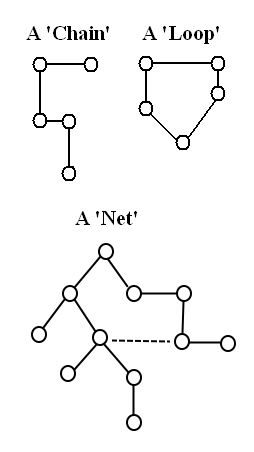
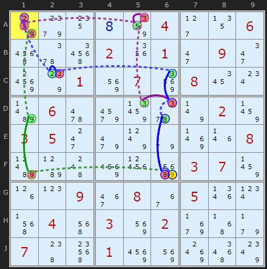
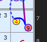
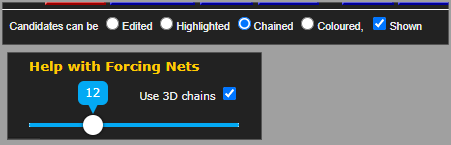
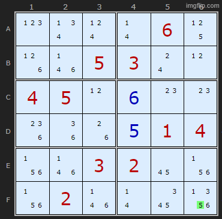
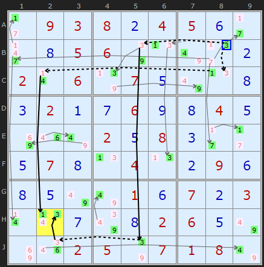
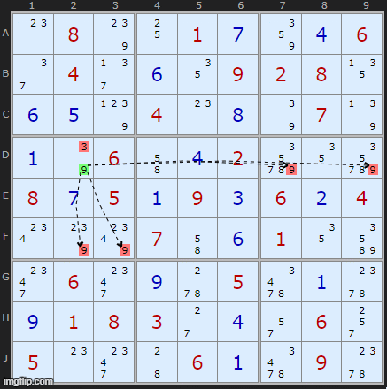
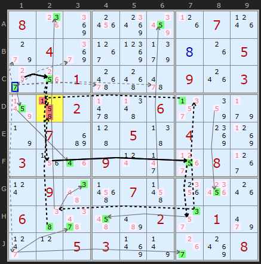

Title: Forcing Nets - SudokuWiki.org

URL Source: https://www.sudokuwiki.org/Forcing_Nets

Markdown Content:

20-March-2026. Forcing Nets released!

Forcing Nets extend **Forcing Chain** patterns like [Digit Forcing Chains](https://www.sudokuwiki.org/Digit_Forcing_Chains). Forcing Chains are linear or made up of several linear chains. A 'net' suggests two dimensions rather than one. We start with an ON or OFF and follow the consequences. All candidates that can see the target candidate are flipped. An ON will effect all it can see. An OFF will propagate only if one other candidate is present in the row, column, box or cell (essence of a Stong Link). In a 'net' two chain parts may converge on a cell and turn off two candidates leaving a third that must be ON. This third kicks off another chain fragment. If you go deep enough many if not most candidates will be assigned one state or another.

A successful Forcing Net finds one of these contradictions:

1.   All candidates in a cell turned OFF
2.   Two candidates in a cell turned ON
3.   All candidates in a unit turned OFF
4.   Two candidates in a unit turned ON

There is one more condition - not a contradiction - but a perfect cover of the board:

1.   All candidates are linked and one ON remains in each cell. This is [Bowman's Bingo](https://www.sudokuwiki.org/Bowmans_bingo) and has it's own page and it is placed in the solver order as a 'last resort'.

Given the contradiction cell(s) it is possible to back-track up the tree to the root node and claim it is ON (can be placed) or OFF (can be removed). The solver searches with an initial OFF and if none are found it tries ON . An ON candidate is attractive as the placement is more bottleneck breaking but there are many fewer. If I do both the search time gets too long.

## Speed vs Utility

Unsolvable #689 showing a 3-chain FN : [Load Example](https://www.sudokuwiki.org/sudoku.htm?bd=S9B849k140h86042d13065m5y5q021y012i092m987s018y0792081a0wbf0662a28f5y7v028b03052k9m7x9e8r1n08bhb94c9625ci03078b1h0p093e0836051r0x5f045e038y02ab4z9f07485k01968y8s5a80) or : [From the Start](https://www.sudokuwiki.org/sudoku.htm?bd=000004006000201090001070800060000020350000008000000370009080500040302000700100000)

The algorithm is pretty fast if it is allowed to return the first Forcing Net it finds but I think the solver should work a little harder than that. Instead I let it finish checking all candidates and return the Forcing Net with the shortest combined Chain length which is also related to the search depth. If I find an elimination at depth 6 I don't look deeper.

It will be a program of work for the future to expand Forcing Nets by using exotic links such as ALSs, Unique Rectangles and other building blocks which are a feature of Forcing Chains.

There are three levels of Forcing Net complexity

1.   Chains which are completely linear, no grouped cells. These ought to mirror 3D Medusa so not sure why 3D Medusa doesn’t get there first. These are solely bi-value and bi-location links. The example above is of this type.
2.   Chains with Grouped Cells. It detects that two or three OFF candidates are present and can make an ON candidate if it is the last remaining. The Off cells are accumulated by previous links in one or both of the chains. The result can be expressed as chains which I can display.
3.   Chains with Grouped Cells + sub chains. Some Forcing Nets pick up links based on certain candidates being OFF but are OFF because of other branches off the main chains. I don’t know how to include these sub branches in the output so I am putting a note to the user to say the chains may reply on sub-chains not spelt out explicitly. It is possible to view them using the manual Forcing Nets I built earlier.

So while 1) and 2) can be well illustrated 3) leaves something to be desired.

Forcing Nets is available in all Sudoku, Jigsaw, Sudoku X and all Windoku solvers.

## Interpreting the net start

The root candidate can be a bit confusing at times. To kick things off in this forcing net G9 is OFF. But the results have two display conflicts:

*   The 9 is correct for being OFF and the start of the chain. But also because of the contradiction it wants to be ON as that is result of the contradiction. Can’t do both
*   The four wants to be ON because -9[G9] and is drawn green. But as a result of the contradiction +9 is ON and that eliminates 4 in G9. So it draws yellow+red text

I might try and get around this by adding a ring or larger circle that can indicate these states.

## Testing and Implications

I have a bit of a dilemma because it is so powerful I’m not sure where to put it in the order. I imagined it should go just before Bowmans but it finds many simpler and useful solutions I am wondering if some of my other chaining strategies are complete.

I ran some tests where I put it at the start of the extremes, just before Exocet

1.   Solved 70% of the [weekly unsolvables](https://www.sudokuwiki.org/Weekly-Sudoku.aspx). That’s 221/228 of my puzzles. David Filmer’s: 129/333 (39%)
2.   It solves 100% of Ruud’s top 50,000. I was missing only about 60 so not too surprising. 
3.   It solves 95% of a 119,000 unsolvables by Roger Kroger. A list he sent me about 5 years ago. I’ve been using some for the weekly when I run out.
4.   It solves ~~9%~~**now 34%** of the puzzles5_forum_hardest_1905_11 set which doesn’t sound much but is a big upgrade. This is the current frontier test set. This set has a lot of Exocets in addition.
5.   If you manually enter the eliminations for steps 5, 6 and 8 the [Easter Monster](https://sudoku.allanbarker.com/sweb/extra/easter/a_em.htm) solves.

Forcing Nets are currently just after Grouped Cells. 99% of all strategy instances after Forcing Nets seem to be replaced by Forcing Nets. The exception is set 4) above with Exocets also dominating. I could drop almost everything in the strategy 'extremes' but they solve puzzles differently and maybe with more clarity than every Forcing Net. So they will be retained.

If I use a greedy approach and get it to return the first instance it is extremely fast. It solved Ruuds 50k it in 4% of the time, like 10 mins as opposed to 4 hours. However I prefer if it searches for the shortest combined length of all chains. This does not lead to an optimal or quick solution but I think the user would expect/prefer these to much longer chains.

While testing Forcing Nets it duplicated a simple [Pointing Pair](https://www.sudokuwiki.org/Intersection_Removal) which I was missing from [Windoku](https://www.sudokuwiki.org/Windoku.aspx) – a window pointing at a window, which I've now added to Pointing Pairs. I hope I can find other instances.

I tried to make a single unsolvable on my main PC but after 24 hours it found not one. I have flagged all the weekly unsolvables that are broken. Not checked Jigsaw unsolvables yet.

## Second round of testing - choice of search order

The time to compute Forcing Nets and the number of Forcing Nets outputted can be improved. Up to 27th of March the solver only looked for Forcing Nets beginning with a candidate being turned ON. However I've noticed many solve paths have long series of nets compared to using Forcing Chains making them seem less efficient.

I tested the first 50 unsolvables which produced 1,044 Forcing Nets in the released solver. Interesting results. Degrees of freedom are:

1.   It can choose to start with a candidate ON or OFF or check both
2.   It can return the first one or the shortest
3.   It can look for cells with fewest candidates first

The short of it is that allowing the solver to return the FIRST forcing net is not only much faster but the solve path is much shorter – but the forcing nets are big and ugly (compared to shortest ones). That’s not going to impress users of the solver.

FNs Compared Reduction
(Previously) Shortest ON 1044 100%0%
Shortest ON Only but bi-value cells first 983 94%6%
Shortest of either 1007 96%4%
(How it is now) Shortest OFF cand, if OFF Ignore ON 389 37%63%
First ON 376 36%64%
First ON rotated 180 degress 410 39%61%
First ON rotated 90 degress 417 40%60%
First OFF, if none then First ON 281 27%73%

In this table ON means the state of the candidate chosen to kick off a Forcing Net. If a contradiction is found then we remove it. Likewise if an OFF is contradictory it must be the solution.

Choosing emptier cells in order makes a 6% improvement but that is not good enough. I think is searches the same space just in a different order, no 6% is not surprising.

I wanted to check if there was a top-left to bottom right bias in the puzzle if you allow it to only return the first one. I rotated all 50 by 90 degrees and then 180 degrees. Approximately a third reduction in number of nets required.

So my compromise sweet spot is “return the Shortest ON and only check OFF if none found”. These are still big forcing nets and sometimes they loop back to the origin cell. They are also rarely as previous tests found. But the advantage of validating an ON is that it busts open that cell with a solution rather than chipping away at a mass of candidates. I might add some options so the user can choose but I have to consider complicated the solver interface.

## Why Now?

**Forcing Nets** has been in my job queue for the longest. The reason for my hesitation is, while the concept is not too difficult, creating an efficient implementation has been daunting as the potential search space is enormous. Any extra strategies need to take a reasonable amount of time to compute as the CPU resources are finite.

The second reason I've been hesitant to introduce them is they are border-line "trial and error" and my solver is devoted to "pattern-based" strategies. I don't believe in back tracking as a final resort. It is more interesting to leave those puzzles as an open question. However it is possible to reduce a Forcing Net to the essential chain fragments and express them as Alternating Inference Chains.

The third reason I've been hesitant is that it is far from a human pen and paper method and I was always hoping something better would come along first.

Forcing Nets have busted open almost all of my existing 'unsolvables' so making future ones much harder, but that's progress.

## Manually looking for Forcing Nets

Take Step may find a Forcing Chain if the puzzle is hard but at any stage you can manually test and view Forcing Nets as have an implication simulator you can play with. Choose "Chains" above the main solver board. There is a slider allowing you to set the depth of the search. This will dynamically re-size the displayed Forcing Net.

Lets take a very trivial example to start with.

We know just from glancing at the board that 5 must go in A6 as it is the last space for a 5. But we're going to ignore that and click on 5 in F6 to turn it ON.

The slider level is depth 1 - the default. Immediately it turns off all the 5s it can see.

Moving the slider to depth 2 sets a bunch of candidates green as they are bi-value cells and must be the solutions if the other candidate is turned off.

Moving the slider to depth 3 turns OFF even more candidates because of the new green ones turned on.

And so on. The yellow cell indicates a contradiction telling us our original choice was wrong and we can eliminate that candidate. At the end it find that all 2s are removed from column 6, a compounded error.

: [Load Example](https://www.sudokuwiki.org/sudoku.htm?bd=S9B2b0903080b04050f2b2j0h05067q0n7u2f0b020r067r070e7u0n0h0c020a0g060i0h040e8i1m7u020e080c2b2b0e070h0n040n0b090f0h0e7u7u010f070b030r0v0g7y0h02060e7u8i1q02057q0701087u) or : [From the Start](https://www.sudokuwiki.org/sudoku.htm?bd=093804500005600000206070000020060040000208000070040090000010703000002600002507180)
Here is a more complicated but real example. I targeted B7 and got: "Forced Net: Two candidates in H2 are ON so B7 must be 9"

The candidate I clicked on was the 9 in B7 but I clicked twice to get the negative assertion -9[B7]. Unlike the positve +9[B7] this led to result by slider depth 6.

'But Andrew, this looks suspiciously like the first example in [3D Medusa](https://www.sudokuwiki.org/3D_Medusa). What trick is this. Aren't you treading on old ground here?'

Well spotted and yes and no. Firstly I wanted an example that wasn't just a 'all candidates emptied a cell'. But also I wanted an intermediate example and yes 3D Medusa is a partial subset of Forcing Nets and we trace them in a similar way. But 3D Medusa is restricted to bi-value and bi-location links and we are going to go well beyond that. Interesting not every candidate in the example will find a contradiction and when it does it might be in a different part of the pattern. We are allowed to try out different 3D Medusa patterns in the same space with this feature. Try clicking on 1 in C2.

Forced Net: Two candidates in H2 are ON so B7 must be 9

-9[B7]+9[C7]-4[C7]+4[C2]-1[C2]+1[H2]

-9[B7]+9[B5]-9[J5]+3[J5]-3[J2]+3[H2]

Some of the other rules of 3D Medusa do not pop out in the current version of Forcing Nets and I need to research further the exact overlap.

## Grouped Cells

Grouped cells also play a part in Forcing Nets just as they do in Forcing Chains. This illustration on a net fragment shows how the initial placement of 9 in D2 removes the 9s from the rest of box 4. The simulator detects there is only one 9 left in the row and adds it to the net to allow the net to continue growing. This example is in a relatively simple puzzle that doesn't need a Forcing Net but I teased it out as a clear example. Unlike the AICs draw on the board I don't add a box and just draw arrow from one of grouped cells to the next part of the link.

Unless the board has a very high density of candidates in most cases most nets will expand without using Grouped Cells. But I need to explain it here in case it looks like parts of a network appear disconnected.

Can I use Forcing Nets to break open a weekly unsolvable? I clicked around on [Unsolvable #592](https://www.sudokuwiki.org/sudoku.htm?bd=800000070040000005001000903002006000070050400300900080090070000600002010005300008) and yes I found a bottleneck. Asserting 7 on C1 caused D2 to empty. So did 2 on the same cell so 5 was the solution. After still too many Bowmans and Pattern Overlays it solved :)

Feedback and comments appreciated.

Andrew Stuart

* * *
