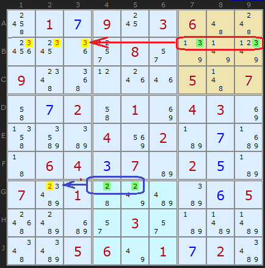
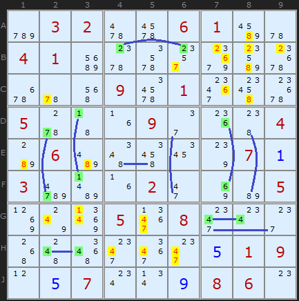
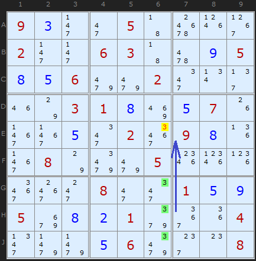
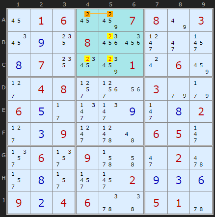
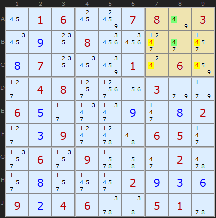
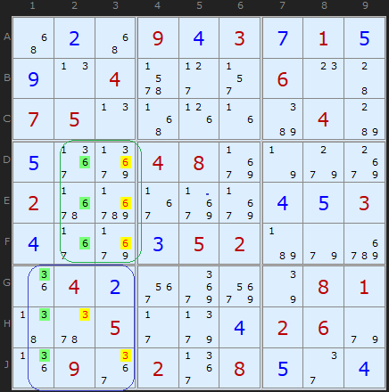

Title: Intersection Removal - SudokuWiki.org

URL Source: https://www.sudokuwiki.org/Intersection_Removal

Markdown Content:
# Intersection Removal - SudokuWiki.org

SudokuWiki.org

Strategies for Popular Number Puzzles

*   [Sign up for more](https://www.sudokuwiki.org/SPHome.aspx)

*   [Main Page](https://www.sudokuwiki.org/Main_Page)
*   [What's New](https://www.sudokuwiki.org/Whats_New)
*   [Strategy Overview](https://www.sudokuwiki.org/Strategy_Families)

9x9 Solvers

*   [Sudoku Solver](https://www.sudokuwiki.org/Sudoku.htm)
*   [Jigsaw Solver](https://www.sudokuwiki.org/Jigsaw.aspx)
*   [Sudoku X Solver](https://www.sudokuwiki.org/SudokuX.aspx)
*   [Windoku Solver](https://www.sudokuwiki.org/Windoku.aspx)
*   [Colour Sudoku](https://www.sudokuwiki.org/ColourSudoku.aspx)
*   [Killer Solver](https://www.sudokuwiki.org/KillerSudoku.aspx)
*   [Killer Jigsaw Solver](https://www.sudokuwiki.org/KillerJigsaw.aspx)

6x6 Solvers

*   [6x6 Sudoku Solver](https://www.sudokuwiki.org/Sudoku6x6.aspx)
*   [6x6 Killer Solver](https://www.sudokuwiki.org/Killer6x6.aspx)
*   [6x6 KenKen Solver](https://www.sudokuwiki.org/KenKen6x6.aspx)
*   [6x6 KenDoku Solver](https://www.sudokuwiki.org/kendoku6x6.aspx)

Weekly 'Unsolvable'

*   [Unsolvable Sudoku](https://www.sudokuwiki.org/Weekly-Sudoku.aspx)
*   [Unsolvable Jigsaw](https://www.sudokuwiki.org/Weekly-Jigsaw.aspx)
*   [Unsolvable Str8ts](https://www.str8ts.com/weekly_str8ts.aspx)

Puzzles to Play

*   [The Daily Sudoku](https://www.sudokuwiki.org/Daily_Sudoku)
*   [Daily 6x6 Sudoku](https://www.sudokuwiki.org/Daily_Mini_Sudoku)New!
*   [The Jigsaw Sudoku](https://www.sudokuwiki.org/Daily_Jigsaw_Sudoku)
*   [The Daily Sudoku X](https://www.sudokuwiki.org/Daily_Sudoku_X)
*   [The Daily Killer](https://www.sudokuwiki.org/Daily_Killer_Sudoku.aspx)
*   [Daily Mini Killer](https://www.sudokuwiki.org/Daily_Mini_Killer_Sudoku.aspx)
*   [Daily Killer Jigsaw](https://www.sudokuwiki.org/Daily_Killer_Jigsaw.aspx)
*   [The Daily Kakuro](https://www.sudokuwiki.org/Daily_Kakuro)
*   [The Daily KenKen](https://www.sudokuwiki.org/Daily_KenKen.aspx)
*   [Daily Codewords](https://www.sudokuwiki.org/Daily_Codewords)
*   [1 to 25](https://www.str8ts.com/daily_1to25.aspx)
*   [The Daily Binairo](https://www.sudokuwiki.org/DailyBinairo)
*   [Letterlicious](https://www.letterlicious.com/Letterlicious_Home.aspx)
*   [Puzzle Packs](https://www.sudokuwiki.org/ACSPuzzles.aspx)

Basic Strategies

*   [Introduction](https://www.sudokuwiki.org/Introduction)
*   [Getting Started](https://www.sudokuwiki.org/Getting_Started)
*   [Naked Candidates](https://www.sudokuwiki.org/Naked_Candidates)
*   [Hidden Candidates](https://www.sudokuwiki.org/Hidden_Candidates)
*   [Intersection Removal](https://www.sudokuwiki.org/Intersection_Removal)

Tough Strategies

*   [X-Wing](https://www.sudokuwiki.org/X_Wing_Strategy)
*   [Chute Remote Pairs](https://www.sudokuwiki.org/Chute_Remote_Pairs)
*   [Simple Colouring](https://www.sudokuwiki.org/Simple_Colouring)
*   [W-Wing](https://www.sudokuwiki.org/W_Wing_Strategy)
*   [Y-Wing](https://www.sudokuwiki.org/Y_Wing_Strategy)
*   [Rectangle Elimination](https://www.sudokuwiki.org/Rectangle_Elimination)
*   [Swordfish](https://www.sudokuwiki.org/Sword_Fish_Strategy)
*   [XYZ-Wing](https://www.sudokuwiki.org/XYZ_Wing)
*   [BUG](https://www.sudokuwiki.org/BUG)
*   [Avoidable Rectangles](https://www.sudokuwiki.org/Avoidable_Rectangles)

Diabolical Strategies

*   [X-Cycles (Part 1)](https://www.sudokuwiki.org/X_Cycles)
*   [X-Cycles (Part 2)](https://www.sudokuwiki.org/X_Cycles_Part_2)
*   [3D Medusa](https://www.sudokuwiki.org/3D_Medusa)
*   [Jellyfish](https://www.sudokuwiki.org/Jelly_Fish_Strategy)
*   [Unique Rectangles](https://www.sudokuwiki.org/Unique_Rectangles)
*   [Tridagons](https://www.sudokuwiki.org/Tridagons)
*   [Fireworks](https://www.sudokuwiki.org/Fireworks)
*   [Twinned XY-Chains](https://www.sudokuwiki.org/Twinned_XY_Chains)
*   [SK Loops](https://www.sudokuwiki.org/SK_Loops)
*   [Extended Rectangles](https://www.sudokuwiki.org/Extended_Unique_Rectangles)
*   [Hidden URs](https://www.sudokuwiki.org/Hidden_Unique_Rectangles)
*   [WXYZ-Wing](https://www.sudokuwiki.org/WXYZ_Wing)
*   [XY-Chains](https://www.sudokuwiki.org/XY_Chains)
*   [Aligned Pair Exclusion](https://www.sudokuwiki.org/Aligned_Pair_Exclusion)

Extreme Strategies

*   [Grouped X-Cycles](https://www.sudokuwiki.org/Grouped_X_Cycles)
*   [Forcing Nets](https://www.sudokuwiki.org/Forcing_Nets)
*   [Exocet](https://www.sudokuwiki.org/Exocet)
*   [Finned X-Wing](https://www.sudokuwiki.org/Finned_X_Wing)
*   [Finned Swordfish](https://www.sudokuwiki.org/Finned_Swordfish)
*   [Inference Chains](https://www.sudokuwiki.org/Alternating_Inference_Chains)
*   [AIC with Groups](https://www.sudokuwiki.org/AIC_with_Groups)
*   [AIC with ALSs](https://www.sudokuwiki.org/AIC_with_ALSs)
*   [AIC with URs](https://www.sudokuwiki.org/Using_Unique_Rectangles_as_Links_in_Chains)
*   [Almost Locked Sets](https://www.sudokuwiki.org/Almost_Locked_Sets)
*   [Death Blossom](https://www.sudokuwiki.org/Death_Blossom)
*   [Sue-de-Coq](https://www.sudokuwiki.org/Sue_de_Coq)
*   [Digit Forcing Chains](https://www.sudokuwiki.org/Digit_Forcing_Chains)
*   [Nishio Forcing Chains](https://www.sudokuwiki.org/Nishio_Forcing_Chains)
*   [Cell Forcing Chains](https://www.sudokuwiki.org/Cell_Forcing_Chains)
*   [Unit Forcing Chains](https://www.sudokuwiki.org/Unit_Forcing_Chains)
*   [Double Exocet](https://www.sudokuwiki.org/Double_Exocet)
*   [Pattern Overlay](https://www.sudokuwiki.org/Pattern_Overlay)

Deprecated Strategies

*   [Remote Pairs](https://www.sudokuwiki.org/Remote_Pairs)
*   [Y-Wing Chain](https://www.sudokuwiki.org/Y_Wing_Chains)
*   [Multivalue X-Wing](https://www.sudokuwiki.org/Multivalue_X_Wing_Strategy)
*   [Multi-Colouring](https://www.sudokuwiki.org/Multi_Colouring_Strategy)
*   [Empty Rectangles](https://www.sudokuwiki.org/Empty_Rectangles)
*   [Guardians](https://www.sudokuwiki.org/Guardians)

Str8ts

*   [Home & Rules](https://www.str8ts.com/str8ts)
*   [The Daily Str8ts](https://www.str8ts.com/Daily_str8ts)
*   [Weekly Extreme Str8ts](https://www.str8ts.com/weekly_str8ts.aspx)
*   [Str8ts Solver](https://www.str8ts.com/str8ts.htm)
*   [Str8ts Sample Pack](https://www.str8ts.com/Str8ts_Sample_Pack.pdf)

Other

*   [What's New](https://www.sudokuwiki.org/Whats_New)
*   [Latest Articles](https://www.sudokuwiki.org/LatestArticles.aspx)
*   [Feedback](https://www.sudokuwiki.org/sudokufeedback.aspx)
*   [Donate](https://www.sudokuwiki.org/Donations)
*   [Syndicated Puzzles](https://www.syndicatedpuzzles.com/)

[Print Version](https://www.sudokuwiki.org/Print_Intersection_Removal)

[Page Index](https://www.sudokuwiki.org/Site_Map)

 Shares 

# Intersection Removal

If any one number occurs twice or three times in just one unit (any row, column or box) then we can remove that number from the intersection of another unit. There are three types of intersection: 
1.   A Pair or Triple in a box - if they are aligned on a row, n can be removed from the rest of the row.
2.   A Pair or Triple in a box - if they are aligned on a column, n can be removed from the rest of the column.
3.   A Pair or Triple in a box - if they are all in the same box, n can be removed from the rest of the box.

## Pointing Pairs, Pointing Triples

Pointing Pairs : [Load Example](https://www.sudokuwiki.org/sudoku.htm?bd=S9B4s010g091803064a4c281c1i2t082q7r7v81094g520l1o1m054b074i0g024i018i04038i4nbqba048y02b70gc34306040c07b6020eb707bk01447wbeba0f0558bgc22q032qb7bfbf4ebi05067u010g02bi) or : [From the Start](https://www.sudokuwiki.org/sudoku.htm?bd=010903600000080000900000507002010430000402000064070200701000005000030000005601020)

 Looking at each box in turn there may be two or three occurrences of a particular number. If these numbers are aligned on a single row or column (as a pair or a triple) then we know that number MUST occur on that line. Therefore, if the number occurs anywhere else on the row or column outside the box WHICH THEY ARE ALIGNED ON then it can be removed. The pair or triple _points_ along the line at any numbers which can be removed.

Here are two Pointing Pairs at the same time on this tough rated puzzle. The 3s in B7 and B9 are alone in box 3 and they are aligned on the row. So looking along the row we can remove all the 3s in Box 1. In a similar manner the 2s in G4 and G5 point along the row to G2.

Pointing Pairs Example 2 : [Load Example](https://www.sudokuwiki.org/sudoku.htm?bd=032006100410000000000901000500090004060000070300020005000508000000000019007000860)

Now this is a rather special puzzle and a little extreme, but if we look at the whole board you can see I have highlighted a whole cluster of Pointing Pairs. It is obviously not necessary to spot everyone to progress the board but there are so many good examples it is worth looking at. The eliminations are highlighted in yellow. You should be able to see which eliminations belong to which Pointing Pair. A couple are consequences of a previous elimination.

Pointing Triple : [Load Example](https://www.sudokuwiki.org/sudoku.htm?bd=S9B090c2j2i0543701p39022j2j060343620i050h0e069m9m022m0v2f1m7o03010h8q0e071g3f3f0e2m023i090h1j3f087o9q9m051s1t1l3i3g2k082i2m010e0i05aa0h0b019i3a1i042n9n9n0e069q2g0o08) or : [From the Start](https://www.sudokuwiki.org/sudoku.htm?bd=900050000200630005006002000003100070000020900080005000000800100500010004000060008)

Here is a Pointing Triple found in a tough grade puzzle containing many wholesome and nutritious Pointing Pairs. All the 3s are found in G6, H6 and J6 and nowhere else in box 8, so they point up the column to another 3 which can be removed.

## Box Line Reduction

Box/Line Reduction : [Load Example](https://www.sudokuwiki.org/sudoku.htm?bd=016007803090800000870001260048000300650009082039000650060900020080002936924600510) or : [From the Start](https://www.sudokuwiki.org/sudoku.htm?bd=016007803000800000070001060048000300600000002009000650060900020000002000904600510)

This strategy involves careful comparison of rows and columns against the content of boxes (3 x 3 cells). If we find numbers in any row or column that are grouped together in just one box, we can exclude those numbers from the rest of the box. For example:

This Sudoku contains numerous Pointing Pairs and Box/Line Reductions and is worth stepping through from the start. Consider row A. The only 2s left are in A4 and A5 which means we should check the rest of the box. 2 has to go somewhere on row A and it will be in one of those two cells. So we can eliminate 2 from B5, C4 and C5.

Box/Line Reduction : [Load Example](https://www.sudokuwiki.org/sudoku.htm?bd=S9B160106188c07087u031a0i140826262l2i2z0h07141a8e010s068a2d04082t3p1u039e9f060e2b2n2n0i2j0h022d0c092l654a06052j2v062v096b4i2i02622r0h2r2z2z020i0c0f090b04065y4605015u) or : [From the Start](https://www.sudokuwiki.org/sudoku.htm?bd=016007803000800000070001060048000300600000002009000650060900020000002000904600510)

 In the very next step of the same puzzle we have two 4s alone in column 8. That fixes 4 to be in either cell A8 or B8. We can remove the other 4s in box 3 and get our next solved cell: 2 in C7.

Triple BLR : [Load Example](https://www.sudokuwiki.org/sudoku.htm?bd=S9B4y0b4y090d030g010e0i0n046b2d2r060o4407050n4z1h1fba04b80e3baf0408ab7n9gac026rdv37abab0d0e030d37ab0c0502b79edu1i040b3maeaq7q0801475z052b9j0d02069e1j093b023b080e2e0d) or : [From the Start](https://www.sudokuwiki.org/sudoku.htm?bd=000903010004000600750000040000480000200000003000052000040000081005000260090208000)

I've rolled two examples into one diagram here, I hope it wont be confusing. The one involving 6s follows on immediately from the first one found among the 3s (purely because it searches in order from 1 to 9). They are both 'triple' versions of Box/Line reduction.

In column 1 the 3s occupy G1, H1, J1 (shorthand = GHJ1) which are all in box 7. The solution is pinned to column 1 so the other 3s in the box must go.

The 6s are likewise pinned by column 2. You can see there are other 6s in column 3, in A3 and J3) which is why it's okay to remove the 6s in DEF3. You won't run out.

If you are a fan of Jigsaw Sudoku puzzles, you may want to read the articles on [Double Pointing Pairs](https://www.sudokuwiki.org/Double_Pointing_Pairs) and [Double Line/Box Reduction](https://www.sudokuwiki.org/Double_Line_Box_Reduction) which extend the ideas here but are strategies possible only in the Jigsaw variant of the puzzle.

Go back to [Hidden Candidates](https://www.sudokuwiki.org/Hidden_Candidates)Continue to [Chute Remote Pairs](https://www.sudokuwiki.org/Chute_Remote_Pairs)

* * *

# Comments

Your Name/Handle

Email Address - required for confirmation (it will not be displayed here)

Your Comment

Please enter the

letters you see:

- [x]  Remember me

Please ensure your comment is relevant to this article.

**Email addresses are never displayed, but they are required to confirm your comments.** When you enter your name and email address, you'll be sent a link to confirm your comment. Line breaks and paragraphs are automatically converted - no need to use 
 or   tags.

Comments[Talk](https://www.sudokuwiki.org/Intersection_Removal?talk#comments)

## ... by: Udimu

Tuesday 22-Apr-2025

on the Intersection Removal page:

Points 3. & 4. can be merged into 

3. A Pair or Triple in the same box, n can be removed from the rest of the box. They do NOT have to be aligned in a row or column.

Andrew Stuart writes:

Yes. I prefer that. Amended

Add to this Thread

## ... by: Aws

Monday 21-Apr-2025

This is awesome! thank you for explaining

REPLY TO THIS POST

## ... by: Sebastian G.

Thursday 20-Feb-2025

I found that the "Box/Line Reduction" has an equivalent or complementary technique which is called "Multiple Lines" in other Sudoku websites: If two boxes in a chute contain a certain number only in the same two lines, then this number has to occupy one of the lines in one box and one in the other. So in the third box you can eliminate this number from those two lines. Box Line Reduction Example 1: The 2's in row B and C in Box 1 and 3 eliminate the yellow-marked 2's in Box 2. Next Example: The 4's in column 7 and 8 in Boxes 6 and 9 eliminate the yellow-marked 4's in Box 3.

Personally, I detect the "Multiple Lines" Pattern more easily and quickly (given that the candidates of a number can be highlighted) than I do the "Box/Line Reduction". I think it might be worth describing this pattern here. 

REPLY TO THIS POST

## ... by: joe

Wednesday 29-May-2024

Thanks a lot for a great explanation!

I tried to read about intersection removal on other websites, but only after reading this article and using hints on Sudoku Mood a couple of times I finally understood how to use this method.

REPLY TO THIS POST

## ... by: d4m4s74

Wednesday 14-Oct-2020

I'm creating a sudoku solver in c++, and I'm using your explanations as base to work from, while writing my own algorithms. (I tried reading your javascript code, but I didn't understand it at all, so I stopped trying)

So far I've built everything up to pointing pairs,and my project for tomorrow is Box Line Reduction.

Shall I just go on in order, or do you recommend specific steps to do next to be able to solve most puzzles?

(If you want to check it out you can find my code so far on github, using the same name as I'm using right now)

REPLY TO THIS POST

## ... by: Robert Jones

Monday 13-Jul-2020

I find that the use of 'intersection removal' will solve puzzles ranked 'diabolical' (Telegraph) and 'super fiendish' (Times) so the solution process becomes purely mechanical. I've stopped doing them for that reason - a difficult killer sudoku is a much more rewarding puzzle to solve.

Incidentally, I had trouble sending this comment because I followed the instruction 'to the letter' and didn't enter the number. It should say " Please enter the characters you see"!

REPLY TO THIS POST

## ... by: Oldray26

Saturday 18-Apr-2020

I'm curious about logistics. Example: our puzzle is on paper and we find pointing pairs. Do you use another piece of paper to indicate these pairs? Do you have a duplicate copy of the puzzle ? I cannot keep all these numbers and positions in my head. What are good ideas to track candidates, patterns, etc. Thanks 

Andrew Stuart writes:

Lot of people use dots in a 3x3 grid. 

Add to this Thread

## ... by: Edwin McCravy

Wednesday 26-Sep-2018

Look for a pair (or triple) of n's inside a box that is also part of a row (or column). Then look to see if it's a pointing pair (or triple). It's a pointing pair if there are no other n's inside the box (though there may be nothing for it to "point to" and eliminate). If the pair (or triple) isn't a pointing pair (or triple), then look to see if n does not appear outside the box on that row (or column). If n doesn't appear at all out there, then you have a box-line reduction. 

REPLY TO THIS POST

## ... by: edgar cook

Wednesday 18-Jul-2018

I am learning Perl and I would like to learn some of the algorithms to solve for x-box, naked pairs etc. Is it OK if I use your source code? I do not know what source code you use and if it is applicable to Perl. 

thanks

-eac

Andrew Stuart writes:

I've designed the documentation to be as helpful and friendly to algorithm designers as possible. Specific examples and exemplars are the way to go. The best part of writing this sort of code is working out to to generalise from the specific. Fortunately most strategies have specific logical rules one can encode. I dont share source code since this would a) deprive you of the joy and achievement of working this out yourself and b) its part of my livelihood and an IP asset of the company. Dabbled in perl myself many years ago. Tough one to start with. Personally I'm C with a little C++. Pointers and linked lists are ones best friends.

Best of luck with the project

Add to this Thread

## ... by: Emy

Thursday 8-Mar-2018

I really like your explanations here. I am just wondering if you sell books about these strategies? Thanks!

REPLY TO THIS POST

## ... by: James

Wednesday 4-Jan-2017

Finally an explanation with appropriate examples that make pointing / intersecting pairs understandable.

REPLY TO THIS POST

## ... by: Paul

Thursday 24-Nov-2016

pcw - persevere! I'm nearly 80 and no brain box. But I enjoy tackling Sudoku and slowly improving my solving skills.

REPLY TO THIS POST

## ... by: Zaiyah

Sunday 12-Jun-2016

Yes, what he's asking for is something that mostly only Browning has ever done, I think (plus Mr Nagra himself, of course) - because that's how Brow'ingns mind worked. But them's the rules, at least it doesn't have to rhyme.

REPLY TO THIS POST

## ... by: AlexB

Monday 14-Mar-2016

Perhaps I'm missing something... this article talks about pairs and triples, as if that's important.

I don't think this is the basis of the logic. What is important is that the digit does not occur in another unit. Maybe I should explain using the example given. In the first example, digit 3 can be removed from B1,B2 and B3. It is stated that this is because there is a pair of 3's in B7,B9. However, what is important here is that there is no 3 on A7,A8,A9,C7,C8,C9. The amount of 3's in B7,B8,B9 makes no difference, the same logic works for 1, 2 or 3 of them.

In other words: I believe explaining this technique using pairs and triples masks the real logic used.

Am I missing something?

REPLY TO THIS POST

## ... by: YBB

Sunday 28-Feb-2016

In the first example on pointing pairs, isn't 9 in E2 and E3 also a pointing pair that results in eliminating 9 from E5, E7 and E9. Thus making 9 in D9 and F9 a pointing pair too.

REPLY TO THIS POST

## ... by: Robert

Sunday 14-Feb-2016

Hi Andrew:

I just wanted to thank you for the excellent site.

You explanations and examples are brilliant!

You obviously put in a tremendous amount of time and effort creating this site. You are to be congratulated!

Thanks

Robert

Andrew Stuart writes:

Thanks Robert!

Add to this Thread

## ... by: Ken

Friday 5-Feb-2016

I refer to your example of "box line reduction".

How has number 2 been eliminated as a candidate for cells A1 and B1?

There is no number 2 present in that box, or in row A or column 1

I assume the number 2 has already been eliminated from these cells at a previous stage, using the pointing pair of 2s in row A. However this is not made clear when the example is viewed in isolation.

REPLY TO THIS POST

## ... by: VG100

Monday 31-Aug-2015

I have recently started playing Sudoku and am totally addicted! This evening I came across your site as I was looking for an explanation of X -wing and Swordfish. 

Thank you so much for clarifying both these strategies.

Playing the game is going to be so much more fun and I can comtinue to challenge myself!

Many thanks.

REPLY TO THIS POST

## ... by: jb681131

Saturday 20-Jun-2015

Just for information, those solving technics are sometime colled "Locked Candidates" or "Intersections", with two sub-technics called "pointing" and "claiming" (what you call Box/Line Reduction).

REPLY TO THIS POST

## ... by: Mal

Tuesday 28-Oct-2014

Thank you for your simple explanations. At long last the "fog" has cleared!

REPLY TO THIS POST

## ... by: Y.Sato

Sunday 5-Oct-2014

In Triple BLR, the 7s ocupy G4,G5,G6, then the 7 in H4,H5, and J5 must go.

Andrew Stuart writes:

Correct. It's just the order in which things are searched for by the solver. It is not uncommon for there to be several instances of different sets of eliminations at the same time.

Add to this Thread

## ... by: TomSellek

Friday 15-Aug-2014

To Gretchen: Look at box 3: Digit 3 appears to be limited to row 'B' (no 3's elsewhere in box 3). That means, either B7 or B9 MUST be set in box 3, otherwise the '3' would be missing in box 3 - which is impossible at all.

Now, from this fact, we can conclude: in row B, there may be no other '3' set. If there were some hints of Digit 3 elsewhere in row B (let alone box 3, this box remains untouched and we could not decide now, which of B7 or B9 would really be true, finally), all those hints in row B could now be removed (look at B1...6), so in this example: B123.

Now your question about "why do the 3s in box 1 do not mean anything". It's going like this: neither, the 3's in box 1 are restricted to row B (there are 3's in C2, C3), nor, the 3's in row B are restricted to box 1 (because of the 3's in box 3). Conclusion: you CANNOT conclude any reduction of pencilmarks out of the 3's in box1.

I hope I could help you, gretchen

REPLY TO THIS POST

## ... by: Gretchen

Sunday 27-Jul-2014

Your first example of pointing pairs is confusing to me. Why do the pairs of 3s in box 3 constitute the pointing pair but the trio of 3s in box 1 don't? How do you determine those are the only candidates? 

REPLY TO THIS POST

## ... by: JG

Sunday 20-Jul-2014

I am delighted to have found your excellent site. I am still at the intermediate level but have found your explanations totally understandable, not something I can say about some others!

Thank you.

REPLY TO THIS POST

## ... by: Joseph Boronka

Tuesday 10-Jun-2014

Great web-site.,

I been playing Soduko for 3 yrs now, and still trying to figure out ways to solve them,

your web-site helps a lot with tips and hints.

[here is a cool puzzle](https://www.sudokuwiki.org/sudoku.htm?bg=7..4.6.....3.5.7...2.....8.1...24..9..6...4..2..68...1.3.....9...4.6.8.....5.7...), and it looks good too !

it has 1 unique solution and is solvable.

Andrew Stuart writes:

Thanks for sharing, it does look very nice

Add to this Thread

## ... by: George kunnappally

Thursday 19-Dec-2013

this site is a real help for solving Sudoku

REPLY TO THIS POST

## ... by: ajay

Friday 11-Oct-2013

hi 

your puzzle solving methods very charming, I do like it .hence forward I will fallow

your tricks to solve the puzzle. Thank-u very much. I do fallow till I get to hard puzzle.

bye-bye

AJAy

REPLY TO THIS POST

## ... by: Ilma

Monday 18-Feb-2013

Appreciation for this information is over 9000-thank you!

Andrew Stuart writes:

I know the reference! ty!

Add to this Thread

## ... by: LizH

Saturday 28-Jul-2012

In your explanation of pointing pairs, the first example has 3s in columns 1,2,3,7, and 9 of row B; and you say the "pair" of 3s in columns 7 and 9 point to and eliminate the 3s in columns 1,2, and 3 of row B. Why not the other way round, with the triple in box 1 (columns 1,2, nd 3 of row B) pointing to and eliminating the 2s in column 7 and 9?

Andrew Stuart writes:

Because box 1 has 3s elsewhere, namely in C2 and C3. It's not a pair/triple if there's other numbers in the same box.

Add to this Thread

## ... by: Ed

Thursday 12-Jul-2012

In practice, how do use coloring? I can't use a magic marker on my screen. When there are more than several cells that are colored, I loose track of what each number is colored.

Andrew Stuart writes:

When printed, you should only need two colours. Or you can use a square and circle, or a circle and cross out. I agree it’s a little tough to manually do this on the screen. I'd like to add more features like that to help people use the solver for those types of strategies but I fear over complicating the user interface.

Add to this Thread

## ... by: Konrad M Kritzinger

Friday 4-May-2012

Anthony, I don't think that you can look at the box in isolation. For the "pointing pairs" to work, there needs to be an absence of candidate 8s from the rest of the first column. If there are no other candidate 8s in that column then the column's 8 must be in the 5/8 or 7/8 cell. In that case the box cannot contain another 8 and the other four candidate 8s can be eliminated. If on the other hand there is another candidate 8 elsewhere in that first column, there would be no certainty that the subject box's 8 need be in the 5/8 or 7/8 cell, and "pointing pairs" would not work.

REPLY TO THIS POST

## ... by: Anthony

Saturday 4-Feb-2012

I have a question. Please see my diagram of a block below. On another website they say with a pointing pair such as the 5/8 in the top left corner and the 7/8 in the bottom left corner are pointing pairs. Therefore I can eliminate all of the other 8s in the block. I do not see why this rule holds true. I am probably missing something but I just don't see it. Why couldn't I put the 8 in the middle top box and then put the 5 in the top left box and the 7 in the bottom left box? I have looked at quite a few puzzles and the rule holds true but WHY??? Thanks for any help in this.

58 1589 1589

2 6 14789

78 4789 3

REPLY TO THIS POST

## ... by: Paleo3D

Wednesday 9-Mar-2011

Much, much appreciated and very intelligent strategies...

REPLY TO THIS POST

## ... by: alvin

Wednesday 7-Apr-2010

NICE SITE.. ive been to many sites ( videos, explanation, sodoku solver..) this site is the best of the best... thanks man. ^_^

REPLY TO THIS POST

## ... by: CS VIDYASAGAR

Thursday 25-Feb-2010

Another excelleng explaination of difficult concept. In Type I , digit 2 have no alternative as it has to be in cell B4 and B6 in the Centre Box. Where as in Right Box, digit 2 appear in Row B and Row C. Hence the Centre Box has priority to contain digit 2. Since 2 has to be either in cell B4 or B6, it has no other place to go in the same Row ie. Row B. So 2 from box Right in Row C can be removed. The concept is NO ALTERNATIVE FOR DIGIT IN ROW OR COLUMN IN A PARTICULAR BOX.

Thanks for nice and simple elucidation of difficult concept. 

REPLY TO THIS POST

## ... by: Patrick Barnaby

Wednesday 20-Jan-2010

These pairs are easy to spot if you first look at a box then ask is there a single line in a box? But to spot the sevens and eitghts you have to see the two X-Wings first. 

There is an X-Wing for sevens and an X-Wing for eights.

REPLY TO THIS POST

## ... by: Clell

Friday 20-Nov-2009

It would have been much easier to understand if you had made the point of alternatives. I did not understand why the double 2s could not eliminate the triple 2s and vice versa until I figured out that what matters is whether or not there is an alternative choice. GAR.

I had looked at this and also could not see the relationship until I reread the above and saw there were no other alternatives in the pointing pair box that forced the others to be eliminated. thanks

REPLY TO THIS POST

## ... by: Greg

Friday 25-Sep-2009

Moses - If A or B is a 9, then how can there be another 9 in the rest of those box of nine squares? You can therefore eliminate the possibility of a 9 in C, D or E.

REPLY TO THIS POST

## ... by: grosenthal08

Thursday 17-Sep-2009

It would have been much easier to understand if you had made the point of alternatives. I did not understand why the double 2s could not eliminate the triple 2s and vice versa until I figured out that what matters is whether or not there is an alternative choice. GAR.

REPLY TO THIS POST

## ... by: Rick Aben

Sunday 12-Jul-2009

Shouldn't this strategy be called "intersection prevalence" (or something like that) instead of "intersection removal", because what you actually do (see for instance example nr 1) is keeping the two 2's in the intersection of row B and box 2 (since they do not appear in the remainder of box 2, so that one of them must be a solution in that box) and remove the 2's out of the remainder of row B (in box 3). 

The same counts for "type 2" (with a swap of box and rows). In that example the two 9's can be found in the intersection of row 4 en box 6 (the box on the right) and not in the remainder of row 4, which means the 9's in the remainder of box 6 can be eliminated. Ofcource, the solution is the same, the difference is in the logical explanation. Isn't it?

Andrew Stuart writes:

The name stuck - in the early days. Not my invention but you are perhaps closer to the mark

Add to this Thread

## ... by: Sergio Scarabello

Friday 24-Apr-2009

In the first example of pointing pairs of 2 in B4-B6 leads to elimination of 2's in B7-B8-B9.

What prevents the choice of pointing triples of 2 in B7-B8-B9 or even the choice of pointing pairs of sny combination in that box, which would lead to elimination of B4-B6?

REPLY TO THIS POST

 Article created on 3-April-2008. Views: 901872

 This page was last modified on 12-September-2013.

 All text is copyright and for personal use only but may be reproduced with the permission of the author.

 Copyright [Andrew Stuart](https://www.sudokuwiki.org/) @ [Syndicated Puzzles](https://www.syndicatedpuzzles.com/), [Privacy](https://www.sudokuwiki.org/privacy), 2007-2026 

