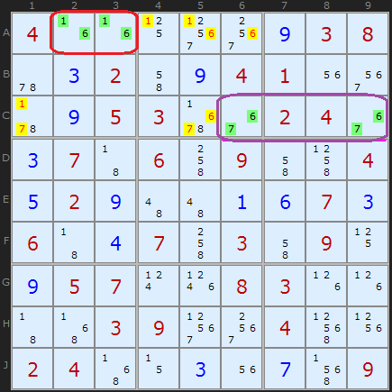
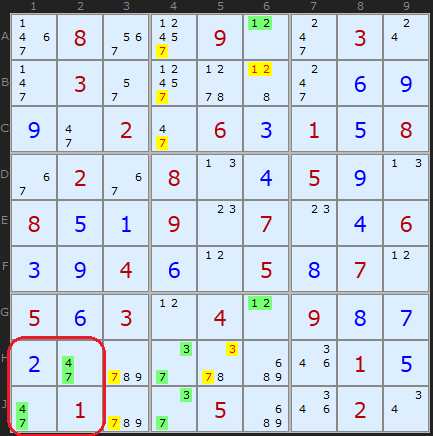
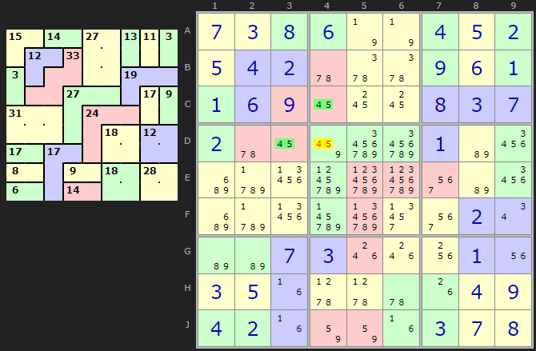
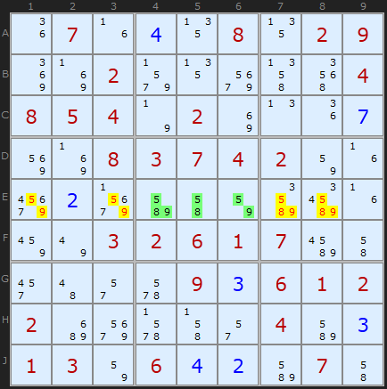
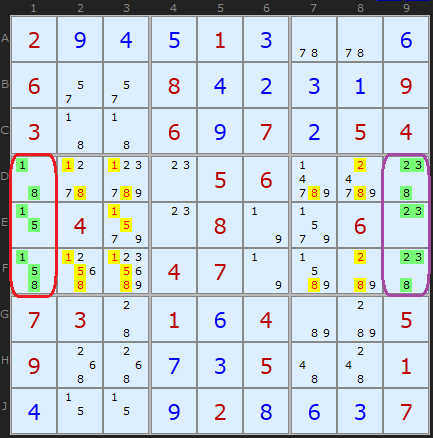
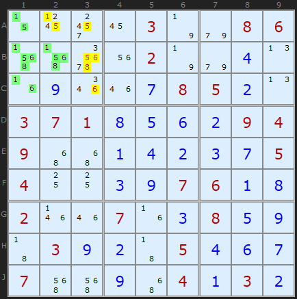

Title: Naked Candidates - SudokuWiki.org

URL Source: https://www.sudokuwiki.org/Naked_Candidates

Markdown Content:
# Naked Candidates - SudokuWiki.org

SudokuWiki.org

Strategies for Popular Number Puzzles

*   [Sign up for more](https://www.sudokuwiki.org/SPHome.aspx)

*   [Main Page](https://www.sudokuwiki.org/Main_Page)
*   [What's New](https://www.sudokuwiki.org/Whats_New)
*   [Strategy Overview](https://www.sudokuwiki.org/Strategy_Families)

9x9 Solvers

*   [Sudoku Solver](https://www.sudokuwiki.org/Sudoku.htm)
*   [Jigsaw Solver](https://www.sudokuwiki.org/Jigsaw.aspx)
*   [Sudoku X Solver](https://www.sudokuwiki.org/SudokuX.aspx)
*   [Windoku Solver](https://www.sudokuwiki.org/Windoku.aspx)
*   [Colour Sudoku](https://www.sudokuwiki.org/ColourSudoku.aspx)
*   [Killer Solver](https://www.sudokuwiki.org/KillerSudoku.aspx)
*   [Killer Jigsaw Solver](https://www.sudokuwiki.org/KillerJigsaw.aspx)

6x6 Solvers

*   [6x6 Sudoku Solver](https://www.sudokuwiki.org/Sudoku6x6.aspx)
*   [6x6 Killer Solver](https://www.sudokuwiki.org/Killer6x6.aspx)
*   [6x6 KenKen Solver](https://www.sudokuwiki.org/KenKen6x6.aspx)
*   [6x6 KenDoku Solver](https://www.sudokuwiki.org/kendoku6x6.aspx)

Weekly 'Unsolvable'

*   [Unsolvable Sudoku](https://www.sudokuwiki.org/Weekly-Sudoku.aspx)
*   [Unsolvable Jigsaw](https://www.sudokuwiki.org/Weekly-Jigsaw.aspx)
*   [Unsolvable Str8ts](https://www.str8ts.com/weekly_str8ts.aspx)

Puzzles to Play

*   [The Daily Sudoku](https://www.sudokuwiki.org/Daily_Sudoku)
*   [Daily 6x6 Sudoku](https://www.sudokuwiki.org/Daily_Mini_Sudoku)New!
*   [The Jigsaw Sudoku](https://www.sudokuwiki.org/Daily_Jigsaw_Sudoku)
*   [The Daily Sudoku X](https://www.sudokuwiki.org/Daily_Sudoku_X)
*   [The Daily Killer](https://www.sudokuwiki.org/Daily_Killer_Sudoku.aspx)
*   [Daily Mini Killer](https://www.sudokuwiki.org/Daily_Mini_Killer_Sudoku.aspx)
*   [Daily Killer Jigsaw](https://www.sudokuwiki.org/Daily_Killer_Jigsaw.aspx)
*   [The Daily Kakuro](https://www.sudokuwiki.org/Daily_Kakuro)
*   [The Daily KenKen](https://www.sudokuwiki.org/Daily_KenKen.aspx)
*   [Daily Codewords](https://www.sudokuwiki.org/Daily_Codewords)
*   [1 to 25](https://www.str8ts.com/daily_1to25.aspx)
*   [The Daily Binairo](https://www.sudokuwiki.org/DailyBinairo)
*   [Letterlicious](https://www.letterlicious.com/Letterlicious_Home.aspx)
*   [Puzzle Packs](https://www.sudokuwiki.org/ACSPuzzles.aspx)

Basic Strategies

*   [Introduction](https://www.sudokuwiki.org/Introduction)
*   [Getting Started](https://www.sudokuwiki.org/Getting_Started)
*   [Naked Candidates](https://www.sudokuwiki.org/Naked_Candidates)
*   [Hidden Candidates](https://www.sudokuwiki.org/Hidden_Candidates)
*   [Intersection Removal](https://www.sudokuwiki.org/Intersection_Removal)

Tough Strategies

*   [X-Wing](https://www.sudokuwiki.org/X_Wing_Strategy)
*   [Chute Remote Pairs](https://www.sudokuwiki.org/Chute_Remote_Pairs)
*   [Simple Colouring](https://www.sudokuwiki.org/Simple_Colouring)
*   [W-Wing](https://www.sudokuwiki.org/W_Wing_Strategy)
*   [Y-Wing](https://www.sudokuwiki.org/Y_Wing_Strategy)
*   [Rectangle Elimination](https://www.sudokuwiki.org/Rectangle_Elimination)
*   [Swordfish](https://www.sudokuwiki.org/Sword_Fish_Strategy)
*   [XYZ-Wing](https://www.sudokuwiki.org/XYZ_Wing)
*   [BUG](https://www.sudokuwiki.org/BUG)
*   [Avoidable Rectangles](https://www.sudokuwiki.org/Avoidable_Rectangles)

Diabolical Strategies

*   [X-Cycles (Part 1)](https://www.sudokuwiki.org/X_Cycles)
*   [X-Cycles (Part 2)](https://www.sudokuwiki.org/X_Cycles_Part_2)
*   [3D Medusa](https://www.sudokuwiki.org/3D_Medusa)
*   [Jellyfish](https://www.sudokuwiki.org/Jelly_Fish_Strategy)
*   [Unique Rectangles](https://www.sudokuwiki.org/Unique_Rectangles)
*   [Tridagons](https://www.sudokuwiki.org/Tridagons)
*   [Fireworks](https://www.sudokuwiki.org/Fireworks)
*   [Twinned XY-Chains](https://www.sudokuwiki.org/Twinned_XY_Chains)
*   [SK Loops](https://www.sudokuwiki.org/SK_Loops)
*   [Extended Rectangles](https://www.sudokuwiki.org/Extended_Unique_Rectangles)
*   [Hidden URs](https://www.sudokuwiki.org/Hidden_Unique_Rectangles)
*   [WXYZ-Wing](https://www.sudokuwiki.org/WXYZ_Wing)
*   [XY-Chains](https://www.sudokuwiki.org/XY_Chains)
*   [Aligned Pair Exclusion](https://www.sudokuwiki.org/Aligned_Pair_Exclusion)

Extreme Strategies

*   [Grouped X-Cycles](https://www.sudokuwiki.org/Grouped_X_Cycles)
*   [Forcing Nets](https://www.sudokuwiki.org/Forcing_Nets)
*   [Exocet](https://www.sudokuwiki.org/Exocet)
*   [Finned X-Wing](https://www.sudokuwiki.org/Finned_X_Wing)
*   [Finned Swordfish](https://www.sudokuwiki.org/Finned_Swordfish)
*   [Inference Chains](https://www.sudokuwiki.org/Alternating_Inference_Chains)
*   [AIC with Groups](https://www.sudokuwiki.org/AIC_with_Groups)
*   [AIC with ALSs](https://www.sudokuwiki.org/AIC_with_ALSs)
*   [AIC with URs](https://www.sudokuwiki.org/Using_Unique_Rectangles_as_Links_in_Chains)
*   [Almost Locked Sets](https://www.sudokuwiki.org/Almost_Locked_Sets)
*   [Death Blossom](https://www.sudokuwiki.org/Death_Blossom)
*   [Sue-de-Coq](https://www.sudokuwiki.org/Sue_de_Coq)
*   [Digit Forcing Chains](https://www.sudokuwiki.org/Digit_Forcing_Chains)
*   [Nishio Forcing Chains](https://www.sudokuwiki.org/Nishio_Forcing_Chains)
*   [Cell Forcing Chains](https://www.sudokuwiki.org/Cell_Forcing_Chains)
*   [Unit Forcing Chains](https://www.sudokuwiki.org/Unit_Forcing_Chains)
*   [Double Exocet](https://www.sudokuwiki.org/Double_Exocet)
*   [Pattern Overlay](https://www.sudokuwiki.org/Pattern_Overlay)

Deprecated Strategies

*   [Remote Pairs](https://www.sudokuwiki.org/Remote_Pairs)
*   [Y-Wing Chain](https://www.sudokuwiki.org/Y_Wing_Chains)
*   [Multivalue X-Wing](https://www.sudokuwiki.org/Multivalue_X_Wing_Strategy)
*   [Multi-Colouring](https://www.sudokuwiki.org/Multi_Colouring_Strategy)
*   [Empty Rectangles](https://www.sudokuwiki.org/Empty_Rectangles)
*   [Guardians](https://www.sudokuwiki.org/Guardians)

Str8ts

*   [Home & Rules](https://www.str8ts.com/str8ts)
*   [The Daily Str8ts](https://www.str8ts.com/Daily_str8ts)
*   [Weekly Extreme Str8ts](https://www.str8ts.com/weekly_str8ts.aspx)
*   [Str8ts Solver](https://www.str8ts.com/str8ts.htm)
*   [Str8ts Sample Pack](https://www.str8ts.com/Str8ts_Sample_Pack.pdf)

Other

*   [What's New](https://www.sudokuwiki.org/Whats_New)
*   [Latest Articles](https://www.sudokuwiki.org/LatestArticles.aspx)
*   [Feedback](https://www.sudokuwiki.org/sudokufeedback.aspx)
*   [Donate](https://www.sudokuwiki.org/Donations)
*   [Syndicated Puzzles](https://www.syndicatedpuzzles.com/)

[Print Version](https://www.sudokuwiki.org/Print_Naked_Candidates)

[Page Index](https://www.sudokuwiki.org/Site_Map)

2.9k Shares 

# Naked Candidates

'Naked' in this context refers to all the remaining possible candidates on a cell which are going to be used in a strategy. The simplest such situation is a Naked Single - or the last remaining candidate on a cell. Generally speaking, if you are making notes on a Sudoku board you have reached a point where simple scanning of the rows, columns and boxes has brought you no further solutions. But you will be finding plenty of Singles on the easier puzzles, and hopefully not too few on the hardest ones.

A Naked Single is exactly equivalent to saying "Ah Ha! Looking at that cell, I can see every other number either in the same box, the same row or the same column, so it's the only number that can fit."

Hidden candidates, mentioned below with regard to Pairs and so on, also have a Hidden Single equivalent. It occurs when you find a cell with lots of possible candidates, but you reason "well, X can't go anywhere else in either the row, column or box, so it must go here."

# Naked Pairs

A Naked Pair (also known as a Conjugate Pair) is a set of two candidate numbers sited in two cells that belong to at least one unit in common. That is, they are present in the same row, column or box.

It is clear that the solution will contain those values in those two cells, and all other candidates with those numbers can be removed from whatever unit(s) they have in common.

Naked Pairs examples : [Load Example](https://www.sudokuwiki.org/sudoku.htm?bd=400000938032094100095300240370609004529001673604703090957008300003900400240030709) or : [From the Start](https://www.sudokuwiki.org/sudoku.htm?bd=400000038002004100005300240070609004020000070600703090057008300003900400240000009)

 In this example, several Naked Pairs are available and I have highlighted two. In red in row A, cells A2 and A3 both contain 1 and 6. We don't know which way round the 1 and the 6 will eventually be - we will find out later as we finish the puzzle - but it means we can remove all other 1s and 6s in the row. The solver has highlighted these candidates in yellow. But A2 and A3 are also in the same box, so we can clear off the 1 in C1 as well.

The [6,7] in row C is also a Naked Pair. It is aligned just in the row, but it removes three other candidate 6s and 7s in the row. Combining both Naked Pairs, we get a solved cell of 8 in C1.

There are other Naked Pairs at this point. You can identify them yourself or load the puzzle up in the solver to see them.

Figure 2 : [Load Example](https://www.sudokuwiki.org/sudoku.htm?bd=080090030030000069902063158020804590851907046394605870563040987200000015010050020) or : [From the Start](https://www.sudokuwiki.org/sudoku.htm?bd=080090030030000000002060108020800500800907006004005070503040900000000010010050020)

Just to show that pairs don't have to be aligned on a row or column, in this group of pairs we have a [4,7] pair on H2 and J1, which removes some 7s in the same box. Two other Naked Pairs eliminate further candidates at this stage.

## Cage Naked Pairs

As Sluggy points out in the comments there are additional ways Naked Pairs can influence puzzles beyond vanilla Sudoku. The Killer Solver will identify Naked Pairs in a cage - and if the configuration of cells permits - there may be other cells that the pair can reach. C4 and D3 share no row, box or column but they do share a cage. Since 4 and 5 must be present in those two cells we can remove 4 and 5 from D4.

# Naked Triples

A Naked Triple is slightly more complicated because it does not always imply three numbers each in three cells.

Any group of three cells in the same unit that contain IN TOTAL three candidates is a Naked Triple. 

Each cell can have two or three numbers, as long as in combination all three cells have only three numbers. 

When this happens, the three candidates can be removed from all other cells in the same unit.

The combinations of candidates for a Naked Triple will be one of the following:

(123) (123) (123) - {3/3/3} (in terms of candidates per cell)

(123) (123) (12)  - {3/3/2} (or some combination thereof)

(123) (12) (23)  - {3/2/2} 

(12) (23) (13) - {2/2/2}

The last case is interesting and the advanced strategy [Y-Wing](https://www.sudokuwiki.org/Y_Wing_Strategy) uses this formation.

Naked Triple : [Load Example](https://www.sudokuwiki.org/sudoku.htm?bd=070408029002000004854020007008374200020000000003261700000093612200000403130642070) or : [From the Start](https://www.sudokuwiki.org/sudoku.htm?bd=070008029002000004854020000008374200000000000003261700000090612200000400130600070)

This first example is as straightforward as it gets. In row E, centre box, are the cells E4, E5 and E6 containing [5,8,9], [5,8] and [5,9] respectively. In total, those three cells contain [5,8,9], so we have fixed those numbers in those cells - just not which way round they will be. This allows us to remove those numbers from the rest of the unit the Triple is aligned on - namely the row.

Naked Triples : [Load Example](https://www.sudokuwiki.org/sudoku.htm?bd=294513006600842319300697254000056000040080060000470000730164005900735001400928637) or : [From the Start](https://www.sudokuwiki.org/sudoku.htm?bd=200010000600800009300607054000056000040080060000470000730104005900005001000020007)

We have two Naked Triples at the same time on this board, in columns 1 and 9. There is no trickery in these Triples because the cells that form the triples are the last three unsolved cells in those columns - so they are bound to contain the three remaining values. Given that fact, we can clear out those values from each box containing a Naked Triple (and only the box, since there is nothing to clear off in the columns). But the manoeuvre nets us a great deal of candidates and we get a solution of 9 in F8. 

In terms of the candidates per cell, the column 1 triple is a {2/2/3} formation (reading down) and the second, column 9, is {3/2/3}.

# Naked Quads

 A Naked Quad is rarer, especially in its full form, but is still useful if it can be spotted. The same logic from Naked Triples applies, but the reason it is so rare is because if a Quad is present, the remaining cells are more likely to be a Triple or Pair and the solver will highlight those first.

Naked Quad example : [Load Example](https://www.sudokuwiki.org/sudoku.htm?bd=000030086000020040090078520371856294900142375400397618200703859039205467700904132) or : [From the Start](https://www.sudokuwiki.org/sudoku.htm?bd=000030086000020000000008500371000094900000005400007600200700800030005000700004030)

 Well, I can't find an example in my 2012 stock, so I'm going to use the one found by Pieter from Australia. It's a cluster of cells in box 1. A1, B1, B2 and C1 collectively contain [1,5,6,8], so those numbers must occupy those cells. That allows us to remove the yellow highlighted candidates.

We don't consider higher orders of Naked candidates because there are only 9 cells in a unit. So if we were to suppose a "Naked Quin" with five candidates there would automatically be a complementary Quad since 5 + 4 = 9. Same point arises with Hidden sets, but it is worth noting that the Naked complement will be Hidden and the Hidden complement will be Naked. It may be viable to look for such beasts in 12x12 or 16x16 Sudokus. 

Go back to [Getting Started](https://www.sudokuwiki.org/Getting_Started)Continue to [Hidden Candidates](https://www.sudokuwiki.org/Hidden_Candidates)

* * *

# Comments

Your Name/Handle

Email Address - required for confirmation (it will not be displayed here)

Your Comment

Please enter the

letters you see:

- [x]  Remember me

Please ensure your comment is relevant to this article.

**Email addresses are never displayed, but they are required to confirm your comments.** When you enter your name and email address, you'll be sent a link to confirm your comment. Line breaks and paragraphs are automatically converted - no need to use 
 or   tags.

Comments[Talk](https://www.sudokuwiki.org/Naked_Candidates?talk#comments)

## ... by: Sluggy

Wednesday 4-Feb-2026

I think the 4,5 (D3, C4) and 7,8 (D2, B4) naked pair example in this puzzle should be included in the documentation here; https://www.dailykillersudoku.com/puzzle/30963

The wording of this document states that pairs can be removed from "units in common". This would suggest 4(?) possibilities; pairs that share a box, column, row or unit. The examples in this document cover the first 3, however that example has a "unit in common" where the pairs intersect. The solver found this for me, so it seems to already cater for it.

[Load Killer Puzzle](https://www.sudokuwiki.org/KillerSudoku.aspx?bd=L9B0bv4000c1pn51ekv0ljn007n1oul08pa1gy3000e32ml2t574xxu005y005y1eky000f1ekq1gy22t5b47pu47qi00180018385t2t582t5c1ekr47v647qi204q1ez21ez22t560dqq1lqm0otu00cz00271ey54r2p484147sy00b61emm00c200cz00271ey3483z0eb3003m32mj2t5q1sb61evm36kw2t5847r0001o001w2t562t6q06bw000e2t6b079x005x1sya1elw0m4t000i1jbh1ekr2t6b4izm47xe1elv1eks000g000h)

Andrew Stuart writes:

That’s a great example. I think you are right, needs to be documented. I will add that to the Naked Pairs section, don’t see why I can’t include Killer puzzles here. 

Add to this Thread

## ... by: Debbie Shayne

Saturday 30-Mar-2024

Hi,

I am relatively new to Sudoku, but seem to be getting a decent handle on things. However, there is one thing that continues to stump me, and I almost certainly get it wrong each time, so I think there is something I am missing about naked triples. I hope I can describe it, since there seems to be no way to add a screenshot.

Let's say, in a unit, that I have the following candidates: (3,9) (3,4,9) (3,7,9) (3,4,7,9)...how do I know if the naked triple is (3,9) (3,4,9) (3,4,9) or (3,9) (3,7,9) (3,7,9)? I'm not sure if this is the best example, just one that is in a current game. It seems that I am constantly getting this type of pattern where it could go two different ways.

Thanks in advance,

Debbie

zs replies:Saturday 30-Mar-2024
I think that in this case, that is not a naked triple, because it contains 4 different values (3,4,7,9). To be a naked triple it must contain only the three different values. Please someone correct me if this is wrong (im new too)

Debbie replies:Saturday 30-Mar-2024
Thanks, ZS. I can see what you mean, but this is such a common situation that, even if I am reading it wrong as two naked triples, I'm thinking there must be a strategy I am missing here.

Davin replies:Thursday 10-Jul-2025
ZS is right, in the cells 39, 349, 379, 3479:

- 39, 349, 349 is not possible, since there is only one 349, not two,

- 39, 379, 379 is not possible, since there is only one 379, not two,

- 39, 349, 3479 and 39, 379, 3479 are not naked triples, since they contain 4 digits in 3 cells. (We do not know which 3 of the 4 digits are the actual solutions to the cells.)

The strategy that you are looking for, however, is a Naked Quad, since 39, 349, 379, 3479 all together contain 4 digits in 4 cells.

Add to this Thread

## ... by: Earl Zhu-Gallo

Thursday 4-Jan-2024

I'm just starting out learning sudoku and your website has been very helpful! For Naked Quins, could you explain the difference between the terms "Hidden" and "Naked" a little bit more? What are Hidden sets? 

Thanks!

Earl

Taipei, Taiwan

REPLY TO THIS POST

## ... by: Stan

Thursday 3-Aug-2023

Suppose, on a row, I have three cells whose candidates are {"1,2,3,6}, {2,3}, {2,3}. Should I process it as a naked pair (2,3) or as a hidden triple (1,2,3)? 

Maybe this particular example doesn't quite capture what I'm wondering about.

Is there a required sequence which, if not followed, could lead to trouble?

Process naked things before hidden things and pairs before triples, etc?

Also, is {1,2,3}, {1,4}, {1,5} a (potential) hidden triplet? I see triplets referred to as 3/3/3, 3/3/2, 3/2/2, 2/2/2 but never as 3/1/1.

Thanks for all your hard work.

Andrew Stuart writes:

The second and third cells form a Naked Pair. For the purposes of the first cell only, you can look at the three cells as a Hidden Triple - it reduces the same candidates. But a naked set will apply to the whole row, column or box.

No triples with {3,1,1}

Add to this Thread

## ... by: Silver

Sunday 9-Oct-2022

In the second Naked Pair example, how do you know to eliminate the 1 2 in B6 instead of the 1 2 in A6? Thank you for your assistance.

Andrew Stuart writes:

A6 abd G3 form the Naked Pair. B6 contains an extra candidate 8

Add to this Thread

## ... by: John Short

Monday 26-Oct-2020

I have just come on this solver after doing Suduko for a number of years. I am thinking though that I must have been doing pretty basic level puzzles. For example I tended to be able to solfve without filling squares with all the options/ Generally did by inspection and a bit of jotting possibles. 

Would you say therefore that it is unlikely to be able to complete the tougher puzzles without the solver at your elbow? 

before using the solver I used to come unstuck occasionally and only find out when the last few steps remained. Then it was almost impossible to backtrack. The solver allows partial progress to be checked which is great. Very impressive piece of work

Andrew Stuart writes:

Hi John.

Depends. Most newspapers print relatively easy puzzles. Few require candidates everywhere. The solver is aimed at the tougher end and it's a long tail.

Add to this Thread

## ... by: George

Sunday 3-May-2020

I'm really having a hard time wrapping my head around these quads. In your example, you show 1 as a digit of the quad group, even though 1 exists in A2, A6, and H1. What makes the 1's in A1, B1&2, and C1 different from those? Same with 5. They are all over the place col's. 2, 3,and 4.

Andrew Stuart writes:

True but the four cells A1, B1, B2 and C1 contain in total just four different numbers, that's what makes them special. We need four in four to make a quad and it's the only quad pattern in that box.

Add to this Thread

## ... by: Janet

Monday 28-Oct-2019

I notice that in examples of Sudoku solving the candidates are placed in certain positions within the squares. Please explain how to do this to enable easier solution making. Thank you.

Janet D.

REPLY TO THIS POST

## ... by: Ing

Wednesday 15-May-2019

The complementary (not "complimentary") of naked candidates is hidden candidates, not another naked candidate. So you won't need to look for "naked quin" if you do look for "hidden quads". Same for the "hidden quins" vs "naked quads".

Andrew Stuart writes:

Appreciate the spelling correction, thanks. Complementary is descriptive of the naked/hidden relationship but can be used for other relationships.

Add to this Thread

## ... by: DanG

Tuesday 7-May-2019

Hi,

Thank you for the solver,

I don't fully understand all the strategies, but i'm working on it.

Although i like most of the examples shown,

The examples for the Naked Triples are not very useful.

Because the cells are align and it automatically exclude candidates.

I don't call that a strategy. It is more simple elimination.

We need to find examples where the cells are NOT align.

Have a nice day.

REPLY TO THIS POST

## ... by: Liz

Tuesday 5-Mar-2019

By what rule must a naked quin always have a complementary *naked* quad (in a unit with no solved cells)? Could it not be hidden instead?

I think the general rule is that in a unit with N solved cells, a naked n-tuple always has a complementary 9-minus-N-minus-n-tuple, but it could be naked or hidden. In your example above, with one solved cell, the 1568 naked quad reveals a 2347 hidden quad.

I have a conjecture that is sort of the converse: that any *hidden* tuple will always have a complementary *naked* tuple. I'm horrible at spotting hidden tuples unless I spot a complementary naked tuple. But although I've never seen an exception, logically I can't rule out the possibility that the complementary tuple might be hidden. Maybe I'm missing something obvious.

REPLY TO THIS POST

## ... by: David Ullman-Dougherty

Sunday 17-Feb-2019

Your tutorial on naked triples does not have an example of a naked triple in a box but not aligned on a row or column. I found this while using your solver. The Sodiku is from page 177 of Will Shortz presents Killer Sudoku.

There is a Sudoku board I would like you to look at

[Click on this link](https://www.sudokuwiki.org/sudoku.htm?bd=803010740109003508400008001010030680080000072000987000008000290000300800090864050)

REPLY TO THIS POST

## ... by: Thomas

Friday 30-Nov-2018

Then again, Hidden Candidates is also a covered subset, but instead of covering a subset of spaces with a set of possibilities, you cover a subset of possibilities with a set of spaces.

Sorry, I came here because I started to write a Sudoku solver and was wondering what inference rules it was missing (it's got hidden singles, naked * [because I enumerate all subsets], and pointing *). The first one I hit that it couldn't solve requires APE.

REPLY TO THIS POST

## ... by: Thomas

Friday 30-Nov-2018

It's funny that you call these Naked Blanks, when they are covered subsets. Take your first example: the set of free spaces in row A is {A2, A3, A4, A5, A6}. The set of possibilities is {{1, 6}, {1, 6}, {1, 2, 5}, {1, 2, 5, 6, 7}, {2, 5, 6, 7}}. The subset {A2, A3} is covered by the set formed by the union of its composite sets of possibilities: {1, 6} U {1, 6} = {1, 6}. If any of the other free spaces (those in {A4, A5, A6}) were to be 1 or 6, we would have to come to the contradiction that either A2 or A3 has no possible candidate values, therefore A4, A5, and A6 cannot be 1 or 6.

I only point this out, because it is a lot easier to program when you're thinking in subsets.

REPLY TO THIS POST

## ... by: Edwin

Saturday 10-Nov-2018

I think you should illustrate a case here in "Naked Candidates" of a naked pair or triple where there are both green and black numbers appearing in the same cell!. In your examples above, there are cells with both yellow and black numbers, but no cell contains both green and black numbers. You need to show a case of green naked candidates when at least one appears in a cell along with other black numbers. FI, we could have two cells in a box or line with 12348 in one and 2379 in the other where no other 2's or 3's appear anywhere else in that box or line. Then one green 23 appears in one cell along with black 148 and the other green 23 appears in the other cell along with black 79. We can then remove any 2's and 3's in the other cells in that box or line. I recently ran into such a naked pair, and realized I had been looking only for naked candidates when no other numbers appeared in the same cells. IOW, 'naked' candidates don't have to be LITERALLY 'naked'! lol

Andrew Stuart writes:

Might you be think of Hidden pairs/triples/quads?

Add to this Thread

## ... by: bill drissel

Thursday 11-Jan-2018

I chose Exemplar 1 for BUG. I recognized the pattern when it arrived. I did not understand the explanation of how to choose the value for the odd cell. The correct value for H5 is 4. But 5 and six don't lead to multiple solutions, the Solution Count shows zero. Is there more material to read. I started using your excellent solver just as a bookkeeper ... then I became more and more interested.

Your bi-value illustrator shows me connections in a jungle of numbers but I'm too much of a novice to see how to use the connections. I never see a double line connection. What's the diff between strong and weak?

I'm really impressed by your work. When my wife began to work Sudoku, I was under the impression that mere tally work would solve anything. But I've found the puzzles much more subtle and demanding. Thank you for your excellent work.

Happy New Year,

 Bill Drissel

 Frisco, TX

Andrew Stuart writes:

Thanks! Check out [this link](https://www.sudokuwiki.org/Weak_and_Strong_Links)

Add to this Thread

## ... by: JohnNoneDoe

Wednesday 30-Aug-2017

The killer solver does not seem to recognize naked pairs linked by a cage.

There is a Killer Sudoku board I would like you to look at

[Click on this link](https://www.sudokuwiki.org/killersudoku.htm?bd=112211112221323442121323341133144341222144111133144231121212231221212332113344442,110007001900000010090013131016200000170000000000000036001200103500000000100000000000000000080700000000171700001911131500000000000000000000000006110009002400000000)

There will be a naked pair in b6,c7 linked by the cage starting at b6. That pair can eliminate candidates in b7. The solver seems not to see this.

Andrew Stuart writes:

Thanks for this great example John. I have seen the gap in the search and plugged the omission. Good catch. Your example puzzle now completes. I have updated all solvers to 2.06.

Add to this Thread

## ... by: JohnF

Thursday 29-Jun-2017

I notice that the solver takes a noticeable amount of time (even on a fairly fast system) to perform the Naked/Hidden Quads test.

A quick way to speed up the solver would be to check whether there are at least 8 unfilled cells in the row/col/box under examination - if there are not, then (as you point out) the solver would already have found a Hidden/Naked Triple or Double.

In fact you can take this one step further; if you have checked for a Naked Quad and not found one, then you won't find a Hidden Quad unless all nine of the cells are still unfilled.

REPLY TO THIS POST

## ... by: JWE

Sunday 7-Aug-2016

Good lessons. But, Brian Fink's example (12/4/2014) of linked naked pairs seems incorrect. He states that if the link ends in a triplet that includes the common pair, then that end can remove the pair. I don't think so.

REPLY TO THIS POST

## ... by: David Spector

Wednesday 20-Jul-2016

I believe that naked pairs also work if the conjugate pairs are located anywhere along an intersecting row and column. If two AB cells are located along an intersecting row and column, you can remove A and B from the intersection cell. This is because this cell will always "see" both A and B.

This situation is easy to find if you first find conjugate pairs, then see if they are on a row and column that intersect at a cell having two or more candidates.

Happens sometimes, not always.

REPLY TO THIS POST

## ... by: BabuYB

Sunday 21-Feb-2016

In the example for naked triple grid 1, the starting candidates for D8 are {5,6.9}; D9 => {1,5,6}; for E7 => {1,3,5,8,9}; E8 => {3,4,5,6,8,9} and E9 => {1,5,6,8}. However, this does not effect the explanation.

REPLY TO THIS POST

## ... by: Brian

Monday 12-Oct-2015

In the second paragraph under Naked Pairs, you state: "It is clear that the solution will contain those values in those two cells." I don't think it is clear at all. By what logic can you rule out the possibility of 1 being in A4 or A5 at this stage of the solution?

Andrew Stuart writes:

If there are only two candidates left in two cells, they are compulsory. Unless you've marked up your candidates incorrectly on paper, these rule out other candidates in the same row/column/box.

Add to this Thread

## ... by: kasmar45

Thursday 10-Sep-2015

Is there any rule of thumb how to perform the first move on this scenario. 

236 236 36

REPLY TO THIS POST

## ... by: Jan Bourdelle

Thursday 13-Aug-2015

Please tell me what the second paragraph under the second puzzle under Naked Triples means: thank you. Your site is wonderful

In terms of the candidates per cell, the column 1's triple is a {2/2/3} formation reading down and the second is {3/2/3}.

Andrew Stuart writes:

Merely that the cells contain 2 out of 3, 2 out of 3 and 3 out of 3 of the three numbers in the triple (in column 1) and similarly for column 9.

Add to this Thread

## ... by: jb681131

Saturday 20-Jun-2015

When the cells that form the Naked Subset are not only confined to one but to two houses (a row and a block or a column and a block), they are sometimes called a Locked Subset. Candidates can be eliminated from both houses.

REPLY TO THIS POST

## ... by: jeanne

Sunday 17-May-2015

Why is b1,2,3 not triple 568? I keep eliminating the wrong numbers

REPLY TO THIS POST

## ... by: marmal9174

Saturday 21-Jun-2014

Best display and information I have seen regarding Sudoku. Thank you for the clear pictures and explanation.

REPLY TO THIS POST

## ... by: Brian Fink

Tuesday 15-Apr-2014

Regarding my previous comment, it doesn't matter how many cells are in the Naked Pair chain. There will be times when the pair itself will cancel out in the cell, because there is an odd number of overlapping Naked Pairs; but my example focuses on the quasi-complete Naked Pair vicious cycle, in which, if the cell in question was just that pair of digits, the puzzle would have 2 solutions. This trick eliminates that possibility from the equation.

REPLY TO THIS POST

## ... by: Brian Fink

Saturday 12-Apr-2014

I've discovered a version of Naked Pairs that is very helpful with just one cell (as opposed to an entire row/column/box).

Let's say we have a chain of an overlapping even number of Naked Pairs, all the same pair, with two ends that can see a single cell but are not both aligned on the same row or column with it or even sharing the same box. Then the pair can be removed from that cell and only that cell, leaving all other digits in that cell as possibilities.

For example, if we had C1=3/7/8, C7=7/8, E7=7/8, and E1=7/8, then in addition to removing 7/8 from Row C and Column 7, you may remove it from C1 as well.

There may also be a variation of this that only includes a cell that can be seen by two cells with naked pairs (same pair) that are not part of a traditional Naked Pair, but I have yet to prove that one.

REPLY TO THIS POST

## ... by: Jan

Monday 7-Apr-2014

In the Naked Quad section is stated "Well, I can't find an example in my 2012 stock, ..."

But you do have one! In the Naked Triple example is also a naked quad for 2, 3, 8 and 9 in D9, E9, F9 and F8 (and so also a Hidden Quad for 1, 4, 5 and 7 in D7, D8, E7 and F7)

REPLY TO THIS POST

## ... by: Pete

Sunday 2-Mar-2014

Ahh, I get it now.....Square C1 contains only numbers which are part of the 4 numbers in the quad and no extra numbers. Whereas square B3 contains extra numbers which are not part of the quad.

It only took me a month to figure out..... 

REPLY TO THIS POST

## ... by: Pete

Saturday 8-Feb-2014

In the naked quad example, I don't get how square c1 is identified as part of the quad, when square b3 contains 3 of the 4 quad numbers. The only thing I notice is that b3 doesn't contain number 1.

Is it the case that each of the quad squares has to contain one number which appears in all 4 squares? If so, then how does this tie-in with the naked triple possibility of (12) (23) (13) ? Here, there isn't a number which appears in all 3 cells..

Great site btw

REPLY TO THIS POST

## ... by: KeithD

Wednesday 22-Jan-2014

Quick suggestion for people who still can't understand the naked triple explanations, above and in the comments: try using one of the three numbers in the triple as the solution for any of the candidates for elimination (in the row, column or box as appropriate). Now, only two of the cells in the triple can be solved, while the third has no valid candidate. Clearly, only the three triple cells can contain the three triple numbers.

Eg, in the first triple example, try putting 5 in E1. Now E5 is 8 and E6 is 9, but E4 has no candidate.

REPLY TO THIS POST

## ... by: Simon

Sunday 22-Dec-2013

Excellent site.

Can I make one small suggestion.

For each of the techniques (Naked singles, Naked candidates, Intersection removal, etc.)

you provide a couple of practice examples. for people to have a go at.

Thanks anyway.

Andrew Stuart writes:

Beyond the basic strategies exemplars are now at the bottom of the text part

Add to this Thread

## ... by: Tim

Sunday 22-Sep-2013

Naked Pairs figure 2 shows (1,2) at A6 and G6.

Why not G4 and G6

Andrew Stuart writes:

That is a Naked Pair on G4/G6, but it doesn't lead to any eliminations (in the row) so it doesn't get highlighted.

Add to this Thread

## ... by: Klaus

Sunday 30-Jun-2013

I don't understand how the 1-2 pair in Fig.2 A-6 and G-6 can remove 1-2 in B5, can you please elaborate on this.

Thank You,

Klaus

BTY you have a great site, its so informative and I have learned so much from it, greatly appreciated.

Andrew Stuart writes:

Candidates 1/2 are the *only* candidates in cells A6 and G6. You notice that B6 has an extra candidate 8. If all three only had 1/2, we'd be in trouble - we'd have gone wrong on some previous step. 1/2 *must* go in A6 and G6, so it leaves no room for 1/2 elsewhere in the column. Fortunately, that 8 allows us to fill B6 and move on.

Add to this Thread

## ... by: Roy

Friday 26-Apr-2013

Just realized there is another Naked Quad in Box 1 in the Naked Quad example (2,3,4,7) in cells A2, A3, B3 & C3! Alas, it doesn't really help reduce any other cells. With two Naked Quads in the Box, the only other number is 9 which has already been identified in cell C2.

REPLY TO THIS POST

## ... by: Roy

Friday 5-Apr-2013

The logic of cell B2 being 1 or 8 for the Naked Quads section is derived from the fact one of the cells A1, B1 & C1 will contain either a 1 or 8 but not both as cell H1 will have the other. Cell B2 is the only other cell in this block that has either of these two numbers. I guess this would be a hidden pair within a pair of naked quads.

REPLY TO THIS POST

## ... by: Roy

Monday 25-Mar-2013

Having reduced cell B2 to possibles 1 or 8, cell B1 can be reduced to possibles 5 or 6 (hidden pair with cell B4) and then H1 must be 8 as would be the case for B2! A1, B1 & C1 have been reduced to a naked triple (1,5,6) with a {2,2,2} formation!

REPLY TO THIS POST

## ... by: Roy

Friday 22-Mar-2013

I believe you can go one step further with cell B2 in the Naked Quads example. It will have a value of either 1 or 8 given the restrictions from cell H1.

REPLY TO THIS POST

## ... by: Anon

Monday 21-Jan-2013

i am really thankful to you for presenting this.really very useful content about sudoku solving. i am impressed.

REPLY TO THIS POST

## ... by: Peter Rogers

Saturday 10-Nov-2012

Hi

What a fabulous website. This is what I have been looking for for years a real how to solve sudokus. I am stunned at its teaching capacity.

REPLY TO THIS POST

## ... by: gerhard, sweden

Wednesday 5-Oct-2011

Assume that a triplet consists of the three bigrams

(example) 56, 67, 57, occuring in one row.

Let´s say that the bigrams occur in region 1 (bigrams 56 and 67) and in another region (57).

It is obvious that they work the same as any true triplet, but less obvious that the figure 6 can be eliminated from the remaining squares of region 1.

If this is described somewhere else, please excuse me for commenting.

REPLY TO THIS POST

## ... by: Pieter, Newtown, Australia

Tuesday 6-Sep-2011

Hi Andrew

I always love to double-check my solution to a puzzle using your solver. I got this one by XY-Chains but damn it! I missed the naked & hidden Quads, yet again! I usually do, damn quads! :-(

I noticed you don't have an example for quads in your "Pick an Example" drop-down list. Want to include this one?

[LOAD EXAMPLE](https://www.sudokuwiki.org/sudoku.htm?bd=....3..86....2.........85..371....949.......54....76..2..7..8...3...5...7....4.3.)

It's from the Sydney Sun-Herald of 2011-09-4 (Auspac Media for the puzzle). You may need to check with them re copyright. 

Thanks as always for your great solver!

Ciao, Pieter

Andrew Stuart writes:

Excellent example. Thank you for sharing. I don't think I can use it in my example list, but it can be linked here as you have stated the credits.

Add to this Thread

## ... by: Charlie R

Wednesday 22-Jun-2011

Wow! What a site. I landed here by chance. I have been exploring sudoku myself, using my own excel-based solver, convinced that there must be a complete rule-based solution. I had found many of the rules myself, but this is a much more complete set, beautifully explained and illustrated. I bow to you, Oh Master

REPLY TO THIS POST

## ... by: Dayanandan

Monday 4-Apr-2011

Landed on this site by chance. The joy experienced is such that I want to tell you this at once. This clears my doubt fully. I like this illustration as well.

Regards

Dayanandan

REPLY TO THIS POST

## ... by: hutch

Monday 7-Mar-2011

i thought i could write this in excel and i did get some parts but soon realized the complexity and have stopped(at least 4 now). the stepwise debugger style is the bomb. i hope to improve my sudoku but i think i will spend a good bit of time just admiring this work.

many thanks for the obvious labor of love.

hutch

pawleys

REPLY TO THIS POST

## ... by: Andrew

Saturday 5-Mar-2011

Almost a year later, a response to Mike, who said:

"I notice that Sudoku Solver does not exhaustively identify all naked pairs as seen in the following puzzle.

http://www.sudokuwiki.org/sudoku.htm?bd=68050041905041000604160000000

9100040300700080400203960204871600000060104106000008

In row E the 2,5 pair in columns 3 and 7 should reduce cell E9 to just 1."

I don't understand why you say that. There's not such a naked pair there, and E9 has already a 3... Perhaps the sudoku saved with that id changed?

REPLY TO THIS POST

## ... by: Blaster88

Tuesday 15-Feb-2011

Non seulement c'est génial mais en plus je bosse mon anglais !

REPLY TO THIS POST

## ... by: Rob Butler

Wednesday 3-Nov-2010

I just found this website a few hours ago and lost the whole afternoon to playing with it. It is great. This is exactly what I have been looking for, i.e., not just an answer to a tough puzzle, but the LOGIC to solve it. Thanks. I will be coming here a lot !

Andrew Stuart writes:

Thanks!

Add to this Thread

## ... by: John

Tuesday 15-Jun-2010

After reading this over, I think I understand why naked triples (and naked quadruples and quintuples). If you understand how naked pairs work, look at naked triples this way: When you solve one of the 3 cells, the other two cells become naked pairs or single. Then all three numbers in a naked triple can be eliminated from the other cells.

For example: (123) (123) (123)

Make any of the cells a 1: (123) (1) (123)

Drop 1 from the other cells: (23) (1) (23) 

You can delete 1 from all other cells, because it is used. You can eliminate 23 from the other cells because it is a naked pair.

The same works for other triples: (123) (12) (23)

If the middle cell is 1: (23) (1) (23)

Eliminate 23 from other cells because it is a naked pair.

 and so forth...

REPLY TO THIS POST

## ... by: Michael

Thursday 27-May-2010

To all who are having difficulty understanding this...

A naked pair shows the same two values and only those values in two different fields (in the same column, row, or three by three square). This shows that those two fields each must have one of the two values (there are no other values to choose from). Since a value cannot occur more than once in any one column, row, or three by three square) the two values can be safely removed from the other clues since it is know that they must appear in the place of the naked pair.

Naked Triples and Quads simply extend the same logic to 3 and 4 values.

REPLY TO THIS POST

## ... by: Mike

Wednesday 31-Mar-2010

I notice that Sudoku Solver does not exhaustively identify all naked pairs as seen in the following puzzle.

http://www.sudokuwiki.org/sudoku.htm?bd=68050041905041000604160000000

9100040300700080400203960204871600000060104106000008

In row E the 2,5 pair in columns 3 and 7 should reduce cell E9 to just 1.

Andrew Stuart writes:

The solver is working correctly, but the behavior in these cases is worth explaining. As Naked Pairs are detected, the removal effects are applied. This might occasionally stop another Naked Pair from being found, since some numbers have been removed. The solver *could* detect all NPs and then apply the results simultaneously, but for speed and space I have chosen not to. Usually, the next set of NPs will be discovered in the next round. This applies to most of the basic strategies.

Add to this Thread

## ... by: Pete

Friday 12-Mar-2010

I've been looking for help and this is the first I've seen that looks like it will help. Bring on the 6 star puzzles. I'm ready(I think).

REPLY TO THIS POST

## ... by: CS VIDYASAGAR

Thursday 25-Feb-2010

Excellent explanation with very useful examples to make one understand difficult concepts naked pairs and naked triples.

Thanks for keeping the aritcle simple and easily understandable. 

REPLY TO THIS POST

## ... by: Harpo

Tuesday 5-Jan-2010

I agree with buc; with the information given it still seems rather illogical to remove the other candidates.

REPLY TO THIS POST

## ... by: Werty

Tuesday 8-Dec-2009

My explanation of naked triples.

On the example.

imagine that you put 5 in one of the columns 2, 3 or 4. That will leave only 7 and 8 as candidates in three columns - 1, 8 and 9. Clear?

You will get to similar wrong position when you put 8 in column 4.

REPLY TO THIS POST

## ... by: Carol Kennedy

Tuesday 8-Dec-2009

I am just learning this game and so enjoy it. But I do not always understand your lessons. For example, if you have 4,8

4,8 in a row then you can eliminate the other 4,8s in that row, but can I also erase all the other 4,8s in the column and the entire box as well? Thank you.

REPLY TO THIS POST

## ... by: Curt Klemenz

Sunday 16-Aug-2009

I'm in same boat...having ultimate difficulty spotting hidden pairs and triples. When they are pointed out, .... I see them.

I suspect there is a mental algorithm for focusing attention toward the specific candidates, but no luck so far. 

Anyone with a suggestion that's willing to share?

REPLY TO THIS POST

## ... by: Bruce D

Monday 3-Aug-2009

An explanation on how the naked tripple works. As in the example shown, we have (7,8) (5,7,8) and (5,7,8). The first cell can contain a 7 or an 8. That means that the other two cells will then contain a 5 and 8 in the case the first one is a 7, or a 5 and 7 if the first cell is an 8. By having the last two cells being conditional on the other, we can eliminate the 5, 7, 8 from all other cells in the row.

REPLY TO THIS POST

## ... by: Rockmelon

Saturday 6-Jun-2009

I have been an accountant for 35 years (which means nothing) and I can't see the relationships among these numbers! I have a really difficuolt time understanding this and I love to do Sudoku!

Any suggestions??

REPLY TO THIS POST

## ... by: BobCarl

Sunday 10-May-2009

As you know, any row, column or box contains nine cells.

When there are only 3 different numbers that can fit into three of the nine cells, that automatically eliminates their use in the remaining six cells. Hence, they can be removed as candidates from those "other cells".

REPLY TO THIS POST

## ... by: buc

Monday 20-Apr-2009

Re naked tripple: I would appreciate you explaining the logic of removing any of the three candidates from other cells.

REPLY TO THIS POST

 Article created on 9-June-2005. Views: 1178046

 This page was last modified on 4-February-2026.

 All text is copyright and for personal use only but may be reproduced with the permission of the author.

 Copyright [Andrew Stuart](https://www.sudokuwiki.org/) @ [Syndicated Puzzles](https://www.syndicatedpuzzles.com/), [Privacy](https://www.sudokuwiki.org/privacy), 2007-2026 

