Title: Rectangle Elimination - SudokuWiki.org

URL Source: https://www.sudokuwiki.org/Rectangle_Elimination

Markdown Content:
Released 14th Oct 2023

This is the first novel 'tough' strategy in a long time and replaces [Empty Rectangles](https://www.sudokuwiki.org/Empty_Rectangles) which I feel is an overly complicated pattern. **Ken Reek** from Denver, USA, sent me his explanation and it is included in his solver [SudoKoach](https://www.kmrconsulting.com/). I think it sufficiently distinct to warrant its own test and go near the start. The pattern can also be expressed with [AICs](https://www.sudokuwiki.org/AIC_with_Groups) usually with at least one grouped cell. For those curious I've kept the Empty Rectangle test on the solver so you can go back a step, untick Rectangle Elimination and compare.

Comments welcome.

I will use the original puzzle Ken sent to me to illustrate his pattern.

The pattern works on a single number - in this case 9.

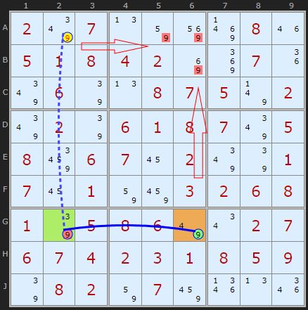

Rectangle Elimination 1 : [Load Example](https://www.sudokuwiki.org/sudoku.htm?bd=S9B027y070n828y8r081m05010804028i8m071i7y067q0n0807057v027y027q060108077y05088e060716027y7q01071601828a03020608017q0508067u0u02070607040203010805097q080282078a1r0n1q)

The base of the pattern consists of a Hinge cell G2 connected to the one remaining 9 in the row (or column), in this case G6. This part has to be a strong either/or link. First 'wing' cell in orange.

From the hinge G2 we look for another 9 in the opposite orientation (the column) and in a different box that is weakly linked - more than two 9s in the unit. The second 'wing' cell.

Consider the weakly-linked A2. If it's ON, then the other wing cell G6 must also be ON. However, this would eliminate ALL the 9s in the 'fourth corner box' (box 2, which is the fourth corner of the rectangle). So A2 cannot be ON, i.e. we can eliminate 9 as a possibility from A2. Simple as.

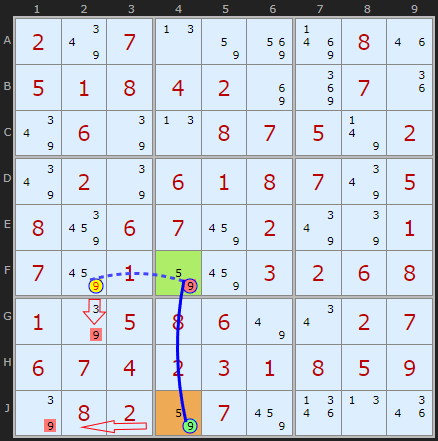

Rectangle Elimination 2 : [Load Example](https://www.sudokuwiki.org/sudoku.htm?bd=S9B027y070n828y8r081m05010804028i8m071i7y067q0n0807057v027y027q060108077y05088e06078a027y7q01078a01828a03020608017q0508067u0u02070607040203010805097q080282078a1r0n1q)

So it turns out there is a second Rectangle Elimination at this stage of the puzzle and my solver finds it before Ken's one - just because of the way I search for the hinge first and go from top-left to bottom-right.

If the 9 in F2 was ON it would remove the 9 in G2 - AND - it would turn OFF the 9 in F4 and turn ON the 9 in J4 - eliminating the 9 in J1.

Since we can't remove all the 9s in box 7 we have a contradiction assuming 9 in F2 can be a solution.

## Multiple Eliminations

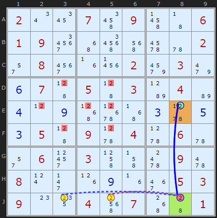

Multiple example : [Load Example](https://www.sudokuwiki.org/sudoku.htm?bd=S9B020u1a074u094r430601093y4y5q5e6i5u022q083u1f2302a2039m0f0745054503b904b60d0l0i516t4z0c5x0e0c0545095x045x065u2q0631034l4j640962080t2j1h0i1f3e0503090o14045g07504401) or : [From the Start](https://www.sudokuwiki.org/sudoku.htm?bd=200709006190000002080002030070503040000000000050904060060300090800000053900407001)

Before the October 2025 update multiple eliminations from the same hinge were handled by consecutive steps. This was a weakness of the algorithm since if a pattern has been identified it should grab all the candidates it can. If you find one elimination it is worth scanning the rest of the row or column for another, as shown in this example.

## Double Rectangle Elimination

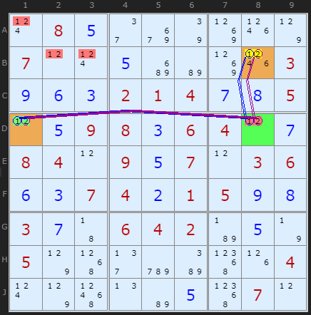

Double Rectangle Elimination : [Load Example](https://www.sudokuwiki.org/sudoku.htm?bd=S9B0t080e2eaa7q8l1p7p070l0t0ec2b68l1p030i0f0c0201040g0h050l0e09080c06040l0g08040l090e070l03060f0c07040b01050i0h030g43060402b70e7n057p512fcyba551h040t7p590nb60e55070l) or : [From the Start](https://www.sudokuwiki.org/sudoku.htm?bd=080000000700000003000214005009806400840907036007401500300642000500000004000000070)

Prior to October 2025 the solver could identify more than one candidate in the same pattern as shown here. But the way the pattern is searched for means this double-number is now handled by consecutive steps.

If +1[B8] then -1[D8] forcing +1[D1] which removes all 1s from box 1, so B8 cannot be 1

If +2[B8] then -2[D8] forcing +2[D1] which removes all 2s from box 1, so B8 cannot be 2

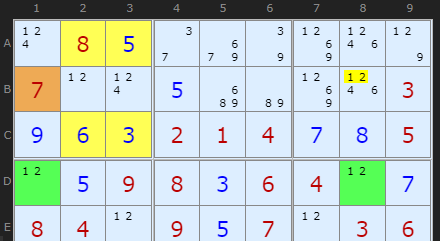
To show how this is also an [Empty Rectangle](https://www.sudokuwiki.org/Empty_Rectangles) I've displayed the pattern here.

Grouped X-Cycle

1 taken off B8. ERI=B1 + strong link on 1 between D1 and D8.

2 taken off B8. ERI=B1 + strong link on 2 between D1 and D8.

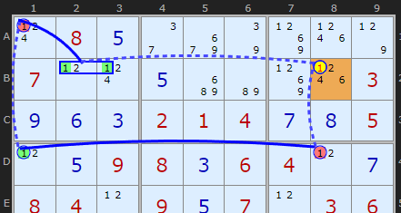
And to show how these are often expressible as Nice Loops I show that pattern here

Grouped X-Cycle

X-CYCLE on 1 - Discontinuous Alternating Nice Loop, length 6):
+1[B8]-1[D8]+1[D1]-1[A1]+1[B2|B3]-1[B8]

- Contradiction: When B8 is set to 1 the chain implies it cannot be 1 - it can be removed

## Two Strong Links

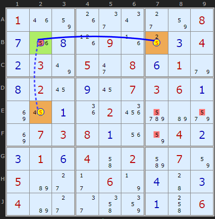

Two strong links example : [Load Example](https://www.sudokuwiki.org/sudoku.htm?bd=S9B011m821g2e0u2c82080g1u0h1h091f100c040b037u052i080f019e0h02160i160703060a8i160a1i0226deb69u8i0703080a1u82040b0c010f044i02bm078205b62c2b067n0d440c04b62c2e4m860a4k06) or : [From the Start](https://www.sudokuwiki.org/sudoku.htm?bd=100000008000090004030508010020007360000020000073800040010402070500060000400000006)

Another kind of double Rectangle Elimination is when both links are strong.

In this case the solver will return

If either +5[B7] or +5[E2] are ON then both are on because they are strongly linked through the hinge cell B2. If both are ON then this removes all 5s from box 6, so neither can be 5

This kind I find to be much, much rarer.

Note: The solver will always alternative strong/weak in a chain and draw the lines that way since it represents ON/OFF/ON etc. See [here](https://www.sudokuwiki.org/Weak_and_Strong_Links).

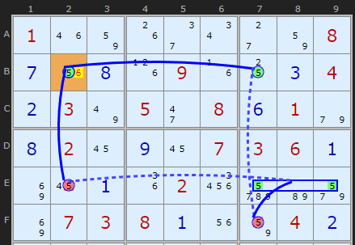
To give it's Nice Loop definition we have to use quite a complicated chain. It also works but discovering that B2 must be the solution rather than finding the wings are _not_. Two sides of the same coin but proves Rectangle Elimination is an easier pattern to find for a human.

X-CYCLE on 5 - Discontinuous Alternating Nice Loop, length 6):

-5[B2]+5[E2]-5[E7|E9]+5[F7]-5[B7]+5[B2]

- Contradiction: When 5 is removed from B2 the chain implies it must be 5 - other candidates 6 can be removed

This strategy is patched into the online solver - I have run tests to check my code and see how widespread it is. I have placed it between Y-Wings and Swordfish. On testing Ruuds top 50k test set I find 35,826 instances across 23,885 puzzles, so very high - but that is partly due to being at the front of the queue. I also found a small bug in the Empty Rectangles getting more instances, but that is moot now.

## Rectangle Eliminations in Jigsaws

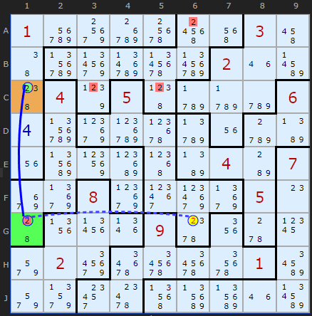
So here is an interesting situation unique to Jigsaws.

The fourth corner of this rectangle is C6 in the top-right most box. Before the solver would not find a Rectangle Elimination because it only searched for 2s in that box. The solver has now been updated to check all boxes since Jigsaws can go all over the place. I'm still looking for a 'box' that does not overlap with any of the other parts of the rectangle. The elimination is

Rectangle Elimination

If +2[G6] then -2[G1] forcing

+2[C1] which removes all 2s 

from box 8, so G6 cannot be 2
[Load the puzzle](https://www.sudokuwiki.org/jigsaw.aspx?shape=33&bd=03v0n4u4f4bkb0099g88vanquqfqvq052gpi8c0hge118es2s2s0210gvameueeesa30s4oa30rajeqeaeoa0ho441m0ma81me6umuma110c843a3q2qg1cc38c41ul005noeofofof803pol0la5scsbarara2gpq&jigmap=111118833188888333178583332175552322177752226774755526744495926444999996449966666)

## Extended Rectangle Elimination

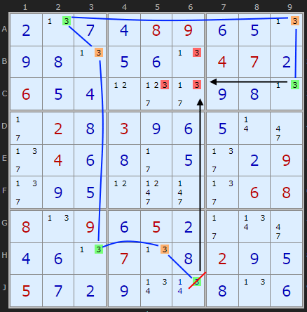

Extended RE example : [Load Example](https://www.sudokuwiki.org/sudoku.htm?bd=S9B0b0n0g0d08090f0e0n0i0h0n0e0f0n04070b060e0d0l0o0g0i0h0n2b020h030i0f0e0r2i0n040f0h0g0e0n0b092e0i0e0l0s0r2e0608080n090f050b2b0v2i0d0f0n070n0h020i0e050g0b0i0v0u0h0n0f) or : [From the Start](https://www.sudokuwiki.org/sudoku.htm?bd=000089000000000470600000000020300000040000009000000068809050000000700200500000000)

A number of strategies can be 'extended' by inserting a chain between parts of the pattern. Bijan Khosronejad from Iran has sent me some good examples where Rectangle Elimination can go around the board between the first and final candidates extending the usefulness of this pattern.

To the right is a puzzle where the 3 in J6 is in danger. Setting it ON will remove the 3s in the column in BC6. But there is another knock on effect. Going around the board (blue line) it also forces 3 on in C9 which would remove the last 3 in box 2 - C6. So from this we can deduce J6 cannot be 3.

This strategy is not currently in the solver but I hope to do so in a future release.

## Using the diagonals in Sudoku X

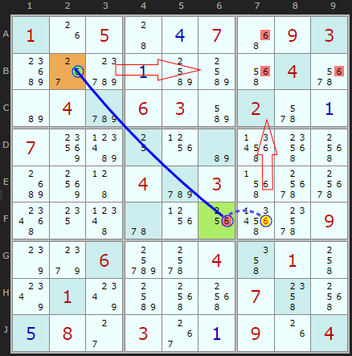

RE diagonals example : [Load Example](https://www.sudokuwiki.org/SudokuX.aspx?bd=X9B011g05440d074y0903c838d40abobo5e0476b604cy0603bm026a0a0794bl101xb65r5k5gc4904504cy035f78785c144h5u1x1w5r6g097s9k06dg6c044m014k800180bo5g5g074o5g0e082c03380a091g04) or : [From the Start](https://www.sudokuwiki.org/SudokuX.aspx?bd=105007093000000040040630200700000000000403000000000009006004010010000700080300904)

There is an easy to spot variation of Rectangle Elimination that uses the diagonals in Sudoku X puzzles - if there is a strong link between two specific candidates. This is the case for 6 between B2 and F2.

If B2 is the solution then it will remove the other 6s in row 5, at B7 and B9.

So we want to look at the other end for a 6 that will remove the final 6 in A7. That 6 is present on F7. If that were the solution it would force B2 to be the solution as well (via the strong link). So it follows F7 cannot be 6.

## Exemplars

* * *
