Title: Unique Rectangles - SudokuWiki.org

URL Source: https://www.sudokuwiki.org/Unique_Rectangles

Markdown Content:
# Unique Rectangles - SudokuWiki.org

SudokuWiki.org

Strategies for Popular Number Puzzles

*   [Sign up for more](https://www.sudokuwiki.org/SPHome.aspx)

*   [Main Page](https://www.sudokuwiki.org/Main_Page)
*   [What's New](https://www.sudokuwiki.org/Whats_New)
*   [Strategy Overview](https://www.sudokuwiki.org/Strategy_Families)

9x9 Solvers

*   [Sudoku Solver](https://www.sudokuwiki.org/Sudoku.htm)
*   [Jigsaw Solver](https://www.sudokuwiki.org/Jigsaw.aspx)
*   [Sudoku X Solver](https://www.sudokuwiki.org/SudokuX.aspx)
*   [Windoku Solver](https://www.sudokuwiki.org/Windoku.aspx)
*   [Colour Sudoku](https://www.sudokuwiki.org/ColourSudoku.aspx)
*   [Killer Solver](https://www.sudokuwiki.org/KillerSudoku.aspx)
*   [Killer Jigsaw Solver](https://www.sudokuwiki.org/KillerJigsaw.aspx)

6x6 Solvers

*   [6x6 Sudoku Solver](https://www.sudokuwiki.org/Sudoku6x6.aspx)
*   [6x6 Killer Solver](https://www.sudokuwiki.org/Killer6x6.aspx)
*   [6x6 KenKen Solver](https://www.sudokuwiki.org/KenKen6x6.aspx)
*   [6x6 KenDoku Solver](https://www.sudokuwiki.org/kendoku6x6.aspx)

Weekly 'Unsolvable'

*   [Unsolvable Sudoku](https://www.sudokuwiki.org/Weekly-Sudoku.aspx)
*   [Unsolvable Jigsaw](https://www.sudokuwiki.org/Weekly-Jigsaw.aspx)
*   [Unsolvable Str8ts](https://www.str8ts.com/weekly_str8ts.aspx)

Puzzles to Play

*   [The Daily Sudoku](https://www.sudokuwiki.org/Daily_Sudoku)
*   [Daily 6x6 Sudoku](https://www.sudokuwiki.org/Daily_Mini_Sudoku)New!
*   [The Jigsaw Sudoku](https://www.sudokuwiki.org/Daily_Jigsaw_Sudoku)
*   [The Daily Sudoku X](https://www.sudokuwiki.org/Daily_Sudoku_X)
*   [The Daily Killer](https://www.sudokuwiki.org/Daily_Killer_Sudoku.aspx)
*   [Daily Mini Killer](https://www.sudokuwiki.org/Daily_Mini_Killer_Sudoku.aspx)
*   [Daily Killer Jigsaw](https://www.sudokuwiki.org/Daily_Killer_Jigsaw.aspx)
*   [The Daily Kakuro](https://www.sudokuwiki.org/Daily_Kakuro)
*   [The Daily KenKen](https://www.sudokuwiki.org/Daily_KenKen.aspx)
*   [Daily Codewords](https://www.sudokuwiki.org/Daily_Codewords)
*   [1 to 25](https://www.str8ts.com/daily_1to25.aspx)
*   [The Daily Binairo](https://www.sudokuwiki.org/DailyBinairo)
*   [Letterlicious](https://www.letterlicious.com/Letterlicious_Home.aspx)
*   [Puzzle Packs](https://www.sudokuwiki.org/ACSPuzzles.aspx)

Basic Strategies

*   [Introduction](https://www.sudokuwiki.org/Introduction)
*   [Getting Started](https://www.sudokuwiki.org/Getting_Started)
*   [Naked Candidates](https://www.sudokuwiki.org/Naked_Candidates)
*   [Hidden Candidates](https://www.sudokuwiki.org/Hidden_Candidates)
*   [Intersection Removal](https://www.sudokuwiki.org/Intersection_Removal)

Tough Strategies

*   [X-Wing](https://www.sudokuwiki.org/X_Wing_Strategy)
*   [Chute Remote Pairs](https://www.sudokuwiki.org/Chute_Remote_Pairs)
*   [Simple Colouring](https://www.sudokuwiki.org/Simple_Colouring)
*   [W-Wing](https://www.sudokuwiki.org/W_Wing_Strategy)
*   [Y-Wing](https://www.sudokuwiki.org/Y_Wing_Strategy)
*   [Rectangle Elimination](https://www.sudokuwiki.org/Rectangle_Elimination)
*   [Swordfish](https://www.sudokuwiki.org/Sword_Fish_Strategy)
*   [XYZ-Wing](https://www.sudokuwiki.org/XYZ_Wing)
*   [BUG](https://www.sudokuwiki.org/BUG)
*   [Avoidable Rectangles](https://www.sudokuwiki.org/Avoidable_Rectangles)

Diabolical Strategies

*   [X-Cycles (Part 1)](https://www.sudokuwiki.org/X_Cycles)
*   [X-Cycles (Part 2)](https://www.sudokuwiki.org/X_Cycles_Part_2)
*   [3D Medusa](https://www.sudokuwiki.org/3D_Medusa)
*   [Jellyfish](https://www.sudokuwiki.org/Jelly_Fish_Strategy)
*   [Unique Rectangles](https://www.sudokuwiki.org/Unique_Rectangles)
*   [Tridagons](https://www.sudokuwiki.org/Tridagons)
*   [Fireworks](https://www.sudokuwiki.org/Fireworks)
*   [Twinned XY-Chains](https://www.sudokuwiki.org/Twinned_XY_Chains)
*   [SK Loops](https://www.sudokuwiki.org/SK_Loops)
*   [Extended Rectangles](https://www.sudokuwiki.org/Extended_Unique_Rectangles)
*   [Hidden URs](https://www.sudokuwiki.org/Hidden_Unique_Rectangles)
*   [WXYZ-Wing](https://www.sudokuwiki.org/WXYZ_Wing)
*   [XY-Chains](https://www.sudokuwiki.org/XY_Chains)
*   [Aligned Pair Exclusion](https://www.sudokuwiki.org/Aligned_Pair_Exclusion)

Extreme Strategies

*   [Grouped X-Cycles](https://www.sudokuwiki.org/Grouped_X_Cycles)
*   [Forcing Nets](https://www.sudokuwiki.org/Forcing_Nets)
*   [Exocet](https://www.sudokuwiki.org/Exocet)
*   [Finned X-Wing](https://www.sudokuwiki.org/Finned_X_Wing)
*   [Finned Swordfish](https://www.sudokuwiki.org/Finned_Swordfish)
*   [Inference Chains](https://www.sudokuwiki.org/Alternating_Inference_Chains)
*   [AIC with Groups](https://www.sudokuwiki.org/AIC_with_Groups)
*   [AIC with ALSs](https://www.sudokuwiki.org/AIC_with_ALSs)
*   [AIC with URs](https://www.sudokuwiki.org/Using_Unique_Rectangles_as_Links_in_Chains)
*   [Almost Locked Sets](https://www.sudokuwiki.org/Almost_Locked_Sets)
*   [Death Blossom](https://www.sudokuwiki.org/Death_Blossom)
*   [Sue-de-Coq](https://www.sudokuwiki.org/Sue_de_Coq)
*   [Digit Forcing Chains](https://www.sudokuwiki.org/Digit_Forcing_Chains)
*   [Nishio Forcing Chains](https://www.sudokuwiki.org/Nishio_Forcing_Chains)
*   [Cell Forcing Chains](https://www.sudokuwiki.org/Cell_Forcing_Chains)
*   [Unit Forcing Chains](https://www.sudokuwiki.org/Unit_Forcing_Chains)
*   [Double Exocet](https://www.sudokuwiki.org/Double_Exocet)
*   [Pattern Overlay](https://www.sudokuwiki.org/Pattern_Overlay)

Deprecated Strategies

*   [Remote Pairs](https://www.sudokuwiki.org/Remote_Pairs)
*   [Y-Wing Chain](https://www.sudokuwiki.org/Y_Wing_Chains)
*   [Multivalue X-Wing](https://www.sudokuwiki.org/Multivalue_X_Wing_Strategy)
*   [Multi-Colouring](https://www.sudokuwiki.org/Multi_Colouring_Strategy)
*   [Empty Rectangles](https://www.sudokuwiki.org/Empty_Rectangles)
*   [Guardians](https://www.sudokuwiki.org/Guardians)

Str8ts

*   [Home & Rules](https://www.str8ts.com/str8ts)
*   [The Daily Str8ts](https://www.str8ts.com/Daily_str8ts)
*   [Weekly Extreme Str8ts](https://www.str8ts.com/weekly_str8ts.aspx)
*   [Str8ts Solver](https://www.str8ts.com/str8ts.htm)
*   [Str8ts Sample Pack](https://www.str8ts.com/Str8ts_Sample_Pack.pdf)

Other

*   [What's New](https://www.sudokuwiki.org/Whats_New)
*   [Latest Articles](https://www.sudokuwiki.org/LatestArticles.aspx)
*   [Feedback](https://www.sudokuwiki.org/sudokufeedback.aspx)
*   [Donate](https://www.sudokuwiki.org/Donations)
*   [Syndicated Puzzles](https://www.syndicatedpuzzles.com/)

[Print Version](https://www.sudokuwiki.org/Print_Unique_Rectangles)

[Page Index](https://www.sudokuwiki.org/Site_Map)

790 Shares 

# Unique Rectangles

Unique Rectangles takes advantage of the fact that published Sudokus have only one solution. If your Sudoku source does not guarantee this then this strategy will not work. But it is very powerful and there are quite a few interesting variants. 

**Credits first**: The initial ideas for these strategies I lifted wholesale from **MadOverLord**'s description (11 Jun 05) on the forum at www.sudoku.com. (Sadly the thread is no longer hosted). Many others have since added to and improved them. I have provided my own examples. (please email me for other credit requests). I will stick to MadOverLord's nomenclature.

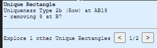27th January 2025

Added the ability to cycle through all **Unique Rectangles** found when the first is displayed.

Similar to how chains can cycle.

## Noticing the 'Deadly Pattern'

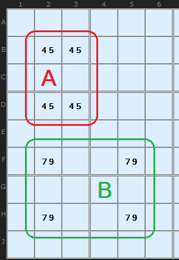

The 'Deadly Pattern' 

 In Figure 1 we have two example rectangles formed by four cells each. The pattern in red marked A consists of four conjugate pairs of 4/5. They reside on two rows, two columns and two boxes. Such a group of four pairs is impossible in a Sudoku with one solution. The reason? Pick any cell with 4/5. If the cell solution was 4 then we quickly know what the other three cells are. But it would be equally possible to have 5 in that cell and the others would be the reverse. There are two solutions to any Sudoku with this deadly pattern. If you have achieved this state in your solution something has gone wrong.

The pattern ringed in green looks like a deadly pattern but there is a crucial difference. The 7/9 still resides on two rows and two columns, but instead of two boxes it is spread over four boxes. Now, such a situation is fine since you can't guarantee that swapping the 7 and 9 in an alternate manner will produce two valid Sudokus. One of them is the real solution, the other a mess. Why? Swapping the 7 and 9 around places them in different boxes and 1 to 9 must exist in each box only once. In the red example, swapping within the box does not change the content of that box.

## Type 1 Unique Rectangles

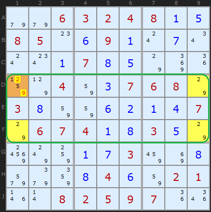

Unique Rectangle Figure 2 : [Load Example](https://www.sudokuwiki.org/sudoku.htm?bd=S9B9e9e06030204080a0e08050o0f090a0s0g0u0s0w0a070h0e7o8m1i857p04820c0706087o030h82820f0b0a0d077o0607040a0h030e7o987w840a0g038a8i0h9u9i860h040f8202011n0r08020509071i1q) or : [From the Start](https://www.sudokuwiki.org/sudoku.htm?bd=006324800850090000000700000004007680300000007067400300000003000000040021008259700)

 For all Unique Rectangles we are going to look for _potential_ deadly patterns and take advantage of them. A **Type 1 Unique Rectangle** is illustrated in Figure 2. The three yellow cells marked contain 2/9. The fourth corner marked in orange also contains 2/9 and two other candidates. If the 1/5 were removed from that cell we would have a Deadly Pattern. This cannot be allowed to happen so its safe to remove 2 and 9 from that cell. 

The proof is pretty straightforward once you get your head around the basic idea. Assume D1 is 2. That forces D9 to be 9, F9 to be 2, and F1 to be 9. That's the deadly pattern; you can swap the 2's and 9's and the puzzle still can be filled in. So if the Sudoku is valid, D1 cannot be 2. The exact same logic applies if you assume D1 is 9.

So D1 can't be a 2, and can't be a 9 

- it must be either 1 or 5.

## Type 2 Unique Rectangles

In Figure 3 we have a similar pattern, but this time, A5 and A6 (cells which are also in the same box) both have a single extra possibility - in this case, 7. 

To make subsequent discussion easier to follow, we will refer to the two squares that only have two possibilities as the floor squares (because they form the foundation of the Unique Rectangle); the other two squares, with extra possibilities shall be called the roof squares.

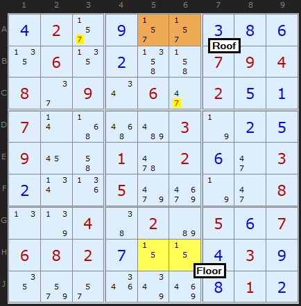

Unique Rectangle Figure 3 : [Load Example](https://www.sudokuwiki.org/sudoku.htm?bd=S9B0d022r0i2r2r0c0h0f1306130b4n4j070904082e090u062i020e0a070r4z56be037n0b0e09164i0162020f2i030b0v1j059mai7n2i080n7r044602b6050f070608020g0z0z0d030i129u2q1q7y8q0h010b) or : [From the Start](https://www.sudokuwiki.org/sudoku.htm?bd=020000000060000794809060200700003000900102003000500008004020507682000030000000010)

 In this **"Type-2 Unique Rectangle"**, one of the boxes contains the floor squares, and the other contains the roof squares. In order to avoid the deadly pattern, 7 must appear in either A5 or A6 (the roof squares). Therefore, it can be removed from all other cells in the units (row, column and box) that contain _both_ of the **roof** cells (in this case, row 1 and box 2). 

Now that you've gotten your head around the basic unique rectangle concept, the proof should come clear:

If neither A5 or A6 contains an 7, then they both become cells with possibilities 1/5. This results in the deadly pattern - so one of those cells must be the 7, and none of the other squares in the intersecting units can contain 7. So A3 and C6 can have 7 removed. This cracks the Sudoku.

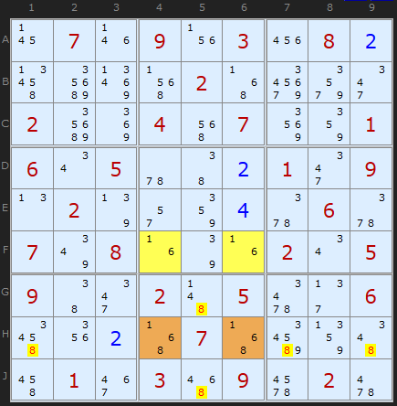

Unique Rectangle Figure 4 : [Load Example](https://www.sudokuwiki.org/sudoku.htm?bd=S9B17071n091v032208024vcm8v5f024zb29y2m02cm8m045e07928601060u055u4602012m090n027r2q86045y065y077y081f7q1f020u0509462m024b05662f064u1y024z074zby874e4q013e0356096i0262) or : [From the Start](https://www.sudokuwiki.org/sudoku.htm?bd=070903080000020000200407001605000109020000060708000205900205006000070000010309020)

I couldn't resist adding this example which I found while looking for [Empty Rectangles](https://www.sudokuwiki.org/Empty_Rectangles). It's as clear as day how the 8s in H4 and H6 combine with the [1,6] Deadly Pattern. 8's aligned with the brown cells are eliminated. I need say no more. 

To view this puzzle in the solver uncheck Rectangle Elimination and choose the second Unique Rectangle after the Type 5 which is found first.

## Type 2B Unique Rectangles

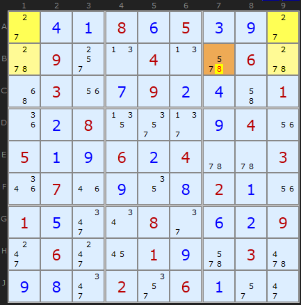

Unique Rectangle Figure 5 : [Load Example](https://www.sudokuwiki.org/sudoku.htm?bd=S9B2c0d0a080f050c0i2c5w092s0n040n6a065w4y031u0g090b0d4i011i0b08132u2f0i041u050a0i060b045u5u031q071m0i120h020a1u010e2m0u082e0f0b092k062k16010i6a03620i0h2m022u060a2q2i) or : [From the Start](https://www.sudokuwiki.org/sudoku.htm?bd=000805000090040060030090001008000040500604003070000200100080009060010030000206000)

 There is a second variant of Type-2 Unique Rectangles as illustrated In Figure 5. 

In this puzzle, we have the same pattern of 4 squares in 2 boxes, 2 rows and 2 columns. The floor squares are A1 and A9, and the roof squares are B1 and B9. However, in this Unique Rectangle, each of the boxes contains one floor and one roof cell. This is perfectly fine, but it means that the only unit (row/column/box) that contains both of the roof cells is row 2, so that is the only unit that you can attempt to reduce; in this case, B7 cannot contain a 8. This is called at **"Type-2B Unique Rectangle"**.

You will need to untick 3D-Medusa to see this example.

## Type 2C Unique Rectangles

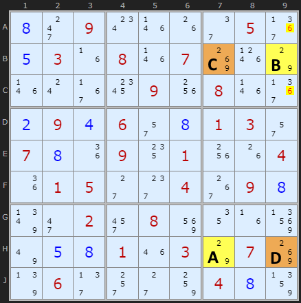

Unique Rectangle Figure 6 : [Load Example](https://www.sudokuwiki.org/sudoku.htm?bd=S9B0h2k090w1n1g2e053b0e031f081n078k1p7o1n0s371c091w081n3b0b090d062q0h01032q070h1i0914011w1g041i01052c2g0438090h7z2i022y088y121f937u0e0h011m037o078k7r062f2s2c84040h87) or : [From the Start](https://www.sudokuwiki.org/sudoku.htm?bd=009000050030807000000090800090600130700901004015004090002080000000103070060000400)

 HoDoKu [records this as a Type 5](http://hodoku.sourceforge.net/en/tech_ur.php#u5) but since it's a variation on Type 2 I'm going to categorize it as 2C. It is fairly rare but easy to understand.

This variation again has the extra candidate but in cells diagonally opposite. You can see the extra 6 in cells B7 and H9 (marked as C and D). 6 Must exist in one of those two cells so any 6 not in the deadly rectangle pattern that can 'see' C and D can be removed.

Not shown in the example is the chance that A or B can also contain the extra candidate 6. Lets say B did - the eliminations hold since those cells can see B9. But if the third extra candidate was in H7 then we could not look in box 3.

## Type 2D Unique Rectangles

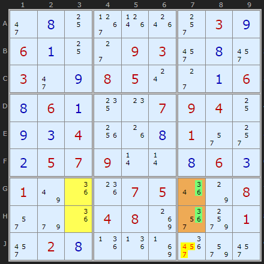

Naked Quint + UR : [Load Example](https://www.sudokuwiki.org/sudoku.htm?bd=S9B2i0h10391p1o2s030i060a102c09032y0h2y032i0i08050s2c0a060h060a140o070904100i0c041w1g0h012q2s0b0507090r0r0h060c017u1i1k07051q7o082q9e1i04088k3q9w012y020h1j1j8j3y9u2y) or : [From the Start](https://www.sudokuwiki.org/sudoku.htm?bd=000000030600093000300850006060007940004000100057900060100075008000480001020000000)

 David Hollenberg kindly brought to my attention to this example (turn off 3D Medusa to see) which he initially analysed as a Naked Quint with values {2,4,5,7,9) allowing {4,5,7} to be removed from J7. Stefan Boumans simplified this into a pattern I think is worth separating out. At least half the Type 3b below and some Type 4 are reduced to this pattern avoiding unnecessary complication.

We have a potential Deadly Rectangle on GH37 but if you look carefully 3 and 6 are only found in one cell outside the DR in box 9 (and in column 7). To avoid the Deadly Rectangle we must use candidates outside of it but 3 and 6 only occur in J7. That fact allows us to remove all other candidates from J7.

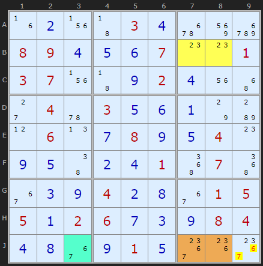

Type 2d example 2 : [Load Example](https://www.sudokuwiki.org/sudoku.htm?bd=S9B1f0b1v43030d6q8ydu08090d0e0f070o0o0103071v430i020d1u4y2c045u030e0f0a7ob80l060n0g080i0e040o0i0e460b0d01520752360c0i040b0h360105050a02060g0c0i08040d0h360i010e3c1k3c) or : [From the Start](https://www.sudokuwiki.org/sudoku.htm?bd=000030000890007001370002000040300000060080040000001070000400015502600084000010000)

 I include this example to illustrate the overlap with Type 3b. I coloured the cyan cell J3 to show where the locked cell is when combined with the roof cells J78 but all this is unnecessary. 2 and 3 only exist in J9 outside the roof tiles so we can go straight to the elimination of 6 and 7 there.

## Type 3 Unique Rectangles

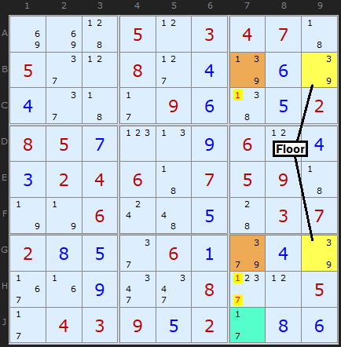

Unique Rectangle Figure 7 : [Load Example](https://www.sudokuwiki.org/sudoku.htm?bd=S9B8i8i45050l03040743052e0l082d047r067q042e432b09064705020805070p0n09060l040302040643070509437n7n060s4a054403070208052e06019i047q371f092m2m082h0l052b04030905022b0806) or : [From the Start](https://www.sudokuwiki.org/sudoku.htm?bd=000503470500800000000090002850000600024607590006000037200060000000008005043902000)

 Choose the second after the Type 5 to see this in the solver.

In this variant we have a floor with a pair as before but the roof contains two different candidates (occurring once or twice in each cell of the roof). In the Figure 7 the floor and roof contain [3/9] and the extra candidates in the roof are 1 and 7. Removing both the 1 and 7 from the roof would leave the deadly pattern so either the 1 in B7 must be a solution or the 7 in G7 is a solution. Knowing this does not get us as far as an elimination, however, but we can say that the 1 in B7 and the 7 in G7 act as a pseudo-cell in their own right. The clever bit is using this pseudo-cell with a bi-value cell containing the same candidates. Such a cell is circled on the board – J7. We effectively have a “locked set” like a Naked Pair. 1 will occur in B7 or J7 or 7 will occur in G7 or J7, we just don’t know which way round. 

Such reasoning allows us to remove other 1s and 7s on the unit shared by the roof cells (but not the cell we’re using to create a locked set with). There are 1s and 7s in C7 and H7 which can be eliminated.

## Type 3b Unique Rectangles

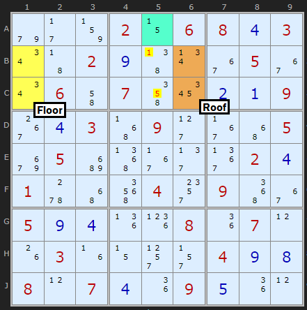

Unique Rectangle Figure 8 : [Load Example](https://www.sudokuwiki.org/sudoku.htm?bd=S9B9e2b83020z06080d030u43020i470v3605360u064i074m1a0b0a09380d034z092d374y05aa05c253372f3b020d015w4y5i042w095236050i0d1j1l081i070l1g031f0z2t2r040i0h080l070d1i090e1i0l) or : [From the Start](https://www.sudokuwiki.org/sudoku.htm?bd=000206803002000050060700009003090005050000020100040900500008070030000400807009000)

There is a compliment to Type 3, where the roof cells share the same box and that means the floor must be in a different box. Cells B1 and B2 form a pair with 3 and 4. These can see two cells in column 6 which also contain 3/4 as well as a 1 and an 5. We need to match this 1 and 5 in the roof cells with a bi-value cell to make a locked set (effectively a Hidden Pair). This can be along the row or column the roof cells are align with or in the same box. The cell we want is A5. No other 1s and 5s can exist in the same box so we remove 1 from B5 and 5 from C5.

I'd like to credit Hervé Gérard for the first example which he sent to me in November 2013 and later Tom Morrin for stating the box should be used as well.

## Type 3/3b with Triple Pseudo-Cells

So far Type 3 and 3b have worked with a pseudo-cell linking with a bi-value cell to make a pseudo pair. This is a valid locked set. Well, locked sets don't have to be pairs, they can involve three candidates over three cells.

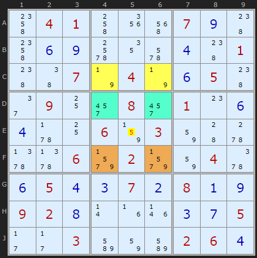

Type 3b with a Triple : [Load Example](https://www.sudokuwiki.org/sudoku.htm?bd=S9B4o04014k1y5e070i484o0f0i6c126a0d48014846077n047n0f05482e09102y082y010o0f0d5v1006830382445w5z5z069v029v82045y0f050d0c070b080a0i09020h0r1f1n0c0g052b2b03bm82bm02060d) or : [From the Start](https://www.sudokuwiki.org/sudoku.htm?bd=800900000020070050019500600200000970100000008054000002001009720090050060000006004)

 In this nicely symmetric example we have a deadly rectangle based on 1 and 9. The remaining candidates in the Roof are 5 and 8. Whether there are one or two of either 5 and 7 in the Roof is not important. We know 5 OR 7 has to appear in F46. Members of a Locked Set must all see each other, so we are looking at other cells that align with the roof, namely row F or box 5. For a Triple cell Locked Set we need two other cells that contain 5 and 7 and one other candidate not present in the Roof. D4 and D6 contain {4,5,7}. With our pseudo-cell that makes a Naked Triple. Naked Triple rules apply so 5 and 7 can be removed from E5 - the only other cell to see all parts of the locked set.

All credit to David Hollenberg for working this insight that nicely expands the strategy. 

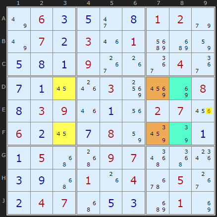

UR 3B example 2 : [Load Example](https://www.sudokuwiki.org/sudoku.htm?bd=S9B7u060c0e2i0h01029e7u070b031m01cic2820e0h0a09381g3a043a0g0a161o0390968i080h03091m0a1u020722060b160g08828e7q0a0a054y5009075a521s0c0i4y011g046q05380b04074y0e0cc2018i) or : [From the Start](https://www.sudokuwiki.org/sudoku.htm?bd=060000120070301000000900040000030008039000270600080000050097000000104050047000010)

Here is a triple with a slightly different pattern, also from David Hollenberg.

There are three candidates {3, 6, 7} in the pseudo-cell (the extra candidates in the roof). Instead of looking for an extra candidate to make up the triple in two other cells we look for all three candidates {3, 6, 7} in those two cells. These are in D8 and F8. These form a triple with the pseudo-cell in DF7. Naked Triple rules apply so we can eliminate the 6 in E9. 

Uniqueness Type 3b (Col) at DF37

- removing 6 at E9 (triple with D8+F8)

## Type 4 Unique Rectangles 

 - Cracking the Rectangle with Conjugate Pairs. (See also [Extended UR Type 4](https://www.sudokuwiki.org/Extended_Unique_Rectangles#type4).)

An interesting observation is that it is sometimes possible to remove one of the original pair of possibilities from the roof squares. Consider the following puzzle in Figure 10 which is a continuation of the Sudoku puzzle used in the first example.

Look closely at the roof squares, A4 and A6, but this time, don't look at their extra possibilities; look at the possibilities they share with the floor squares. 

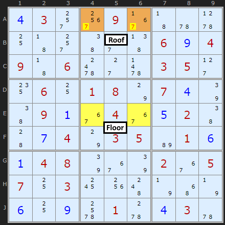

Unique Rectangle Figure 10 : [Load Example](https://www.sudokuwiki.org/sudoku.htm?bd=S9B0d032s3o0937435u5x10432s462s47060i04094306642c6303052d14061001087o070d7q46090a3604360e0246440g047o0305b6010f0a04087q367q023605071003181w4c7n4y7n0f100i6c015w0d035u) or : [From the Start](https://www.sudokuwiki.org/sudoku.htm?bd=030090000000000604906000350060180700090040020004035010048000205703000000000010030)

If you look carefully, you'll see that in box 2, the roof squares are the only squares that can contain a 6. This means that, no matter what, one of those squares must be 6 - and from this you can conclude that neither of the squares can contain a 7, since this would create the "deadly pattern"! So you can remove 7 from A4 and A6. 

Nomenclature: When two squares are the only two squares in a unit that can have a particular value, they are referred to as a conjugate pair on that value. 

This is an example of a **"Type-4 Unique Rectangle"**. As you have probably realised, since the roof squares are in the same box, you can search for conjugate pairs in both of their common units (the row and the box, in this case). 

## Type 4B Unique Rectangles

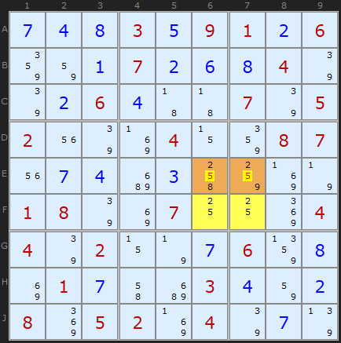

Unique Rectangle Figure 11 : [Load Example](https://www.sudokuwiki.org/sudoku.htm?bd=S9B0g0d0h030e09010b0686820a070b0f0h047q7q0b060d4343077q05021u7q8j040z8608071u0g0dc20c4k848j7n01087q8i0710108m04047q020z7n0g06870h8i010g4ic2030d820b088m05028j047q0g7r) or : [From the Start](https://www.sudokuwiki.org/sudoku.htm?bd=000309106000700040006000705200040087000000000180070004402000600010003000805204000)

 And, as you might expect, there is a **Type-4B Unique Rectangle** variant, in which the floor squares are not in the same box, and you can only look for the conjugate pair in their common row or column. For example:

In this case, since 2 can only appear in row E in the roof squares, 5 can be removed from both of them. 

As Type-4 Unique Rectangle solutions "destroy" the Unique Rectangle, it is usually best to look for them only after you've done any other possible Unique Rectangle reductions.

## Type 5 Unique Rectangles

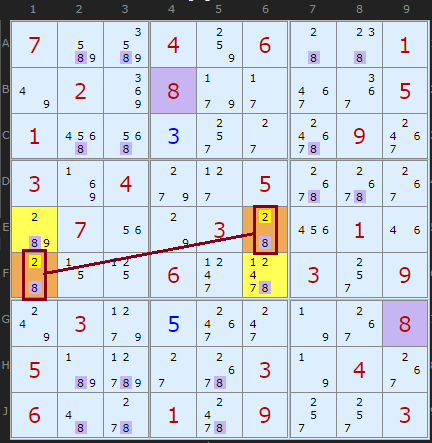

Unique Rectangle Type 5 : [Load Example](https://www.sudokuwiki.org/sudoku.htm?bd=S9B07bmbq0484064448017u028m089f2b3e3a05015m5e0c2s2c70093g038j049g2d056s6s38b8071u7o034422011m440z11062l65032s097w039h0e3g2k7n380805b7d12c6s037n0438064a5w0164092s2s03) or : [From the Start](https://www.sudokuwiki.org/sudoku.htm?bd=700406001020800005100000090304005000070030010000600309030000008500003040600109003)

As of January 2021 we have a new Unique Rectangle elimination! Thanks to Ivar Agy from Norway who shared an example with me. Not to say that it might have been discovered elsewhere, I can't check, but please come forward if there are earlier references. Since it is vaguely related to Type 1 (in that it attacks candidates in the rectangle, not outside), and is quite simple to spot, the solver searches for it after Type 1 and before the others. However, I am obliged to call Type 5 since I don't want to re-number everything. 

Any rectangle across two boxes that contains two candidates in all four cells might have two opposite corners containing only two candidates, like the {2,8} in E6 and F1. If one of those candidates is linked to the other corners with strong links (ie no other 2s or 8s in the two rows and two columns of the rectangle), it could create a Deadly Rectangle. We are looking for a diagonal Naked Pair - each cell can't see the other, but it is locked. If 2 (the weakly linked candidate in the pair) was ON in either E6 or F1 it would force 8 to be in the other corners. This is not allowed so 2 can be removed from the Naked Pair. Very cool.

[Ivar's example](https://www.sudokuwiki.org/sudoku.htm?bd=008950304094030000000824009050300090387269541000508023105082930000005480806093005) can be found if you turn off 3D Medusa first.

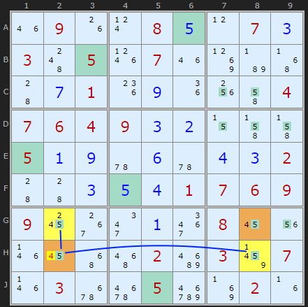

Type 5 Example 2

(untick XY-Chains) : [Load Example](https://www.sudokuwiki.org/sudoku.htm?bd=S9B1m091g0t080e0l070c034c051p071m8lb74z440g011k0i1i1w4i04070604090c0b0z4j4j050a0i5u0f5u0d0c0244440c0e0d010706090918383i0a3i08161u1n164y5602ca038b071n036q6y05e28j021f) or : [From the Start](https://www.sudokuwiki.org/sudoku.htm?bd=090080070305070000001000004764900000500000002000001769900000800000020307030050020)

Up to 2024 I was detecting a pattern where all four candidates (8 in the example above) had strong links forming a loop all the way round. This was too restrictive. If just one pair of strong links exists we can eliminate on the pivot or mid-cell, provided that cell is one of the bi-value ones. In this example there are strong links from H2 to G2 and from H2 to H8. So if H2 is 4 then both G2 and H8 are 5, causing G8 to be 4. But this is a deadly pattern, so H2 cannot be 4.

Uniqueness Type 5: removing 4 from H2 because if true it would create a Deadly Rectangle with G2 and H2

## Unique Rectangle Exemplars

 These puzzles require two Unique Rectangle strategies at some point but are otherwise trivial and only requires singles.

 They make good practice puzzles.

 Created by Klaus Brenner 
*   [Exemplar 1, Type 1 + Type 2](https://www.sudokuwiki.org/sudoku.htm?bd=000806000200010074009700010006000201300000600020000000030005000002000080810002953)
*   [Exemplar 2, Type 1 + Type 2](https://www.sudokuwiki.org/sudoku.htm?bd=000000000074180060020004030080000000600009000200356000000203100000001640065000900)
*   [Exemplar 3, Type 1 + Type 4](https://www.sudokuwiki.org/sudoku.htm?bd=080720013000000000100300000000006031030504060020910700200100908005008004000000000)
*   [Exemplar 4, Type 1 + Type 4](https://www.sudokuwiki.org/sudoku.htm?bd=100000040060010000070900056000009000009005030510070090000000200806000307204000000)
*   [Exemplar 5, Type 2 + Type 4](https://www.sudokuwiki.org/sudoku.htm?bd=009006002045003008000010030080001050004000080100760000000207500000090000000000023)
*   [Exemplar 6, Type 2 + Type 4](https://www.sudokuwiki.org/sudoku.htm?bd=650708000020060000000300042800002001100490000090030000080009050000500080000000300)
*   [Exemplar 7, Type 3b](https://www.sudokuwiki.org/sudoku.htm?bd=910240000000080600000006700500004902030000070704800006005300000003020000000079043) Uses two sets of cells for 6 eliminations
*   [Exemplar 8, Type 4 + Type 4](https://www.sudokuwiki.org/sudoku.htm?bd=300200640005040000000050900002000090050000006090000051400863000060007800000400302)
*   [Exemplar 9, Type 4 + Type 4b](https://www.sudokuwiki.org/sudoku.htm?bd=000024000200005310800070020060000000000000095004090002001009000000600000007501064)

Go back to [Jelly-Fish](https://www.sudokuwiki.org/Jelly_Fish_Strategy)Continue to [Extended Unique Rectangles](https://www.sudokuwiki.org/Extended_Unique_Rectangles)

* * *

# Comments

Your Name/Handle

Email Address - required for confirmation (it will not be displayed here)

Your Comment

Please enter the

letters you see:

- [x]  Remember me

Please ensure your comment is relevant to this article.

**Email addresses are never displayed, but they are required to confirm your comments.** When you enter your name and email address, you'll be sent a link to confirm your comment. Line breaks and paragraphs are automatically converted - no need to use 
 or   tags.

Comments[Talk](https://www.sudokuwiki.org/Unique_Rectangles?talk#comments)

## ... by: d.harper

Thursday 28-May-2026

HI Andrew,

Type 3b, looks like a typo in text copied below.... expecting {3, 6, 9} but reads {3, 6, 7}

"There are three candidates {3, 6, 7} in the pseudo-cell (the extra candidates in the roof). Instead of looking for an extra candidate to make up the triple in two other cells we look for all three candidates {3, 6, 7} ....."

regards, d harper

REPLY TO THIS POST

## ... by: Howard Weiss

Friday 19-Dec-2025

I have been working for a while on a SUdoku solver patterned on your web site.

I have implemented the logic in the section on Uniquerectangles, but I am finding that there are many more possible DeadlyPatterns in the examples for UniqueRectangle that are not found per this section

I took a different approach. For each cell which contained one of the values in the floor cells, I set that cell that value and then "solved" using Naked Pairs, triples etc. This turned up a number of additional deadly pairs

For instance, in the first example, setting cells H1 or H2 to 9 create deadly patterns with cells A1 and A2

In the second example, setting F5 to 4 create a deadly pattern with E5, E8 and F8 (but, interestingly setting E5 to 4 does not create a deadly pattern)

Do you agree?

REPLY TO THIS POST

## ... by: Howard Weiss

Wednesday 17-Dec-2025

Please confirm that in the Type 1 Example

Rectangle wtih floor A1 and A2 and roof H1 and H2 is also a Type 4 rectangle (eliminate 9's)

REPLY TO THIS POST

## ... by: Wolfgang M.

Tuesday 16-Dec-2025

Hi Andrew,

when I was studying your explanation of UR Type5, I struggled over the enclosed sentence :

(ie no other n in the two rows and two columns of the rectangle)

where I could not imagine what you meant by the placeholder "n"

in this sentence.

Could this please be explainded more specific - thank you.

Thanks to Autoclear I'm now able to solve all 4/5 levels each Day.

Regards Wolfgang

Andrew Stuart writes:

How about “no other 2s or 8s in the two rows and two columns”

It refers to the possibility that the corner candidates (in this example 2 and 8) might be strong links and I was reminding the reader what a strong link was (probably unnecessary at this advanced level)

Glad to see you solving high grade puzzles

Add to this Thread

## ... by: Cerberus

Sunday 17-Aug-2025

Surely, your Unique Rectangles, Type 5 are just plain Hidden Rectangles , that may or may not, have the home cell in either, or both, diagonal bi value cells

REPLY TO THIS POST

## ... by: Alan

Friday 7-Mar-2025

I don't understand the following with reference to type 4 rectangles:

"As you have probably realised, since the roof squares are in the same box, you can search for conjugate pairs in both of their common units (the row and the box, in this case)"

I assume that the conjugate pair in figure 10 are the 6s in the roof squares, which have to be in the same row or we wouldn't have a unique rectangle, so how can the box come into it? I'm probably misunderstanding something.

REPLY TO THIS POST

## ... by: martin

Friday 22-Nov-2024

There are some peculiar properties of URs (and other 'deadly' patterns) which should be pointed out:

1. A deadly patter remains 'alive' even if some of the corners of the UR have been resolved.

 Up to three corners can be resolved. Once the fourth corner is resolved, obviously

 the result is either deadly or avoided. With three resolved corners, the fourth corner

 therefore (to avoid) needs to discard the candidate found in the diagonally opposite cell.

2. Since many interactive solvers do not distinguish in their display between resolved and

 preset cells: That distinction is vital!! A preset cell by definition can never be part of a

 deadly UR!! In fact, that is what presets are all about: avoiding these deadly patterns.

 Think of the empty board as a humongous deadly pattern!

 Similarly, when posting examples, the distinction could be very important.

Andrew Stuart writes:

Reasonable observations, good to make

If you’ve not see it, [Avoidable Rectangles](https://www.sudokuwiki.org/Avoidable_Rectangles) use this information

Add to this Thread

## ... by: martin

Friday 22-Nov-2024

it was already mentioned that Hodoku has a type 6, which can be applied multiple times

when there is the same pair present at different positions.

Applying Hodoku type 6 multiple times resolves the Types 4, 4B and 5 here.

The same is true for Type 1, with the caveat of the extra condition checks, which are,

however, trivially fulfilled.

Andrew Stuart writes:

I've checked this. Hodoku's "Type 6" is my "Type 5" although I go about detecting it backwards to Hodoku and I eliminated the other number in the pair. For example, in his example, I remove 2 and not 5. Two approaches, same result. [Load example](https://www.sudokuwiki.org/sudoku.htm?bd=039500008500000002000020400041905000900070030000008570008006700000000000190000000) (You have to turn off quite a few intermediary strategies to trigger it).

Add to this Thread

## ... by: Aleksandra Z

Monday 28-Oct-2024

After noticing it recently in the puzzle below, I have started using a pattern which resembles a weaker but more common version of Type 5; in short, an elimination still is possible even if only a single strong link is present, as opposed to the full rectangle being linked strongly.

If a rectangle across two boxes has opposing corners with only the same two candidates X/Y, and if one candidate X has just one strong link to an adjacent corner, then X can be removed from the other corner. The reason is that placing X there would force adjacent double Y, but then the strong link demands opposite X, which is the ambiguous pattern we are trying to avoid.

This is an example puzzle, which reaches that scenario if XY-Chain and 3D Medusa are disabled:

000000025002753004900800000280010050030408010010020078000009007300586200690000000

It occurs in the rectangle AC37, and it becomes available immediately after A7 becomes 3/7 along with its opposite C3, also immediately before the solver finds other unique rectangles. From here, it suffices to note that 7 is strong in row C—that alone is enough to remove 7 from A3. Independently of that, because the other candidate 3 is strong in row A it can be eliminated from C7.

As it happens, 7 was also strong in column 7 (and 3 strong in column 3), but I emphasise that only one of those strong links are required for an elimination. The reduced need for strong links makes this partial pattern much more common; unlike the full Type 5 pattern (or the very useful Hidden Unique Rectangle pattern!), neither candidate is required to form an X-Wing.

Personally I imagine it as a "partial unique rectangle" or perhaps a "unique rectangle edge elimination" given that demanding uniqueness risks eliminating a candidate from one edge, but in the context here it is described very well as a lighter version of Type 5!

REPLY TO THIS POST

## ... by: Mika

Saturday 26-Aug-2023

It seems like Type 5 Unique Rectangles is a variation of Type 4 (Not entirely sure).

Andrew Stuart writes:

Yes. Hodoku has documented it on his site as "Type 6" and states it is a variation UR Type 4 (his and mine)

Add to this Thread

## ... by: David Harkness

Thursday 24-Aug-2023

Type 3 can be extended to hidden pairs/triples/quads similar to how it works with naked tuples by treating the floor cells as a single pseudo cell. Might this become type 3c?

In this example, the UR is in BC69. Since 347 form a hidden triple in C4, C5, and C69 (the pseudo cell), 5 and 6 may be eliminated from C4 and C5. It does not allow eliminating 56 from the floor cells, however.

+-----------------+------------------+--------------+

| 7    5   2      | 9     36   8     | 16  4   136  |

| 3    48  48     | 2     1    56    | 79  79  56   |

| 69   1   69     | 34567 3456 3567  | 2   8   356  |

+-----------------+------------------+--------------+

| 145  6   3      | 457   8    2     | 147 17  9    |

| 14   2   7      | 346   9    36    | 5   16  8    |

| 8    49  459    | 1     456  567   | 467 3   2    |

+-----------------+------------------+--------------+

| 2    7   1      | 356   356  9     | 8   56  4    |

| 4569 489 45689  | 56    2    1     | 3   569 7    |

| 569  3   569    | 8     7    4     | 169 2   156  |

+-----------------+------------------+--------------+[Load Sudoku](https://www.sudokuwiki.org/sudoku.htm?bd=411105g12881220h2a098g8g050330k0k030i003i07o3o780581381i21095g81054i42g10i05412og12811228181gghg033g706g09050541033838g181300hjgogrg30050309j041j009j081410hi20532)

Unfortunately, the naked pair 56 in C1 and C3 eliminates the 6 from C6 and C9, breaking the UR.

REPLY TO THIS POST

## ... by: David Harkness

Wednesday 23-Aug-2023

Greetings, Andrew.

It seems type 3b should extend to naked quads and hidden pairs/triples/quads as well.

Cheers,

David

REPLY TO THIS POST

## ... by: Robert

Sunday 25-Jun-2023

Just to follow up - in the first graphic on this page, the "deadly pattern" only remains deadly in Killer Sudoku if either

a) B2 and B3 are in the same cage, and D2 and D3 are in the same cage, or

b) B2 and D2 are in the same cage, and B3 and D3 are in the same cage.

We could also have all four in the same cage, but this is precluded if we are using the "killer cage convention".

REPLY TO THIS POST

## ... by: Robert

Sunday 25-Jun-2023

I've just sent a detailed email, but the short summary here is - be careful applying the Unique Rectangle strategies to Killer Sudokus. It all depends on the particular "cages" the four points of the rectangle are in.

So this idea that all regular Sudoku strategies also work on Killer Sudokus - I don't think it extends to "uniqueness" strategies, at least not without some additional assumptions on the cages.

This can be seen in Killer #5768 (June 22). Use the solver until it decides to remove "5" from cell J7. This is based on a "UR" strategy, and ultimately finds one solution. However, this is another solution that does have a "5" in J7 - the inference, that the 5 can be removed, is only valid in one of the two solutions.

REPLY TO THIS POST

## ... by: Steve Benoit

Thursday 16-Mar-2023

Hi,

I think I've seen your type 5 Unique Rectangles before. It took me a while to remember where... Check out Sudoku Swami's "Unique Rectangles Part 2 / Sudoku Tutorial #21" on Youtube beginning at time-stamp 12:32. He refers to them as UR-Type 6.

Fantastic website by the way! I wish I had found it much sooner...

Steve

REPLY TO THIS POST

## ... by: Tapio Ranta-aho

Tuesday 6-Dec-2022

Hello . 

I wonder if this can be a version of unique rectangles? This happened once and candidate 5 appeared to be correct, but I don't know that wasn't just a coincidence.

 ___ ___ ___ ___ ___ ___ ___ ___ ___ 

 ___ ___ ___ ___ ___ ___ ___ ___ ___ 

 ___ 12_ 12_ ___ ___ ___ ___ ___ ___ 

 ___ 12_ ___ ___ ___ 12_ ___ ___ ___ 

 ___ ___ ___ ___ ___ ___ ___ ___ ___ 

 ___ ___ 12_ ___ ___ 125 ___ ___ ___ 

Thanks, 

Tapsa

Anonymous replies:Tuesday 17-Jan-2023
The given example is correct, but the solver doesn't search for this pattern.

Pieter, Newtown, Oz replies:Thursday 2-Feb-2023
@Tapio Ranta-aho.

Assuming the "12" pairs are Naked Pairs (no other candidates), this is virtually a "stretched" Type 1 UR. 

Also @Andrew

I refer you to Jonathan Handojo's comment on 2021-06-9 finding that the Solver skips UR's and jumps to WXYZ, similar to my earlier comment on 2019-12-16. 

I also found a sorta Type 5 in your daily puzzle for 2023-01-21 but not in the Solver order, which I will try to retrieve and send separately. 

As always thanks for a fabulous website! 

Ciao, Pieter

Add to this Thread

## ... by: Maggie Mc

Tuesday 5-Apr-2022

I played a game of brainium sudoku in which the four corners of a square had the same two numbers could only have those two numbers because they were the only spaces left in their respective rows. This should not be possible. I can send a screen shot. Can you explain?

Andrew Stuart writes:

Please do

Anonymous replies:Tuesday 17-Jan-2023
Are the cells falling in two boxes?

Add to this Thread

## ... by: Anonymous

Monday 10-Jan-2022

[HoDoKu](http://hodoku.sourceforge.net/en/tech_ur.php#u6) already has a documentation of Type 5 (under the name Type 6), _and_ it mentions that it is the same as two HUR type 1's.

Seeing the website hasn't been updated for about 8-9 years, this type has been known for a long time already.

REPLY TO THIS POST

## ... by: Anonymous

Friday 31-Dec-2021

Isn't a Type 5 UR just two Type 1 HURs on the same spot?

REPLY TO THIS POST

## ... by: Pieter, Newtown, Oz

Thursday 4-Nov-2021

Hi Andrew

Re Type 5 URs

1. The output from the solver says, for example, "Uniqueness Type 5: removing 2 from E6 and F1 because if true it would create a Deadly Rectangle with E1 and F1". It should read "... would create a Deadly Rectangle with E1 and ***F6***".

2. I've noticed odd characters in some places in the text, such as "Thanks to Ivar Ag�y from Norway" in Type 5 above. Also in the Digit Forcing Chains strategy - Second Example "DIGIT FORCING CHAIN: because … -5[G9]+5[F9]-5[F1]+5[C1] ��-4[C1]+4[B1". 

I find it curious that you "updated" version 2.08, twice, rather than naming them 2.09, 2.10?

Thanks as always

Ciao

Pieter

REPLY TO THIS POST

## ... by: alpreucil

Wednesday 18-Aug-2021

Andrew! Where is your Solver??? The wonderful one with the black background. I've used this solver for years to solve the puzzles that puzzled me, and I found it very user-friendly and helpful. NONE of the other solvers I've tried hold a candle to it. I want it back! Any reason why it has disappeared from the site??? Thanks! Al Preucil

Andrew Stuart writes:

Always at https://www.sudokuwiki.org/sudoku.htm

Never been down except for server migrations

Add to this Thread

## ... by: Tunner

Monday 12-Jul-2021

Through out this section you repeatedly state that the "rectangle" consists of 2 rows, 2 columns, and 2 boxes. But, is it not true that the process is the same if there are 2 rows, 3 columns, and 2 boxes? Or 3 rows, 2 columns, and 2 boxes? I think the boxes are the important link. This may not be true for all types but it seems to work for type 1.

Andrew Stuart writes:

Sounds like an [Extended Unique Rectangle](https://www.sudokuwiki.org/Extended_Unique_Rectangles)

Add to this Thread

## ... by: SG

Tuesday 6-Jul-2021

There is a Sudoku board I would like you to look at for another example of Type5.

[Click on this link](https://www.sudokuwiki.org/sudoku.htm?bd=000005302006030900080009070000100800070000095001060200054000000002000000810000006)

Andrew Stuart writes:

Nice one

Add to this Thread

## ... by: BobW

Saturday 19-Jun-2021

Hi Andrew,

I believe the new type 5 that you posted (January 2021), has been known for some time.

It is described on the enjoysudoku forum, along with many other variations of UR's having two extra candidate cells, located diagonally. That post is dated April 2006. I ran across it while implementing UR's in my own solver last year.

http://forum.enjoysudoku.com/post26448.html#p26448

If I'm not mistaken, the one that you refer to as Type 5 is referred to as UR+2D/1SL (not to be confused with UR+2D or UR+2d).

I spent many hours going through that post and many others in the same thread. The logic for many of them is so convoluted that it made my head spin. It occurred to me that it would be much simpler just to work out the truth tables for them. One day, having nothing better to do, that's exactly what I did. I worked out the truth tables for every possible combination of UR's with 2, 3 or 4 extra candidate cells ("Guardian cells" in my notation) with every possible combination of strong links between the various cells. Summarizing only patterns that give eliminations of internal UR candidates, I found 8 different UR+2 patterns with adjacent guardians, 11 different UR+2 patterns with diagonal guardians, 18 different UR+3 patterns, and 5 different UR+4 patterns.

When I refer to the number of patterns found, I've excluded reflections and rotations of the basic patterns. I implemented the resulting rules using a lookup table in my solver.

There's not enough room here to give all of my results, but if you contact me by email, I'd be happy to share what I've done.

Andrew Stuart writes:

Hi Bob

That sounds like thorough work, well done. I should take it all in and completely redo the UR. Big job though. 

Add to this Thread

## ... by: Jonathan Handojo

Wednesday 9-Jun-2021

Here's a puzzle that I purchased from one of your Diabolical packs (and I have been enjoying a lot of these. I hope it's fine with sharing one of those puzzles here.) [load here](https://www.sudokuwiki.org/sudoku.htm?bd=000000075000301040060002090000080300070000080003740000040000020010608000930200000)

If you use the Solve Path with every checkbox ticked, you get a WXYZ-Wing evaluation. It seems to have skipped through the Unique Rectangles strategy when there's one in B7, B9, J7 and J9 that allows the eliminations: 8 from J7, 6 from J9, and 8 from B9. Either value you force into them forms the deadly pattern, so I solved the puzzle quite with ease after using this. Now I'm not too sure of the rules with this, but I only saw it through forcing.

Andrew Stuart writes:

Something happening here. Will have to investigate.

Andrew Stuart writes:

2025. This puzzle no longer finds a WXYZ wing and I have to turn off XY-Chains, 3DM and HUR to get one. The [position at that point](https://www.sudokuwiki.org/sudoku.htm?bd=S9B0c440r4a0f0i450705440e0i030g015004502j062j4a0e0243090c0t7o1p7n081u031v0g0z071v7n0b0c0d088i43b60307041u1w1v8k0f040h0e0c0g0i020a2s012s060i082q0c0d09032q020a0d761u4y) looks too candidate dense to reveal a UR in BJ79 (to me) but can anyone else spot it? 

Add to this Thread

## ... by: Pieter, Newtown, Oz

Monday 16-Dec-2019

Hi Andrew

As always thanks for a fabulous website!

Solving your [Daily Sudoku for 2019-11-15](https://www.sudokuwiki.org/sudoku.htm?bd=..5......69.8..4..8..9....65....9.8...32.79...7.1....34....2..7..1..3.68......3..) I believe it has a Type 4 UR which the solver does not find.

After solving the basics we are left with [this board](https://www.sudokuwiki.org/sudoku.htm?bd=305000800690800400800900006500309781103207900970100623430002007751493268200000300) and the solver next finds an XYZ-Wing.

If you backstep and turn XYZ and X-Cycles off, I would expect the solver to find what I believe to be a Type 4 UR in EJ89, with the floor in E8/9, and the conjugate pair of 4's in J8/9, eliminating the 5's in J8/9. However, the solver skips all URs and finds a WXYZ. 

Is this correct/a bug?

Ciao, Pieter 

REPLY TO THIS POST

## ... by: Niki

Friday 7-Sep-2018

I'm curious why the Unique Rectangle strategy isn't included in the Jigsaw Sudoku solver. Do other strategies there render it irrelevant?

I ask because I just spotted one for the first time in an extreme jigsaw puzzle - it was a 3/3b (triple), and it made the rest of the puzzle collapse nicely. Despite the jigsaw shape, it still fell in two rows, two columns, and two boxes just like it ought. But I was hesitant to follow up on it, having never seen the Unique Rectangle strategy mentioned in conjunction with jigsaws.

Andrew Stuart writes:

This is on my to-do list. Merely satisfying the criteria may not be enough to be a true elimination in all cases. This is my intuition but I need to find some counter-examples. I believe that the potential distortions do not allow it in most cases. Can you send me the puzzle? (use the email button). I should be able to run my library through with UR turned on and see if a rule can be devised, but it will be a qualified one I suspect

Add to this Thread

## ... by: Pieter, Newtown, Oz

Thursday 12-Jul-2018

Hi Andrew

I am confused by the solvers handling of URs in this [partially solved puzzle](https://www.sudokuwiki.org/sudoku.htm?bd=793400000261070940845000002658701400309040006402609800904067201027000364006004000)

I have spotted what I believe to be a clear Type 4 UR in CH45, on 1/9. However, the solver finds a Type 3b combining with the 5/8 in H6 and then the puzzle solves. 

I tried unchecking URs and the solver finds a Hidden UR Type 1 and eliminates the 1 in H5. Why does it not eliminate the 1 in H4? Taking Steps to try again, even re-checking the UR box, the solver moves to a HUR in EF28. 

A 1 in H4 would create the Deadly Pattern. Why isn't it eliminated? Bug?

Ciao, Pieter

Andrew Stuart writes:

I tested this position and yes the Type 4 does get detected, well spotted. It's the ordering of the URs which means 3B will get tested and return first. Thinking of adding a toggle for them all in the strategy list

Add to this Thread

## ... by: digituer

Thursday 2-Nov-2017

It's a pleasure reading your pages. I've learned a lot. Thanks Andrew!

The pseudo-cell concept in Type 3 is great! I think based on this pseudo-cell concept, a hidden pair strategy can also be applied.

12 . . | . . 12AC

 . . . | . . .

12 . . | . . 12AB

---------------------------

 . . . | . . 12FE

If the 2 roof cells and that extra cell are the only three cells holding 12 in the unit, then FE can be removed (ABCFE can be any numbers).

REPLY TO THIS POST

## ... by: AAHoffman

Monday 17-Apr-2017

I often extend this strategy to 3, 4, or even more naked pairs forming multiple "floors" or a multi-story structure, i.e.,

A1=A2={2,4}

D1=D2={2,5}

G1=G2={4,5}

as a simple example. Solutions devolving to this can be eliminated.

Multiple floors can be bent and don't have to be in a straight line, i.e.,

A1=A2={2,4} (row)

D1=E2={2,4} (note: forms a diagonal that "bends" the structure)

D4=E4={2,4} (column)

Another possibility uses naked triples in three rows, i.e.,

{A1,A2,A3}={2,3,4} (in any combination (except naked single or pair), i.e., {23},{24},{34})

{D1,D2,D3}={2,3,4} (i.e., {24},{34},{23})

{G1,G2,G3}={2,3,4} (i.e., {34},{23},{24}).

All these patterns occur often enough to be useful.

By the way, not sure how nomenclatures are standardized but I have named these "meta" strategies instead of naked rectangles... because they are a rule dependent on a rule of the game. When three digits are involved as above, I call them "triple meta".

REPLY TO THIS POST

## ... by: Barry

Wednesday 13-Jul-2016

Using the type 1 example, couldn't the removal of just the 2 or just the 9 prevent a deadly pattern? Of course, you wouldn't necessarily know which one to eliminate at that point, but isn't it possible that another solving technique might eventually eliminate one of the primary candidates thus no longer making it part of a unique rectangle? I know the methodology works and that neither candidate will be part of the final solution, but just don't see the logic of being able to say that both candidates should be eliminated.

REPLY TO THIS POST

## ... by: Thinkist

Friday 29-Apr-2016

Hello again...

I came to a clearer realization on why I dislike uniqueness strategies: they mess with the solution count if a sudoku happens to have multiple solutions, erroneously decimating otherwise valid solutions. I point you to an example of mine [here](https://www.sudokuwiki.org/sudoku.htm?bd=805307094073109206901000703100090400240031000507000010350000001010970000000010038). It has 63 solutions, but 4 URs erroneously deduce it to 3, and then one use of the BUG strategy erroneously deduces it to 1. So, this makes the puzzle appear valid when in fact it should have 63 solutions all along and the solver should fail to complete correctly. The chaining, netting, and simple combinatoric strategies don't mess with the solution count. In those cases, simply because there is more than one solution, the solver will merely fail to complete correctly rather than throw up an error. I believe that any puzzle (or "puzzle", if you will) that throws up a contradiction should have 0 solutions from the start, not because of a uniqueness strategy.

Re-reading your reply to my first comment, I'm glad that you've not decided to add a solution count before any logical solving takes place, as that would of course ruin the purpose of using the solver, which is to showcase a bottom-up approach to sudoku solving rather than cheat it with a brute-force top-down approach.

And for the record, I realize that any valid sudoku puzzle should have only a single solution. The point I'm trying to make is that uniqueness strategies aren't the best way to find it (which is why I still have them unchecked in the solver). In essence, they assume what you are trying to prove (via chaining, netting, and simple combinatoric strategies): that the puzzle has a unique solution.

Andrew Stuart writes:

I'm interested in your assertion "The chaining, netting, and simple combinatoric strategies don't mess with the solution count". If true it would be one way of showing that a puzzle might be valid (by completing using such strategies) but it would require some kind of proof to show that all a) all valid sudoku puzzles can be solved using only these strategies minus uniqueness strategies and b) that all multi-solution (non-valid) puzzles cannot complete.

The problem with a) is that I don’t know of a solver that claims to solve all puzzles (certainly I don't pretend mine is the most advanced and I have a long job queue of improvements) and the problem with b) is that I'm sure a non-valid puzzle could accidentally complete giving the impression of a single solution solved logically. Wish I had one to hand, but I strongly suppose it. 

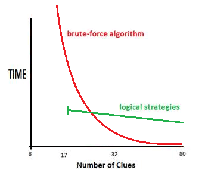I think there are good reasons to set aside uniqueness strategies especially from a purist POV but I've always considered muli-solution puzzles to be broken or mis-defined puzzles. They look like ducks, walk like ducks, but are not in fact ducks. They are another class of object, to be filtered away. That's not to deny they are interesting in their own right but they are outside the scope of the solver (mine at least).

However there is a good practical reason for using logic rather than brute force for solution counting, as the attached graph tries to show. It’s a crude diagram I knocked up to illustrate a point in a previous correspondence, but there is a point at which brute force becomes much slower than logic and it’s a function of clue density.

Add to this Thread

## ... by: Master Shuriken

Tuesday 27-Jan-2015

You could have another strategy which is an extension of unique rectangles (extension of both 2x2 and 3x3).

If you have, for example empty boxes in A1, A2, H1, J2, H9, J9 with 2 clues (1,2) in each box, this wouldn't be possible.

You could extend this *uniqueness chain* as long as you like through the puzzle and extend it to triples, too, (as long as you make sure that there would be 2 solutions if everything else was filled in).

Like the unique rectangle, it would tell you something which is not possible, and could help eliminate clues, etc.

Andrew Stuart writes:

Like [Extended Unique Rectangles](https://www.sudokuwiki.org/Extended_Unique_Rectangles)?

Add to this Thread

## ... by: dshaps

Tuesday 29-Jul-2014

Under Type 4, following comment appears.

Quote

If you look carefully, you'll see that in box 7, the roof squares are the only squares that can contain a 7. This means that, no matter what, one of those squares must be 7 - and from this you can conclude that neither of the squares can contain a 9, since this would create the "deadly pattern"! So you can remove 9 from H1and H2. 

Unquote

How is it that deadly pattern will get created, if either of roof squares contains 9. Can you please elaborate?

REPLY TO THIS POST

## ... by: PCForrest

Sunday 6-Jul-2014

@Random Sudoku Enthusiast

"In the 'Type 1 Unique Rectangles' example (Unique Rectangle Figure 2), can't the same explanation be used for the 2 and the 9 in D2? Logically, it doesn't make sense to eliminate the 2 and the 9 in D1, but not in D2. It seems that by eliminating the 2 and the 9 in D1, we move the deadly rectangle corner over to D2. Should we then use the same logic to eliminate the 2 and the 9 from D2? Or are we ignoring that square for the sake of the example?"

D2 does not a rectangle make, let alone a unique rectangle. To be valid, all four cells must occupy exactly 2 rows, 2 columns and 2 boxes. Logically, it makes perfect sense to eliminate both 2 and 9 from D1 but not from D2, for the simple reason D2 must take the value 2 in the final solution. If you eliminate the 2, you immediately invalidate the puzzle. The logic that applies to D1 does not apply to D2. We are ignoring D2 for the simple reason it plays no part in this unique rectangle.

REPLY TO THIS POST

## ... by: Sherman

Friday 28-Mar-2014

Two of the Unique Rectangle examples on this page can also have the Hidden Unique Rectangle logic applied to them, resulting in even more eliminations.

For example, figure 7 in the Type3b UR discussion has strong links between all four 6's in the UR. If 7 is placed in cell E6, 6's must be placed in cells E4 and J6, forcing a 7 in J4 - a deadly pattern. So 7 cannot go in E6. Likewise, 7 cannot go in E4.

The HUR logic can also be applied to figure 6, removing a couple of 3's.

Type 4/4b can be analyzed with HUR, which results in the same eliminations as UR. So in some sense Type 4/4b is really part of the HUR logic.

When you find a Type 2/2b or 3/3b UR, it pays to look at the strong links in it to see if HUR can also be applied. Apply HUR after UR, as it destroys the deadly pattern.

REPLY TO THIS POST

## ... by: Dan, UK

Monday 17-Mar-2014

type 3 can be extended to search for 'triples', even 'quads'. In your examples just a pairs are used - 17 in first one, 83 in second one.

how about this:

http://www.sudokuwiki.org/sudoku.htm?bd=000764381364010572187235000013082607000601035000090018200000159001020700070150820

my solver says:

Unique rectangle type 3 at r2c4, r2c6, r8c4 and r8c6 allows 4 and 6 to be eliminated from r8c1, r8c2

you can see a screenshots from my solver here:

http://danhen.xf.cz/pics/shared/su_ur3_01.jpg

http://danhen.xf.cz/pics/shared/su_ur3_02.jpg

explanation: floor if clearly defined. As the roof contains additional candidates defined as 346, we can search for TWO cells, which contains some of these candidates, but only them, as defined in naked triple rule. As we found two cells 46 and 346, we can consider this as triple (two found cells and two cells from the roof of unique rectangle) and eliminate candidates 346 from the other cells in the unit (as seen on screenshots). 

HODOKU solver can recognize this 'triple-extended-type 3' as well :)

http://hodoku.sourceforge.net/en/show_example.php?file=u301&tech=Unique+Rectangle+Type+3

The same logic can be used for searching for 'quad', that means four additional candidates in the roof of rectangle, and we'll be looking for THREE cells in a unit, which contains some of those candidates, defined by the rule of naked quad. My solver should be able to solve such a problem, but unfortunatelly I didn't find any game to match this problem :( If ANYONE is able to share game with such a kind of unique rectangle, feel free to post it :)

Dan

REPLY TO THIS POST

## ... by: Random Sudoku Enthusiast

Wednesday 6-Nov-2013

In the 'Type 1 Unique Rectangles' example (Unique Rectangle Figure 2), can't the same explanation be used for the 2 and the 9 in D2 ?

Logically, it doesn't make sense to eliminate the 2 and the 9 in D1, but not in D2.

It seems that by eliminating the 2 and the 9 in D1, we move the deadly rectangle corner over to D2. Should we then use the same logic to eliminate the 2 and the 9 from D2?

Or are we ignoring that square for the sake of the example?

REPLY TO THIS POST

## ... by: jaswant singh =sriganganagar INDIA

Tuesday 22-Oct-2013

ref.sudoku puzzle creater UR type 4 =focuses on UR candidates -- U R of 3,9 see row J =I remove the 3,3 ofJ2 J3 OTHERWAY= J2,J3,J78 form subset triplet [157].hence 5 of J5 will be removed leaving there inJ5 the 2. In turn J4 will become 3. & in turn3 will be removed from J2andJ3...

REPLY TO THIS POST

## ... by: DanielKlaus

Saturday 3-Aug-2013

I found a wonderful UR type 2 example in my own created sudokus:

[there are 7 eliminations](https://www.sudokuwiki.org/sudoku.htm?bd=000090027030107800600000400001304680080009730003800900379000208000902070452738100).

REPLY TO THIS POST

## ... by: JesseChisholm

Wednesday 15-May-2013

I didn't see the pattern on your site, but there is a "Nested Deadly Squares" that is quite rare, but could also be looked for and avoided with much the same techniques as Unique Rectangles.

Picture the group "B" in figure one (where "A" is the Deadly Pattern)

Add an expanded copy of group "B" such that:

* there are four boxes with a pair of 7/9 cells

* there are four rows with a pair of 7/9 cells

* there are four cols with a pair of 7/9 cells

These eight 7/9 cells together form a Nested Deadly Squares pattern.

-Jesse

REPLY TO THIS POST

## ... by: gerp124

Sunday 10-Feb-2013

OH! And while I have your attention, I would like to say that I dislike unique rectangles.

I can accept that they're part of the game, and may be the only way to solve a board sometimes, but it seems like such an arbitrary rule. What's so special about singularity? Yes, that was intended as a joke, but I've never seen any aesthetic offense in a puzzle with more than one solution. Except that a single solution cannot then be published. But I've already made my case regarding published solutions :-)

REPLY TO THIS POST

## ... by: gerp124

Sunday 10-Feb-2013

Thanks very much for the reply Andrew.

And thanks very much for such a wonderful website- for years, until I discovered this website, I was completely befuddled as to the solutions that are always published- they are not needed, and they are not helpful. If you can finish, you don't need the solution, and if you _can't_ finish, you don't need the solution, rather, you need to know _how_ to get the solution. And this website has provided an wonderful practical education in reasoning via sudoku!

REPLY TO THIS POST

## ... by: gerp124

Sunday 10-Feb-2013

I don't see much recent activity, but I hope this gets seen- I believe I have found a published contradiction, and so I'm wondering about the phrase above: 'published Sudokus have only one solution'.

In the Sudoku of the Variety section of Minneapolis Star Tribune for Sunday has these values _given_:

2D=9

2E=7

7D=7

7E=9

Does it make a difference, that the values were _given_, as opposed to being values that needed _solving_? The entire puzzle constitutes the _solution_, doesn't it? And these values could move, yielding a second solution, true?

Here is the board as published, and thanks for in any thoughts.

http://www.sudokuwiki.org/sudoku.htm?bd=800002000004000009060908003090004700075801930006300010500403090900000200000700008

Andrew Stuart writes:

I get these posts directly, so no worries, I try reply as soon as possible and Sundays are good days for this. You are correctly identifying the deadly pattern in two rows, two columns and two boxes and the numbers are swappable - except as I think you've suggested, it doesn't apply if these are clues. Since clues are fixed they can't be swapped around so the problem of duplicate solutions doesn't arise. Keep an eye out for the simpler URs, they are quite common and useful.

Add to this Thread

## ... by: Sonalita

Monday 9-Jul-2012

@Thinkist

A fundamental premise of Andrew's excellent solver (and any algorithm based solver) is that the puzzle MUST have a unique solution. 

It is generally accepted that the definition of a valid sudoku puzzle includes the constraint that there must be a single solution, so your statement of "not believing in uniqueness strategies" makes no sense.

REPLY TO THIS POST

## ... by: Thinkist

Thursday 5-Apr-2012

Harmen Dijkstra has a fully valid point. This is why I don't believe in uniqueness strategies and have them unchecked in the solver. If a Sudoku has multiple solutions, so be it.

Andrew Stuart writes:

A Sudoku with more than one solution is not a valid puzzle and more than uniqueness strategies will cause it to either a) go down one particular path, or b) create a logical contradiction and get nowhere. Even with uniqueness unticked the solver will not be 'logical' in any real sense. The proof of this is to consider an empty board. What 'logical' strategy is appropriate to solve an empty board?

I am thinking of adding a solution count to the start of the solve "take step" and stop any further progress until the puzzle is fixed. Mostly it is data entry and it causes confusion is people don’t check the solution count first.

Add to this Thread

## ... by: B.N.Hobson

Sunday 1-Apr-2012

A word of caution. The Unique Rectangle doesn't work with Samurai Sudoku (five interlocking Sudoku puzzles). One section may have two answers, but one of them is wrong in relation to rest of the puzzle. i have recently had two cases where the Unique Rectangle gave the wrong answer.

Andrew Stuart writes:

The most probable reason for the solver not working on Samurai is that each individual Sudoku lacks all the clues necessary to solve it individually. The overlap provides the extra information necessary to complete the puzzle. It would be necessary to partially solve two overlapping parts before completing them both. Otherwise you might as well have five separate sudokus.

Add to this Thread

## ... by: Anton Delprado

Saturday 14-May-2011

There seems to be a lot of room for extension of type 3 or at least the concept of treating the two roof cells as a single virtual. This virtual cell has the union of values in the two roof cells excluding the deadly values.

If we look at type 2 cells from this concept then the virtual cell has a single value and is "solved". This can then be used to eliminate that value in any cell that can see both cells. So type 2 are kinds of type 3 in a sense.

This can also be extended to naked multiples in the joined row/col. For example if roof cells are in the same row and have three non-deadly values that are shared in two other cells in the row then those values can be removed in other cells in the row.

Andrew Stuart writes:

Hi Anton

Yes, I have a feeling it might be possible to generalize and extend UR types. I'm in touch with someone else who has a good idea about re-organizing the families under different rules. I think you are on a similar track

Add to this Thread

## ... by: Chuck Bruno - Virginia

Thursday 6-Jan-2011

Isn't the example for type 3 also a type 4B, allowing us to remove the 4's from cells B2 and B9?

REPLY TO THIS POST

## ... by: Alan Freberg

Saturday 18-Dec-2010

Hi Andrew,

Here's one that I had on hand when I wrote my previous post, but had yet to logic it out. It's fairly straight forward, though. It appears to be a Type 5b as there are three candidates in the ceiling instead of two as in Type 3 or my previous examples. 

In the Daily Nightmare for Dec. 29, 2005 the floor cells contain 3/4 in 2 B/D. The ceiling is in Col. 1 where the unsolved cells contain: 6/7/9 (A1), 3/4/7/9 (B1), 3/4/6/7 (D1), 4/7 (E1) and 6/7/9 (H1). The ceiling in cells B/D1 contain the Strong Links (if we can still call them that) 6/7/9. As you explain two cell tri-values on pg. 124, A1 and H1 will be reduced to a Naked Pair whichever of the three is the true value in the ceiling cells . Delete 7(E1). 

Thanks again,

Alan Freberg

REPLY TO THIS POST

## ... by: Alan Freberg

Thursday 16-Dec-2010

Hi Andrew,

A few months ago I purchased "The Book" with the intention of first reading it and then trying to solve all of Ruud's Daily Sudoku Nightmares. "The Book" was an excellent read. It illuminated several dark corners. There are still some dark corners left, but they are my failings and not yours.

One thing I'm always trying to do with a Sudoku is to find something new or somehow push the envelope past what I know. Having read your book lead me to something of that nature while working on the Nightmares.

My solutions for the Daily Nightmares for March 30, 2006, Feb. 15, 2006, Feb. 2, 2006, Dec, 19 2005 and Dec. 16, 2005 contain a pattern that I have not seen before. They are based on a combined application of Unique Rectangles and Aligned Pair Exclusion. At first I thought they were a variant of your Type 3 URs, but, since they allow for more deletions than Type 3 would, it appears that they are a new variation. I call them UR Type 5 or UR APE App(lication).

In the March 30 DN (please pardon my reverse chronological order, but if you choose to look them up it is the order in which you will find them.) the floor pair are 4/5 in Col. 5 A/C. The ceiling is in Col. 2 where the unsolved cells contain the following candidates: 4/5/6/(A2), 6/8 (B2), 4/5/9 (C2), 4/5/8/9 (E2) and 8/9 (J2). 6/9 are the Strong Link pair in the ceiling. According to the Type 3 rule there are no deletions possible. However, on pg. 122 of the chapter on APE the following rule is given--"Any two cells with only abc exclude combinations ab, ac and bc..." Applying this rule to this formation we find that the two cells B2 and J2 contain 6/8/9. However one looks at it, the values for the extra candidates in the ceiling cells are accounted for and 8/9 can be deleted from E2. Notice that 8(E2) is not one of the Strong Link candidates. 

In the Feb. 15 DN the floor pair are 3/7 in Row E 1/2. The ceiling is in Row B. The unsolved cells in B contain: 1/3/7 (B1), 3/7/8 (B2), 8/9 (B4), 1/9 (B5) and 3/9 (B9). 1/8 are the Strong Link candidates in the ceiling and 1/8/9 in B4/5 fulfill the APE rule requirements. Delete 9 (B9).

In the Feb. 2 DN the floor pair are 7/8 in Col. 2 G/J. The ceiling is in Col. 6. The unsolved cells in Col. 6 contain: 3/6 (C6), 4/6/8 (D6), 4/6 (E6), 4/7/8 (G6) and 3/4/7/8 (H6). 3/4 are the strong links in the ceiling. 3/4/6 in C/E fulfill the APE rule requirements. Delete 4/6 (D6).

In the Dec. 19 DN the floor pair are 2/6 in Row H 2/3. The ceiling is in Row B. The unsolved cells in Box 1 are: 5/7 (A1), 1/5/7 (A3) and 6/7 (C2). 1/5 are the Strong Link pair in the ceiling with 1/5/7 in A 1/3 completing the APE requirements. Delete 7 (C2).

In the Dec. 16 DN the floor pair are 4/6 in Row D 1/2. The ceiling is in Row G. The unsolved cells in Row G contain: 4/6/7 (G3), 3/5/7 (G7) and 3/5 (G8). 5/7 are the Strong Link pair in the ceiling with 3/5/7 (G7/8) fulfilling the APE rule requirements. Delete 7 (G3).

If this is indeed a new application then you are the godfather of this baby as your explanation of the APE rule pointed the way for me.

Thank you very much,

Alan Freberg

REPLY TO THIS POST

## ... by: JCS

Friday 6-Aug-2010

Andi and John_Ha

I am new to this site but I end to agree with Andi. There is no deadly pattern if R5C6 contains candidates 356.

Applying simple colouring technique to the puzzle will show that 2s can be removed from R2C8 R7C2 R8C7 and R8C9. That causes R2C8 to be a 9, R7C8 a 2, R7C3 a 9, R1C1 a 9, R1C5 a 4, R4C5 a 9, R4C6 a 7. At this stage that leaves 356 as candidates for R5C6. The puzzle can then easily be solved without applying that "unique rectangle" technique ending with a 6 in R5C6.

REPLY TO THIS POST

## ... by: csvidyasagar

Friday 6-Aug-2010

Dear Denis, 

1. You are absolutely correct. Type 4 and Type 4 B rely one logic that roof cell may contain a digit which is confined to that row or column or block and can not be removed. So the other digit can be easily removed from thase two cells in Roof Row. In Type 4 example, the Roof Row C has 1,5,6 in cell C1 and C3. Either digit 1 or 5 can be removed to ensure Deadly Pattern does not result leading to two solutions. But 5 is confined both in Row C and in Block Top Left or Block 1. So digit 1 can be removed from both cells in Roof Row C.

 Have I confused you further ?

with regards,

CS Vidyasagar

REPLY TO THIS POST

## ... by: csvidyasagar

Friday 6-Aug-2010

Dear Andi,

1. When you have three out of four corners in a unique rectangle have two digits (in this case 5,7), then the fourth corner can not have 5,7 as this will have all four corners having 5,7.This is a Deadly pattern as you can have two different solutions. But for a pure Sudoku you have to have only one or unique solution. That is possible only if you remove digits 5,7 which other three corner cells of Unique Rectangle have. 

2. You aim must be to reduce maximum number of digits from cells containing multiple candidates. When you can remove 5,7 from 3,5,6,7, of cell R5 C6, you are reducing time to solve the puzzle but also reducing complexity. More candidates in ells mean more complexity and require more time to solve.

3. When you remove 5,7 from cell R5 C6, you see in column 6 you have digit 5 in cell R2C6 and digit 7 in cell R4C6. So the rule of all columns, rows and boxes to contain all digits from 1 to 9 is met.

4. I could only think of three reasons as to why you can remove 5,7 from cell R5 C6.

 Have I confused you further ?

with regards,

CS Vidyasagar

REPLY TO THIS POST

## ... by: csvidyasagar

Friday 6-Aug-2010

Dear Lea,

The four cells you have mentioned have the following pattern:

 Col 1 Col 4

Row A 1,5,6 1,5,6

Row D 1, 5 1,5.

 This is similar to Unique Rectangle Pattern 2B. That is floor cells are 1,5 and Roof cells are 1,5,6. Since these form a unique rectangle with 1,5 being common in all the four cells to avoid Deadly Pattern ( of all cells having 1,5), you have to keep 6 in Row A i.e. Roof cells. That means 1,5 will be removed later from Roof Cells in Row A. 

 But you can not have two 6s in Row A (Roof Row) as any row can have only one digit in one cell. So remove 6 from any other cell in Roof Row A or in the Block /Box of Roof cells.

 Have I confused you further ?

with regards,

CS Vidyasagar

REPLY TO THIS POST

## ... by: Harmen Dijkstra

Saturday 15-May-2010

Yes the point is, that there are indeed more solutions. So, if you use unique triangles, and get a solution, you will not know that your solution is a unique solution. 

REPLY TO THIS POST

## ... by: Wiking 48

Sunday 2-May-2010

Hi Harmen Dijkstra,

I'm quite new on this.

why do you bother with such a non-defined sudoku?

There are many more than 17 sulotions! Check for yourself, you see that 24, 42 in the left of your grid can be excanged.

Is there any idea to fight against non-defined?

Upper left corner can also be 1, 2 or 3 which gives a lot of solutions..

Down left corner in your example is 7 in one example which is quite common among the sulotions, 1 is more rare but possible...

REPLY TO THIS POST

## ... by: Harmen Dijkstra

Friday 5-Mar-2010

I made this sudoku:

. 9 . | 5 . . | 6 4 7

6 . 5 | . . 7 | . 9 3

. 7 . | . . . | 2 5 8

-----------------------

. 5 6 | . 7 . | 9 . .

. . 7 |9 . 5| 3 8 6

. . 3 |8 . 2| 4 7 5

-----------------------

. . . | . 5 .| 8 3 9

5 6 . | . . .| 7 2 .

. . . | . . 8| 5 6 4

If you filling this sudoku in the sudoku solver, the solution Count will say that there are 17 solutions. But if you try TAKE STEP then you will get only this sudoku (with Unique Rectangles):

2 9 1 | 5 8 3 | 6 4 7

6 8 5 | 2 4 7 | 1 9 3

3 7 4 | 1 9 6 | 2 5 8

-----------------------

8 5 6 | 3 7 4 | 9 1 2

4 2 7 | 9 1 5 | 3 8 6

9 1 3 | 8 6 2 | 4 7 5

-----------------------

7 4 2 | 6 5 1 | 8 3 9

5 6 8 | 4 3 9 | 7 2 1

1 3 9 | 7 2 8 | 5 6 4

But there are more solutions, for example:

1 9 2 | 5 8 3 | 6 4 7

6 8 5 | 2 4 7 | 1 9 3

3 7 4 | 6 9 1 | 2 5 8

-----------------------

8 5 6 | 3 7 4 | 9 1 2

2 4 7 | 9 1 5 | 3 8 6

9 1 3 | 8 6 2 | 4 7 5

-----------------------

4 2 1 | 7 5 6 | 8 3 9 

5 6 8 | 4 3 9 | 7 2 1

7 3 9 | 1 2 8 | 5 6 4

The sudoku solver said that (because of Unique Rectangles) R7C4 has to be a 6, but in this example you see that you get an other solution with a 7.

Is this a fault in the sudoku solver? 

REPLY TO THIS POST

## ... by: CS Vidyasagar

Wednesday 3-Mar-2010

1. You have given very simple and lucid explanation of difficult concept of Unique Rectangles of four types. One comes across such situations in number of Sudoku puzzles of varying degrees of difficulty. The clear understanding of unique rectangles helps one to get out of log jam one is subjected to frequently in these interesting puzzles. I do not know whether any more explanation can be given to what you have done. Only one has to read your article may be twice but keep the most important lesson you brought out loud and clear that " DO NOT HAVE DEADLY PATTERN OF HAVING FOUR CONJUGATE PAIRS" as that leads to multple solutions. Sudoku permits only unique solution. 

2. One has to understand the logic and solution becomes quite clear. You have seleted many good illustrations which have explained the logic clearly and unambiguosly.

3. Looking forward to more such illustrations. 

Kudos for wonderful work you are doing.

with regards,

Vidyasagar

REPLY TO THIS POST

## ... by: Lea Hayes

Tuesday 23-Feb-2010

Just to clarify my question:

Rectangle Cells:

A(1,5,6) B(1,5,6)

C(1,5) D(1,5)

Why remove 1 from both A and B and not either of the following:

A(5,6) B(1,5)

C(1,5) D(1,5)

or

A(1,5) B(5,6)

C(1,5) D(1,5)

REPLY TO THIS POST

## ... by: Lea Hayes

Tuesday 23-Feb-2010

Re: Type 4 Unique Rectangles - Cracking the Rectangle with Conjugate Pairs

I do not understand how you came to the conclusion that 1 can be removed? Why not remove 6 instead?

REPLY TO THIS POST

## ... by: John_Ha

Friday 22-Jan-2010

Andi

I too was puzzling over that but I think the answer is simple. See Fig 2. (5 and 7) are unsolved in Col 4 otherwise they wouldn't be candidates in R2C4. Similarly (5 and 7) are unsolved in Col 6. Similarly (5 and 7) are unsolved in Row 5. Because the cell at R5C4 is unsolved for 5 and 7, then the centre 3x3 must be unsolved for (5 and 7).

There is therefore no way before now that the cell at R5C6 could have had either 5 or 7 eliminated as candidates because there are no solved (5 or 7) that it can see. The 5 and 7 at R5C6 could not have been eliminated by something happening on R5, nor on C6, nor in its 3x3.

So, the cell at R5C6 MUST have BOTH 5 and 7 as candidates (as well as possibly others, in this case 3 and 6).

Now assume R5C6 is 5 - we get the deadly pattern. So R5C6 cannot be 5. Now assume R5C6 is 7 - we get the deadly pattern. So R5C6 cannot be 7. 

So R5C6 cannot be 5 or 7 and both can be eliminated.

REPLY TO THIS POST

## ... by: Andi

Friday 22-Jan-2010

I do not understand this strategy. In the first example for Type 1 UR, I understand that if 3 or 6 would be removed from R5C6, you would end up with a deadly pattern. That's fine so far. 

But I do not see why you can eliminate 5 AND 7 for this reason from R5C6. IMHO, if in R5C6 3,5,6 would be possible, well then this would just imply R5C4 and R2C6 being 7 and R2C4 being 5. An "ordinary" solution. OTOH, if in R5C6 3,6,7 would be possible, R5C4 and R2C6 would be 5 and R2C4 would be 7. Quite straightforward, too. My point is: both possibilities would be valid. But I cannot spot a "deadly pattern" here because to remove the ambiguity in this sitatuation, all you can postulate is that *either* 5 *or* 7 must be removed from the possibilities in R5C6. With either number removed, the ambiguity is removed, thus no deadly pattern anymore. But I just don't see why you eliminate *both* 5 and 7 in R5C6?

Am I missing something?

REPLY TO THIS POST

## ... by: Dennis Daft

Tuesday 5-May-2009

Shouldn't your Type 4B example be "solved" using the Type 2A method? Using this method the 6 in R1C3 and R3C5 would be eliminated, forcing one of the "roof" cells to be a 6. I believe the end result is the same. This would be consistant with only using Type 4 when no other solution is possible.

Dennis

REPLY TO THIS POST

 Article created on 11-April-2008. Views: 619124

 This page was last modified on 27-December-2025.

 All text is copyright and for personal use only but may be reproduced with the permission of the author.

 Copyright [Andrew Stuart](https://www.sudokuwiki.org/) @ [Syndicated Puzzles](https://www.syndicatedpuzzles.com/), [Privacy](https://www.sudokuwiki.org/privacy), 2007-2026 

