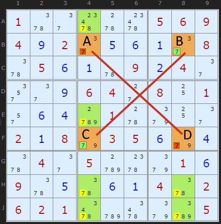
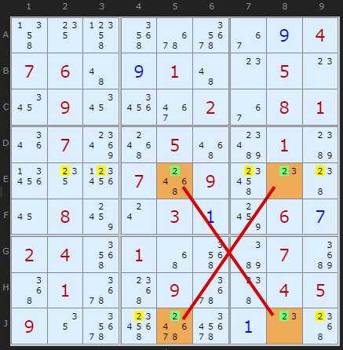
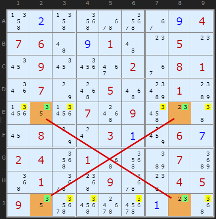
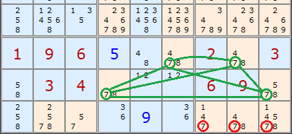
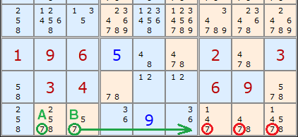

Title: X-Wing Strategy - SudokuWiki.org

URL Source: https://www.sudokuwiki.org/X_Wing_Strategy

Markdown Content:
# X-Wing Strategy - SudokuWiki.org

SudokuWiki.org

Strategies for Popular Number Puzzles

*   [Sign up for more](https://www.sudokuwiki.org/SPHome.aspx)

*   [Main Page](https://www.sudokuwiki.org/Main_Page)
*   [What's New](https://www.sudokuwiki.org/Whats_New)
*   [Strategy Overview](https://www.sudokuwiki.org/Strategy_Families)

9x9 Solvers

*   [Sudoku Solver](https://www.sudokuwiki.org/Sudoku.htm)
*   [Jigsaw Solver](https://www.sudokuwiki.org/Jigsaw.aspx)
*   [Sudoku X Solver](https://www.sudokuwiki.org/SudokuX.aspx)
*   [Windoku Solver](https://www.sudokuwiki.org/Windoku.aspx)
*   [Colour Sudoku](https://www.sudokuwiki.org/ColourSudoku.aspx)
*   [Killer Solver](https://www.sudokuwiki.org/KillerSudoku.aspx)
*   [Killer Jigsaw Solver](https://www.sudokuwiki.org/KillerJigsaw.aspx)

6x6 Solvers

*   [6x6 Sudoku Solver](https://www.sudokuwiki.org/Sudoku6x6.aspx)
*   [6x6 Killer Solver](https://www.sudokuwiki.org/Killer6x6.aspx)
*   [6x6 KenKen Solver](https://www.sudokuwiki.org/KenKen6x6.aspx)
*   [6x6 KenDoku Solver](https://www.sudokuwiki.org/kendoku6x6.aspx)

Weekly 'Unsolvable'

*   [Unsolvable Sudoku](https://www.sudokuwiki.org/Weekly-Sudoku.aspx)
*   [Unsolvable Jigsaw](https://www.sudokuwiki.org/Weekly-Jigsaw.aspx)
*   [Unsolvable Str8ts](https://www.str8ts.com/weekly_str8ts.aspx)

Puzzles to Play

*   [The Daily Sudoku](https://www.sudokuwiki.org/Daily_Sudoku)
*   [Daily 6x6 Sudoku](https://www.sudokuwiki.org/Daily_Mini_Sudoku)New!
*   [The Jigsaw Sudoku](https://www.sudokuwiki.org/Daily_Jigsaw_Sudoku)
*   [The Daily Sudoku X](https://www.sudokuwiki.org/Daily_Sudoku_X)
*   [The Daily Killer](https://www.sudokuwiki.org/Daily_Killer_Sudoku.aspx)
*   [Daily Mini Killer](https://www.sudokuwiki.org/Daily_Mini_Killer_Sudoku.aspx)
*   [Daily Killer Jigsaw](https://www.sudokuwiki.org/Daily_Killer_Jigsaw.aspx)
*   [The Daily Kakuro](https://www.sudokuwiki.org/Daily_Kakuro)
*   [The Daily KenKen](https://www.sudokuwiki.org/Daily_KenKen.aspx)
*   [Daily Codewords](https://www.sudokuwiki.org/Daily_Codewords)
*   [1 to 25](https://www.str8ts.com/daily_1to25.aspx)
*   [The Daily Binairo](https://www.sudokuwiki.org/DailyBinairo)
*   [Letterlicious](https://www.letterlicious.com/Letterlicious_Home.aspx)
*   [Puzzle Packs](https://www.sudokuwiki.org/ACSPuzzles.aspx)

Basic Strategies

*   [Introduction](https://www.sudokuwiki.org/Introduction)
*   [Getting Started](https://www.sudokuwiki.org/Getting_Started)
*   [Naked Candidates](https://www.sudokuwiki.org/Naked_Candidates)
*   [Hidden Candidates](https://www.sudokuwiki.org/Hidden_Candidates)
*   [Intersection Removal](https://www.sudokuwiki.org/Intersection_Removal)

Tough Strategies

*   [X-Wing](https://www.sudokuwiki.org/X_Wing_Strategy)
*   [Chute Remote Pairs](https://www.sudokuwiki.org/Chute_Remote_Pairs)
*   [Simple Colouring](https://www.sudokuwiki.org/Simple_Colouring)
*   [W-Wing](https://www.sudokuwiki.org/W_Wing_Strategy)
*   [Y-Wing](https://www.sudokuwiki.org/Y_Wing_Strategy)
*   [Rectangle Elimination](https://www.sudokuwiki.org/Rectangle_Elimination)
*   [Swordfish](https://www.sudokuwiki.org/Sword_Fish_Strategy)
*   [XYZ-Wing](https://www.sudokuwiki.org/XYZ_Wing)
*   [BUG](https://www.sudokuwiki.org/BUG)
*   [Avoidable Rectangles](https://www.sudokuwiki.org/Avoidable_Rectangles)

Diabolical Strategies

*   [X-Cycles (Part 1)](https://www.sudokuwiki.org/X_Cycles)
*   [X-Cycles (Part 2)](https://www.sudokuwiki.org/X_Cycles_Part_2)
*   [3D Medusa](https://www.sudokuwiki.org/3D_Medusa)
*   [Jellyfish](https://www.sudokuwiki.org/Jelly_Fish_Strategy)
*   [Unique Rectangles](https://www.sudokuwiki.org/Unique_Rectangles)
*   [Tridagons](https://www.sudokuwiki.org/Tridagons)
*   [Fireworks](https://www.sudokuwiki.org/Fireworks)
*   [Twinned XY-Chains](https://www.sudokuwiki.org/Twinned_XY_Chains)
*   [SK Loops](https://www.sudokuwiki.org/SK_Loops)
*   [Extended Rectangles](https://www.sudokuwiki.org/Extended_Unique_Rectangles)
*   [Hidden URs](https://www.sudokuwiki.org/Hidden_Unique_Rectangles)
*   [WXYZ-Wing](https://www.sudokuwiki.org/WXYZ_Wing)
*   [XY-Chains](https://www.sudokuwiki.org/XY_Chains)
*   [Aligned Pair Exclusion](https://www.sudokuwiki.org/Aligned_Pair_Exclusion)

Extreme Strategies

*   [Grouped X-Cycles](https://www.sudokuwiki.org/Grouped_X_Cycles)
*   [Forcing Nets](https://www.sudokuwiki.org/Forcing_Nets)
*   [Exocet](https://www.sudokuwiki.org/Exocet)
*   [Finned X-Wing](https://www.sudokuwiki.org/Finned_X_Wing)
*   [Finned Swordfish](https://www.sudokuwiki.org/Finned_Swordfish)
*   [Inference Chains](https://www.sudokuwiki.org/Alternating_Inference_Chains)
*   [AIC with Groups](https://www.sudokuwiki.org/AIC_with_Groups)
*   [AIC with ALSs](https://www.sudokuwiki.org/AIC_with_ALSs)
*   [AIC with URs](https://www.sudokuwiki.org/Using_Unique_Rectangles_as_Links_in_Chains)
*   [Almost Locked Sets](https://www.sudokuwiki.org/Almost_Locked_Sets)
*   [Death Blossom](https://www.sudokuwiki.org/Death_Blossom)
*   [Sue-de-Coq](https://www.sudokuwiki.org/Sue_de_Coq)
*   [Digit Forcing Chains](https://www.sudokuwiki.org/Digit_Forcing_Chains)
*   [Nishio Forcing Chains](https://www.sudokuwiki.org/Nishio_Forcing_Chains)
*   [Cell Forcing Chains](https://www.sudokuwiki.org/Cell_Forcing_Chains)
*   [Unit Forcing Chains](https://www.sudokuwiki.org/Unit_Forcing_Chains)
*   [Double Exocet](https://www.sudokuwiki.org/Double_Exocet)
*   [Pattern Overlay](https://www.sudokuwiki.org/Pattern_Overlay)

Deprecated Strategies

*   [Remote Pairs](https://www.sudokuwiki.org/Remote_Pairs)
*   [Y-Wing Chain](https://www.sudokuwiki.org/Y_Wing_Chains)
*   [Multivalue X-Wing](https://www.sudokuwiki.org/Multivalue_X_Wing_Strategy)
*   [Multi-Colouring](https://www.sudokuwiki.org/Multi_Colouring_Strategy)
*   [Empty Rectangles](https://www.sudokuwiki.org/Empty_Rectangles)
*   [Guardians](https://www.sudokuwiki.org/Guardians)

Str8ts

*   [Home & Rules](https://www.str8ts.com/str8ts)
*   [The Daily Str8ts](https://www.str8ts.com/Daily_str8ts)
*   [Weekly Extreme Str8ts](https://www.str8ts.com/weekly_str8ts.aspx)
*   [Str8ts Solver](https://www.str8ts.com/str8ts.htm)
*   [Str8ts Sample Pack](https://www.str8ts.com/Str8ts_Sample_Pack.pdf)

Other

*   [What's New](https://www.sudokuwiki.org/Whats_New)
*   [Latest Articles](https://www.sudokuwiki.org/LatestArticles.aspx)
*   [Feedback](https://www.sudokuwiki.org/sudokufeedback.aspx)
*   [Donate](https://www.sudokuwiki.org/Donations)
*   [Syndicated Puzzles](https://www.syndicatedpuzzles.com/)

[Print Version](https://www.sudokuwiki.org/Print_X_Wing_Strategy)

[Page Index](https://www.sudokuwiki.org/Site_Map)

1.7k Shares 

# X-Wing Strategy

This strategy is looking at single numbers in rows and columns. It should be easier to spot in a game as we can concentrate on just one number at a time. 

X-Wing example 1 : [Load Example](https://www.sudokuwiki.org/sudoku.htm?bd=S9B015y2e685w68050609040i022e0e0f0a2e085y050f0a5u090b042e2u2e0i06042c0810012q0f0dd0015w9i102e020a089e03050f9e0d5y042e05d0609i010f095y0e5y0f0a045y0206020166cy669id205) or : [From the Start](https://www.sudokuwiki.org/sudoku.htm?bd=100000569402000008050009040000640801000010000208035000040500010900000402621000005)

 The picture on the right shows a classic X-Wing, this example being based on the number **seven**. The X is formed from the diagonal correspondence of cells marked A, B, C and D. What's special about them?

Well, A and B are a locked pair of **7**s. So are C and D. They are locked because they are the only **7**s in rows B and F. We know therefore that if A turns out to be a **7** then B cannot be a **7**, and vice versa. Likewise if C turns out to be a **7** then D cannot be, and vice versa. 

What is interesting is the **7**s present elsewhere in the fourth and eighth columns. These have been highlighted with green boxes. 

Think about the example this way. A, B, C and D form a rectangle. If A turns out to be a **7** then it rules out a **7** at C as well as B. Because A and CD are 'locked' then D must be a **7** if A is. Or vice versa. So a 7 MUST be present at AD or BC. If this is the case then any other **7**s along the edge of our rectangle are redundant. We can remove the **7**s marked in the green squares. 

The rule is

_When there are 

*   only two possible cells for a value in each of two different rows,
*   and these candidates lie also in the same columns,
then all other candidates for this value in the columns can be eliminated._

The reverse is also true for 2 columns with 2 common rows. Since this strategy works in the other direction as well, we will look at an example next.

X-Wing example 2 : [Load Example](https://www.sudokuwiki.org/sudoku.htm?bd=S9B4n144p5i6q7a360i0407064a0i014a0o050o1a091a263e023608011q078w580556bk01bc2714290758094w0o4816088c0s030a8c060g02045i014y5iba07c652016u54096u48040509127a5s707i0a0o54) or : [From the Start](https://www.sudokuwiki.org/sudoku.htm?bd=000000004760010050090002081070050010000709000080030060240100070010090045900000000)

In this second example I've chosen a Sudoku puzzle where an enormous number of candidates can be removed using two X-Wings. The first is a '2-Wing'. The orange high lighted cells show the X-Wing formation. Note that the orientation is in the columns this time, as opposed to rows as above. Looking at columns we can see that candidate 2 only occurs twice - in the orange cells. Which ever way the 2s could be placed (E5/J8 or E8/J5) six other 2s in the rows can be removed - the yellow highlighted numbers.

X-Wing example 3 : [Load Example](https://www.sudokuwiki.org/sudoku.htm?bd=S9B4n0b4n5i6q7a360i0407064a0i014a0o050o1a091a263e023608011q077o580556bk01bc2712270758094u0o4616087o0s030a8c060g02045i014y5iba07c652016u54096u48040509127a5q707i0a0o52)

A few steps later the second X-Wing is found on candidate 3 in the same rows. Whichever way round the 3 can be placed in those rows (E2/J8 or E8/J2) there can be no other 3 in rows E and J except in those orange cells.

## Generalising X-Wing

X-Wing is not restricted to rows and columns. We can also extend the idea to boxes as well.

If we generalise the rule above we get:

_When there are 

*   only 2 candidates for a value, in each of 2 different units of the same kind,

*   and these candidates lie also on 2 other units of the same kind,

then all other candidates for that value can be eliminated from the latter two units._

Now we have 6 combinations: 

1.   Starting from 2 rows and eliminating in 2 columns
2.   Starting from 2 columns and eliminating in 2 rows
3.   Starting from 2 boxes and eliminating in 2 rows
4.   Starting from 2 boxes and eliminating in 2 columns
5.   Starting from 2 rows and eliminating in 2 boxes
6.   Starting from 2 columns and eliminating in 2 boxes*   Classic X-Wing
*   Classic X-Wing
*   Same effect as[line/box reduction](https://www.sudokuwiki.org/Intersection_Removal)
*   Same effect as[line/box reduction](https://www.sudokuwiki.org/Intersection_Removal)
*   Same effect as[pointing pairs](https://www.sudokuwiki.org/Intersection_Removal)
*   Same effect as[pointing pairs](https://www.sudokuwiki.org/Intersection_Removal)

Here is an example of combination 5. Starting from 2 rows and eliminating in 2 boxes, in this case the last two boxes in the Sudoku. The rows are 7 and 8 and they each have two **7**s. Our x-Wing is now a trapezoid but the logic is the same. We can be certain that 7 can be eliminated in the red circled cells.

But HOLD UP one moment. There is a simpler strategy that does the same job!

A and B above are a pointing pair. This removes the same 7s in the same place. Combination 6 is also the complement of a pointing pair. Combinations 3 and 4 are also complements of the Line/Box Reduction. Our generalisation of X-Wing to boxes hasn't profited us at all. We learn that

**X-Wings containing boxes are the inverse of the [Intersection Removal](https://www.sudokuwiki.org/Intersection_Removal) strategies**

## X-Wing Exemplars

 These puzzles require the X-Wing strategy at some point but are otherwise trivial.

 They make good practice puzzles.

 (All replaced June 2025 with new examples) 
*   [Exemplar 1, x3 (score 74)](https://www.sudokuwiki.org/sudoku.htm?bd=000001008700030009020000061080009003001040900900300020240000080600090005100600000)
*   [Exemplar 2, x3 (score 94)](https://www.sudokuwiki.org/sudoku.htm?bd=000001408000206030720000009030700000400605003000002040900000062060903000502400000)
*   [Exemplar 3, x3 (score 117)](https://www.sudokuwiki.org/sudoku.htm?bd=000080000000901084209040006790000800040000050006000042900060501160704000000030000)
*   [Exemplar 4, x3 (score 133)](https://www.sudokuwiki.org/sudoku.htm?bd=900020000506000109007501000000008060601000507090400000000602700409000806000080004)
*   [Exemplar 5, x3 (score 136)](https://www.sudokuwiki.org/sudoku.htm?bd=029010400000506090080000000002060300060701080005080100000000010070402000004070250)
*   [Exemplar 6, x3 (score 139)](https://www.sudokuwiki.org/sudoku.htm?bd=840000001107050290000100300000003000500090002000400000001004000038020105900000027)
*   [Exemplar 7, x3 (score 142)](https://www.sudokuwiki.org/sudoku.htm?bd=400002000800690000070000060001920008090106070300054900080000090000031005000500006)
*   [Exemplar 8, x3 (score 144)](https://www.sudokuwiki.org/sudoku.htm?bd=100000408200010000009305000005070001090000020400050900000709100080030002903000006)
*   [Exemplar 9, x3 (score 152)](https://www.sudokuwiki.org/sudoku.htm?bd=004708600080000070000069005070050000000906000060070090400100000050000010001403800)
*   [Exemplar 10, x3 (score 153)](https://www.sudokuwiki.org/sudoku.htm?bd=200305000008240300700000002500400080003020900020008001800000009007082100000501004)

 The next strategy in this 'family' is [Sword-Fish](https://www.sudokuwiki.org/Sword_Fish_Strategy)

Go back to [Intersection Removal](https://www.sudokuwiki.org/Intersection_Removal)Continue to [Rectangle Elimination](https://www.sudokuwiki.org/Rectangle_Elimination)

* * *

# Comments

Your Name/Handle

Email Address - required for confirmation (it will not be displayed here)

Your Comment

Please enter the

letters you see:

- [x]  Remember me

Please ensure your comment is relevant to this article.

**Email addresses are never displayed, but they are required to confirm your comments.** When you enter your name and email address, you'll be sent a link to confirm your comment. Line breaks and paragraphs are automatically converted - no need to use 
 or   tags.

Comments[Talk](https://www.sudokuwiki.org/X_Wing_Strategy?talk#comments)

## ... by: geezerpk

Tuesday 18-Nov-2025

Thanks, you explanations are so much easier to follow than the bulk of the information I've seen on other source.CW2

REPLY TO THIS POST

## ... by: paul

Sunday 27-Oct-2024

hi andrew, thanks for a fantastic website.

you suggested an Xwing in a step to the solution of my sudoku.

the 3 was identified...

D2 [2,3,8] - D7 [2,3,5,8]

H2 [3,5,8] - H7 [3,5,8]

however the 3 was also on line J and made the X as well... 

J2 [2,3,5,8] - J7 [3,4,5,8,9]

why did you choose line H instead of line J?

I can send a pic to you if you want clarification. Just email me.

cheers

REPLY TO THIS POST

## ... by: Aleksandar

Friday 2-Aug-2024

I just found out that there are known techniques in Sudoku and I'm trying to learn them for the first time. Your explanations are great. 

Did [Exemplar 2](https://www.sudokuwiki.org/sudoku.htm?bd=005000400020940000900700008003000290100203007079000300400008001000014060006000700), x1 (score 82) in a few minutes and I didn't spot any X-wing there. It simply resolved 1 by 1

Andrew Stuart writes:

That might happen on very easy puzzles

Can you spot it [on this step](https://www.sudokuwiki.org/sudoku.htm?bd=4028118028020h04g0280580g10h30024038g10g0241380430188130800902304005g10g03300g05g0093080410441g10g80300902300h1804204081g0180318g04018030h8021048002211804g0410g18)?

Aleksandar replies:Thursday 15-Aug-2024
Yes I can. On so filled board and knowing what to look for is easy to spot.

Thank you for the attention :)

Add to this Thread

## ... by: Digdoug

Friday 21-Jun-2024

It looks like there are a couple of typos (or perhaps it was written before you settled on yellow as the colour for candidate eliminations) in the paragraphs talking about the very first picture.

In paragraphs four and five, it says that the candidates which can be eliminated are highlighted in green, but they're actually highlighted in yellow - the green ones are the 7s in the orange boxes which make up the x-wing.

Andrew Stuart writes:

True. Fixed. Was worth putting the green highlighted cells just for emphasis on the first diagram.

Add to this Thread

## ... by: fred

Monday 19-Feb-2024

in the first diagram can the x wing also go in j 4 and j 8 

Chio replies:Sunday 19-May-2024
the number has to be present in the row only in those 2 cells

in this case 7 is also in j5 j6 j7.

Add to this Thread

## ... by: Rodney Lindenmayer

Monday 10-Jul-2023

Great explanation❗️ I visited several other sites where they just said "Do this" without the underlying logic, and the X-Wing remains impossible to properly use. Bravo for this: cogent, succinct.

REPLY TO THIS POST

## ... by: Ymiros

Tuesday 27-Jun-2023

Not directly concerning the text, but shouldn't the next page after this be Swordfish rather than Single's Chains? At least Swordfish says "Go back to X-Wing" and Jellyfish which comes after Swordfish says "Continue to Singles Chains".

REPLY TO THIS POST

## ... by: kauaikarl

Monday 1-May-2023

Ran a Sudoku I was stuck on through a solver that indicated the next step is a "simple contradiction" but it didn't explain how it worked. Never heard of this strategy and couldn't find any info about it on the web. Appreciate any help 

Andrew Stuart writes:

Poor ;) Hoping better on the solver here

Add to this Thread

## ... by: hawkeye

Saturday 15-Apr-2023

I have stupidly underestimated the logic of sudoku. Your explanation of X WING is excellent ,

since a multiplicity of examples helped me to understand ! 

I am embarrassed that I didn't catch on before. 

REPLY TO THIS POST

## ... by: Hexameron

Friday 13-May-2022

Only just found this site and excited to explore it and learn new techniques. I'm hoping it's going to give me strategies that mean I no longer need to use trial-and-error for diabolical/extreme sudokus. And I disagree with those comments saying the explanations aren't clear - so far I've found the reverse to be true. One point to amend: vice versa is not spelt vis versa - you're thinking of vis-a-vis, which is something different.

Andrew Stuart writes:

Thank you and thanks for spell check. Appreciated

Add to this Thread

## ... by: Marja Glas

Monday 6-Dec-2021

X-Wing example 1: why is the x-wing not between B4-8 and J4-8

REPLY TO THIS POST

## ... by: Jim Birch

Sunday 6-Sep-2020

Great piece of work, thanks

REPLY TO THIS POST

## ... by: Thurstan

Sunday 6-Sep-2020

There is another (mixed) combination: if we look at the digit 1 in the puzzle https://www.7sudoku.com/view-puzzle?date=20200717 we see that the four examples at A5, B5 (common column) and B8,A9 (common block) lie in two rows, and remove the rest of the ones in the first two rows,

REPLY TO THIS POST

## ... by: Tom

Monday 10-Aug-2020

These pages are superb - they clarified the various techniques and have lifted my own solving powers. 

In response to David Spector: because the trial-and-error method of solving sudokus isn't so interesting. Somewhere on Andrew's site he says this: his interest is in the logic, not the brute force methodologies. I've done diabolical and extreme sudokus using the "try-one-number-in-a-cell-with-two-remaining-possibilities-and-if-it-doesn't-work-try-the-other-one" technique (targeted trial-and-error), and whilst it gets the solution I'm left dissatisfied, thinking how did that work? 

REPLY TO THIS POST

## ... by: Jayaprakash

Thursday 16-Aug-2018

The X Wing tells AD or BC to have 7 in your first example. But once you spotted an X Wing, we can eliminate other cells. But how do you solve it? Put 7 at A and proceed to find out or any other way?

REPLY TO THIS POST

## ... by: Riddlemethisbatman

Sunday 13-May-2018

I'll be back to this page. Nice graphics and good explanation. You gotta do these a few times to get an understanding. To David who asks about the necessity for these techniques - more challenging puzzles can only be solved using techniques like x-wing; though I suppose you could use the guessing technique, sometimes referred to as 'forcing chain' but it is surprisingly inefficient as you will usually have to go ahead and almost complete the puzzle to find out if the number you tried was correct. Good fluke if it is, but the problem is that finding that one correct number will still not be enough to solve the difficult sudoku. So then you gotta guess again. I feel like using logic techniques is much more satisfying, efficient and far more likely to yield correct solutions. 

REPLY TO THIS POST

## ... by: Vinod K Chandran

Tuesday 7-Nov-2017

Hi, 

Thanks for this page. Its really very helpful. 

REPLY TO THIS POST

## ... by: David Spector

Tuesday 12-Jul-2016

It seems to me that once applying the basic strategies yields no further change, usually there are only 2 or 3 candidates in each unresolved cell. At this point, instead of doing difficult searches for patterns such as wings and fish, why not just save the puzzle state as a backtracking point and select any cell that contains 2 candidates (they will all switch together). Just pick one of the candidates to delete. Then apply the same basic strategies (naked singles, etc.) until either the puzzle is solved or an inconsistency is found. In the latter case, restore the puzzle from the backtracking saved state and choose the other candidate. The puzzle will now be easy to solve.

This is so much simpler than all those advanced strategies, so complex, which may or may not apply.

REPLY TO THIS POST

## ... by: Bill

Thursday 10-Dec-2015

I think, perhaps, I answered my own question: There is more than one solution to the puzzle; there are two. Does this sound correct? I was told long ago that there was only one solution to each Sudoku puzzle. Maybe not.

Andrew Stuart writes:

Broken multi-solution puzzles are easy to make. They mess up the solver and the logic

Add to this Thread

## ... by: Bill

Thursday 10-Dec-2015

I have a puzzle in which all squares are filled except in the four boxes forming the x-wing. In each of these four boxes, the same pair of numbers appear. Is it possible to solve this puzzle situation?

REPLY TO THIS POST

## ... by: JuanBeegAhs

Sunday 26-Apr-2015

Still confuses me. Take the first example, why go for ABCD? Why not take, say... CD and any of the four 7s that appear below, or any other combination of X Wing there?

Looking at the other examples just seems to reinforce this haze for me. It doesn't seem like there has to be a fixed number of squares between or anything, as long as four similar numbers can be in a square or even trapezoid apparently.

REPLY TO THIS POST

## ... by: gcrupa

Monday 6-Apr-2015

I used your solver (the Best !) to crack a puzzle beyond my pwers yet and, at some point I got in Step 14 - X-Wing docs

(Row->Col) 7 taken off D1, based on DH29

(Row->Col) 7 taken off H1, based on DH29

(Row->Col) 7 taken off H8, based on DH29

I do not know what DH29 stands for and also did not know where to look for it.

Can you tell me, please ?

Have a nice day

gcrupa

Andrew Stuart writes:

DH29 is compact notation for the four cells D2, D9, H2 and H9

Add to this Thread

## ... by: June K

Sunday 9-Nov-2014

Thank-you! Finally an explanation that outlines the logic used and also utilizes plain language to do it. Best I've read so far.

REPLY TO THIS POST

## ... by: Simon Davitt

Thursday 16-Oct-2014

Great pages and great explanation.

Please can you give some un-worked samples for each page to allow people to test their understanding.

REPLY TO THIS POST

## ... by: Richard

Thursday 16-Oct-2014

I'm a little confused when x wings apply. Is it a requirement that all four candidates be in four spearate boxes? In examples one through three, all of the candidates are in different boxes. However, in your fourth example, the candidates are in two boxes. 

Andrew Stuart writes:

Try this partially [completed puzzle](https://www.sudokuwiki.org/sudoku.htm?bd=009002374004070590700904001861349257090761438437825169900407003070000940048290715). The first strategy used is Pointing Pairs using cells C7 and C8 - removing 8 in C2. But if you look at cells G7 and G8 you can make an X-Wing with C7 and C8 on 8. The pattern is perfectly correct for an X-Wing in the columns eliminating in the rows. (Pity there is no eliminations in row G). But why use a more complex explanation than the original Pointing Pair? So in one sense "all four candidates need to be in four separate boxes" is true - but only if you have exhausted all Pointing Pairs, which is the reduced explanation if the X-Wing isn't in four boxes. 

Add to this Thread

## ... by: fdan

Wednesday 28-Aug-2013

Thanks, trying to work at creating suduko puzzles

REPLY TO THIS POST

## ... by: Lydia

Sunday 28-Jul-2013

Best explanation ever of x-wing!

REPLY TO THIS POST

## ... by: sajan

Wednesday 24-Jul-2013

In the second example above, showing the 2-Wing, why has column 8 been selected , and not column 9?. Why is X -wing not between E5/J9 and E9/J5 ? Similarly, in the next example, that of the 3-wing, whu again column 8 in preference to column 9?

Thanks

Sajan

Andrew Stuart writes:

E9 and J9 on 2 can't be part of an X-Wing since 2s occur four times in the column. We're looking for pairs in one direction (in this case columns) so we can eliminate in the other direction (rows)

Add to this Thread

## ... by: Trophy

Saturday 13-Apr-2013

I've been doing sudoku for years and still having trouble with the most difficult ones. After using many of the "hint" I still get to a point where I'm stymied. I end up having to guess at the right # for a box in some cases (usually where there are two #s the same in 2 boxes in a row or a colume ) If I guess wrong I have to go back and use the other # and it then usually works to solve the puzzle. Is this a common thing, or should there always be a way to solve the pussle without guessing?

Andrew Stuart writes:

The reason I got into Sudoku strategies was because I was unsatisfied with having to guess and I thought there must be some underlying rule that I was missing. However, Sudoku has proved to be extremely deep and there are still examples which even the most advanced strategies cannot crack with logic alone. I publish [these here](https://www.sudokuwiki.org/Weekly_Sudoku.asp).

Now, people do come up with logical methods and it's usually by combining several ideas in one go. This is the coal face I'm picking at now, trying to generalise these ideas and get them into code.

However, it will be a rare puzzle in the newspapers that can't be solved logically. We really have to search for a long time to find unsolvables (currently they are 1/10,000) from my generator. 

Computers can't mimic inspiration and there's still a place for that in Sudoku, if you get stuck

Add to this Thread

## ... by: Daran

Wednesday 13-Mar-2013

sir can i apply the same strategies for 16X16 and 25X25 grid sudokus...or i need to change any conditions to select the possibilites for the strategies

Andrew Stuart writes:

Yes, exactly the same strategies, although some need to scale differently. I’m pretty sure there are no specific strategies for higher order Sudoku the don’t occur for 9x9.

Add to this Thread

## ... by: Complex sudoku newbie

Saturday 16-Feb-2013

Loved your explanations! The illustrations make it especially easy and simple to follow for a non-mathematician but a sudoko fan. It is nice to find methods to improve my game that I can follow and use. Thank you!

REPLY TO THIS POST

## ... by: M Bakhtian

Friday 4-Jan-2013

Great site for technique. But choice of black as a background color and the size of print for this venue is compromising the quality of reading about these lovely intricacies!

REPLY TO THIS POST

## ... by: RLets

Tuesday 28-Aug-2012

Should "...the only 7's in the first and last rows" in paragraph 3 be "...the only 7's in the 2nd and 6th rows"? Great web site. Love the solver. Now, I need to read your book!

Andrew Stuart writes:

Typo fixed, thanks! Textual hangover from old diagram

Add to this Thread

## ... by: Dino Hsu

Friday 20-Apr-2012

To further Konrad's study of single column (or a single row) scenario, the problem is that the two X-wing locations in the 'single column' can be both non-X, without the 'other column' also aligned, resulting in failure to lock in the two locaitons for X in the 'single column'.

REPLY TO THIS POST

## ... by: Konrad M Kritzinger

Tuesday 7-Feb-2012

It seems that I was over-hasty with my comment on 2-Feb-2012. The proposition works in some cases but not others. 

REPLY TO THIS POST

## ... by: Konrad M Kritzinger

Thursday 2-Feb-2012

X-Wing doesn't seem to require an X. The same principle seems applicable to a single column (or a single row). If there is a locked pair in one row, and the same locked pair occurs in another row, then, if at least one cell from each locked pair is in the same column, all other occurrences of that number in that column can be eliminated. The same principle applies if rows and columns are exchanged.

REPLY TO THIS POST

## ... by: Yves Sioui

Saturday 26-Mar-2011

In X-wing example 2, using cells CJ59 instead CJ58 would 'erased' the 2's in column 8. Since that new choice respect the same conditions as the one you choose, the results are in conflict with each other. In one instance the value 2 in column 8 is possible and the other decline that. I find it disturbing.

Andrew Stuart writes:

CJ59 is not a valid X-Wing since column 9 contains more than two 2s - so the conflict you highlight does not arise

Add to this Thread

## ... by: Ted L

Thursday 30-Dec-2010

In X Wing example 1, you state that after elimination only a 9 remains in cell G9. Is this incorrect, for it looks that a 2 and a 9 remain in this cell. I loaded the example to confirm this, and found that simple colouring is still required before the puzzle can be completed.

A wonderful site which gives great pleasure and instruction - thank you very much.

Andrew Stuart writes:

Thx for this prompt. I believe I left a sentence about a completed cell in the paragraph because of the old diagram. You are correct a 2 remains in G9 so I've removed that sentence.

Add to this Thread

## ... by: William Mann

Sunday 19-Dec-2010

Your answer to Colin Pearce, June 30, doesn't make sense. It isn't because "the blue boxes contain other 6s in the row". I think what you should have told him is that both pairs (A/B and C/D) are the only two squares with sixes in their rows (locked pairs), therefore, either A or B must be a six, and either C or D must be a six. All other sixes in those columns can be eliminated.

REPLY TO THIS POST

## ... by: Harold Binley

Saturday 16-Oct-2010

Marv Rowe, 9th April, has made the same mistake as I used to. The X-wing only works as a trapezoid if each pair of the four cells share the same units; they share columns 3 and 4, but although r8c3 & r8c4 share the same row r5c4 & r6c3 have nothing in common.

H

REPLY TO THIS POST

## ... by: Rohan

Friday 6-Aug-2010

As a complete beginner and coming to grasp with the logic of X-Wing, it seems there are certain conditions that need to apply before this strategy can be applied. Amongst which are:

1. No occurrence of the number (in this case 6) can occur in the rows between A and B or C and D;

2. the classic X-Wing uses only the extreme boxes at the edges of the puzzle since otherwise, as Colin Pierce pointed out why could one not use the blue boxes above C and D? Because if one did there would be a very different result.

Whatever, thanks for your very useful site, it has helped me greatly!

Andrew Stuart writes:

Your condition 2 is false. I've added another example - which I hope is very illustrative of the strategy.

Add to this Thread

## ... by: Elmer Schartow

Tuesday 3-Aug-2010

Regarding X-Wing Strategy:

I'm being picky but the second para after the first illus points out the boxes BETWEEN AB and CD which are highlighted in yellow. On my computer the boxes ABCD themselves are yellow and the boxes BETWEEN ABCD are highlighted in cyan.

I believe the first question posed by colin pearce is a valid one and needs to be answered. Also the situation regarding the 7 in cell X posed by CS Vidyasager appears to be completely valid IF there are no 7's in A and B.

Andrew Stuart writes:

Fixed the 'yellow' word in the second para. thx (refered to an old diagram)

Add to this Thread

## ... by: colin pearce

Wednesday 30-Jun-2010

Hi Andrew,

thank you for this extraordinary and marvellous site.

I have a question on your X-wing principle. The top diagram with the yellow boxes ABCD... (and I hope I;m not being obtuse here), but why couldn't the four yellow boxes include, instead of C and D, the two blue boxes above them, this eliminating C and D as options?

Thanks again.. I love this resource,

cheers

colin

Andrew Stuart writes:

because the blue boxes contain other 6s in the row

Add to this Thread

## ... by: Marv Rowe

Friday 9-Apr-2010

Stopped using X-Wing on anything but squares and rectangles after I did www.websudoku.com Extreme Puzzle 80,052,202,927 - Had only two instances of 7's in Columns 3 & 4 - Cells r5c4, r6c3, r8c3 & r8c4 --> thought I could eliminate all other 7's from row 8 - wrong assumption - 7 in r8c7 was the correct answer - at lower levels (easy, medium, hard and evil) could always eliminate numbers is cells if the x-wing was a trapizoid - not so in this case

REPLY TO THIS POST

## ... by: CS Vidyasagar

Thursday 25-Feb-2010

X wing is traditionally diaognal. In the trapezoidal like you explained, If 7 is present in cell A, then it can not be in cell B and vice versa. So any other 7 under the influence of cell A or B can be eliminated. Same logic applies to C and D. That way 7 in cells Y and Z can be eliminated by this logic. But 7 in Cell X can not be eliminated as it it not controlled by A or B or C or D.

thanks 

REPLY TO THIS POST

## ... by: Kantilal M Mane

Wednesday 3-Feb-2010

Excellent technique !!!

REPLY TO THIS POST

## ... by: John Mathews

Friday 18-Dec-2009

If I am understanding this right, then the pattern can only be a square, rectangle, or trapezoid shape for any of these X-wing solutions. Is that correct?

Andrew Stuart writes:

Correct. To be trapizoid the connections between the cells are through the box they share - not just the rows and columns - which alone would produce a rectangulat pattern.

Add to this Thread

## ... by: Faris

Wednesday 2-Dec-2009

I love your graphics though I do agree with Pannel that the explnations are not easy to follow at times. Keep the nice work!

REPLY TO THIS POST

## ... by: Nick Pannell

Sunday 4-Oct-2009

I'm a mathematician and I'm really intrigued at the setting of patterned sudokus and the decision as to what makes one easy, medium or hard. Your soultion strategies are very interesting, although the explanations are a bit difficult to follow: but your graphics are excellent. Thank you

REPLY TO THIS POST

 Article created on 10-April-2008. Views: 1945005

 This page was last modified on 27-December-2014.

 All text is copyright and for personal use only but may be reproduced with the permission of the author.

 Copyright [Andrew Stuart](https://www.sudokuwiki.org/) @ [Syndicated Puzzles](https://www.syndicatedpuzzles.com/), [Privacy](https://www.sudokuwiki.org/privacy), 2007-2026 

