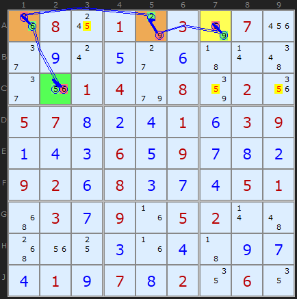
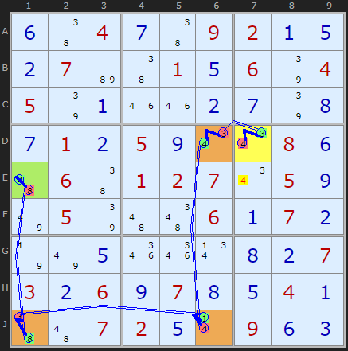
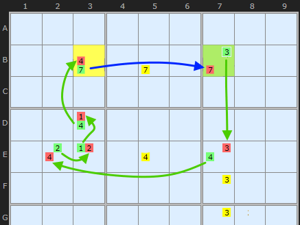
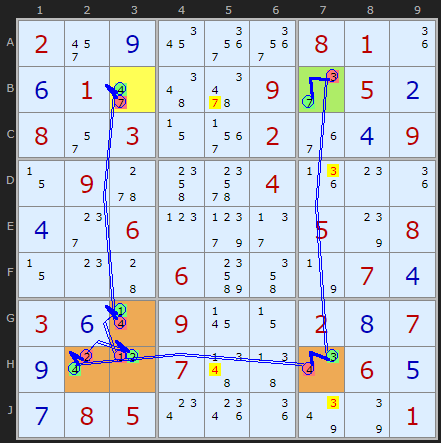

Title: XY-Chains - SudokuWiki.org

URL Source: https://www.sudokuwiki.org/XY_Chains

Markdown Content:
# XY-Chains - SudokuWiki.org

SudokuWiki.org

Strategies for Popular Number Puzzles

*   [Sign up for more](https://www.sudokuwiki.org/SPHome.aspx)

*   [Main Page](https://www.sudokuwiki.org/Main_Page)
*   [What's New](https://www.sudokuwiki.org/Whats_New)
*   [Strategy Overview](https://www.sudokuwiki.org/Strategy_Families)

9x9 Solvers

*   [Sudoku Solver](https://www.sudokuwiki.org/Sudoku.htm)
*   [Jigsaw Solver](https://www.sudokuwiki.org/Jigsaw.aspx)
*   [Sudoku X Solver](https://www.sudokuwiki.org/SudokuX.aspx)
*   [Windoku Solver](https://www.sudokuwiki.org/Windoku.aspx)
*   [Colour Sudoku](https://www.sudokuwiki.org/ColourSudoku.aspx)
*   [Killer Solver](https://www.sudokuwiki.org/KillerSudoku.aspx)
*   [Killer Jigsaw Solver](https://www.sudokuwiki.org/KillerJigsaw.aspx)

6x6 Solvers

*   [6x6 Sudoku Solver](https://www.sudokuwiki.org/Sudoku6x6.aspx)
*   [6x6 Killer Solver](https://www.sudokuwiki.org/Killer6x6.aspx)
*   [6x6 KenKen Solver](https://www.sudokuwiki.org/KenKen6x6.aspx)
*   [6x6 KenDoku Solver](https://www.sudokuwiki.org/kendoku6x6.aspx)

Weekly 'Unsolvable'

*   [Unsolvable Sudoku](https://www.sudokuwiki.org/Weekly-Sudoku.aspx)
*   [Unsolvable Jigsaw](https://www.sudokuwiki.org/Weekly-Jigsaw.aspx)
*   [Unsolvable Str8ts](https://www.str8ts.com/weekly_str8ts.aspx)

Puzzles to Play

*   [The Daily Sudoku](https://www.sudokuwiki.org/Daily_Sudoku)
*   [Daily 6x6 Sudoku](https://www.sudokuwiki.org/Daily_Mini_Sudoku)New!
*   [The Jigsaw Sudoku](https://www.sudokuwiki.org/Daily_Jigsaw_Sudoku)
*   [The Daily Sudoku X](https://www.sudokuwiki.org/Daily_Sudoku_X)
*   [The Daily Killer](https://www.sudokuwiki.org/Daily_Killer_Sudoku.aspx)
*   [Daily Mini Killer](https://www.sudokuwiki.org/Daily_Mini_Killer_Sudoku.aspx)
*   [Daily Killer Jigsaw](https://www.sudokuwiki.org/Daily_Killer_Jigsaw.aspx)
*   [The Daily Kakuro](https://www.sudokuwiki.org/Daily_Kakuro)
*   [The Daily KenKen](https://www.sudokuwiki.org/Daily_KenKen.aspx)
*   [Daily Codewords](https://www.sudokuwiki.org/Daily_Codewords)
*   [1 to 25](https://www.str8ts.com/daily_1to25.aspx)
*   [The Daily Binairo](https://www.sudokuwiki.org/DailyBinairo)
*   [Letterlicious](https://www.letterlicious.com/Letterlicious_Home.aspx)
*   [Puzzle Packs](https://www.sudokuwiki.org/ACSPuzzles.aspx)

Basic Strategies

*   [Introduction](https://www.sudokuwiki.org/Introduction)
*   [Getting Started](https://www.sudokuwiki.org/Getting_Started)
*   [Naked Candidates](https://www.sudokuwiki.org/Naked_Candidates)
*   [Hidden Candidates](https://www.sudokuwiki.org/Hidden_Candidates)
*   [Intersection Removal](https://www.sudokuwiki.org/Intersection_Removal)

Tough Strategies

*   [X-Wing](https://www.sudokuwiki.org/X_Wing_Strategy)
*   [Chute Remote Pairs](https://www.sudokuwiki.org/Chute_Remote_Pairs)
*   [Simple Colouring](https://www.sudokuwiki.org/Simple_Colouring)
*   [W-Wing](https://www.sudokuwiki.org/W_Wing_Strategy)
*   [Y-Wing](https://www.sudokuwiki.org/Y_Wing_Strategy)
*   [Rectangle Elimination](https://www.sudokuwiki.org/Rectangle_Elimination)
*   [Swordfish](https://www.sudokuwiki.org/Sword_Fish_Strategy)
*   [XYZ-Wing](https://www.sudokuwiki.org/XYZ_Wing)
*   [BUG](https://www.sudokuwiki.org/BUG)
*   [Avoidable Rectangles](https://www.sudokuwiki.org/Avoidable_Rectangles)

Diabolical Strategies

*   [X-Cycles (Part 1)](https://www.sudokuwiki.org/X_Cycles)
*   [X-Cycles (Part 2)](https://www.sudokuwiki.org/X_Cycles_Part_2)
*   [3D Medusa](https://www.sudokuwiki.org/3D_Medusa)
*   [Jellyfish](https://www.sudokuwiki.org/Jelly_Fish_Strategy)
*   [Unique Rectangles](https://www.sudokuwiki.org/Unique_Rectangles)
*   [Tridagons](https://www.sudokuwiki.org/Tridagons)
*   [Fireworks](https://www.sudokuwiki.org/Fireworks)
*   [Twinned XY-Chains](https://www.sudokuwiki.org/Twinned_XY_Chains)
*   [SK Loops](https://www.sudokuwiki.org/SK_Loops)
*   [Extended Rectangles](https://www.sudokuwiki.org/Extended_Unique_Rectangles)
*   [Hidden URs](https://www.sudokuwiki.org/Hidden_Unique_Rectangles)
*   [WXYZ-Wing](https://www.sudokuwiki.org/WXYZ_Wing)
*   [XY-Chains](https://www.sudokuwiki.org/XY_Chains)
*   [Aligned Pair Exclusion](https://www.sudokuwiki.org/Aligned_Pair_Exclusion)

Extreme Strategies

*   [Grouped X-Cycles](https://www.sudokuwiki.org/Grouped_X_Cycles)
*   [Forcing Nets](https://www.sudokuwiki.org/Forcing_Nets)
*   [Exocet](https://www.sudokuwiki.org/Exocet)
*   [Finned X-Wing](https://www.sudokuwiki.org/Finned_X_Wing)
*   [Finned Swordfish](https://www.sudokuwiki.org/Finned_Swordfish)
*   [Inference Chains](https://www.sudokuwiki.org/Alternating_Inference_Chains)
*   [AIC with Groups](https://www.sudokuwiki.org/AIC_with_Groups)
*   [AIC with ALSs](https://www.sudokuwiki.org/AIC_with_ALSs)
*   [AIC with URs](https://www.sudokuwiki.org/Using_Unique_Rectangles_as_Links_in_Chains)
*   [Almost Locked Sets](https://www.sudokuwiki.org/Almost_Locked_Sets)
*   [Death Blossom](https://www.sudokuwiki.org/Death_Blossom)
*   [Sue-de-Coq](https://www.sudokuwiki.org/Sue_de_Coq)
*   [Digit Forcing Chains](https://www.sudokuwiki.org/Digit_Forcing_Chains)
*   [Nishio Forcing Chains](https://www.sudokuwiki.org/Nishio_Forcing_Chains)
*   [Cell Forcing Chains](https://www.sudokuwiki.org/Cell_Forcing_Chains)
*   [Unit Forcing Chains](https://www.sudokuwiki.org/Unit_Forcing_Chains)
*   [Double Exocet](https://www.sudokuwiki.org/Double_Exocet)
*   [Pattern Overlay](https://www.sudokuwiki.org/Pattern_Overlay)

Deprecated Strategies

*   [Remote Pairs](https://www.sudokuwiki.org/Remote_Pairs)
*   [Y-Wing Chain](https://www.sudokuwiki.org/Y_Wing_Chains)
*   [Multivalue X-Wing](https://www.sudokuwiki.org/Multivalue_X_Wing_Strategy)
*   [Multi-Colouring](https://www.sudokuwiki.org/Multi_Colouring_Strategy)
*   [Empty Rectangles](https://www.sudokuwiki.org/Empty_Rectangles)
*   [Guardians](https://www.sudokuwiki.org/Guardians)

Str8ts

*   [Home & Rules](https://www.str8ts.com/str8ts)
*   [The Daily Str8ts](https://www.str8ts.com/Daily_str8ts)
*   [Weekly Extreme Str8ts](https://www.str8ts.com/weekly_str8ts.aspx)
*   [Str8ts Solver](https://www.str8ts.com/str8ts.htm)
*   [Str8ts Sample Pack](https://www.str8ts.com/Str8ts_Sample_Pack.pdf)

Other

*   [What's New](https://www.sudokuwiki.org/Whats_New)
*   [Latest Articles](https://www.sudokuwiki.org/LatestArticles.aspx)
*   [Feedback](https://www.sudokuwiki.org/sudokufeedback.aspx)
*   [Donate](https://www.sudokuwiki.org/Donations)
*   [Syndicated Puzzles](https://www.syndicatedpuzzles.com/)

[Print Version](https://www.sudokuwiki.org/Print_XY_Chains)

[Page Index](https://www.sudokuwiki.org/Site_Map)

119 Shares 

# XY-Chains

XY-Chains is a way to connect two parts of the board that can't directly "see" each other. The "X" and the "Y" in the name represent these two values in each chain link. If we can connect the ends we can make inferences and eliminate candidates.

XY-Chain example 1 : [Load Example](https://www.sudokuwiki.org/sudoku.htm?bd=S9B1g0818017o038207222e0i0s0e2c0f430r4e2e1u01049e0886021y05070h0b0d010f03090a0d0c060e090g0h0b09020f080c0g0d05014y030g091f05020r4a501u100c1f0d430i0g0d010i070h02120612) or : [From the Start](https://www.sudokuwiki.org/sudoku.htm?bd=080103070000000000001408020570001039000609000920800051030905200000000000010702060)

 Originally these were found by extending [Y-Wings](https://www.sudokuwiki.org/Y_Wing_Strategy) into so-called [Y-Wing Chains](https://www.sudokuwiki.org/Y_Wing_Chains) but it was quickly transformed into this more encompassing strategy. The same pincer-like attack on candidates that both ends can see by chaining bi-value cells. With Y-Chains the hinge relied on identical bi-value cells but in an XY-Chain the candidate can differ by one on each hop.

The example here is a very simple XY-Chain of length 4 which removed all 5's highlighted in yellow. The chain ends are 5 A7 and C2 - so all cells that can see both of these are under fire. It's possible to start at either end but lets follow the example from A7. We can reason as follows

*   If A7 is 5 then A3/C7/C9 cannot be.

*   if A7 is NOT 5 then it's 9, so A5 must be 2, which forces A1 to be 6. If A1 is 6 then C2 is 5.

Which ever choice in A7 the 5's in A3/C7/C9 cannot be 5. The same logic can be traced from C2 to A7 so the strategy is bi-directional, in the jargon.

This strategy cannot predict which end of the chain will have the solution 5 just that at least one end will do so. Testing on a large set of puzzles (>10,000) reveals that in 57% of XY-Chains found the solution is at both ends of the chain. 

## Chain Notation

The solver uses relatively simple chain notation with cells identified with [Row Letter+Column]. (There is an option to change to rYcX coordinates). In a chain we're alternating between strong and weak links but also turning candidates ON and OFF. To symbolise that the chain uses plus and minus. The number being turned on or off follows the symbol. The above example is

-5[A7]+9[A7]-9[A5]+2[A5]-2[A1]+6[A1]-6[C2]+5[C2]

5 taken off A3

5 taken off C7

5 taken off C9

In later documentation on [Grouped X-Cycles](https://www.sudokuwiki.org/Grouped_X_Cycles) you will see grouped cells denoted as +4[D4|E4] and when ALSs are used to make a link curly brackets are used: +7{H6|G6}. Rare exotic links like [Unique Rectangles](https://www.sudokuwiki.org/Using_Unique_Rectangles_as_Links_in_Chains) are named -9(UR[DF28]) as is an [X-Wing](https://www.sudokuwiki.org/AICs_with_Exotic_Links)-8(XW[-E3/-B3+B2-E2])

## Example 2

XY-Chain example 2 : [Load Example](https://www.sudokuwiki.org/sudoku.htm?bd=S9B0f46040g4609020a0e0b07b646010e067q04057q0a1m1m0b0g7q0h0g010b050i0u0u080f4a06460102070u050i7u057q4a4e060a070b7n7u0e1q1q0v0h0b07030b060i070h0e040a434a07020e0r090f0c) or : [From the Start](https://www.sudokuwiki.org/sudoku.htm?bd=004009200070010604500000000010500080060127050050006070000000007306070040007200900)

This relatively easy Sudoku puzzle contains contains a nice XY-Chain near the end. It proves 4 must be in either E1 or D7 and therefore we can remove the 4 in E7 since that cell can see both ends.

## Detection Changes August 2025

XY-Chains go way back to the earliest instance of the solver and had separate code for this strategy because the pattern is very simple and it pre-dates my work on AICs. But the selection of the “best” XY-Chain was very crude. I’d look for length 3 and return the first, then any length 4 and finally any length 5-12 and return the first. (Length here is the number of cells, not the chain links which are double the 'length').

I decided to see if I could use the AIC code to look for this pattern and re-use some code. The AIC Chain detection builds a list of the best 50 chains and allows the solver to “explore” other chains at the same step. This means XY-Chains share the same priorities: number of eliminations before length, length before same number of eliminations and so on. Same preference order as AIC and other chaining. This may change the score and solve order of puzzles that require XY-Chains.

Also the old XY-Chain code was not using Windoku and Sudoku X diagonal units which was a big miss.

Currently XY-Chains do not use exotic links as this would turn a 'diabolical' strategy into an 'extreme' one.

## Closed XY-Chains

September 2025. Here is a great observation I wished I'd picked up many years ago. Certainly dates from [at least 2008](http://jcbonsai.free.fr/sudoku/JSudokuUserGuide/chainsTechniques.html) but other references please let me know! I'm grateful to **Stefan** in the Netherlands for emphasising how relevant it is and why it was missing from the solver. This is a good boost for XY-Chains and in testing I've found around 8%-10% additional eliminations. Indeed the old example 2 has the property described and I've moved it to this section. XY-Chains of this type now have no start or end cells highlighted.

 It all rests on whether the ends of the chain can see each other.

In this animation I've pulled out the essential parts of an XY-Chain from the following example. The chain starts on B3 and ends on B7. The old strategy would have eliminated the 7 in B5 and no more - since the rule is _"at least one end of the chain or the other must be the solution"_.

But if the two ends of the chains can see each other we get a continuous loop. The blue arrow bridges the gap since the 7s in B3 and B7 connect. We are going to see this a lot in [X-Cycles](https://www.sudokuwiki.org/X_Cycles) and later in [Alternating Inference Chains](https://www.sudokuwiki.org/Weak_and_Strong_Links). The difference is that Strong Links are all on the bi-value cells. The arrows in the diagram illustrate the direction of inferences.

Closed XYC example 1 : [Load Example](https://www.sudokuwiki.org/sudoku.htm?bd=S9B022y0i1a3q3q08011i0f012i4e66092e050b082q030z3n02360d090z095w4o6g041j0o1i0d2g060p9l2f057s080z0o4406bs4m7n070d030f0r09170z020h070i0s0l074f470u060e0g08050w1s1i7y7q01) or : [From the Start](https://www.sudokuwiki.org/sudoku.htm?bd=200000810010009050803002009090004000006000508000600070300900207000700060085000001)

The alternating red and green candidates show us that all round the chain the solution must be one colour or another. We don't know which but we do know they form two distinct sets. All Weak Links become Strong Links which means we can eliminate along every link in the chain. So the 4 in H5 is knocked out by the link H27 and two 3s in D7 and J7 are knocked out by the link BH7.

This is [Nice Loop Rule 1](https://www.sudokuwiki.org/Alternating_Inference_Chains) This neatly ties together the family of chaining strategies.

Closed XYC example 2 : [Load Example](https://www.sudokuwiki.org/sudoku.htm?bd=S9B4a0i0217434j03070662014yak03c405444c0c3m5e3g6s440a094c090c1m08051g0g0s015u3m5f031h04c24kb8021u5n1f09074y4q030f080i2s2c0c0d0a2q0e0b039f04b7b606cy0104078y4yci020cbm) or : [From the Start](https://www.sudokuwiki.org/sudoku.htm?bd=002000376010030500000000090900850001000304000200097003080000000003040060147000200)

This Sudoku puzzle contains three XY-Chains, starting with this short rectangular one. Although this loop is continuous the solver needs to start somewhere and that is B3. That cell is either 8 or 6. 

If it is 6 then D3 must be 4 which pushes 2 into D8 which in turn makes B8 8. 

You can trace this from back round the other way:

If B3 is 8 then B8 must be 2 which pushes 4 into D8 which in turn makes B8 6 confirming B3 is 8.

So three of the four links that span rows and columns contain candidates we can remove, as shown.

## XY-Chains Exemplars

 These puzzles require the XY-Chains strategy at some point but are otherwise trivial.

 New examples added here as of August 2025

 They make good practice puzzles. 
*   [Exemplar 1 (x5, score 81)](https://www.sudokuwiki.org/sudoku.htm?bd=001005004060080057072900000004000060009060400030000700000007840610050030300200100)
*   [Exemplar 2 (x2, score 88)](https://www.sudokuwiki.org/sudoku.htm?bd=020080600000500007078000340000290006050000090600037000042000570300009000009050030)
*   [Exemplar 3 (x2, score 89)](https://www.sudokuwiki.org/sudoku.htm?bd=000007001790006085500800000020063000009000600000740030000005008350900074100300000)
*   [Exemplar 4 (x2, score 90)](https://www.sudokuwiki.org/sudoku.htm?bd=010027050020600400800000007000004070006708900070300000700000009005009010030160020)
*   [Exemplar 5 (x2, score 93)](https://www.sudokuwiki.org/sudoku.htm?bd=090060000310000702050000080900007008003000900200500001080000020105080004000020060)
*   [Exemplar 6 (x2, score 98)](https://www.sudokuwiki.org/sudoku.htm?bd=080309050005000300009072000300800060200090005060005001000780400002000600090204070)

Go back to [Y-Wing Chains](https://www.sudokuwiki.org/Y_Wing_Chains)Continue to [3D Medusa](https://www.sudokuwiki.org/3D_Medusa)

* * *

# Comments

Your Name/Handle

Email Address - required for confirmation (it will not be displayed here)

Your Comment

Please enter the

letters you see:

- [x]  Remember me

Please ensure your comment is relevant to this article.

**Email addresses are never displayed, but they are required to confirm your comments.** When you enter your name and email address, you'll be sent a link to confirm your comment. Line breaks and paragraphs are automatically converted - no need to use 
 or   tags.

Comments[Talk](https://www.sudokuwiki.org/XY_Chains?talk#comments)

## ... by: Eric Bryant

Saturday 23-Aug-2025

I noticed the Detection Changes from earlier this month:

> There is also a side effect that URs and ALSs might be used in the links

> making a chain although it will be rare. In two minds about this since they

> are not part of the pattern but are logically fine.

Here's a potential argument for leaving URs out, or having the option to disable them:

https://www.sudokuwiki.org/sudoku.htm?bd=S9B4712060n070409024j43040709050203064309130206080n040z07040705080206010903060901050307020804020803040109050706130n0807091306040207060902041308130z1302040n0608071309

This is a partially generated puzzle from some software I've been developing. The program has yet to randomly add in enough clues to make a complete puzzle.

The Solution Count of 3 can quickly be verified by "solving" by hand; plug a 1, 3 or 8 into A1 and you'll quickly end up with a complete valid grid.

BUG and Unique Rectangles don't apply here, because the puzzle is not yet at the point of having a unique solution.

Accordingly, uncheck both these strategies (along with XY-Chain) and the puzzle won't be solvable.

Check off XY-Chain again though, and we do get a unique solution, due to XY-Chains now including URs.

It would be nice to not have XY-Chains include URs if Unique Rectangles are unchecked, to not come across "false positives" for a puzzle's solvability.

Don't know how doable this is in the solver though; depends on how everything works under the hood.

Would it be feasible to alter one strategy's implementation based on whether another strategy is checked or unchecked?

Would this even be a good idea, or counterintuitive & against the solver's design principles?

Another possibility could be to have separate checkboxes for XY-Chains with & without URs, similar to how X-Wing & Swordfish have both finned & unfinned variants.

Of course, it could be that incomplete puzzles like this example are outside the scope of what the solver is intended to do, and I shouldn't be trying to "solve" the unsolvable. :)

Andrew Stuart writes:

Hi Eric. There is a tick box under the list of strategies on the right hand side, on the solver. That will disable URs in all chains.

Add to this Thread

## ... by: BeyelerStudios

Tuesday 15-Jul-2025

[Example 5](https://www.sudokuwiki.org/sudoku.htm?bd=903001000800000000751009060187000294000792186200148573670913000002684000410257630) contains two type 1 WXYZ-Wings your solver doesn't detect:

The first one with hinge in B4 and wings {B3,B6} and {D4} and non-restricted common digit 5. Note that the 5 is present in the hinge like your example 1 for a type 1 WXYZ-Wing but isn't present in B3 similar to example 3 for a type 1 WXYZ-Wing: "we don't have to worry about the common digit 'seeing' the brown cells as they don't have a common digit in them." This eliminates the 5 in A4.

The second one with hinge C7 and wings {C5,C9} and {G7} and non-restricted common digit 8 eliminates the 8 in A7.

Cheers and thanks for all your great explanations!

Andrew Stuart writes:

Very useful analysis, thank-you very much. Solver can now detect this type.

Add to this Thread

## ... by: VladFein

Monday 24-Mar-2025

I think I found an example with 18 XY-Chains, one of them is 14-long:

.....5..84.....3......312.6...56...12.4....3..17....9.8...5.76..7........92..3...

Thank you for your great site!

Andrew Stuart writes:

Whopper! Thanks very much for sharing ;)

Add to this Thread

## ... by: Wolfgang M.

Friday 28-Feb-2025

Hello Andrew, 

thanks for documenting these variety of possibilties to eliminate candidates.

When I was studying the XY-chain explanation,

I found a sentence, which is contradicting the examples shown as explanation:

"With Y-Chains the hinge was expanded to a chain of identical bi-value cells but in an XY-Chain these can be different - as long as there is one candidate to make all the links."

In all 3 examples only the first and last cell in a chain are having one common candidate.

Maybe that was a more restrictive version in the past, which has been simplyfied lateral. 

Could you please include this to the rule, as it confused me, when I read the text the first times, until I recognized, that the limitation to all members of the chain isn't really neccesary. 

Wolfgang

Andrew Stuart writes:

Good point. A very old piece of text at the top. I've reworded it to include links to Y-Wings and the deprecated Y-Wing Chains page.

Add to this Thread

## ... by: Regan

Thursday 14-Dec-2023

Found an exemplar for 12 length chain (link opens straight to the point where you need the chain): [Load Puzzle](https://www.sudokuwiki.org/sudoku.htm?bd=S9B1n1g0r0807090l05030n2c2e0405060l0809090805030201070604050r4b090u0246070607030605010804090202094a060u07050n434f0r0207091a060v4j1r362e02081a090v0z4e050901060u460207)

Pete replies:Tuesday 25-Jun-2024
https://www.sudokuwiki.org/sudoku.htm?bd=006080005005603900384951276030100050501030002060005010219378564658412700003569020

I think there's a very long XY chain linker in this puzzle to get the original 47 pair to a 4 in the bottom left corner 

47-71-19-92-27-74-43-39-93-39-97-94-42-27-74-47 cancels the 7

Am I right?

Andrew Stuart writes:

I can't see it Pete

Add to this Thread

## ... by: Nick

Friday 10-Nov-2023

I’m struggling to complete puzzles that need a y wing or xy chain to complete , How do you spot these ? Are there any tips ?

REPLY TO THIS POST

## ... by: Andy Potvin

Tuesday 3-Jan-2023

For Exemplar 5, in its current orientation, my solver only needed 6 XYchain's.

RU S# DL Technique Details (only showing steps requiring Dlevel>=UR1=9)

37 18 45 XYchain:8 eliminated 6 from p25 via chain p23 p53 p73 p93 p99 p39 p35 p45.

37 19 45 XYchain:8 eliminated 8 from p79 via chain p73 p53 p23 p26 p46 p45 p35 p39.

37 20 37 XYchain:5 eliminated 5 from p78 via chain p73 p93 p99 p39 p79.

37 21 37 XYchain:5 eliminated 2 from p19 p29 via chain p39 p99 p93 p73 p79.

37 22 37 XYchain:5 eliminated 8 from p19 via chain p39 p79 p73 p93 p99.

37 23 37 XYchain:5 eliminated 7 from p17 p27 p89 via chain p87 p99 p39 p79 p19.

And if I transform the matrix/puzzle (in MATLAB notation to transpose(fliplr(Mp))) my solver needs only 4 XYchain's: one 8-link followed by 3 5-link.

I haven't yet developed a function to find the "simplest" solution possible. (And I don't have any plans to develop such a function.)

Best,

Andy

REPLY TO THIS POST

## ... by: Pieter, Newtown, Oz

Saturday 30-Jul-2022

Hi Andrew

Where has my head been at? Only just discovered the new Fireworks strategy 8 months later!!! 

Anyway, this comment is re a possible bug!? In your daily example for 2022-07-16, we reach [this board](https://www.sudokuwiki.org/sudoku.htm?bd=000682403640050020302074006020090004904237008800410002400020307250740080701069245) which finds an XY-Chain length 9 eliminating the 6 in F7. However, the solver does so via 3 sides of a previously discovered X-Wing "box", whereas it could have simply gone via one side and been of length 7. Curious! 

Kudos as always for your fantastic and always expanding Solver!!!

Ciao, Pieter

Andrew Stuart writes:

[Testing](https://www.sudokuwiki.org/sudoku.htm?bd=S9B0z9f9u060802049f0306045u7q050n5u027n03b7027n07044j83060z023q4i095e2b3b04091f040203070z1v08083a3q04011u8iae0204c2c24j024i038j0702058m07040n8i087n074601460609020405) as of August 2025 I think the three variants of the XY-Chain at this point are around the shorter length, so I think it does as you suggest. 

Add to this Thread

## ... by: Anonymous

Friday 1-Apr-2022

Hi! I was trying to make a sudoku with a XY-Chain of length 4, and accidentally found a puzzle with one of length 12! [Here is the link if you are interested](https://www.sudokuwiki.org/sudoku.htm?bd=652...38.7....856..3.65.4.2985...1...7..2.......18..5.42...3...5..........6..9...)

Andrew Stuart writes:

Thanks!

Add to this Thread

## ... by: ush

Wednesday 13-Oct-2021

Today's XY chain stated: 10/13/21

XY-Chain

length=4, chain ends: B7 and J8

This proves 8 is the solution at one end of the chain or the other

-8[B7]+9[B7]-9[F7]+7[F7]-7[F8]+9[F8]-9[J8]+8[J8]

8 taken off A8

8 taken off G7

8 taken off J7

However cell B6 was also 89...so why can it be ignored as not the start or end of the '8 ' chain? I thought a chain has to go as far as it can before you decide where it started or ends. 

REPLY TO THIS POST

## ... by: Bondye

Saturday 3-Jul-2021

I have crafted a puzzle that includes 10 xy-chains (and several wings and 3Dmedusa). [check it out here](https://www.sudokuwiki.org/sudoku.htm?bd=500040060004020003006010700800000000070500002005000900460000050019000800008003601)

REPLY TO THIS POST

## ... by: Gordon

Sunday 27-Sep-2020

I have noticed that in XY chains, if the two pincers share the same 2 numbers, and these numbers are also contained in the target cell, then both can be eliminated. I don't know if you have this mentioned elsewhere, but your solver missed such an opportunity on a puzzle I ran through it this morning, and only eliminated the first number - (4) and not the second one (7).

Andrew Stuart writes:

Easy enough to test your observation but [this example](https://www.sudokuwiki.org/sudoku.htm?bd=S9B2w1c0w0n090h2j10062w1c0i060n2i2j10080h010f052i020i0c2i0d090a0h2q2q020f0c0f0h077p0l0c05047n0o0o057v0r060h077n141c0h070f0a0u090s01060w0w1c092m0h30090g0w0w08160f0a10) blanks the cell C5. So unless there is a refinement I don’t think it holds. Hurts my head trying to disprove it logically. 

Add to this Thread

## ... by: AB

Sunday 13-Sep-2020

I'm not sure if I'm understanding this correctly, but isn't this just a special case of X-Cycles Rule 3, where all the strong links are within cells, and the candidates to be eliminated can be joined to the two ends of the XY-Chain by weak links (thus forming a loop with a discontinuity of two weak links)? Or does X-Cycles in your solver not consider links between candidates in the same cell?

Anonymous replies:Sunday 9-Jan-2022
Strong links within cells are outside the scope of X-cycles, as X-cycles is a single digit technique.

Add to this Thread

## ... by: Mike Hopkins

Wednesday 2-Sep-2020

I am rather proud of the output from my solver program when fed the first of the examples on your page:

XY chain: initial candidates X and Y are (5) and (3). 

Chain is: A7(5,9), A5(2,9), A1(2,6), C2(5,6), 

No other cell in the common scope of the two ends of that chain can be (5).

C7 was (3,5,9) is now (3,9)

XY chain: initial candidates X and Y are (5) and (6). 

Chain is: C2(5,6), A1(2,6), A5(2,9), A7(5,9), 

No other cell in the common scope of the two ends of that chain can be (5).

A3 was (2,4,5) is now (2,4)

C9 was (3,5,6) is now (3,6)

Happy to share the source code, it is (Ada)

REPLY TO THIS POST

## ... by: Robert

Sunday 21-Jun-2020

Thought about this one, it seems to be a somewhat strange special case of alternating inference chains.

We can define links in two ways - they can be between the same value in two different cells in the same row, column, or box, or they can be between different values within the same cell. We get three of the strategies described at this website by using different definitions for strong and weak links.

(1) Strong links required to be between different cells, weak links also required to be between different cells - original "nice loops". In the database of 100 puzzles I am using, 60 are solved this way.

(2) Strong links can be either between different cells or within the same cell, weak links can also be either between different cells or within the same cell - alternating inference chain. Of my 100 puzzles, 89 are solved this way.

(3) Strong links required to be within the same cell, weak links required to be between different cells - xy_chain. Of my 100 puzzles, 45 are solved in this way.

In (3), "strong links" refer to links that are required to be strong, and "weak links" refer to those that are not required to be strong. If a "weak" link happens to be strong, it still follows the rule for weak links, not strong links.

But there are three other combinations of strategies that I don't see described at the website. However, it was a pretty each job to modify my alternating inference chain software to handle them.

(4) Strong links required to be between different cells, weak links required to be within the same cell. Of my 100 puzzles, 21 are solved this way.

(5) Strong links can be either between different cells or within the same cell, weak links are required to be between different cells. Of my 100 puzzles, 80 are solved this way.

(6) Strong links are required to be between different cells, weak links can be either between different cells or within the same cell. Of my 100 puzzles, 83 are solved this way.

So there are three additional strategies :) Although (1), (3), (4), (5), and (6) are also special cases of (2), alternating inference chains. Simple colouring is also a special case of nice loops, and therefore of alternating inference chains. Medusa without Rule 6 is also a special case of alternating inference chains.

Anonymous replies:Sunday 9-Jan-2022
It's not at all strange when you think about it. Since there are strong links within cells, they are bivalue cells. Bivalue cells are also ALSs, which allows us to extend this technique to ALSs and not just bivalue cells, which is exactly what the ALS-XY-Chain technique does.

And it is very useful to split strategies into X-cycles, Colouring, Medusa and all that, as it simplifies things and you can look for the more common patterns first.

Add to this Thread

## ... by: John

Friday 1-May-2020

In the first example, you stop progressing the chain as soon as you find a confluence, i.e. you could have continued to H2, H5 etc with this chain. Is this just a programmer decision for efficiency, or is there some underlying reason?

Can an XY-Chain therefore consist of as little as 3 cells?

Anonymous replies:Sunday 9-Jan-2022
Eliminations depend on the two ends of the chain. You could extend the chain, but it would not get us any more eliminations. And an XY-chain can contain as few as three cells, but that is the same as an XY-wing / Y-wing.

Add to this Thread

## ... by: Eli

Wednesday 4-Mar-2020

very thankful

REPLY TO THIS POST

## ... by: pie314271

Sunday 1-Dec-2019

Through attempting to make various sudoku puzzles, I've wondered if the maximum length for an XY-chain is 12. Every time I've seen these chains, most of them only hit 12 at most. Is there a proven maximum on the XY-chain length?

Andrew Stuart writes:

In fact that is a limit in my solver due to concerns over CPU usage. I cap it. I do have another version of the solver (well, same solver, just a flag) which looks for chains in a breath-first-tree order which has no limit and I've seen chains in the 20 links or more. Uses much more memory and I'm reluctant to make it the default solver on the site. One day maybe.

Add to this Thread

## ... by: Kavala

Thursday 18-Jul-2019

I don't know if this has already been mentioned, however...

Often you can find an XY Chain, but it is one that does not result in an elimination.

This chain can still be useful, however, when combined with a 3D Medusa chain.

For example, if one end of the XY Chain has a known color that is part of a 3D Medusa

Chain, then the other end of the XY Chain can be assumed to be the opposite color.

This helps extend the reach of the 3D Medusa in situations where that is not possible 

following the usual logic of the 3D Medusa.

REPLY TO THIS POST

## ... by: kvnviktor

Wednesday 2-Jan-2019

Exemplar 3, x4 (score 113) Avoidable Rectangle Type 1: 4/8 in r3c12,r7c12 

in the third example, the death rectangle c12, g12, numbers 8 and 4 in the corners

REPLY TO THIS POST

## ... by: TG

Wednesday 17-Oct-2018

You're a really helpful web site; couldn't make it without ya!

REPLY TO THIS POST

## ... by: CH

Sunday 7-Oct-2018

Just simply needed to emphasize Now i'm pleased I stumbled in your web site.

Andrew Stuart writes:

Thanks!

Add to this Thread

## ... by: Mike Van Emmerik

Wednesday 17-Feb-2016

> So both ends can be filled in.

Oops. I don't have time right now to sort out why, but it's not always that both ends can be filled in. So you just get the usual "must be opposite colour" information, and that often allows one end to be filled in, sometimes both.

REPLY TO THIS POST

## ... by: Mike Van Emmerik

Tuesday 16-Feb-2016

Guy Renaldon posted:

"At first I select a bi value cell. Not anyone, but rather one containing two candidates regarding the digits missing the most. "

I agree that when attempting to solve puzzles manually (say with a phone app), it helps to cut down the forest of possibilities by considering first those bi-valued cells that there are less commonly represented. I now scan through the candidate numbers noting which numbers have the fewest unsolved cells. I'm not sure that both candidates for the initial bi-value cell need to be rare, just one of them. In fact, the last puzzle I did involved one of the rarer numbers paired with the most common unsolved number.

There is an additional "sanity check" that I like to perform. With the rarer numbers, there are often only a few viable starting pairs, and often some of these can be eliminated by eye as being involved in a strong link, or otherwise already related as opposite in colour. If you start with one such candidate bi-value cell, you are likely, after some effort, to prove something that you knew trivially to be true already. By contrast, if the candidates are already "like coloured" by simple colouring (X chains), meaning that you believe that one or the other is the solution, they make good candidates since if you can prove they are XY-chain linked (e.g.. this cell could be a 6, but if not it's a 4 so that has to be a 2 ... and this has to be a 6, then you've proved that each end is either a 6, or it's a 6. So both ends can be filled in. No doubt you can make stronger general statements about the other elements in the chain, but these tend to take care of themselves.

With these two checks reducing the effort needed to find these XY-chains, they are becoming more fun and much less of a chore.

REPLY TO THIS POST

## ... by: Steve

Wednesday 5-Aug-2015

Thanks very much for your website, which has been a delight as well as a great education.

I believe I have found an alternative solution to Exemplar 3 on www.sudokuwiki.org/XY_Chains that requires only 1 XY-chain (or is it something else?) rather than four.

After all simpler strategies have been exhausted, I have the following chain:

1 on F2 -> 2 on F4 -> 8 on F8 -> 5 on F1 -> 4 on E3 -> 9 on E5

Alternatively, a 9 on F2.

So, any cell that can see F2 and E5 (i.e. E2 and F5) cannot contain a 9.

When I remove the 9s in these cells, the remainder of the Sudoku is solved with simple strategies. 

I've checked this in the solver and it works. Have I got it right?

Cheers,

Steve Strain

Memphis, TN USA

REPLY TO THIS POST

## ... by: Eric

Monday 6-Apr-2015

Considering example 1 and building an XY-chain starting in A1 and ending in A5, we would be driven to remove candidate 2 from A3. Such a chain is made of bi-value cells and A3 sees both ends of the chain, which show a different color for candidate 2.

What is the additional condition to be statisfied by an XY-chain that is not met by the A1-A5 chain?

REPLY TO THIS POST

## ... by: Sherman

Friday 11-Apr-2014

Shum and Andrew - the number of cells in the chain does NOT have to be even. See Figure 22.1 on page 62 of "The Logic of Sudoku" for an example with 5 cells: 78, 86, 65, 53, 37 which removes 7 from any cell that sees both ends of this chain. Also, all Y-Wing chains, which are a subset of XY chains, have an odd number of cells.

REPLY TO THIS POST

## ... by: Shum

Sunday 29-Dec-2013

This isn't stated, but it seems to me a necessary condition is the length of the chain must be even (referring to the number of cells, not the number of links). All the examples here have length 4 and the alternate coloring seems to imply this restriction. Agree? 

Andrew Stuart writes:

That is a good observation but I fail in my documentation to include longer examples. I think I was hung up on finding short simple ones and now I realise that I should show they can be several lengths. I also believe they will contain an even number of cells in total. I will have a hunt in my 2014 stock for longer ones and also try and find a crazy super length one, there has to be a 'longest'

Add to this Thread

## ... by: suneet shrotri

Monday 21-Oct-2013

I have discovered a new method to eliminate a possibility by 2 chains with one common end & other 2 ends are part of a set then if common end is not X then if in some cases other ends come to have XY possibilities then possibility X can be eliminated from other remaining members of the set. I am sure that no other method on this website can do this.

REPLY TO THIS POST

## ... by: gg fuller

Tuesday 11-Jun-2013

I'm unsure about the description as it mentions it is a more encompassing version of "Y-Wing Chains" and also refers to "Y-chains". Since there are no such strategies described on this site, I don't know if that refers to "Y-wing" or "X-chains" or both. If I just look for XY-chains will that catch all Y-Wings and X-chains, or is X-chains separate? X-chains seems to require a loop to make any eliminations.

Andrew Stuart writes:

Hi, yes there is a page, [click here](https://www.sudokuwiki.org/Y_Wing_Chains) but I subsumed this into the more general chaining strategies and that opening line needs to be edited. This goes way way back to the early days.

Add to this Thread

## ... by: Guy Renauldon

Thursday 2-Jun-2011

The Exclamation Mark Method

This is to answer to François Tremblay and John Robinson question. 

Yes François, there is a trick to discover an XY chain.

Recently, I settled a kind of method which I name the “Exclamation Mark Method” 

That is what it is:

At first I select a bi value cell. Not anyone, but rather one containing two candidates regarding the digits missing the most. 

Let’s say the cell I select contain “a” and “b” as candidates. 

Then I make a double bet.

First bet: “a” true, 

Second bet: “b” true. 

Regarding the first bet, I draw a small vertical line “I” just under the “a” of the bet cell. Then I consider the other bi values cells only and I mark all the candidates deducted by this first bet by an “I”, drawn just under the candidates.

Regarding the second bet “b” I do the same but the mark will be a small point “.”under the “b” in the bet cell. 

Most of the time, soon or later, if a XY chain exists, I obtain a cell containing a candidate marked with an exclamation mark “!” (This is the reason of the name of my “method”, although the exclamation mark can be reverse, the point on the top)

So a candidate , let’s say “k”, will be marked with an exclamation mark. It means it is true in both bets. So “k” is a true digit. (Although I can’t say anything on “a” or “b”). Most of the time, this true digit will solve the Sudoku, when the Sudoku is not difficult too much. 

But I do not consider the job as finished. I have to find my XY chain.

Let’s see the simplest case at first: the cell where we have the “!” is a bi value cell too. I consider the other candidate in that cell, the one without the “!”, let’s say “m”. “m” have to be eliminated, so “m” must see two other bi value cells containing an “m”, which will be the two ends of my XY chain (to understand that, you have to know what an XY chain is exactly). Then I consider each end of my chain and I follow the reverse itinerary from each end. I draw the links between the bi value cells really, with a pen. Doing so I’ll automatically reach my double bet cell. And that it is, I’ve drawn my XY chain! Very easily, without the headaches y suffered before I applied that method. And doing so, you can find very long XY chains, containing ten links for example, or more.

Note that you can find a shorter chain which does not go through the double bet cell, but with the same ends. The reason is that more than one XY chain exists on a same grid most of the time. 

If the cell which sees the two ends of the chain is not a bi value cell, it is a little bit more complicated. But the “method” works too. If the cell contains three candidates, you will have two candidates marked with an exclamation mark. Then the third candidate can be removed. If a cell contains four candidates, you’ll find three exclamation marks in that cell. Generally speaking, if the cell contains N candidates, you’ll find N-1 candidates with an exclamation mark. The other one left without the “!” can be removed. This chain does not give a true digit directly. 

Sorry, I’ve been little bit long in my explanation, and please excuse my English, being French (perhaps François Tremblay will understand me better, his name sounding very French …)

I’d like to add some remarks, if Andrew Stuarts give me some more place.

1/An xy chain is in fact a multi value X Cycle in three dimension, containing bi values cells only from one end to the other. The strong links are located inside the bi value cells. The other links can be either strong or weak, except the links between “m”, which must be weak. In fact it is a special AIC, with bi value cells only. 

3/ This “method” is not mine…in fact it is the well known Forcing Chain Strategy. But the exclamation mark trick is mine, I think. 

Many thanks to Andrew Stuart if he accepts to publish my comment, which maybe he can find a bit too long and not very clear (it is to me, but may be not to all the readers due to my bad English…). 

Guy Renauldon

REPLY TO THIS POST

## ... by: John Robinson

Sunday 30-Jan-2011

I have the same question as Francois Trembly on 28-Oct-2009

REPLY TO THIS POST

## ... by: S.Monta

Tuesday 18-Jan-2011

Hello,

First i would like to thank you very much for your great website witch made me dramatically improve my Sudoku skills.

I have a question : could the chain 56-67-67-78-83-89-96 be an XY-Chain?

REPLY TO THIS POST

## ... by: Marshal L. Merriam

Wednesday 8-Sep-2010

I think I have another type of xy chain. In a sudoku I'm doing now (not one of these examples), I find the sequence 28-87-73-36-68-82 where the first pair and the last are the same cell! If its value were 8, then xy chain logic demands that it also be 2, a contradiction. No such contradiction prevents it being 2. 

Alternatively we could argue that the xy chain demands that at least one of the endpoints be a 2. Since they are the same, the cell must be a 2.

REPLY TO THIS POST

## ... by: Marshal L. Merriam

Monday 30-Aug-2010

I now understand Anton's confusion. It stems from the explanation of example 1. I would add one more bullet:

If C2 is not 5 then it must be 6. A1 cannot be 6, A5 cannot be 2 and A7 cannot be 9. Ergo, if C2 is not 5, then A7 must be 5. As noted in the first bullet, if A7 is not 5 then C2 must be 5. So either A7 or C2 must be 5. 

When stated this way, the chain does not require locked sets. If C2 is not 5, then no other cell in box 1 can be 6, so even if there were a 6 at B3(say), all of the bullets would still hold.

REPLY TO THIS POST

## ... by: Marshal L. Merriam

Saturday 28-Aug-2010

Is it fair to say that this technique exposes a new strong link? That is, in the first example 5a7 = 5 c2. In the second, 6A2 = 6C8. 

If I haven't overlooked something, this allows XY chains to connect to other single number techniques that use strong link information (eg x- cycles, red-black) 

REPLY TO THIS POST

## ... by: Matt Lala

Monday 16-Nov-2009

I read something on a different site (if I understand this correctly) is that when you reach the end of the chain, you are using the "leftover" value to make your elimination. In the first example, the last green arrow is to a 6, and the leftover in that cell is a 5, which is what gets eliminated. If the last link had been to the 5, then the leftover is 6, and you cannot use that to end the chain and eliminate the 5's. Not sure what conditions are needed for the start. I may be wrong on this.

Francois, I don't think you need a solver, but it does help to have a program that highlights all of them. I glance at the 'busiest' groupings of bivalue cells and then pick one and just start driving. If a fork presents itself I'll choose whichever option seems to steer me back towards the start of the chain.

Anton, I don't think they have to be locked, they just need to be bivalue. Try plugging in a 2 at the start of that chain in the 2nd example, and follow the links, and you'll see how the green cell at the end becomes a 6 (despite the unlocked cells used). And plugging in a 6 at the start makes the eliminations pretty obvious.

REPLY TO THIS POST

## ... by: Francois Tremblay

Wednesday 28-Oct-2009

I understand the logic but my problem is how do you spot this without the help of a solver? Visually, the start and end of such a chain are tough to find. Do you go through all the grid to start the chain at all possible bi-value cells? In the "simple" cases above, you have respectively 21 & 22 bi-value cells (even your book's example on page 62, figure 22.1 shows 21 of them) which would represent a lot of permutations that only a computer could run through. As a human solver, is there a trick to find those chains?

REPLY TO THIS POST

## ... by: Anton Delprado

Thursday 18-Jun-2009

Maybe I am missing something but it looks like 4E and 8E are not locked for the value 6 because 9E is potentially 6 as well.

An XY-Chain is possible from this although it would have the pivot chain below:

3A - 3C - 3H - 6H - 6F - 5F - 9F

REPLY TO THIS POST

 Article created on 11-April-2008. Views: 422489

 This page was last modified on 12-September-2025.

 All text is copyright and for personal use only but may be reproduced with the permission of the author.

 Copyright [Andrew Stuart](https://www.sudokuwiki.org/) @ [Syndicated Puzzles](https://www.syndicatedpuzzles.com/), [Privacy](https://www.sudokuwiki.org/privacy), 2007-2026 

